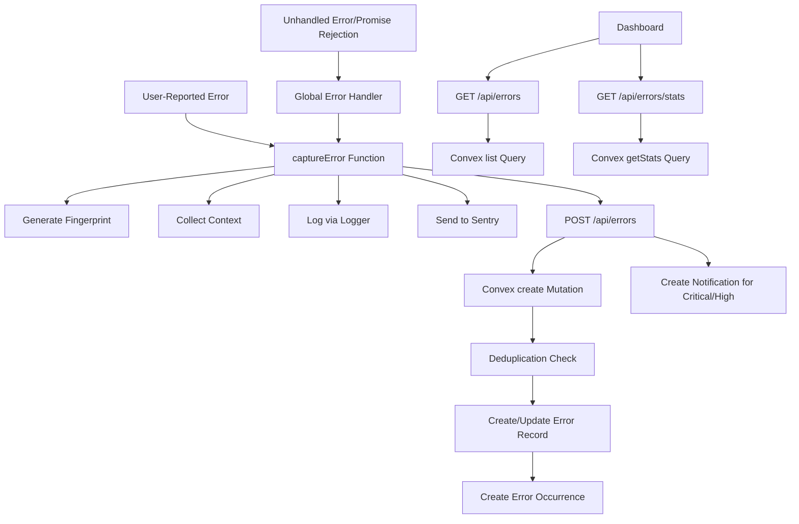
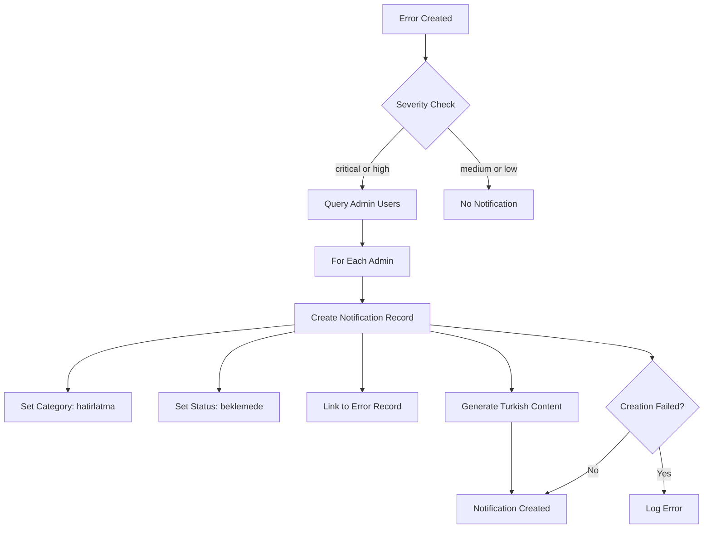
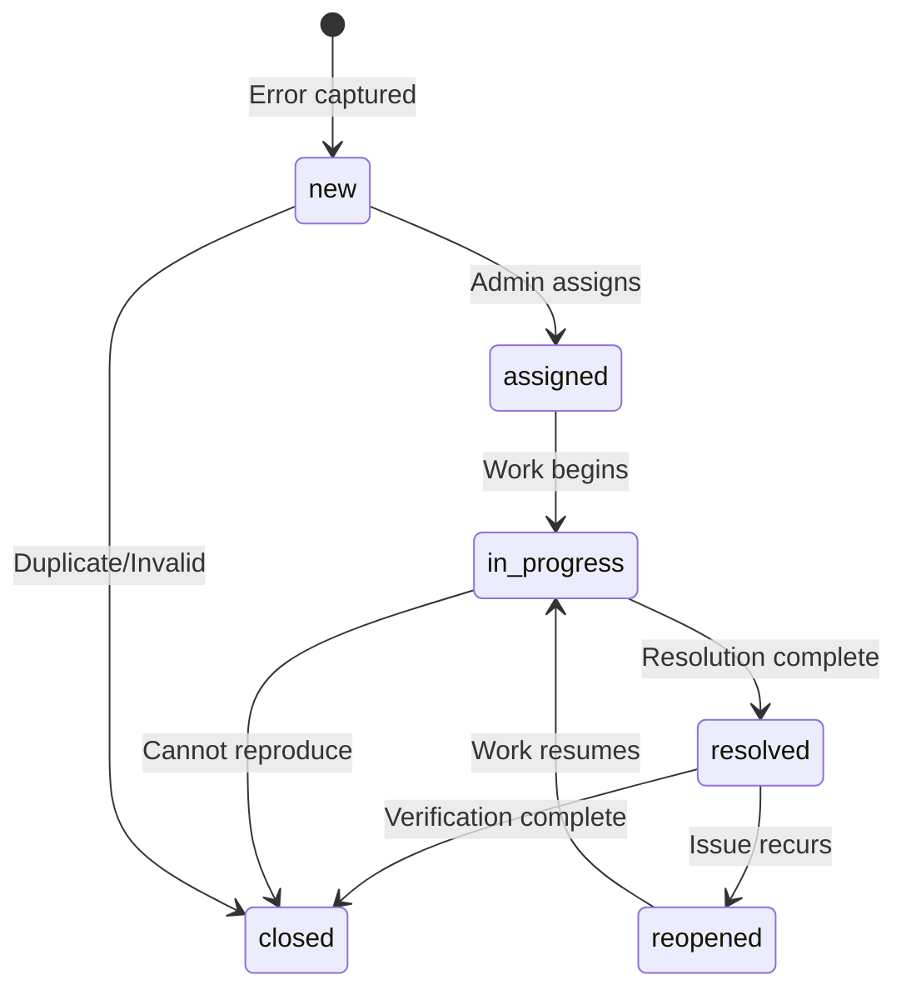

# Error Tracking System Enhancement Design

## Overview

This design document outlines improvements and enhancements to the existing error tracking system based on a comprehensive review of the Sentry integration, error management dashboard, and associated code quality concerns. The system currently captures errors through multiple layers, stores them in Convex, and presents them via a dashboard interface, while also forwarding to Sentry for external monitoring.

## Current Architecture Summary

### Error Capture Flow

The error tracking system follows a multi-layered architecture:

1. **Global Error Handlers** - Window error and unhandled promise rejection listeners capture runtime errors
2. **Error Tracker** - Enriches errors with context (device info, performance metrics, page context) and generates fingerprints
3. **Convex Backend** - Stores error records with deduplication based on fingerprints
4. **API Layer** - Next.js API routes expose error management functionality
5. **Dashboard UI** - React-based interface for viewing and managing errors
6. **Sentry Integration** - External error monitoring and tracking service

### Data Flow

## Identified Issues and Improvement Areas

### 1. Logger Method Signature Mismatch

#### Current Issue

In error-tracker.ts, the logger.warn call passes an Error object as the second parameter:

- Location: error-tracker.ts, line 330
- Current usage: logger.warn message, error - where error is passed as context
- Logger signature: warn message: string, context?: LogContext
- Problem: Error objects are not properly typed as LogContext parameters

#### Impact

- Type system violations
- Potential loss of error details in logging
- Inconsistent error handling patterns

#### Resolution Strategy

Standardize logger usage across the error tracking system:

- For error scenarios, use logger.error message, error, context instead of logger.warn
- For warnings without errors, use logger.warn message, context
- Wrap error objects in context when needed: logger.warn message, error: error

### 2. Type Safety Issues with Convex ID Casting

#### Current Issue

Multiple API routes use as any casts to convert string parameters to Convex Id types:

- errors/route.ts: user_id and reporter_id cast with as any
- errors/id/route.ts: id parameter cast with as any
- errors/id/assign/route.ts: Similar casting patterns

#### Impact

- Loss of type safety
- Potential runtime errors if invalid IDs are passed
- Reduced code maintainability
- Difficult to track type-related bugs

#### Resolution Strategy

Create centralized helper utilities for safe ID conversion:

**Helper Function Specification**

| Function           | Purpose                                   | Input                           | Output             | Validation                                  |
| ------------------ | ----------------------------------------- | ------------------------------- | ------------------ | ------------------------------------------- |
| toConvexId         | Convert string to Convex ID               | string, table name              | Id or throws error | Format validation, existence check optional |
| toOptionalConvexId | Convert optional string to Convex ID      | string or undefined, table name | Id or undefined    | Skip if undefined, validate if present      |
| validateConvexId   | Check if string is valid Convex ID format | string                          | boolean            | Format-only validation                      |

These helpers should:

- Provide clear error messages for invalid IDs
- Support optional IDs gracefully
- Be reusable across all API routes
- Maintain type safety without as any casts

### 3. Incomplete Dashboard Functionality

#### Current Issue

The Detaylar (Details) button in ErrorsPage component:

- Renders a button for each error in the list
- Button has no onClick handler
- No navigation or detail view implemented
- GET /api/errors/id endpoint exists but is unused

#### Impact

- Users cannot view detailed error information
- Occurrence timeline is inaccessible
- Assignment and resolution workflows are incomplete
- Full error context and stack traces are hidden

#### Resolution Strategy

Implement comprehensive error detail view:

**Error Detail Page Requirements**

| Section             | Data Displayed                                                    | Actions Available              |
| ------------------- | ----------------------------------------------------------------- | ------------------------------ |
| Error Header        | Title, error code, severity, status, category                     | Update status, update severity |
| Metadata            | Component, function, URL, first seen, last seen, occurrence count | None                           |
| Assignment          | Assigned user, assignment date                                    | Assign to user, Unassign       |
| Resolution          | Resolved by, resolved date, resolution notes                      | Resolve, Reopen                |
| Technical Details   | Stack trace, error context, device info                           | Copy to clipboard              |
| Occurrence Timeline | List of all occurrences with timestamps, URLs, sessions           | Filter by date, Export         |
| Task Linkage        | Linked task details                                               | Link task, Unlink task         |
| Sentry Integration  | Sentry event ID, link to Sentry                                   | Open in Sentry                 |

**Navigation Flow**

- Detaylar button navigates to /errors/errorId
- Detail page fetches from GET /api/errors/errorId
- Detail page fetches occurrences from GET /api/errors/errorId/occurrences (new endpoint needed)
- Back button returns to error list with preserved filters

### 4. Notification System Incomplete

#### Current Issue

The createErrorNotification function:

- Contains TODO comment for workflow_notifications integration
- Only logs notification details via logger.warn
- Does not create actual notification records
- Critical/high severity errors do not trigger user notifications

#### Impact

- Admins are not alerted to critical errors
- Manual monitoring required
- Delayed response to high-severity issues
- Notification workflow is non-functional

#### Resolution Strategy

Complete workflow_notifications integration:

**Notification Creation Flow**

1. Error is created with critical or high severity
2. Query users table for admin and super_admin roles
3. For each admin user, create workflow_notification record
4. Notification includes:
   - Turkish-localized title and body
   - Reference to error record (type: error, id: errorId)
   - Category: hatirlatma (reminder)
   - Status: beklemede (pending)
   - Priority based on error severity

**Notification Content Specification**

| Severity | Emoji | Title Pattern         | Priority | Include in Body                                        |
| -------- | ----- | --------------------- | -------- | ------------------------------------------------------ |
| critical | 🚨    | KRİTİK HATA           | urgent   | Error title, category, code, component, URL, timestamp |
| high     | ⚠️    | YÜKSEK ÖNCELİKLİ HATA | high     | Error title, category, code, component, timestamp      |

**Implementation Requirements**

- Query users by role using existing Convex user queries
- Batch create notifications for all admins
- Handle notification creation failures gracefully
- Log notification creation for audit trail

### 5. Sentry Integration Enhancements

#### Current Issue

Sentry integration lacks:

- User context (Sentry.setUser not called)
- PII redaction in beforeSend hook
- Breadcrumbs for user actions
- Consistent context across client and server

#### Impact

- Reduced triage quality in Sentry dashboard
- Potential PII leakage to external service
- Missing user journey context
- Incomplete error reproduction information

#### Resolution Strategy

Enhance Sentry configuration and error enrichment:

**User Context Integration**

When user authentication exists:

- Call Sentry.setUser with user ID, username, role
- Update user context on authentication state changes
- Clear user context on logout

**PII Redaction Strategy**

Implement beforeSend hook to redact:

- TC (Turkish ID) numbers - apply same masking as logger
- Password fields
- Token values
- API keys
- Email addresses in error messages (optional)
- Phone numbers (optional)

Reuse existing maskSensitive logic from logger.ts:

- Apply to Sentry event.extra and event.contexts
- Maintain consistency with logging PII handling

**Breadcrumb Strategy**

Add breadcrumbs for:

- Page navigation events
- Form submissions
- API calls (sanitized)
- User interactions (button clicks, state changes)
- Authentication events

Breadcrumbs should include:

- Category (navigation, user, api, etc.)
- Message describing the action
- Timestamp (automatic)
- Sanitized data (no PII)

### 6. API Security Hardening

#### Current Issue

Error API endpoints lack:

- CSRF protection verification
- Rate limiting to prevent abuse
- Request flooding safeguards

#### Impact

- Vulnerability to CSRF attacks
- Potential for error reporting abuse
- Risk of database flooding with fake errors
- Denial of service through excessive error creation

#### Resolution Strategy

Apply existing security middleware:

**CSRF Protection**

- Apply CSRF verification to POST, PATCH, DELETE operations
- Use existing csrf.ts utilities
- Exempt GET operations (read-only)
- Return 403 for CSRF token mismatch

**Rate Limiting Configuration**

| Endpoint Pattern      | Method | Rate Limit   | Window   | Identifier |
| --------------------- | ------ | ------------ | -------- | ---------- |
| /api/errors           | POST   | 20 requests  | 1 minute | IP address |
| /api/errors           | GET    | 100 requests | 1 minute | IP address |
| /api/errors/id        | PATCH  | 10 requests  | 1 minute | User ID    |
| /api/errors/id/assign | POST   | 10 requests  | 1 minute | User ID    |
| /api/errors/stats     | GET    | 50 requests  | 1 minute | IP address |

Use existing rate-limit.ts and rate-limit-config.ts patterns:

- Apply appropriate limits per endpoint
- Return 429 when exceeded
- Log rate limit violations

### 7. Date Handling Standardization

#### Current Issue

- Dates stored as ISO 8601 strings in Convex
- Comparisons use lexicographic string comparison
- No centralized date utilities
- Potential for timezone-related bugs

#### Impact

- Risk of incorrect date filtering
- Inconsistent date formatting
- Timezone ambiguity
- Maintenance challenges

#### Resolution Strategy

Establish date handling conventions:

**Storage Convention**

- Continue using ISO 8601 strings (compatible with Convex)
- Always use UTC timezone
- Generate via new Date.toISOString()

**Comparison Utilities**

Create helper functions:

| Function           | Purpose                        | Parameters             | Returns |
| ------------------ | ------------------------------ | ---------------------- | ------- |
| isDateBefore       | Check if date1 is before date2 | isoString1, isoString2 | boolean |
| isDateAfter        | Check if date1 is after date2  | isoString1, isoString2 | boolean |
| isDateInRange      | Check if date is within range  | isoString, start, end  | boolean |
| formatRelativeDate | Format date as relative time   | isoString              | string  |

These utilities should:

- Convert ISO strings to Date objects for comparison
- Handle undefined/null values gracefully
- Support optional timezone conversions for display

**Display Formatting**

- Use consistent Turkish locale formatting for dashboard
- Implement relative time formatting (existing formatDate in ErrorsPage)
- Provide absolute date tooltips on hover

### 8. Retry Mechanism Enhancement

#### Current Issue

The retryPendingErrors function:

- Uses localStorage queue without size limits beyond basic truncation
- No exponential backoff strategy
- Retries immediately on app load
- Fixed 5-minute retry interval
- No network state awareness

#### Impact

- Potential localStorage overflow
- Inefficient retry patterns
- Battery drain on mobile devices
- Failed retries waste resources

#### Resolution Strategy

Implement robust retry mechanism:

**Exponential Backoff Specification**

| Attempt | Delay      | Max Age    | Action                   |
| ------- | ---------- | ---------- | ------------------------ |
| 1       | Immediate  | -          | Try on next online event |
| 2       | 30 seconds | 5 minutes  | Retry                    |
| 3       | 2 minutes  | 30 minutes | Retry                    |
| 4       | 10 minutes | 2 hours    | Retry                    |
| 5+      | Discard    | -          | Remove from queue        |

**Queue Management**

- Maximum queue size: 50 errors
- Discard oldest when limit exceeded
- Store retry attempt count with each error
- Store timestamp of last retry attempt
- Store original capture timestamp

**Network Awareness**

- Listen to online/offline events
- Trigger retry when connection restored
- Pause retry attempts when offline
- Use navigator.onLine for initial check

**Implementation Pattern**

Enhanced queue item structure:

| Field         | Type       | Purpose                            |
| ------------- | ---------- | ---------------------------------- |
| errorData     | object     | Original error data to report      |
| capturedAt    | ISO string | When error was originally captured |
| attempts      | number     | Number of retry attempts made      |
| lastAttemptAt | ISO string | Timestamp of last retry attempt    |
| nextRetryAt   | ISO string | When next retry should occur       |

## Functional Requirements

### Error Detail Page

#### Purpose

Provide comprehensive view of individual errors with full context and management capabilities.

#### User Interactions

| Action             | Trigger                           | Behavior                                   | Validation                    |
| ------------------ | --------------------------------- | ------------------------------------------ | ----------------------------- |
| View Details       | Click Detaylar button             | Navigate to /errors/errorId                | Error must exist              |
| Assign Error       | Click Assign button, select user  | Update error status to assigned            | User must be active           |
| Resolve Error      | Click Resolve button, enter notes | Update status to resolved, record resolver | Notes required, min 10 chars  |
| Reopen Error       | Click Reopen button, enter reason | Update status to reopened                  | Reason required, min 10 chars |
| Link Task          | Click Link Task, select task      | Associate error with task                  | Task must exist and be open   |
| Copy Stack Trace   | Click copy icon                   | Copy stack trace to clipboard              | Stack trace must exist        |
| View in Sentry     | Click Sentry link                 | Open Sentry event in new tab               | Sentry event ID must exist    |
| Filter Occurrences | Select date range                 | Show occurrences within range              | Valid date range              |
| Export Occurrences | Click Export button               | Download CSV of occurrences                | At least one occurrence       |

#### Data Requirements

**Error Detail Fields**

- Error metadata (title, code, category, severity, status)
- Technical details (stack trace, error context, device info)
- Assignment information (assigned user, assignment date)
- Resolution information (resolver, resolution date, notes)
- Occurrence statistics (count, first seen, last seen)
- Related entities (linked task, Sentry event)

**Occurrence Timeline Fields**

- Timestamp of occurrence
- User ID (if available)
- Session ID
- URL where error occurred
- User action that triggered error
- Request ID for correlation
- Context snapshot at time of occurrence

### Enhanced Notification System

#### Purpose

Alert administrators to critical and high-severity errors through the existing workflow notification system.

#### Notification Trigger Logic

#### Notification Content Structure

**Critical Error Notification**

- Title: 🚨 KRİTİK HATA
- Body template:
  - Hata: error title
  - Kategori: translated category
  - Kod: error code
  - Bileşen: component name (if available)
  - URL: error URL (if available)
  - Zaman: timestamp
  - Footer: Lütfen acilen kontrol edin.

**High Severity Error Notification**

- Title: ⚠️ YÜKSEK ÖNCELİKLİ HATA
- Body template: (same as critical)
- Footer: Lütfen kontrol edin.

#### Integration Requirements

- Use existing workflow_notifications Convex table
- Query users with role admin or super_admin
- Create notification for each admin user
- Handle creation failures without blocking error creation
- Log notification creation for audit purposes

### API Endpoint Enhancements

#### New Endpoints Required

**GET /api/errors/errorId/occurrences**

Retrieve occurrence timeline for a specific error.

| Parameter  | Type       | Required | Description                              |
| ---------- | ---------- | -------- | ---------------------------------------- |
| limit      | number     | No       | Max occurrences to return (default: 100) |
| start_date | ISO string | No       | Filter occurrences after this date       |
| end_date   | ISO string | No       | Filter occurrences before this date      |

Response structure:

- success: boolean
- data: array of occurrence objects
- total: total count matching filters

**POST /api/errors/errorId/assign**

Assign error to a user.

| Parameter   | Type      | Required | Description                |
| ----------- | --------- | -------- | -------------------------- |
| assigned_to | Convex ID | Yes      | User ID to assign error to |

Response structure:

- success: boolean
- data: updated error object
- message: confirmation message

Validation:

- User ID must be valid Convex ID
- User must exist
- User must be active

**POST /api/errors/errorId/resolve**

Resolve an error.

| Parameter        | Type      | Required | Description                              |
| ---------------- | --------- | -------- | ---------------------------------------- |
| resolved_by      | Convex ID | Yes      | User ID of resolver                      |
| resolution_notes | string    | Yes      | Explanation of resolution (min 10 chars) |

Response structure:

- success: boolean
- data: updated error object
- message: confirmation message

Validation:

- User ID must be valid
- Resolution notes required, minimum 10 characters
- Error must not already be closed

**POST /api/errors/errorId/reopen**

Reopen a resolved error.

| Parameter | Type   | Required | Description                         |
| --------- | ------ | -------- | ----------------------------------- |
| reason    | string | Yes      | Reason for reopening (min 10 chars) |

Response structure:

- success: boolean
- data: updated error object
- message: confirmation message

Validation:

- Reason required, minimum 10 characters
- Error must be in resolved status

**POST /api/errors/errorId/link-task**

Link error to a task.

| Parameter | Type      | Required | Description     |
| --------- | --------- | -------- | --------------- |
| task_id   | Convex ID | Yes      | Task ID to link |

Response structure:

- success: boolean
- data: updated error object
- message: confirmation message

Validation:

- Task ID must be valid
- Task must exist
- Task must not be completed or cancelled

#### Security Requirements for New Endpoints

All new endpoints must implement:

- CSRF token validation (POST operations)
- Rate limiting per configuration table above
- Authentication verification (user must be logged in)
- Authorization checks (admin/super_admin for assignment and resolution)
- Input validation using Zod schemas
- Proper error handling and logging

## Non-Functional Requirements

### Performance Considerations

#### Error Capture Performance

- captureError should complete primary enrichment within 50ms
- Sentry reporting should not block error capture
- Backend API calls should not block error capture (already async)
- localStorage operations should not cause UI jank

#### Dashboard Performance

- Initial load of error list: < 1 second for 20 errors
- Stats computation: < 500ms for typical error volumes
- Filter application: < 200ms response time
- Occurrence timeline load: < 1 second for 100 occurrences

#### Query Optimization

- Continue using Convex indexes for filtered queries
- Implement pagination for occurrence timelines
- Cache stats data with 30-second TTL on client
- Use React Query for efficient data fetching and caching

### Reliability Requirements

#### Error Capture Reliability

- Local queue ensures zero loss during network failures
- Exponential backoff prevents overwhelming backend
- Maximum 50 queued errors prevents localStorage overflow
- Old errors (>2 hours) discarded to maintain relevance

#### Data Integrity

- Fingerprint-based deduplication prevents duplicate error records
- Occurrence records maintain complete history
- Status transitions tracked through metadata
- Resolution notes and reopen reasons preserved

### Security Requirements

#### PII Protection

- TC numbers masked in all logs (both application logger and Sentry)
- Passwords, tokens, API keys redacted before logging
- User-identifying information in Sentry limited to user ID and role
- Error context sanitized before storage

#### Access Control

- Error viewing: authenticated users only
- Error assignment/resolution: admin and super_admin roles only
- Error creation via API: rate-limited by IP
- CSRF protection on all mutation endpoints

#### Rate Limiting

- Error creation limited to 20 per minute per IP
- Dashboard queries limited to 100 per minute per IP
- Mutation operations limited to 10 per minute per user
- Rate limit violations logged for security monitoring

### Monitoring and Observability

#### Logging Requirements

- All error captures logged with sanitized context
- API operations logged with request/response metadata
- Notification creation logged for audit trail
- Rate limit violations logged with IP and endpoint
- CSRF failures logged for security review

#### Metrics to Track

| Metric                     | Purpose                     | Threshold           |
| -------------------------- | --------------------------- | ------------------- |
| Error creation rate        | Detect error spikes         | > 100 errors/hour   |
| Retry queue size           | Monitor failed reporting    | > 30 queued errors  |
| Notification failures      | Ensure admin alerting works | > 5% failure rate   |
| API response times         | Performance monitoring      | > 1 second p95      |
| Fingerprint collision rate | Deduplication effectiveness | > 1% collision rate |

## Implementation Priorities

### Phase 1: Critical Fixes (High Priority)

**Objective**: Address immediate code quality and functionality issues

1. Fix logger.warn signature mismatch in error-tracker.ts
   - Update line 330 to use proper logger method
   - Audit all logger calls in error tracking modules
   - Estimated effort: 1 hour

2. Create ID conversion helper utilities
   - Implement toConvexId, toOptionalConvexId, validateConvexId
   - Replace as any casts in all API routes
   - Update type definitions
   - Estimated effort: 3 hours

3. Implement workflow notification integration
   - Complete createErrorNotification function
   - Query admin users and create notification records
   - Test with critical and high severity errors
   - Estimated effort: 4 hours

### Phase 2: Dashboard Enhancement (Medium Priority)

**Objective**: Complete error management user interface

1. Create error detail page component
   - Implement /errors/errorId route
   - Build detail view layout with all sections
   - Estimated effort: 8 hours

2. Implement occurrence timeline
   - Create GET /api/errors/errorId/occurrences endpoint
   - Build occurrence list component
   - Add date filtering and export
   - Estimated effort: 5 hours

3. Add error management actions
   - Implement assign, resolve, reopen, link-task endpoints
   - Create UI components for each action
   - Add confirmation dialogs
   - Estimated effort: 6 hours

4. Wire up Detaylar button navigation
   - Add onClick handler
   - Implement navigation with state preservation
   - Estimated effort: 1 hour

### Phase 3: Security and Reliability (Medium Priority)

**Objective**: Harden error tracking system against abuse and improve reliability

1. Apply CSRF protection
   - Add CSRF verification to error mutation endpoints
   - Test with existing CSRF utilities
   - Estimated effort: 2 hours

2. Implement rate limiting
   - Configure limits per endpoint
   - Apply existing rate-limit middleware
   - Test limit enforcement
   - Estimated effort: 3 hours

3. Enhance retry mechanism
   - Implement exponential backoff
   - Add network state awareness
   - Improve queue management
   - Estimated effort: 4 hours

### Phase 4: Sentry Integration Enhancement (Low Priority)

**Objective**: Improve error triage quality in Sentry

1. Add user context to Sentry
   - Implement Sentry.setUser calls
   - Update on auth state changes
   - Estimated effort: 2 hours

2. Implement PII redaction in beforeSend
   - Reuse maskSensitive from logger
   - Apply to Sentry events
   - Test with various PII scenarios
   - Estimated effort: 3 hours

3. Add breadcrumb tracking
   - Implement navigation breadcrumbs
   - Add user interaction breadcrumbs
   - Sanitize breadcrumb data
   - Estimated effort: 4 hours

### Phase 5: Refinements (Low Priority)

**Objective**: Polish and optimize error tracking system

1. Standardize date handling
   - Create date utility functions
   - Replace string comparisons with utility calls
   - Estimated effort: 3 hours

2. Add performance monitoring
   - Implement metrics tracking
   - Set up alerts for thresholds
   - Estimated effort: 3 hours

3. Enhance dashboard UX
   - Add loading skeletons
   - Implement optimistic updates
   - Add toast notifications for actions
   - Estimated effort: 4 hours

## Testing Strategy

### Unit Testing Requirements

**Error Tracker Utilities**

- Test generateErrorFingerprint with various error types
- Test collectDeviceInfo across different browsers
- Test collectPerformanceMetrics with mocked performance API
- Test getPageContext with mocked window object
- Test captureError with all code paths

**ID Conversion Helpers**

- Test toConvexId with valid and invalid IDs
- Test toOptionalConvexId with undefined values
- Test validateConvexId with various formats
- Test error messages for invalid inputs

**Date Utilities**

- Test date comparison functions with edge cases
- Test timezone handling
- Test relative date formatting

**Retry Mechanism**

- Test exponential backoff calculation
- Test queue size limiting
- Test old error discarding
- Test network state handling

### Integration Testing Requirements

**API Endpoints**

- Test error creation with valid data
- Test error creation with invalid data
- Test error listing with various filters
- Test error detail retrieval
- Test assignment workflow
- Test resolution workflow
- Test reopen workflow
- Test task linking

**Notification Integration**

- Test notification creation for critical errors
- Test notification creation for high severity errors
- Test no notification for medium/low severity
- Test notification content formatting
- Test handling of notification creation failures

**Security**

- Test CSRF protection enforcement
- Test rate limiting with rapid requests
- Test rate limit reset after window expires
- Test PII redaction in logs
- Test PII redaction in Sentry events

### End-to-End Testing Requirements

**Error Capture Flow**

- Trigger unhandled error and verify capture
- Trigger unhandled promise rejection and verify capture
- Submit user-reported error and verify creation
- Verify Sentry event creation
- Verify error appears in dashboard

**Dashboard Workflows**

- Navigate to error detail page
- Assign error to user
- Resolve error with notes
- Reopen resolved error
- Link error to task
- View occurrence timeline
- Filter errors by status and severity

**Retry Mechanism**

- Simulate network failure during error reporting
- Verify error queued in localStorage
- Restore network and verify retry
- Verify successful retry removes from queue

## Risk Assessment and Mitigation

### Technical Risks

#### Risk: Sentry Event Quota Exhaustion

- **Probability**: Medium
- **Impact**: High (loss of external error monitoring)
- **Mitigation**:
  - Configure appropriate sample rates (currently 10% in production)
  - Monitor Sentry quota usage
  - Implement client-side filtering for known low-value errors
  - Set up alerts before quota limits reached

#### Risk: localStorage Overflow

- **Probability**: Low
- **Impact**: Medium (loss of retry queue)
- **Mitigation**:
  - Enforce strict queue size limit (50 errors)
  - Discard old errors (>2 hours)
  - Implement try-catch around localStorage operations
  - Degrade gracefully if localStorage unavailable

#### Risk: Convex Database Growth

- **Probability**: High (expected over time)
- **Impact**: Medium (performance degradation)
- **Mitigation**:
  - Implement archival strategy for old errors (>90 days)
  - Monitor database size and query performance
  - Consider aggregation for historical errors
  - Set up automated cleanup of closed errors after retention period

### Operational Risks

#### Risk: Notification Spam

- **Probability**: Medium
- **Impact**: Medium (admin alert fatigue)
- **Mitigation**:
  - Only notify for critical and high severity
  - Implement notification frequency limits per error type
  - Group similar errors in single notification
  - Provide admin controls to mute specific error types

#### Risk: False Positive Errors

- **Probability**: Medium
- **Impact**: Low (noise in error tracking)
- **Mitigation**:
  - Implement error filtering/suppression rules
  - Allow admins to mark errors as expected/known
  - Provide ignore patterns for specific error messages
  - Track false positive rate and adjust filtering

### Security Risks

#### Risk: PII Leakage to Sentry

- **Probability**: Medium
- **Impact**: High (privacy violation)
- **Mitigation**:
  - Implement comprehensive beforeSend redaction
  - Regular audits of Sentry events for PII
  - Test PII redaction with all error types
  - Document PII handling procedures

#### Risk: Error API Abuse

- **Probability**: Low
- **Impact**: High (database flooding, DoS)
- **Mitigation**:
  - Apply aggressive rate limiting on error creation
  - Monitor for unusual error creation patterns
  - Implement IP blocking for abuse
  - CSRF protection on all mutation endpoints

## Success Metrics

### Code Quality Metrics

- **Type Safety**: Zero as any casts in error tracking modules
- **Test Coverage**: Minimum 80% coverage for error tracker utilities
- **Logger Compliance**: 100% of logger calls use correct signatures
- **ESLint Violations**: Zero new violations in error tracking code

### Functional Metrics

- **Dashboard Completeness**: All planned features implemented (detail view, actions, timeline)
- **Notification Reliability**: 99% of critical errors trigger notifications
- **API Coverage**: All error management workflows have corresponding endpoints
- **Documentation**: All new endpoints documented with schemas

### Performance Metrics

- **Error Capture Latency**: < 50ms for enrichment phase
- **Dashboard Load Time**: < 1 second for initial render
- **API Response Time**: < 500ms p95 for all error endpoints
- **Retry Success Rate**: > 95% of queued errors eventually reported

### Security Metrics

- **PII Redaction Coverage**: 100% of identified PII types masked
- **CSRF Protection**: 100% of mutation endpoints protected
- **Rate Limit Effectiveness**: < 0.1% of requests exceed limits
- **Security Audit Findings**: Zero high-severity findings in error tracking system

## Dependencies and Constraints

### Technical Dependencies

**External Services**

- Sentry SDK: Version compatibility with Next.js
- Convex: Database schema version compatibility

**Internal Systems**

- Authentication system: Required for user context in Sentry
- Workflow notifications: Required for admin alerting
- User management: Required for assignment and resolution workflows
- Task management: Required for error-task linking

### Constraint Considerations

**Browser Compatibility**

- localStorage availability: Graceful degradation if unavailable
- Performance API: Optional, fallback if not available
- Navigator API: Check for existence before use

**Convex Limitations**

- Query result size limits: Implement pagination for large result sets
- Mutation rate limits: Batch operations where possible
- Search index capabilities: Work within full-text search constraints

**Turkish Localization**

- All user-facing text in Turkish (already implemented)
- Date formatting using tr-TR locale
- Error messages and notifications in Turkish

## Appendix

### Error Category Definitions

| Category    | Definition                           | Examples                                        | Typical Severity |
| ----------- | ------------------------------------ | ----------------------------------------------- | ---------------- |
| runtime     | JavaScript runtime errors            | TypeError, ReferenceError, unhandled exceptions | High             |
| ui_ux       | User interface and experience issues | Button not responding, layout breaks            | Medium           |
| design_bug  | Visual design defects                | Incorrect colors, spacing issues                | Low              |
| system      | System-level errors                  | Authentication failures, permission errors      | High             |
| data        | Data validation and integrity errors | Invalid data format, constraint violations      | Medium           |
| security    | Security-related errors              | Unauthorized access, CSRF failures              | Critical         |
| performance | Performance degradation              | Slow queries, memory leaks                      | Medium           |
| integration | Third-party integration failures     | API call failures, service unavailable          | High             |

### Error Status Lifecycle

### Fingerprint Generation Algorithm

The fingerprint generation strategy combines:

1. Component name (or unknown)
2. Function name (or unknown)
3. Error message text
4. First 3 lines of stack trace

This combination is hashed using a simple integer hash function to create a consistent identifier for deduplication. The fingerprint allows the system to:

- Group identical errors together
- Track occurrence count over time
- Prevent duplicate error records
- Identify error patterns

**Collision Handling**: In rare cases where different errors produce the same fingerprint, they will be grouped together. This is acceptable as the occurrence records maintain individual context snapshots.

### API Response Format Standards

All error tracking API endpoints follow a consistent response format:

**Success Response**

- success: true
- data: Response payload (object or array)
- message: Optional success message (for mutations)

**Error Response**

- success: false
- error: Error message (string)
- details: Additional error details (string or validation errors array)

**Validation Error Response**

- success: false
- error: Validation failed
- details: Array of Zod validation errors

### Convex Schema Indexes

The errors table uses the following indexes for efficient querying:

- **by_status**: Enables filtering by error status
- **by_severity**: Enables filtering by severity level
- **by_category**: Enables filtering by error category
- **by_assigned_to**: Enables querying errors assigned to specific users
- **by_last_seen**: Enables sorting by most recent occurrence
- **by_fingerprint**: Enables deduplication lookups
- **by_status_severity**: Enables compound filtering for dashboard
- **by_search**: Full-text search on error titles

These indexes support the filtering and sorting requirements of the dashboard while maintaining query performance as error volume grows.
