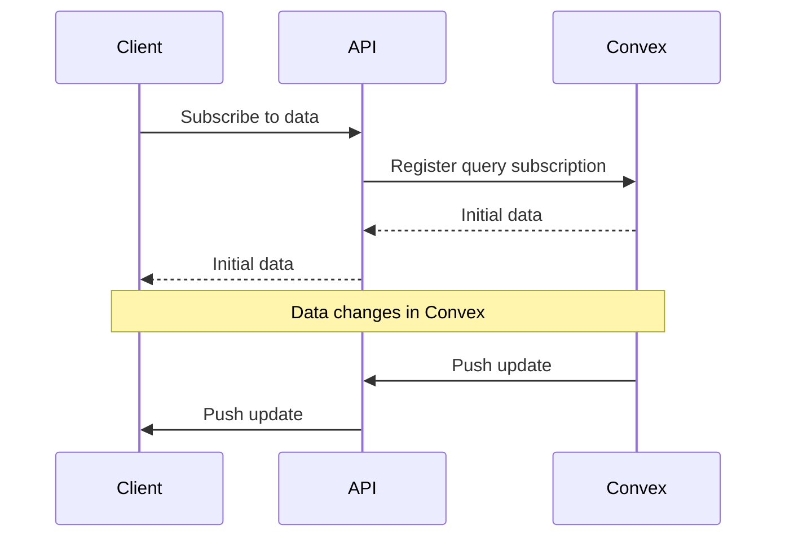
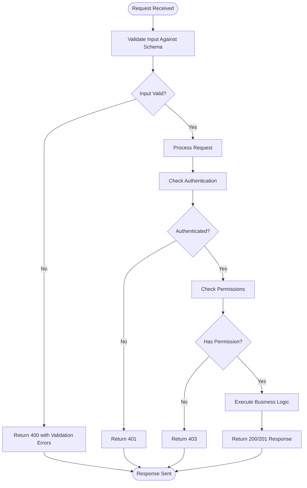

# API Reference

<cite>
**Referenced Files in This Document**   
- [middleware.ts](file://src/middleware.ts)
- [auth.ts](file://convex/auth.ts)
- [users.ts](file://convex/users.ts)
- [beneficiaries.ts](file://convex/beneficiaries.ts)
- [donations.ts](file://convex/donations.ts)
- [aid-application.ts](file://src/lib/validations/aid-application.ts)
- [beneficiary.ts](file://src/lib/validations/beneficiary.ts)
- [kumbara.ts](file://src/lib/validations/kumbara.ts)
- [meeting.ts](file://src/lib/validations/meeting.ts)
- [auth-utils.ts](file://src/lib/api/auth-utils.ts)
- [route.ts](file://src/app/api/auth/login/route.ts)
- [users/route.ts](file://src/app/api/users/route.ts)
- [beneficiaries/route.ts](file://src/app/api/beneficiaries/route.ts)
- [donations/route.ts](file://src/app/api/donations/route.ts)
</cite>

## Table of Contents

1. [Introduction](#introduction)
2. [Authentication](#authentication)
3. [Rate Limiting](#rate-limiting)
4. [API Versioning](#api-versioning)
5. [Real-time Capabilities](#real-time-capabilities)
6. [API Endpoints](#api-endpoints)
   - [Auth](#auth)
   - [Users](#users)
   - [Beneficiaries](#beneficiaries)
   - [Donations](#donations)
7. [Error Handling](#error-handling)
8. [Pagination](#pagination)
9. [Request Validation](#request-validation)

## Introduction

The PORTAL application provides a comprehensive API for managing users, beneficiaries, donations, and other organizational data. This API reference documents all public endpoints, including their request/response schemas, authentication requirements, and usage examples.

The API follows RESTful principles with JSON request and response payloads. All endpoints are protected by authentication and appropriate authorization checks based on user roles and permissions.

**Section sources**

- [middleware.ts](file://src/middleware.ts)

## Authentication

The API uses session-based authentication with CSRF protection. Users must authenticate through the login endpoint to obtain a session cookie and CSRF token.

Authentication is enforced through Next.js middleware, which checks for valid sessions on protected routes. The system implements role-based access control (RBAC) with granular permissions for different modules.

The authentication flow:

1. Obtain CSRF token from `/api/csrf`
2. Submit credentials to `/api/auth/login`
3. Receive session cookie and CSRF token in response
4. Include CSRF token in subsequent requests to protected endpoints

**Section sources**

- [middleware.ts](file://src/middleware.ts)
- [auth.ts](file://convex/auth.ts)
- [auth-utils.ts](file://src/lib/api/auth-utils.ts)
- [route.ts](file://src/app/api/auth/login/route.ts)

## Rate Limiting

The API implements rate limiting to prevent abuse and ensure system stability. The rate limiting configuration is defined in the application's rate limit module.

Login attempts are specifically rate-limited to prevent brute force attacks. Other API endpoints inherit rate limiting from the framework's default configuration.

Rate limiting headers are included in responses to inform clients of their current rate limit status.

**Section sources**

- [middleware.ts](file://src/middleware.ts)
- [rate-limit-config.ts](file://src/lib/rate-limit-config.ts)

## API Versioning

The API does not currently implement versioning in the URL path. All endpoints are served from their base paths without version prefixes.

Backwards compatibility is maintained through careful schema evolution. When breaking changes are required, they are introduced with adequate notice and migration paths for clients.

Future versions of the API may introduce versioning through URL paths (e.g., `/api/v1/users`) or custom headers.

**Section sources**

- [middleware.ts](file://src/middleware.ts)

## Real-time Capabilities

The application leverages Convex for real-time data synchronization. Convex provides reactive queries that automatically push updates to clients when data changes.

Real-time capabilities are implemented through:

- Convex queries for data retrieval
- Convex mutations for data modification
- Automatic client-side reactivity

Clients can subscribe to data changes, receiving updates in real-time without the need for manual polling.



**Diagram sources**

- [users.ts](file://convex/users.ts)
- [beneficiaries.ts](file://convex/beneficiaries.ts)
- [donations.ts](file://convex/donations.ts)

## API Endpoints

### Auth

#### POST /api/auth/login

Authenticate a user and create a session.

**Authentication**: Not required

**Request Body**:

```json
{
  "email": "string",
  "password": "string",
  "rememberMe": "boolean"
}
```

**Response (200)**:

```json
{
  "success": true,
  "data": {
    "user": {
      "id": "string",
      "email": "string",
      "name": "string",
      "role": "string",
      "permissions": ["string"],
      "isActive": "boolean",
      "createdAt": "string",
      "updatedAt": "string",
      "phone": "string",
      "labels": ["string"]
    },
    "session": {
      "sessionId": "string",
      "expire": "string"
    }
  }
}
```

**Response (401)**: Invalid credentials
**Response (403)**: Inactive account

**Usage Example**:

```bash
curl -X POST https://portal.example.com/api/auth/login \
  -H "Content-Type: application/json" \
  -d '{"email":"user@example.com","password":"password123"}'
```

```javascript
fetch('/api/auth/login', {
  method: 'POST',
  headers: { 'Content-Type': 'application/json' },
  body: JSON.stringify({
    email: 'user@example.com',
    password: 'password123',
  }),
});
```

**Section sources**

- [route.ts](file://src/app/api/auth/login/route.ts)

### Users

#### GET /api/users

List users with optional filtering.

**Authentication**: Required
**Permissions**: `users:manage`

**Query Parameters**:

- `search`: Filter by name
- `role`: Filter by role
- `isActive`: Filter by active status
- `limit`: Number of results per page

**Response (200)**:

```json
{
  "success": true,
  "data": [
    {
      "_id": "string",
      "name": "string",
      "email": "string",
      "role": "string",
      "permissions": ["string"],
      "isActive": "boolean",
      "phone": "string",
      "avatar": "string",
      "labels": ["string"],
      "_creationTime": "string",
      "_updatedAt": "string"
    }
  ],
  "total": "number",
  "continueCursor": "string",
  "isDone": "boolean"
}
```

**Response (403)**: Insufficient permissions

**Usage Example**:

```bash
curl -X GET "https://portal.example.com/api/users?role=admin&isActive=true" \
  -H "Authorization: Bearer <token>"
```

#### POST /api/users

Create a new user.

**Authentication**: Required
**Permissions**: `users:manage`

**Request Body**:

```json
{
  "name": "string",
  "email": "string",
  "role": "string",
  "permissions": ["string"],
  "password": "string",
  "isActive": "boolean",
  "phone": "string",
  "avatar": "string",
  "labels": ["string"]
}
```

**Response (201)**: User created
**Response (400)**: Validation error
**Response (403)**: Insufficient permissions
**Response (409)**: Email already exists

**Usage Example**:

```bash
curl -X POST https://portal.example.com/api/users \
  -H "Content-Type: application/json" \
  -H "CSRF-Token: <token>" \
  -d '{
    "name": "John Doe",
    "email": "john@example.com",
    "role": "Staff",
    "permissions": ["beneficiaries:read", "donations:read"],
    "password": "securePassword123",
    "isActive": true
  }'
```

**Section sources**

- [users.ts](file://convex/users.ts)
- [users/route.ts](file://src/app/api/users/route.ts)

### Beneficiaries

#### GET /api/beneficiaries

List beneficiaries with pagination and filtering.

**Authentication**: Required
**Permissions**: `beneficiaries:read`

**Query Parameters**:

- `search`: Search by name
- `status`: Filter by status (TASLAK, AKTIF, PASIF, SILINDI)
- `city`: Filter by city
- `limit`: Number of results per page
- `skip`: Number of records to skip

**Response (200)**:

```json
{
  "success": true,
  "data": [
    {
      "_id": "string",
      "name": "string",
      "tc_no": "string",
      "phone": "string",
      "email": "string",
      "address": "string",
      "city": "string",
      "district": "string",
      "neighborhood": "string",
      "family_size": "number",
      "status": "string",
      "birth_date": "string",
      "gender": "string",
      "nationality": "string",
      "religion": "string",
      "marital_status": "string",
      "children_count": "number",
      "orphan_children_count": "number",
      "elderly_count": "number",
      "disabled_count": "number",
      "income_level": "string",
      "income_source": "string",
      "has_debt": "boolean",
      "housing_type": "string",
      "has_vehicle": "boolean",
      "health_status": "string",
      "has_chronic_illness": "boolean",
      "chronic_illness_detail": "string",
      "has_disability": "boolean",
      "disability_detail": "string",
      "has_health_insurance": "boolean",
      "regular_medication": "string",
      "education_level": "string",
      "occupation": "string",
      "employment_status": "string",
      "aid_type": "string",
      "totalAidAmount": "number",
      "aid_duration": "string",
      "priority": "string",
      "reference_name": "string",
      "reference_phone": "string",
      "reference_relation": "string",
      "application_source": "string",
      "notes": "string",
      "previous_aid": "boolean",
      "other_organization_aid": "boolean",
      "emergency": "boolean",
      "contact_preference": "string",
      "approval_status": "string",
      "approved_by": "string",
      "approved_at": "string",
      "_creationTime": "string",
      "_updatedAt": "string"
    }
  ],
  "total": "number"
}
```

**Response (403)**: Insufficient permissions

#### POST /api/beneficiaries

Create a new beneficiary.

**Authentication**: Required
**Permissions**: `beneficiaries:write`

**Request Body**:

```json
{
  "name": "string",
  "tc_no": "string",
  "phone": "string",
  "email": "string",
  "address": "string",
  "city": "string",
  "district": "string",
  "neighborhood": "string",
  "family_size": "number",
  "status": "string",
  "birth_date": "string",
  "gender": "string",
  "nationality": "string",
  "religion": "string",
  "marital_status": "string",
  "children_count": "number",
  "orphan_children_count": "number",
  "elderly_count": "number",
  "disabled_count": "number",
  "income_level": "string",
  "income_source": "string",
  "has_debt": "boolean",
  "housing_type": "string",
  "has_vehicle": "boolean",
  "health_status": "string",
  "has_chronic_illness": "boolean",
  "chronic_illness_detail": "string",
  "has_disability": "boolean",
  "disability_detail": "string",
  "has_health_insurance": "boolean",
  "regular_medication": "string",
  "education_level": "string",
  "occupation": "string",
  "employment_status": "string",
  "aid_type": "string",
  "totalAidAmount": "number",
  "aid_duration": "string",
  "priority": "string",
  "reference_name": "string",
  "reference_phone": "string",
  "reference_relation": "string",
  "application_source": "string",
  "notes": "string",
  "previous_aid": "boolean",
  "other_organization_aid": "boolean",
  "emergency": "boolean",
  "contact_preference": "string"
}
```

**Response (201)**: Beneficiary created
**Response (400)**: Validation error
**Response (403)**: Insufficient permissions
**Response (409)**: TC number already exists

**Section sources**

- [beneficiaries.ts](file://convex/beneficiaries.ts)
- [beneficiaries/route.ts](file://src/app/api/beneficiaries/route.ts)

### Donations

#### GET /api/donations

List donations with filtering options.

**Authentication**: Required
**Permissions**: `donations:read`

**Query Parameters**:

- `status`: Filter by status (pending, completed, cancelled)
- `donor_email`: Filter by donor email
- `is_kumbara`: Filter by kumbara status
- `limit`: Number of results per page
- `skip`: Number of records to skip

**Response (200)**:

```json
{
  "success": true,
  "data": [
    {
      "_id": "string",
      "donor_name": "string",
      "donor_phone": "string",
      "donor_email": "string",
      "amount": "number",
      "currency": "string",
      "donation_type": "string",
      "payment_method": "string",
      "donation_purpose": "string",
      "notes": "string",
      "receipt_number": "string",
      "receipt_file_id": "string",
      "status": "string",
      "is_kumbara": "boolean",
      "kumbara_location": "string",
      "collection_date": "string",
      "kumbara_institution": "string",
      "location_coordinates": {
        "lat": "number",
        "lng": "number"
      },
      "location_address": "string",
      "route_points": [
        {
          "lat": "number",
          "lng": "number",
          "address": "string"
        }
      ],
      "route_distance": "number",
      "route_duration": "number",
      "_creationTime": "string",
      "_updatedAt": "string"
    }
  ],
  "total": "number"
}
```

**Response (403)**: Insufficient permissions

#### POST /api/donations

Create a new donation.

**Authentication**: Required
**Permissions**: `donations:write`

**Request Body**:

```json
{
  "donor_name": "string",
  "donor_phone": "string",
  "donor_email": "string",
  "amount": "number",
  "currency": "string",
  "donation_type": "string",
  "payment_method": "string",
  "donation_purpose": "string",
  "notes": "string",
  "receipt_number": "string",
  "receipt_file_id": "string",
  "status": "string",
  "is_kumbara": "boolean",
  "kumbara_location": "string",
  "collection_date": "string",
  "kumbara_institution": "string",
  "location_coordinates": {
    "lat": "number",
    "lng": "number"
  },
  "location_address": "string",
  "route_points": [
    {
      "lat": "number",
      "lng": "number",
      "address": "string"
    }
  ],
  "route_distance": "number",
  "route_duration": "number"
}
```

**Response (201)**: Donation created
**Response (400)**: Validation error
**Response (403)**: Insufficient permissions

**Section sources**

- [donations.ts](file://convex/donations.ts)
- [donations/route.ts](file://src/app/api/donations/route.ts)

## Error Handling

The API returns standardized error responses with appropriate HTTP status codes.

**Common Error Responses**:

- `400 Bad Request`: Invalid request parameters or body
- `401 Unauthorized`: Missing or invalid authentication
- `403 Forbidden`: Insufficient permissions
- `404 Not Found`: Resource not found
- `409 Conflict`: Resource already exists
- `500 Internal Server Error`: Server-side error

Error response format:

```json
{
  "success": false,
  "error": "string",
  "details": ["string"]
}
```

Validation errors include detailed information about which fields failed validation.

**Section sources**

- [auth-utils.ts](file://src/lib/api/auth-utils.ts)
- [users/route.ts](file://src/app/api/users/route.ts)
- [beneficiaries/route.ts](file://src/app/api/beneficiaries/route.ts)
- [donations/route.ts](file://src/app/api/donations/route.ts)

## Pagination

Most list endpoints support pagination through query parameters. The API uses cursor-based pagination for better performance with large datasets.

**Query Parameters**:

- `limit`: Number of items per page (default: 50, max: 100)
- `skip`: Number of items to skip
- `cursor`: Cursor for the next page (returned in response)

**Response Format**:

```json
{
  "documents": ["array"],
  "total": "number",
  "continueCursor": "string",
  "isDone": "boolean"
}
```

Clients should use the `continueCursor` value from the response to fetch the next page of results.

**Section sources**

- [users.ts](file://convex/users.ts)
- [beneficiaries.ts](file://convex/beneficiaries.ts)
- [donations.ts](file://convex/donations.ts)

## Request Validation

All API requests are validated using Zod schemas. The validation occurs both on the client and server side to ensure data integrity.

Key validation schemas:

- `beneficiarySchema`: Validates beneficiary data with comprehensive field validation
- `kumbaraCreateSchema`: Validates kumbara donation creation
- `meetingSchema`: Validates meeting creation with date and participant validation
- `aidApplicationDocumentSchema`: Validates aid application data

Validation includes:

- Required field checks
- Type validation
- Length constraints
- Format validation (email, phone, TC number)
- Business rule validation (e.g., minors cannot be married)



**Diagram sources**

- [beneficiary.ts](file://src/lib/validations/beneficiary.ts)
- [kumbara.ts](file://src/lib/validations/kumbara.ts)
- [meeting.ts](file://src/lib/validations/meeting.ts)
- [aid-application.ts](file://src/lib/validations/aid-application.ts)
