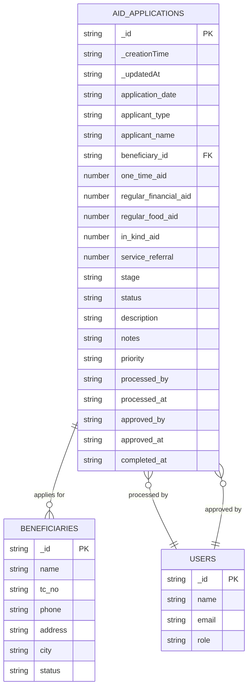
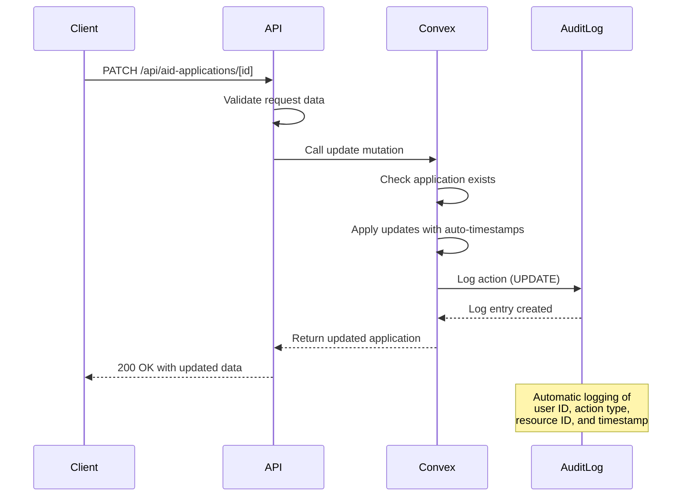
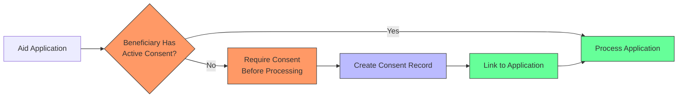
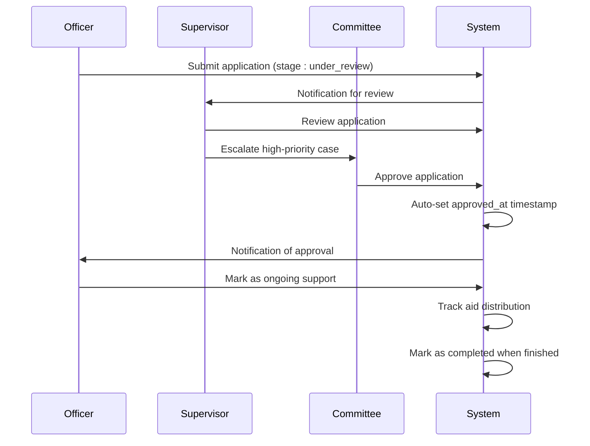

# Aid Applications API

<cite>
**Referenced Files in This Document**   
- [aid_applications.ts](file://convex/aid_applications.ts)
- [route.ts](file://src/app/api/aid-applications/route.ts)
- [route.ts](file://src/app/api/aid-applications/[id]/route.ts)
- [aid-application.ts](file://src/lib/validations/aid-application.ts)
- [api.ts](file://src/lib/convex/api.ts)
- [audit_logs.ts](file://convex/audit_logs.ts)
- [consents.ts](file://convex/consents.ts)
- [beneficiaries.ts](file://convex/beneficiaries.ts)
- [database.ts](file://src/types/database.ts)
</cite>

## Table of Contents

1. [Introduction](#introduction)
2. [Core Endpoints](#core-endpoints)
3. [Data Model](#data-model)
4. [Application Lifecycle](#application-lifecycle)
5. [Validation Rules](#validation-rules)
6. [Audit Logging](#audit-logging)
7. [Consent Management Integration](#consent-management-integration)
8. [Error Handling](#error-handling)
9. [Examples](#examples)

## Introduction

The Aid Applications API provides comprehensive functionality for managing aid applications within the PORTAL application. This API enables organizations to track applications through their entire lifecycle from submission to completion, with robust filtering, validation, and audit capabilities. The system supports multiple aid types and integrates with beneficiary records and consent management systems to ensure compliance and data integrity.

**Section sources**

- [aid_applications.ts](file://convex/aid_applications.ts#L1-L162)
- [route.ts](file://src/app/api/aid-applications/route.ts#L1-L115)

## Core Endpoints

### GET /api/aid-applications

Retrieves a paginated list of aid applications with optional filtering by status, application type, and beneficiary.

**Query Parameters**

- `limit` (number, optional): Number of records to return (default: 50, max: 100)
- `skip` (number, optional): Number of records to skip for pagination
- `page` (number, optional): Page number for pagination (calculated as skip = (page-1) \* limit)
- `stage` (string, optional): Filter by application stage (draft, under_review, approved, ongoing, completed)
- `status` (string, optional): Filter by status (open, closed)
- `beneficiary_id` (string, optional): Filter by beneficiary ID
- `search` (string, optional): Text search across application fields

**Response Format**

```json
{
  "success": true,
  "data": [
    {
      "_id": "string",
      "application_date": "string (ISO date)",
      "applicant_type": "person|organization|partner",
      "applicant_name": "string",
      "beneficiary_id": "string",
      "one_time_aid": "number",
      "regular_financial_aid": "number",
      "regular_food_aid": "number",
      "in_kind_aid": "number",
      "service_referral": "number",
      "stage": "draft|under_review|approved|ongoing|completed",
      "status": "open|closed",
      "description": "string",
      "notes": "string",
      "priority": "low|normal|high|urgent",
      "processed_by": "string (user ID)",
      "processed_at": "string (ISO date)",
      "approved_by": "string (user ID)",
      "approved_at": "string (ISO date)",
      "completed_at": "string (ISO date)"
    }
  ],
  "total": "number"
}
```

**Section sources**

- [aid_applications.ts](file://convex/aid_applications.ts#L5-L43)
- [route.ts](file://src/app/api/aid-applications/route.ts#L32-L55)

### GET /api/aid-applications/[id]

Retrieves detailed information about a specific aid application including assessment notes, supporting documents, and approval history.

**Path Parameters**

- `id` (string, required): The unique identifier of the aid application

**Response Format**

```json
{
  "success": true,
  "data": {
    "_id": "string",
    "application_date": "string (ISO date)",
    "applicant_type": "person|organization|partner",
    "applicant_name": "string",
    "beneficiary_id": "string",
    "one_time_aid": "number",
    "regular_financial_aid": "number",
    "regular_food_aid": "number",
    "in_kind_aid": "number",
    "service_referral": "number",
    "stage": "draft|under_review|approved|ongoing|completed",
    "status": "open|closed",
    "description": "string",
    "notes": "string",
    "priority": "low|normal|high|urgent",
    "processed_by": "string (user ID)",
    "processed_at": "string (ISO date)",
    "approved_by": "string (user ID)",
    "approved_at": "string (ISO date)",
    "completed_at": "string (ISO date)"
  }
}
```

**Section sources**

- [aid_applications.ts](file://convex/aid_applications.ts#L47-L52)
- [route.ts](file://src/app/api/aid-applications/[id]/route.ts#L24-L50)

### POST /api/aid-applications

Submits a new aid application to the system.

**Request Body**

```json
{
  "application_date": "string (ISO date)",
  "applicant_type": "person|organization|partner",
  "applicant_name": "string",
  "beneficiary_id": "string",
  "one_time_aid": "number",
  "regular_financial_aid": "number",
  "regular_food_aid": "number",
  "in_kind_aid": "number",
  "service_referral": "number",
  "stage": "draft|under_review|approved|ongoing|completed",
  "status": "open|closed",
  "description": "string",
  "notes": "string",
  "priority": "low|normal|high|urgent"
}
```

**Response Format**

```json
{
  "success": true,
  "data": {
    "_id": "string",
    "application_date": "string (ISO date)",
    "applicant_type": "person|organization|partner",
    "applicant_name": "string",
    "beneficiary_id": "string",
    "one_time_aid": "number",
    "regular_financial_aid": "number",
    "regular_food_aid": "number",
    "in_kind_aid": "number",
    "service_referral": "number",
    "stage": "draft|under_review|approved|ongoing|completed",
    "status": "open|closed",
    "description": "string",
    "notes": "string",
    "priority": "low|normal|high|urgent"
  },
  "message": "Application created successfully"
}
```

**Section sources**

- [aid_applications.ts](file://convex/aid_applications.ts#L55-L92)
- [route.ts](file://src/app/api/aid-applications/route.ts#L61-L113)

### PATCH /api/aid-applications/[id]

Updates an existing aid application, including recording approval decisions and status changes.

**Path Parameters**

- `id` (string, required): The unique identifier of the aid application

**Request Body**

```json
{
  "stage": "draft|under_review|approved|ongoing|completed",
  "status": "open|closed",
  "priority": "low|normal|high|urgent",
  "one_time_aid": "number",
  "regular_financial_aid": "number",
  "regular_food_aid": "number",
  "in_kind_aid": "number",
  "service_referral": "number",
  "description": "string",
  "notes": "string",
  "processed_by": "string (user ID)",
  "processed_at": "string (ISO date)",
  "approved_by": "string (user ID)",
  "approved_at": "string (ISO date)",
  "completed_at": "string (ISO date)"
}
```

**Response Format**

```json
{
  "success": true,
  "data": {
    "_id": "string",
    "application_date": "string (ISO date)",
    "applicant_type": "person|organization|partner",
    "applicant_name": "string",
    "beneficiary_id": "string",
    "one_time_aid": "number",
    "regular_financial_aid": "number",
    "regular_food_aid": "number",
    "in_kind_aid": "number",
    "service_referral": "number",
    "stage": "draft|under_review|approved|ongoing|completed",
    "status": "open|closed",
    "description": "string",
    "notes": "string",
    "priority": "low|normal|high|urgent",
    "processed_by": "string (user ID)",
    "processed_at": "string (ISO date)",
    "approved_by": "string (user ID)",
    "approved_at": "string (ISO date)",
    "completed_at": "string (ISO date)"
  },
  "message": "Application updated successfully"
}
```

**Section sources**

- [aid_applications.ts](file://convex/aid_applications.ts#L94-L147)
- [route.ts](file://src/app/api/aid-applications/[id]/route.ts#L56-L97)

## Data Model

The aid application data model includes comprehensive fields for tracking application details, aid types, and processing information.

**AidApplicationDocument Structure**

- `_id`: Unique identifier (string)
- `_creationTime`: Creation timestamp (ISO string)
- `_updatedAt`: Last update timestamp (ISO string)
- `application_date`: Date of application submission (ISO string)
- `applicant_type`: Type of applicant (person, organization, partner)
- `applicant_name`: Name of applicant (string)
- `beneficiary_id`: Reference to beneficiary record (string)
- `one_time_aid`: Amount of one-time financial aid (number)
- `regular_financial_aid`: Amount of regular financial aid (number)
- `regular_food_aid`: Amount of regular food aid (number)
- `in_kind_aid`: Value of in-kind aid (number)
- `service_referral`: Value of service referrals (number)
- `stage`: Current stage in workflow (draft, under_review, approved, ongoing, completed)
- `status`: Open/closed status (open, closed)
- `description`: Application description (string)
- `notes`: Internal notes (string)
- `priority`: Processing priority (low, normal, high, urgent)
- `processed_by`: User ID of processor (string)
- `processed_at`: Timestamp of processing (ISO string)
- `approved_by`: User ID of approver (string)
- `approved_at`: Timestamp of approval (ISO string)
- `completed_at`: Timestamp of completion (ISO string)



**Diagram sources**

- [database.ts](file://src/types/database.ts#L524-L543)
- [aid_applications.ts](file://convex/aid_applications.ts#L55-L88)

## Application Lifecycle

The aid application system implements a multi-stage approval workflow with automatic timestamp management.

```mermaid
flowchart TD
A[Draft Application] --> B[Under Review]
B --> C{Approval Decision}
C --> |Approved| D[Approved]
C --> |Rejected| E[Completed]
D --> F[Ongoing Support]
F --> G[Completed]
G --> H[Closed]
style A fill:#f9f,stroke:#333
style B fill:#bbf,stroke:#333
style C fill:#f96,stroke:#333
style D fill:#6f9,stroke:#333
style E fill:#f66,stroke:#333
style F fill:#6f9,stroke:#333
style G fill:#6f9,stroke:#333
style H fill:#ccc,stroke:#333
classDef stage fill:#eef,stroke:#66f,stroke-width:2px;
classDef decision fill:#fdd,stroke:#f66,stroke-width:2px;
classDef final fill:#eee,stroke:#999,stroke-width:2px;
class A,B,D,F stage
class C decision
class E,G,H final
note right of C
Multi-level approval process
with committee review
end note
note right of G
Automatic timestamp set
when stage changes to completed
end note
```

**Diagram sources**

- [aid_applications.ts](file://convex/aid_applications.ts#L136-L142)
- [aid_applications.ts](file://convex/aid_applications.ts#L70-L75)

## Validation Rules

The system enforces strict validation rules for different aid types and application data.

**Required Fields**

- `applicant_name`: Minimum 2 characters
- `application_date`: Must be valid ISO date string
- `stage`: Must be one of: draft, under_review, approved, ongoing, completed
- `status`: Must be one of: open, closed

**Numerical Constraints**

- All aid amount fields (one_time_aid, regular_financial_aid, etc.) must be non-negative numbers
- Priority values restricted to: low, normal, high, urgent
- Applicant type restricted to: person, organization, partner

**Section sources**

- [aid-application.ts](file://src/lib/validations/aid-application.ts#L8-L45)
- [route.ts](file://src/app/api/aid-applications/route.ts#L6-L27)

## Audit Logging

All application modifications are automatically logged for compliance and accountability.



**Diagram sources**

- [aid_applications.ts](file://convex/aid_applications.ts#L129-L146)
- [audit_logs.ts](file://convex/audit_logs.ts#L12-L35)

## Consent Management Integration

The system integrates with beneficiary consent records to ensure proper authorization for aid processing.



**Diagram sources**

- [consents.ts](file://convex/consents.ts#L4-L47)
- [beneficiaries.ts](file://convex/beneficiaries.ts#L123-L151)

## Error Handling

The API provides comprehensive error responses for various failure scenarios.

**Common Error Responses**

- `400 Bad Request`: Invalid request data or validation errors
  ```json
  {
    "success": false,
    "error": "Validation error",
    "details": ["Applicant name is required", "Invalid stage"]
  }
  ```
- `404 Not Found`: Application ID not found
  ```json
  {
    "success": false,
    "error": "Application not found"
  }
  ```
- `500 Internal Server Error`: System error during processing
  ```json
  {
    "success": false,
    "error": "Data retrieval failed"
  }
  ```

**Section sources**

- [route.ts](file://src/app/api/aid-applications/route.ts#L48-L55)
- [route.ts](file://src/app/api/aid-applications/[id]/route.ts#L40-L50)

## Examples

### Multi-Stage Approval Workflow



**Diagram sources**

- [aid_applications.ts](file://convex/aid_applications.ts#L136-L142)
- [workflow_notifications.ts](file://convex/workflow_notifications.ts)

### Incomplete Application Response

When submitting an application with missing required fields:

**Request**

```json
{
  "applicant_name": "",
  "application_date": "2023-12-01"
}
```

**Response (400 Bad Request)**

```json
{
  "success": false,
  "error": "Validation error",
  "details": ["Applicant name is required", "Invalid stage"]
}
```

**Section sources**

- [route.ts](file://src/app/api/aid-applications/route.ts#L68-L73)
- [aid-application.ts](file://src/lib/validations/aid-application.ts#L11-L25)
