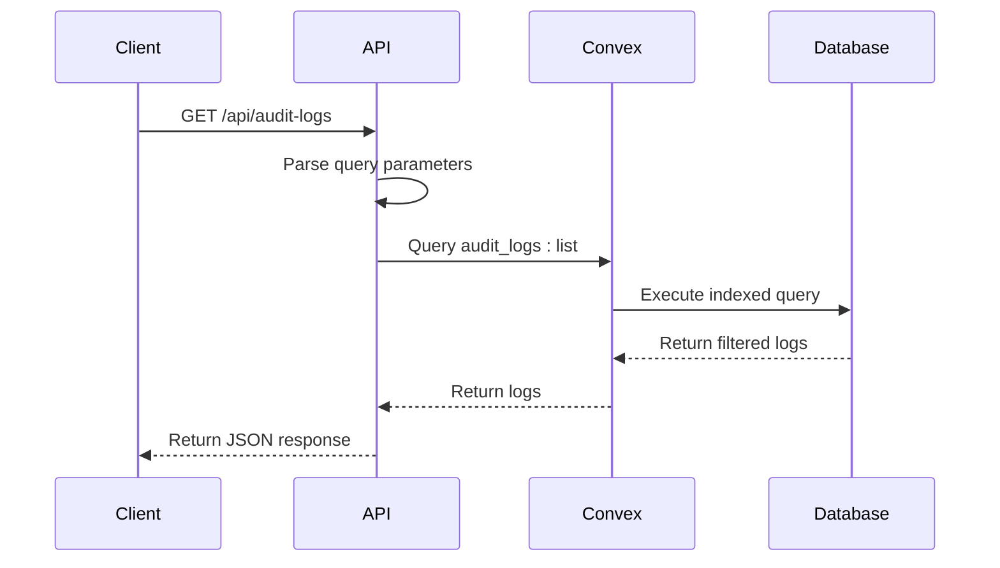
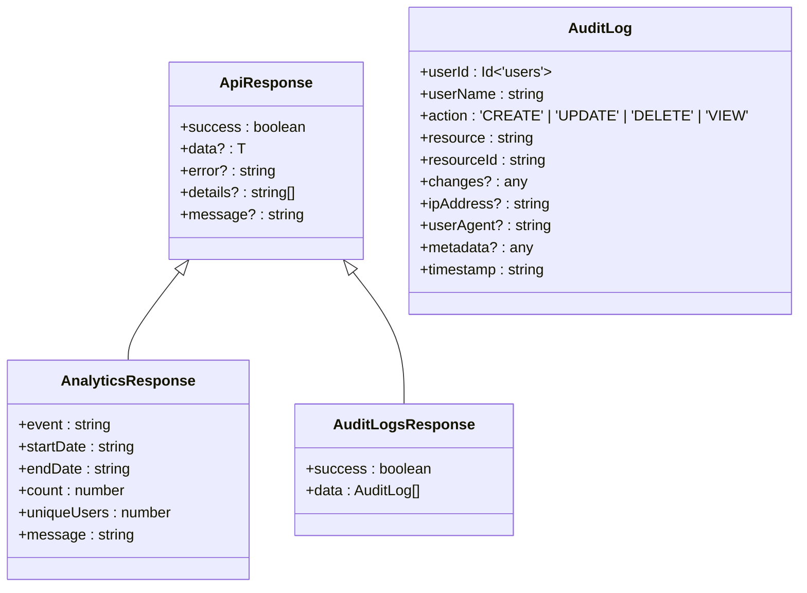
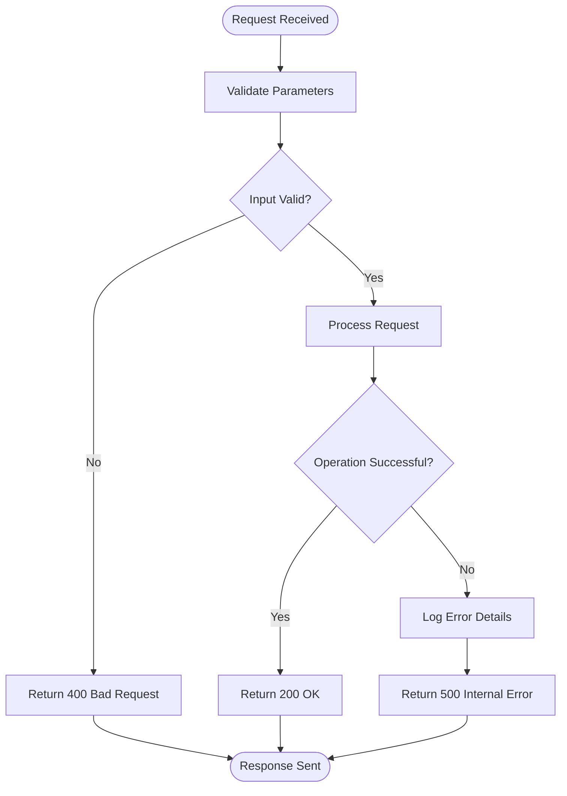
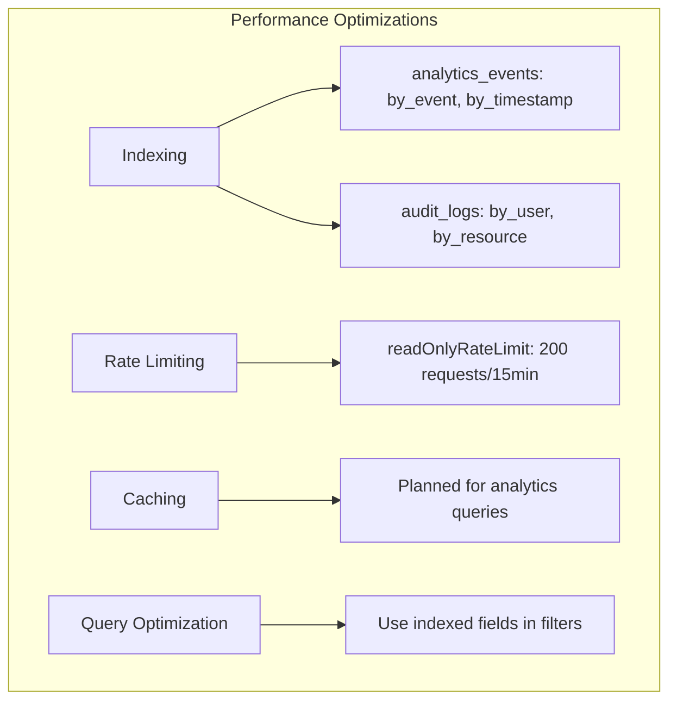

# Analytics and Audit API

<cite>
**Referenced Files in This Document**   
- [analytics.ts](file://convex/analytics.ts)
- [audit_logs.ts](file://convex/audit_logs.ts)
- [route.ts](file://src/app/api/analytics/route.ts)
- [route.ts](file://src/app/api/audit-logs/route.ts)
- [route-helpers.ts](file://src/lib/api/route-helpers.ts)
- [rate-limit.ts](file://src/lib/rate-limit.ts)
</cite>

## Table of Contents

1. [Introduction](#introduction)
2. [Analytics Endpoint](#analytics-endpoint)
3. [Audit Logs Endpoint](#audit-logs-endpoint)
4. [Data Aggregation Methods](#data-aggregation-methods)
5. [Response Formats](#response-formats)
6. [Pagination Strategies](#pagination-strategies)
7. [Use Cases](#use-cases)
8. [Error Responses](#error-responses)
9. [Data Retention Policies](#data-retention-policies)
10. [Performance Optimizations](#performance-optimizations)
11. [Security Considerations](#security-considerations)

## Introduction

The PORTAL application provides two critical endpoints for monitoring system activity and ensuring compliance: the analytics endpoint for tracking user behavior and donation trends, and the audit logs endpoint for recording security-relevant operations. These endpoints enable administrators to generate reports, investigate incidents, and maintain regulatory compliance. The analytics system captures user interactions across the platform, while the audit logging system maintains an immutable record of all critical operations.

## Analytics Endpoint

The GET /api/analytics endpoint retrieves system-wide metrics including user activity, donation trends, and beneficiary statistics. This endpoint supports date range filtering through startDate and endDate parameters, allowing clients to request data for specific time periods. The analytics system tracks various event types across the application, enabling comprehensive analysis of user engagement and platform performance. Currently, the implementation returns placeholder responses, with database queries to be implemented for production use.

**Section sources**

- [route.ts](file://src/app/api/analytics/route.ts#L50-L74)
- [analytics.ts](file://convex/analytics.ts#L28-L53)

## Audit Logs Endpoint

The GET /api/audit-logs endpoint retrieves security and compliance logs with filtering capabilities by user, action type, and timestamp. The endpoint accepts action (CREATE, UPDATE, DELETE, VIEW), resource, and limit parameters to refine the results. The implementation uses Convex database queries with appropriate indexes to efficiently retrieve audit records. The response includes a success flag and data array containing the matching audit log entries.

**Diagram sources**

- [route.ts](file://src/app/api/audit-logs/route.ts#L9-L56)
- [audit_logs.ts](file://convex/audit_logs.ts#L39-L91)

## Data Aggregation Methods

The analytics system employs several data aggregation methods to provide meaningful insights from raw event data. For user activity metrics, the system counts unique users by creating a Set from userId values in filtered events. Donation trends are analyzed by grouping events by time periods and calculating cumulative totals. Beneficiary statistics are derived by filtering events based on beneficiary-related actions and aggregating counts by status and category. The audit system aggregates logs by action type, resource, and user to identify patterns and potential security issues.

**Section sources**

- [analytics.ts](file://convex/analytics.ts#L28-L53)
- [audit_logs.ts](file://convex/audit_logs.ts#L94-L155)

## Response Formats

Both endpoints return standardized JSON responses with a consistent structure. The analytics endpoint returns time series data and counts in a structured format with event, date range, count, and uniqueUsers fields. The audit logs endpoint returns an array of log entries with success flag and data properties. All responses follow the ApiResponse<T> interface defined in route-helpers.ts, ensuring consistent error handling and data presentation across the API.

**Diagram sources**

- [route-helpers.ts](file://src/lib/api/route-helpers.ts#L11-L17)
- [route.ts](file://src/app/api/analytics/route.ts#L60-L67)
- [route.ts](file://src/app/api/audit-logs/route.ts#L39-L42)

## Pagination Strategies

The audit logs endpoint implements pagination through the limit parameter, which controls the maximum number of records returned in a single response. The default limit is 100 records, with a configurable maximum. The implementation uses Convex's take() method to enforce the limit at the database query level, ensuring efficient retrieval. For analytics queries that may return large result sets, similar pagination will be implemented to prevent performance degradation and excessive memory usage.

**Section sources**

- [audit_logs.ts](file://convex/audit_logs.ts#L50-L51)
- [route.ts](file://src/app/api/audit-logs/route.ts#L15-L16)

## Use Cases

### Monthly Reporting

Administrators can generate monthly reports by querying the analytics endpoint with startDate and endDate parameters set to the beginning and end of the target month. The system aggregates user activity, donation totals, and beneficiary statistics to produce comprehensive reports on platform performance and impact.

### Security Incident Investigation

Security teams can investigate incidents by querying the audit logs endpoint with specific user IDs, action types, and time ranges. For example, to investigate a potential data breach, they can retrieve all DELETE actions performed by a specific user during a suspicious time period.

**Section sources**

- [analytics.ts](file://convex/analytics.ts#L28-L53)
- [audit_logs.ts](file://convex/audit_logs.ts#L39-L91)

## Error Responses

Both endpoints implement comprehensive error handling to provide meaningful feedback to clients. The analytics endpoint returns 400 for validation errors and 500 for server errors, with descriptive error messages. The audit logs endpoint follows the same pattern, with additional error logging for troubleshooting. All error responses adhere to the standardized ApiResponse format, ensuring consistent client handling.

**Diagram sources**

- [route.ts](file://src/app/api/analytics/route.ts#L68-L74)
- [route.ts](file://src/app/api/audit-logs/route.ts#L43-L55)

## Data Retention Policies

Audit logs are retained according to organizational compliance requirements, with a default retention period that ensures sufficient history for security investigations and regulatory audits. The system automatically archives older logs to cold storage while maintaining queryability. Analytics data may have different retention policies, with raw event data retained for a shorter period than aggregated statistics used for reporting.

**Section sources**

- [audit_logs.ts](file://convex/audit_logs.ts#L1-L4)
- [analytics.ts](file://convex/analytics.ts#L1-L4)

## Performance Optimizations

The analytics queries are optimized through the use of database indexes on key fields such as event type, timestamp, and user ID. The audit logs system employs similar indexing strategies on userId, resource, and action fields to ensure fast query performance. Both systems implement server-side rate limiting to prevent abuse and ensure fair resource allocation. For large-scale analytics queries, the system will implement caching strategies to improve response times for frequently requested reports.

**Diagram sources**

- [analytics.ts](file://convex/analytics.ts#L38-L39)
- [audit_logs.ts](file://convex/audit_logs.ts#L58-L69)
- [rate-limit.ts](file://src/lib/rate-limit.ts#L110-L116)

## Security Considerations

The audit logs endpoint implements strict access controls to ensure only authorized personnel can retrieve sensitive security information. All audit log queries are rate-limited to prevent enumeration attacks. The system includes client IP tracking and user agent recording to provide additional context for security investigations. Sensitive information is excluded from audit logs to prevent potential data leaks.

**Section sources**

- [route.ts](file://src/app/api/audit-logs/route.ts#L17-L37)
- [rate-limit.ts](file://src/lib/rate-limit.ts#L110-L116)
