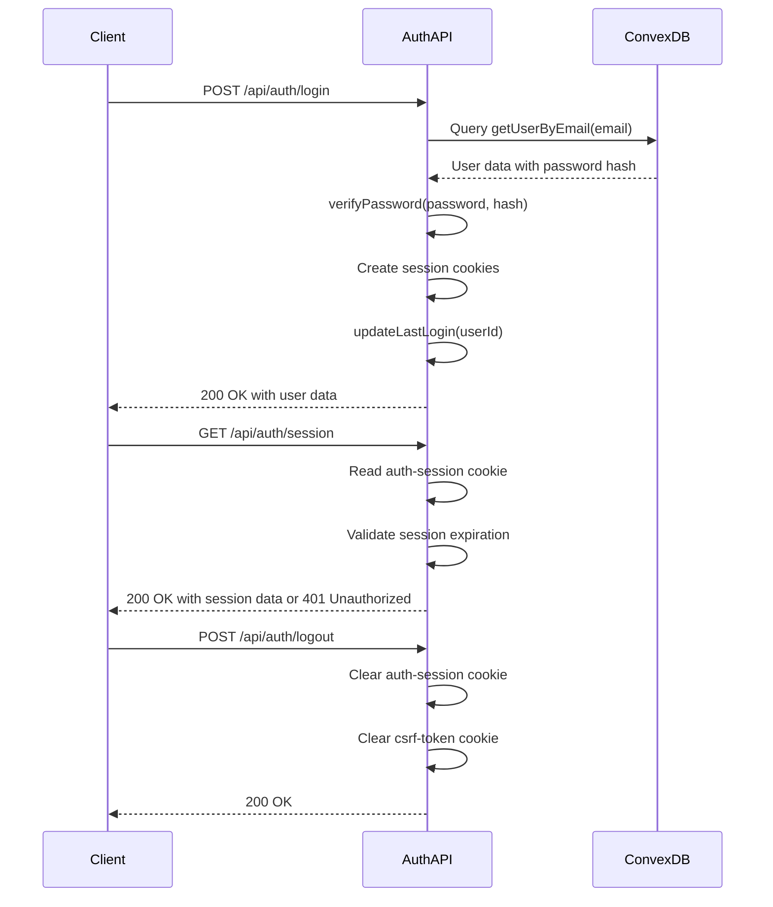
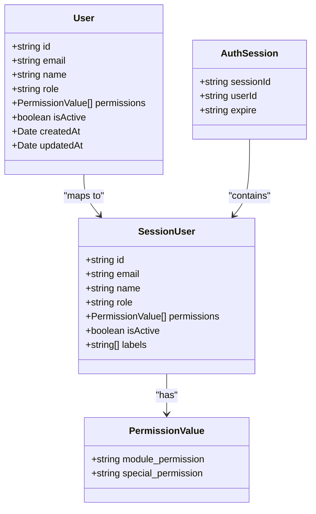
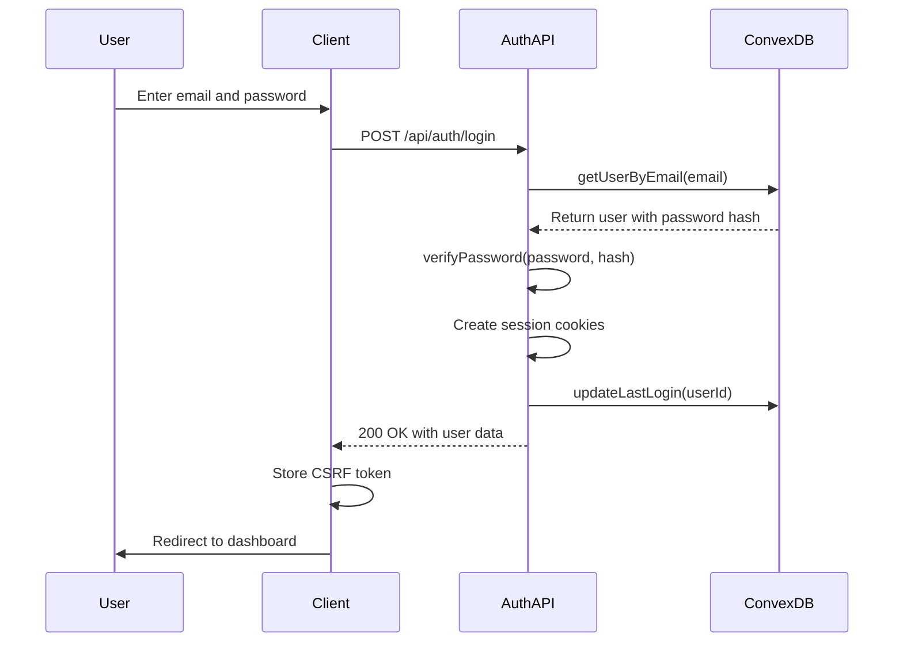
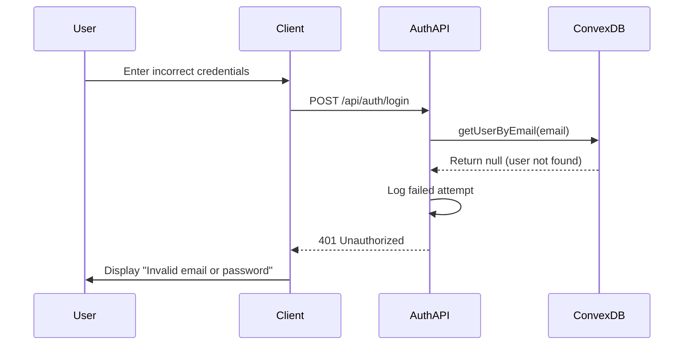

# Authentication API

<cite>
**Referenced Files in This Document**   
- [auth.ts](file://convex/auth.ts)
- [login/route.ts](file://src/app/api/auth/login/route.ts)
- [session/route.ts](file://src/app/api/auth/session/route.ts)
- [logout/route.ts](file://src/app/api/auth/logout/route.ts)
- [session.ts](file://src/lib/auth/session.ts)
- [password.ts](file://src/lib/auth/password.ts)
- [get-user.ts](file://src/lib/auth/get-user.ts)
- [auth.ts](file://src/types/auth.ts)
- [middleware.ts](file://src/middleware.ts)
</cite>

## Table of Contents

1. [Introduction](#introduction)
2. [Authentication Endpoints](#authentication-endpoints)
3. [Session Management](#session-management)
4. [Security Considerations](#security-considerations)
5. [RBAC Integration](#rbac-integration)
6. [Error Handling](#error-handling)
7. [Authentication Flow Examples](#authentication-flow-examples)
8. [CSRF Protection](#csrf-protection)

## Introduction

The PORTAL application provides a secure authentication system that integrates with Convex for user management and authentication. This documentation details the authentication endpoints, session handling, security measures, and integration with the Role-Based Access Control (RBAC) system. The authentication system uses secure cookies for session management, implements CSRF protection, and validates user credentials against the Convex database.

**Section sources**

- [auth.ts](file://convex/auth.ts)
- [middleware.ts](file://src/middleware.ts)

## Authentication Endpoints

### POST /api/auth/login

This endpoint handles user authentication by validating credentials and establishing a session.

**Request**

- Method: POST
- Content-Type: application/json

**Request Body Schema**

```json
{
  "email": "string",
  "password": "string",
  "rememberMe": "boolean (optional)"
}
```

**Request Parameters**

- `email`: User's email address (required)
- `password`: User's password (required)
- `rememberMe`: Whether to extend session duration (optional, defaults to false)

**Response**

- Success (200): Returns user data and session information
- Unauthorized (401): Invalid credentials
- Forbidden (403): Inactive account

**Success Response Schema**

```json
{
  "success": true,
  "data": {
    "user": {
      "id": "string",
      "email": "string",
      "name": "string",
      "role": "string",
      "permissions": ["string"],
      "isActive": "boolean",
      "createdAt": "string",
      "updatedAt": "string",
      "phone": "string",
      "labels": ["string"]
    },
    "session": {
      "sessionId": "string",
      "expire": "string"
    }
  }
}
```

**Authentication Process**

1. Validates input parameters
2. Queries Convex database for user by email
3. Verifies password using bcrypt
4. Creates session with secure cookies
5. Updates last login timestamp
6. Returns user data and session information

The endpoint implements rate limiting to prevent brute force attacks and logs authentication attempts for security monitoring.

**Section sources**

- [login/route.ts](file://src/app/api/auth/login/route.ts)
- [password.ts](file://src/lib/auth/password.ts)
- [auth.ts](file://convex/auth.ts)

## Session Management

### GET /api/auth/session

Retrieves current user session data for client-side authentication state initialization.

**Request**

- Method: GET

**Response**

- Success (200): Returns session information
- Unauthorized (401): No active session or expired session

**Success Response Schema**

```json
{
  "success": true,
  "data": {
    "userId": "string",
    "expiresAt": "string"
  }
}
```

**Session Validation**
The endpoint validates the session by:

1. Reading the auth-session cookie
2. Parsing session data from JSON
3. Checking expiration timestamp
4. Returning session information if valid

If the session is expired, the cookie is cleared and a 401 response is returned.

### POST /api/auth/logout

Terminates the current user session by clearing authentication cookies.

**Request**

- Method: POST

**Response**

- Success (200): Session terminated successfully
- Error (500): Error during logout process (session still cleared)

**Logout Process**

1. Clears auth-session cookie by setting maxAge to 0
2. Clears csrf-token cookie by setting maxAge to 0
3. Returns success response

The endpoint ensures cookies are cleared even if an error occurs during the logout process.



**Diagram sources**

- [login/route.ts](file://src/app/api/auth/login/route.ts#L15-L176)
- [session/route.ts](file://src/app/api/auth/session/route.ts#L8-L63)
- [logout/route.ts](file://src/app/api/auth/logout/route.ts#L8-L71)

**Section sources**

- [session/route.ts](file://src/app/api/auth/session/route.ts)
- [logout/route.ts](file://src/app/api/auth/logout/route.ts)
- [session.ts](file://src/lib/auth/session.ts)

## Security Considerations

### Cookie Security

The authentication system implements secure cookie attributes:

**auth-session Cookie**

- HttpOnly: true (prevents client-side JavaScript access)
- Secure: true in production (transmitted only over HTTPS)
- SameSite: strict (prevents CSRF attacks)
- Path: / (available across the entire domain)

**csrf-token Cookie**

- HttpOnly: false (accessible to client-side JavaScript for CSRF protection)
- Secure: true in production
- SameSite: strict
- Path: /

### Password Handling

Password security is implemented through:

- bcrypt hashing with 12 salt rounds
- Password strength validation (minimum 8 characters, includes letters and numbers)
- Secure transmission over HTTPS
- Server-side validation only (no client-side password validation)

### Session Security

- Session IDs are generated with cryptographically secure random values
- Sessions have expiration times (24 hours by default, 30 days with rememberMe)
- Session data is stored server-side in Convex database
- Session validation occurs on each protected request

**Section sources**

- [login/route.ts](file://src/app/api/auth/login/route.ts)
- [session.ts](file://src/lib/auth/session.ts)
- [password.ts](file://src/lib/auth/password.ts)

## RBAC Integration

### Role-Based Access Control

The authentication system integrates with the RBAC system to enforce permission-based access to application resources. User roles and permissions are stored in the Convex database and included in the session data.

**User Roles**

- Dernek Başkanı (Association President)
- Yönetici (Manager)
- Üye (Member)
- Görüntüleyici (Viewer)
- Personel (Staff)

**Permission Structure**
Permissions are defined as an array of permission values that determine access to specific modules and actions. The middleware checks these permissions against route requirements.



**Diagram sources**

- [auth.ts](file://src/types/auth.ts#L3-L44)
- [session.ts](file://src/lib/auth/session.ts#L8-L22)
- [middleware.ts](file://src/middleware.ts#L9-L10)

**Section sources**

- [middleware.ts](file://src/middleware.ts)
- [session.ts](file://src/lib/auth/session.ts)
- [auth.ts](file://src/types/auth.ts)

## Error Handling

### Error Responses

The authentication endpoints return standardized error responses:

**401 Unauthorized**

```json
{
  "success": false,
  "error": "No active session" | "Session expired" | "Geçersiz email veya şifre"
}
```

**403 Forbidden**

```json
{
  "success": false,
  "error": "Hesap aktif değil"
}
```

**400 Bad Request**

```json
{
  "success": false,
  "error": "Email ve şifre gereklidir"
}
```

**500 Internal Server Error**

```json
{
  "success": false,
  "error": "Giriş yapılırken bir hata oluştu" | "Logout error"
}
```

### Error Scenarios

- Invalid credentials: Returns 401 with generic error message
- Inactive account: Returns 403 with specific error message
- Missing required fields: Returns 400 with validation error
- Server errors: Returns 500 with error message
- Expired sessions: Returns 401 and clears the session cookie

**Section sources**

- [login/route.ts](file://src/app/api/auth/login/route.ts)
- [session/route.ts](file://src/app/api/auth/session/route.ts)
- [logout/route.ts](file://src/app/api/auth/logout/route.ts)

## Authentication Flow Examples

### Successful Authentication Flow



### Failed Authentication Flow



**Diagram sources**

- [login/route.ts](file://src/app/api/auth/login/route.ts#L15-L176)
- [session/route.ts](file://src/app/api/auth/session/route.ts#L8-L63)

**Section sources**

- [login/route.ts](file://src/app/api/auth/login/route.ts)
- [session/route.ts](file://src/app/api/auth/session/route.ts)

## CSRF Protection

### CSRF Token Management

The authentication system implements CSRF protection through token-based validation:

**Token Generation**

- Generated on successful login
- Stored in a non-HttpOnly cookie (csrf-token)
- Accessible to client-side JavaScript
- Valid for 24 hours

**Token Usage**

- Included in requests to protected endpoints
- Validated by API routes before processing
- Regenerated as needed

**CSRF Endpoint**
GET /api/csrf returns the current CSRF token or generates a new one if none exists.

The CSRF protection works in conjunction with SameSite=strict cookie attributes to prevent cross-site request forgery attacks while maintaining usability.

**Section sources**

- [login/route.ts](file://src/app/api/auth/login/route.ts)
- [middleware.ts](file://src/middleware.ts)
- [session.ts](file://src/lib/auth/session.ts)
