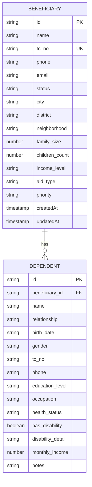
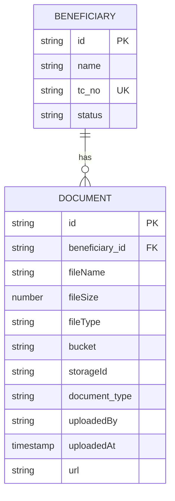
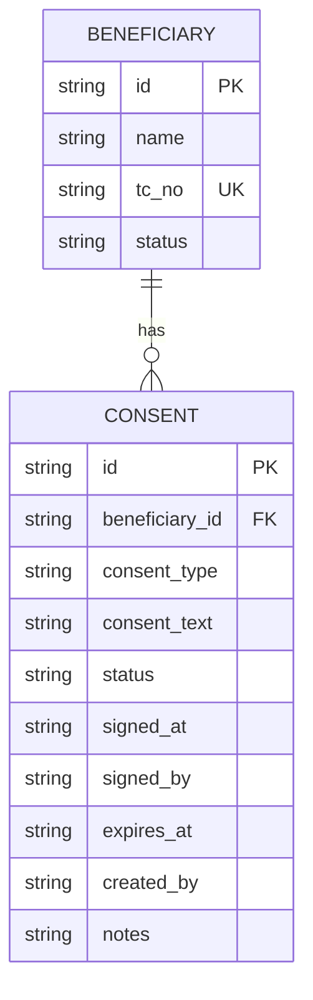

# Beneficiaries API

<cite>
**Referenced Files in This Document**   
- [beneficiaries.ts](file://convex/beneficiaries.ts)
- [route.ts](file://src/app/api/beneficiaries/route.ts)
- [beneficiary.ts](file://src/types/beneficiary.ts)
- [dependents.ts](file://convex/dependents.ts)
- [documents.ts](file://convex/documents.ts)
- [consents.ts](file://convex/consents.ts)
- [route.ts](file://src/app/api/beneficiaries/[id]/route.ts)
</cite>

## Table of Contents

1. [Introduction](#introduction)
2. [Core Endpoints](#core-endpoints)
3. [Data Relationships](#data-relationships)
4. [Validation Rules](#validation-rules)
5. [Error Handling](#error-handling)
6. [Integration with Document Management](#integration-with-document-management)
7. [Security and Access Control](#security-and-access-control)

## Introduction

The Beneficiaries API provides comprehensive functionality for managing beneficiary records within the PORTAL application. This API enables CRUD operations for beneficiary data, including personal information, socioeconomic data, family dependents, documents, and aid history. The system is built on Convex as the backend database and uses Next.js for API routing. The API supports pagination, filtering, and complex queries for efficient data retrieval and management.

**Section sources**

- [beneficiaries.ts](file://convex/beneficiaries.ts#L1-L229)
- [route.ts](file://src/app/api/beneficiaries/route.ts#L1-L248)

## Core Endpoints

### GET /api/beneficiaries

Retrieves a paginated list of beneficiaries with optional filtering by status, region, or support type.

**Query Parameters:**

- `limit` (number, optional): Number of records to return (default: 50)
- `skip` (number, optional): Number of records to skip for pagination
- `status` (string, optional): Filter by beneficiary status (TASLAK, AKTIF, PASIF, SILINDI)
- `city` (string, optional): Filter by city
- `search` (string, optional): Search by name

**Response Structure:**

```json
{
  "success": true,
  "data": [
    {
      "id": "string",
      "name": "string",
      "tc_no": "string",
      "phone": "string",
      "email": "string",
      "status": "TASLAK | AKTIF | PASIF | SILINDI",
      "city": "string",
      "family_size": "number",
      "income_level": "string",
      "aid_type": "string",
      "priority": "string",
      "createdAt": "string",
      "updatedAt": "string"
    }
  ],
  "total": "number",
  "message": "string"
}
```

**Example Request:**

```
GET /api/beneficiaries?status=AKTIF&city=ISTANBUL&limit=10
```

**Section sources**

- [beneficiaries.ts](file://convex/beneficiaries.ts#L6-L60)
- [route.ts](file://src/app/api/beneficiaries/route.ts#L82-L122)

### GET /api/beneficiaries/[id]

Retrieves comprehensive beneficiary data including personal information, family dependents, documents, and aid history.

**Response Structure:**

```json
{
  "success": true,
  "data": {
    "id": "string",
    "name": "string",
    "tc_no": "string",
    "phone": "string",
    "address": "string",
    "email": "string",
    "birth_date": "string",
    "gender": "string",
    "nationality": "string",
    "religion": "string",
    "marital_status": "string",
    "city": "string",
    "district": "string",
    "neighborhood": "string",
    "family_size": "number",
    "children_count": "number",
    "income_level": "string",
    "income_source": "string",
    "housing_type": "string",
    "health_status": "string",
    "education_level": "string",
    "occupation": "string",
    "employment_status": "string",
    "aid_type": "string",
    "totalAidAmount": "number",
    "priority": "string",
    "status": "TASLAK | AKTIF | PASIF | SILINDI",
    "approval_status": "pending | approved | rejected",
    "notes": "string",
    "createdAt": "string",
    "updatedAt": "string",
    "dependents": [
      {
        "id": "string",
        "name": "string",
        "relationship": "string",
        "birth_date": "string",
        "gender": "string",
        "tc_no": "string",
        "phone": "string",
        "education_level": "string",
        "occupation": "string",
        "health_status": "string",
        "has_disability": "boolean",
        "disability_detail": "string",
        "monthly_income": "number",
        "notes": "string"
      }
    ],
    "documents": [
      {
        "id": "string",
        "fileName": "string",
        "fileSize": "number",
        "fileType": "string",
        "document_type": "string",
        "uploadedAt": "string",
        "url": "string"
      }
    ],
    "consents": [
      {
        "id": "string",
        "consent_type": "string",
        "consent_text": "string",
        "status": "active | revoked | expired",
        "signed_at": "string",
        "signed_by": "string",
        "expires_at": "string",
        "notes": "string"
      }
    ]
  }
}
```

**Section sources**

- [beneficiaries.ts](file://convex/beneficiaries.ts#L63-L68)
- [route.ts](file://src/app/api/beneficiaries/[id]/route.ts#L75-L110)

### POST /api/beneficiaries

Creates a new beneficiary record with comprehensive personal and socioeconomic data.

**Request Body:**

```json
{
  "name": "string",
  "tc_no": "string",
  "phone": "string",
  "address": "string",
  "email": "string",
  "birth_date": "string",
  "gender": "string",
  "nationality": "string",
  "religion": "string",
  "marital_status": "string",
  "city": "string",
  "district": "string",
  "neighborhood": "string",
  "family_size": "number",
  "children_count": "number",
  "orphan_children_count": "number",
  "elderly_count": "number",
  "disabled_count": "number",
  "income_level": "string",
  "income_source": "string",
  "has_debt": "boolean",
  "housing_type": "string",
  "has_vehicle": "boolean",
  "health_status": "string",
  "has_chronic_illness": "boolean",
  "chronic_illness_detail": "string",
  "has_disability": "boolean",
  "disability_detail": "string",
  "has_health_insurance": "boolean",
  "regular_medication": "string",
  "education_level": "string",
  "occupation": "string",
  "employment_status": "string",
  "aid_type": "string",
  "totalAidAmount": "number",
  "aid_duration": "string",
  "priority": "string",
  "reference_name": "string",
  "reference_phone": "string",
  "reference_relation": "string",
  "application_source": "string",
  "notes": "string",
  "previous_aid": "boolean",
  "other_organization_aid": "boolean",
  "emergency": "boolean",
  "contact_preference": "string",
  "status": "TASLAK | AKTIF | PASIF | SILINDI",
  "approval_status": "pending | approved | rejected",
  "approved_by": "string",
  "approved_at": "string"
}
```

**Section sources**

- [beneficiaries.ts](file://convex/beneficiaries.ts#L89-L169)
- [route.ts](file://src/app/api/beneficiaries/route.ts#L129-L242)

### PUT /api/beneficiaries/[id]

Updates an existing beneficiary record with partial or complete data.

**Request Body:**

```json
{
  "name": "string",
  "tc_no": "string",
  "phone": "string",
  "address": "string",
  "email": "string",
  "status": "TASLAK | AKTIF | PASIF | SILINDI"
}
```

**Section sources**

- [beneficiaries.ts](file://convex/beneficiaries.ts#L172-L214)
- [route.ts](file://src/app/api/beneficiaries/[id]/route.ts#L117-L169)

### DELETE /api/beneficiaries/[id]

Deletes a beneficiary record by ID.

**Section sources**

- [beneficiaries.ts](file://convex/beneficiaries.ts#L217-L227)
- [route.ts](file://src/app/api/beneficiaries/[id]/route.ts#L177-L214)

## Data Relationships

### Beneficiary-Dependent Relationship

The system maintains a one-to-many relationship between beneficiaries and their family dependents. Each dependent is linked to a beneficiary through the beneficiary_id field.



**Diagram sources**

- [beneficiaries.ts](file://convex/beneficiaries.ts#L1-L229)
- [dependents.ts](file://convex/dependents.ts#L1-L140)

### Beneficiary-Document Relationship

The system maintains a one-to-many relationship between beneficiaries and their documents. Each document is linked to a beneficiary through the beneficiary_id field and stored in Convex storage.



**Diagram sources**

- [beneficiaries.ts](file://convex/beneficiaries.ts#L1-L229)
- [documents.ts](file://convex/documents.ts#L1-L109)

### Beneficiary-Consent Relationship

The system maintains a one-to-many relationship between beneficiaries and their consents. Each consent is linked to a beneficiary through the beneficiary_id field and tracks consent status and expiration.



**Diagram sources**

- [beneficiaries.ts](file://convex/beneficiaries.ts#L1-L229)
- [consents.ts](file://convex/consents.ts#L1-L75)

## Validation Rules

### Required Fields

The following fields are required for creating a new beneficiary:

- `name`: Must be at least 2 characters
- `tc_no`: Must be exactly 11 digits (Turkish Identification Number)
- `phone`: Must be a valid phone number (10-15 digits)
- `address`: Must be at least 10 characters
- `city`: Must be a valid city from the City enum
- `family_size`: Must be a positive number
- `status`: Must be one of: TASLAK, AKTIF, PASIF, SILINDI

### TC Kimlik No Validation

The system implements strict validation for Turkish Identification Numbers (TC Kimlik No):

- Must be exactly 11 digits
- Must pass the TC number validation algorithm
- Must be unique across all beneficiaries

### Socioeconomic Data Validation

Socioeconomic data fields have specific validation rules:

- `income_level`: Must be one of predefined values (e.g., "DÜŞÜK", "ORTA", "YÜKSEK")
- `housing_type`: Must be one of predefined values (e.g., "EV", "KIRALIK", "YURT")
- `education_level`: Must be one of predefined values from EducationStatus enum
- `employment_status`: Must be one of predefined values (e.g., "CALISMIYOR", "CALISIYOR", "EMEKLI", "OGRENCI")

**Section sources**

- [beneficiaries.ts](file://convex/beneficiaries.ts#L4-L229)
- [route.ts](file://src/app/api/beneficiaries/route.ts#L46-L79)
- [route.ts](file://src/app/api/beneficiaries/[id]/route.ts#L12-L68)
- [beneficiary.ts](file://src/types/beneficiary.ts#L1-L560)

## Error Handling

### Common Error Responses

The API returns standardized error responses for validation failures and other issues:

**400 Bad Request - Validation Error:**

```json
{
  "success": false,
  "error": "Doğrulama hatası",
  "details": [
    "Ad Soyad en az 2 karakter olmalıdır",
    "TC Kimlik No 11 haneli olmalıdır",
    "Geçerli bir telefon numarası giriniz"
  ]
}
```

**404 Not Found:**

```json
{
  "success": false,
  "error": "İhtiyaç sahibi bulunamadı"
}
```

**409 Conflict - Duplicate TC Number:**

```json
{
  "success": false,
  "error": "Bu TC Kimlik No zaten kayıtlı"
}
```

**500 Internal Server Error:**

```json
{
  "success": false,
  "error": "Listeleme işlemi başarısız"
}
```

### Specific Error Scenarios

- **Invalid TC Number**: Returns 400 with message "Invalid TC number format"
- **Duplicate TC Number**: Returns 409 with message "Beneficiary with this TC number already exists"
- **Beneficiary Not Found**: Returns 404 with message "Beneficiary not found"
- **Authentication/Authorization Failure**: Returns appropriate status code with authentication error details
- **CSRF Token Validation Failure**: Returns 403 with authentication error details

**Section sources**

- [beneficiaries.ts](file://convex/beneficiaries.ts#L153-L164)
- [route.ts](file://src/app/api/beneficiaries/route.ts#L230-L235)
- [route.ts](file://src/app/api/beneficiaries/[id]/route.ts#L159-L163)

## Integration with Document Management

### Document Upload Process

The system integrates with Convex storage for document management:

1. Client requests an upload URL from the storage service
2. Client uploads the file directly to Convex storage using the provided URL
3. Client creates document metadata in the files collection with beneficiary_id
4. System generates a secure URL for accessing the document

### Document Types

The system supports various document types for beneficiaries:

- Identity documents (TC Kimlik, Passport, etc.)
- Medical reports
- Financial documents
- Educational certificates
- Legal documents
- Aid application forms

### Document Access Control

Document access is controlled through:

- Beneficiary ID association
- User role-based permissions
- Secure URL generation with expiration
- Audit logging of document access

**Section sources**

- [documents.ts](file://convex/documents.ts#L1-L109)
- [beneficiaries.ts](file://convex/beneficiaries.ts#L89-L169)

## Security and Access Control

### Authentication and Authorization

The API implements robust security measures:

- CSRF token validation for state-changing operations (POST, PUT, DELETE)
- Role-based access control (requireModuleAccess)
- Authentication requirement for all operations
- Input validation and sanitization
- Error masking to prevent information leakage

### Consent Tracking

The system includes comprehensive consent tracking:

- Multiple consent types can be recorded for each beneficiary
- Consent status tracking (active, revoked, expired)
- Signed date and expiration date tracking
- Audit trail of consent changes
- Integration with document management for consent forms

### Data Privacy

The system implements data privacy measures:

- TC Kimlik No masking in logs
- Secure storage of sensitive information
- Access logging and audit trails
- Data retention policies
- Compliance with Turkish data protection regulations

**Section sources**

- [route.ts](file://src/app/api/beneficiaries/route.ts#L6-L10)
- [route.ts](file://src/app/api/beneficiaries/[id]/route.ts#L7-L8)
- [consents.ts](file://convex/consents.ts#L1-L75)
- [beneficiaries.ts](file://convex/beneficiaries.ts#L71-L87)
