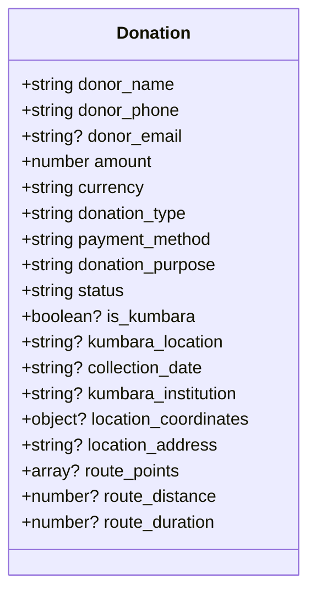
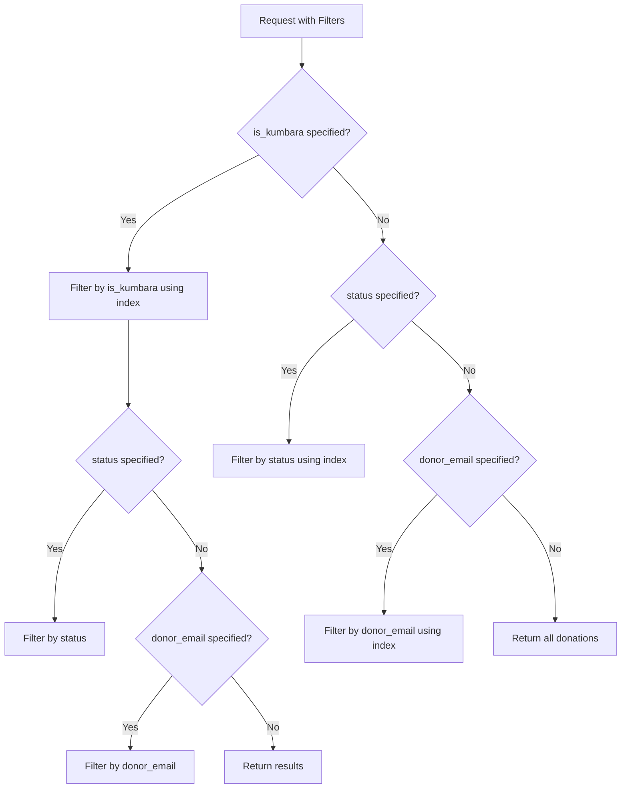
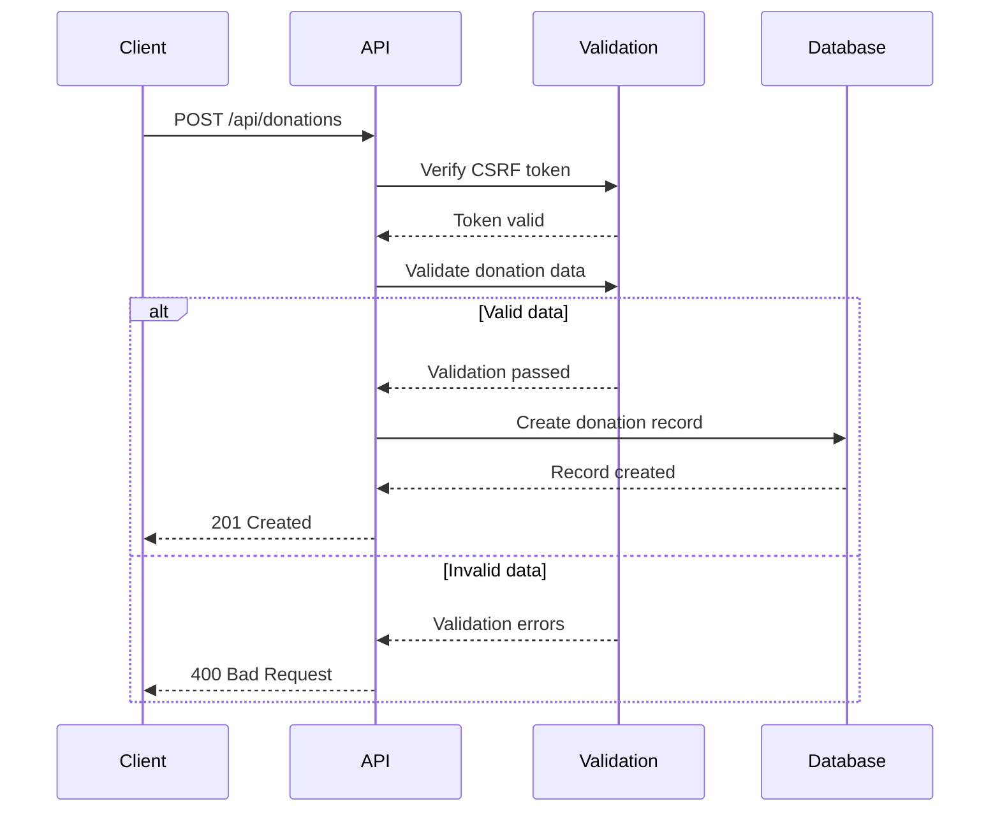
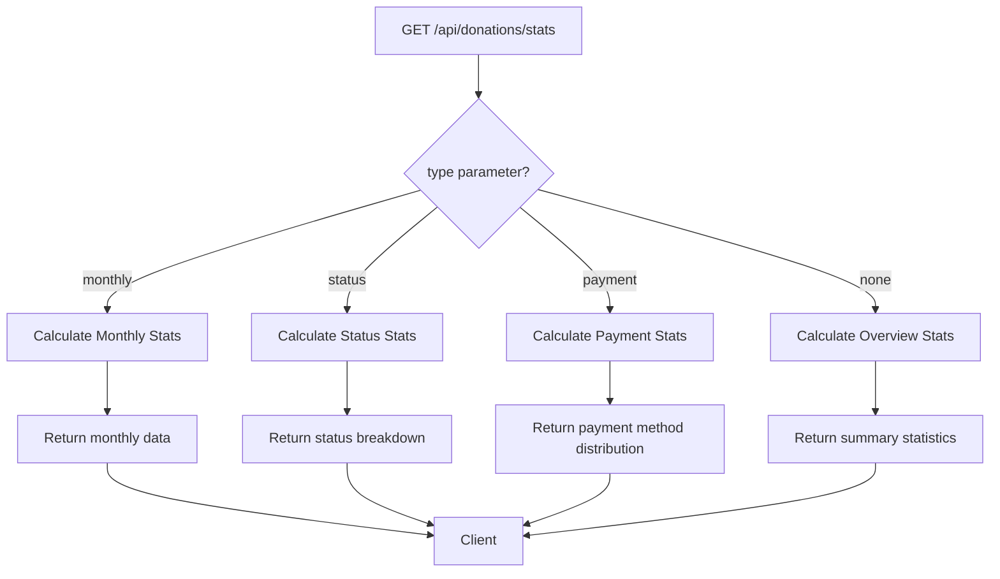
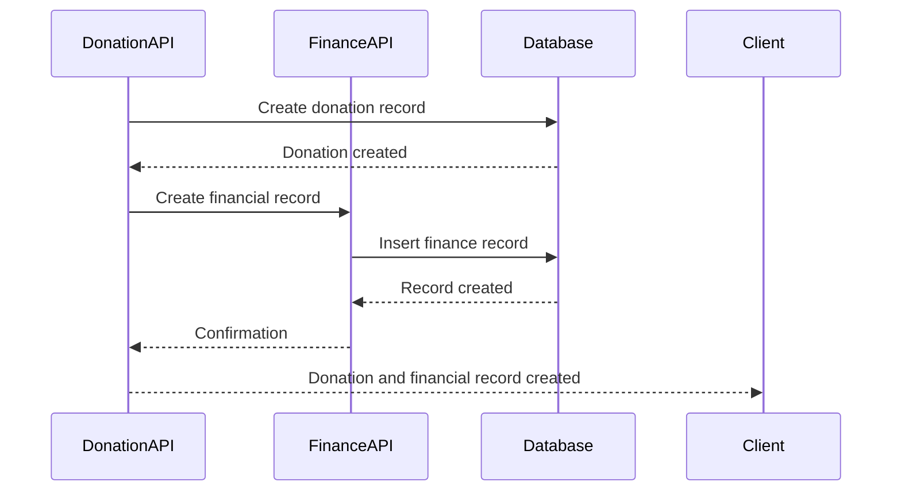
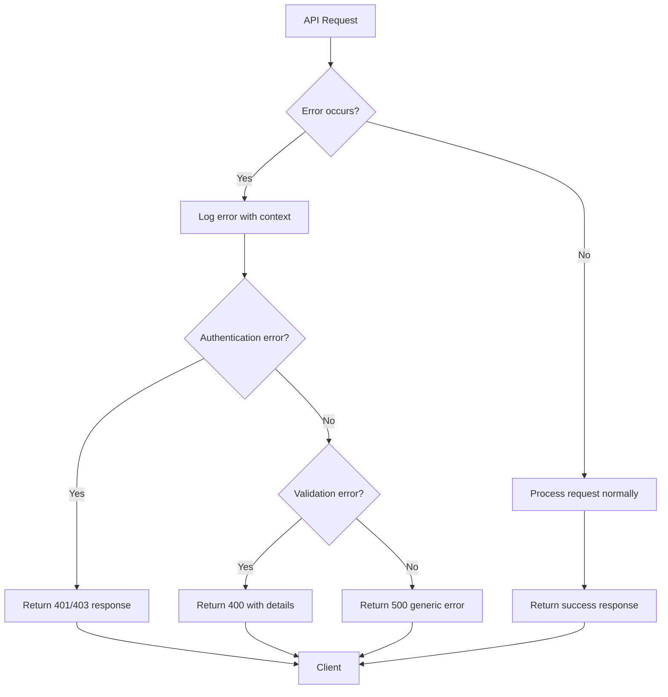
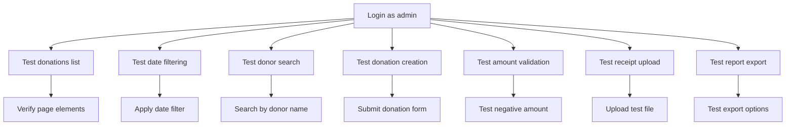

# Donations API

<cite>
**Referenced Files in This Document**   
- [donations.ts](file://convex/donations.ts)
- [route.ts](file://src/app/api/donations/route.ts)
- [stats/route.ts](file://src/app/api/donations/stats/route.ts)
- [finance_records.ts](file://convex/finance_records.ts)
- [donations.spec.ts](file://e2e/donations.spec.ts)
</cite>

## Table of Contents

1. [Introduction](#introduction)
2. [API Endpoints](#api-endpoints)
3. [Donation Data Structure](#donation-data-structure)
4. [Filtering and Querying](#filtering-and-querying)
5. [Creating Donations](#creating-donations)
6. [Donation Statistics](#donation-statistics)
7. [Integration with Financial Records](#integration-with-financial-records)
8. [Error Handling](#error-handling)
9. [Testing and Validation](#testing-and-validation)
10. [Best Practices](#best-practices)

## Introduction

The Donations API provides comprehensive functionality for managing donation records within the PORTAL application. This API enables users to retrieve, create, and analyze donation data with support for various donation types including standard donations and Kumbara (piggy bank) donations. The system integrates with financial reporting and provides robust filtering, validation, and analytics capabilities.

The API follows RESTful principles and is built on the Convex backend platform, ensuring data consistency and real-time capabilities. It supports authentication, CSRF protection, and comprehensive error handling to ensure secure and reliable operations.

**Section sources**

- [donations.ts](file://convex/donations.ts#L1-L149)
- [route.ts](file://src/app/api/donations/route.ts#L1-L148)

## API Endpoints

The Donations API provides several endpoints for managing donation records:

### GET /api/donations

Retrieves a list of donation records with optional filtering parameters. This endpoint supports pagination and various filter criteria to help users find specific donations.

### GET /api/donations/[id]

Retrieves detailed information about a specific donation by its ID. This includes donor data, donation amount, payment method, and associated metadata.

### POST /api/donations

Creates a new donation record with validation of monetary amounts and donor information. This endpoint requires CSRF token verification and appropriate user permissions.

### GET /api/donations/stats

Provides donation analytics and aggregation data, including overview statistics, monthly trends, status breakdowns, and payment method distributions.

```mermaid
flowchart TD
A[Client Application] --> B[GET /api/donations]
A --> C[GET /api/donations/[id]]
A --> D[POST /api/donations]
A --> E[GET /api/donations/stats]
B --> F[Donation List with Filters]
C --> G[Single Donation Details]
D --> H[New Donation Creation]
E --> I[Analytics and Statistics]
```

**Diagram sources**

- [route.ts](file://src/app/api/donations/route.ts#L53-L82)
- [route.ts](file://src/app/api/donations/route.ts#L89-L147)
- [stats/route.ts](file://src/app/api/donations/stats/route.ts#L21-L73)

**Section sources**

- [route.ts](file://src/app/api/donations/route.ts#L53-L147)
- [stats/route.ts](file://src/app/api/donations/stats/route.ts#L21-L73)

## Donation Data Structure

The donation records contain comprehensive information about each donation, including donor details, financial data, and metadata.

### Core Fields

- **donor_name**: String - Full name of the donor
- **donor_phone**: String - Contact phone number
- **donor_email**: String (optional) - Email address of the donor
- **amount**: Number - Monetary amount of the donation
- **currency**: String - Currency code (TRY, USD, EUR)
- **donation_type**: String - Type of donation
- **payment_method**: String - Method of payment
- **donation_purpose**: String - Purpose or cause for the donation
- **status**: String - Current status (pending, completed, cancelled)

### Kumbara-Specific Fields

For Kumbara (piggy bank) donations, additional fields capture location and collection details:

- **is_kumbara**: Boolean - Indicates if this is a Kumbara donation
- **kumbara_location**: String (optional) - Physical location of the piggy bank
- **collection_date**: String (optional) - Date when the piggy bank was collected
- **kumbara_institution**: String (optional) - Institution associated with the piggy bank
- **location_coordinates**: Object (optional) - Geographic coordinates (lat, lng)
- **location_address**: String (optional) - Full address of the location
- **route_points**: Array (optional) - GPS points for the collection route
- **route_distance**: Number (optional) - Total distance of the collection route
- **route_duration**: Number (optional) - Duration of the collection route



**Diagram sources**

- [donations.ts](file://convex/donations.ts#L76-L108)

**Section sources**

- [donations.ts](file://convex/donations.ts#L76-L108)

## Filtering and Querying

The API provides robust filtering capabilities to help users find specific donation records based on various criteria.

### Available Filters

- **limit**: Number (optional) - Maximum number of records to return (default: 50)
- **skip**: Number (optional) - Number of records to skip for pagination
- **status**: String (optional) - Filter by donation status (pending, completed, cancelled)
- **donor_email**: String (optional) - Filter by donor's email address
- **is_kumbara**: Boolean (optional) - Filter by Kumbara donation status

### Query Parameters

When retrieving donation lists, you can use query parameters to filter results:

```http
GET /api/donations?status=completed&donor_email=john@example.com&limit=100
```

The filtering logic prioritizes the `is_kumbara` filter when provided, applying additional filters to the already filtered results. For other filters, the system uses database indexes to optimize query performance.



**Diagram sources**

- [donations.ts](file://convex/donations.ts#L4-L52)

**Section sources**

- [donations.ts](file://convex/donations.ts#L4-L52)
- [route.ts](file://src/app/api/donations/route.ts#L53-L82)

## Creating Donations

The POST endpoint allows for the creation of new donation records with comprehensive validation.

### Request Structure

The request body should contain all required donation fields:

```json
{
  "donor_name": "John Doe",
  "donor_phone": "+905551234567",
  "donor_email": "john@example.com",
  "amount": 100,
  "currency": "TRY",
  "donation_type": "standard",
  "payment_method": "credit_card",
  "donation_purpose": "Education Support",
  "receipt_number": "REC-2024-001",
  "status": "completed"
}
```

### Validation Rules

The system enforces several validation rules to ensure data quality:

- Donor name must be at least 2 characters long
- Donation amount must be positive
- Currency must be one of: TRY, USD, EUR
- Email format must be valid (if provided)
- Phone number format must be valid (if provided)

### Kumbara Donation Creation

For Kumbara donations, additional fields can be included:

```json
{
  "is_kumbara": true,
  "kumbara_location": "Main Office",
  "collection_date": "2024-01-15",
  "kumbara_institution": "Local School",
  "location_coordinates": {
    "lat": 41.0082,
    "lng": 28.9784
  },
  "route_distance": 5.5,
  "route_duration": 30
}
```



**Diagram sources**

- [donations.ts](file://convex/donations.ts#L76-L108)
- [route.ts](file://src/app/api/donations/route.ts#L89-L147)

**Section sources**

- [route.ts](file://src/app/api/donations/route.ts#L14-L48)
- [route.ts](file://src/app/api/donations/route.ts#L89-L147)

## Donation Statistics

The statistics endpoint provides comprehensive analytics for donation data, enabling users to understand donation trends and patterns.

### Available Statistics Types

The `/api/donations/stats` endpoint supports different types of statistical data through the `type` query parameter:

- **overview**: Summary statistics including total donations, amounts, and status breakdown
- **monthly**: Monthly donation trends showing amount and count by month
- **status**: Distribution of donations by status (pending, completed, cancelled)
- **payment**: Distribution of donations by payment method

### Overview Statistics

The default overview provides key metrics:

- **total_donations**: Total number of donation records
- **total_amount**: Sum of all donation amounts
- **this_month_amount**: Total amount for the current month
- **monthly_growth**: Percentage growth compared to the previous month
- **pending_donations**: Count of pending donations
- **completed_donations**: Count of completed donations
- **cancelled_donations**: Count of cancelled donations

### Monthly Trends

The monthly statistics provide data for the last six months, enabling trend analysis:

```json
[
  {
    "month": "Ara 2023",
    "amount": 15000,
    "count": 45
  },
  {
    "month": "Oca 2024",
    "amount": 18000,
    "count": 52
  },
  {
    "month": "Şub 2024",
    "amount": 22000,
    "count": 68
  }
]
```



**Diagram sources**

- [stats/route.ts](file://src/app/api/donations/stats/route.ts#L21-L73)

**Section sources**

- [stats/route.ts](file://src/app/api/donations/stats/route.ts#L21-L73)

## Integration with Financial Records

The Donations API integrates with the financial reporting system through the finance_records collection in Convex.

### Data Relationship

Each donation record can be linked to financial records for accounting and reporting purposes. The relationship is established through shared fields:

- **receipt_number**: Links donations to corresponding financial records
- **amount** and **currency**: Synchronized between donation and financial records
- **transaction_date**: Derived from donation creation time
- **payment_method**: Shared between systems

### Financial Record Creation

When a donation is processed, a corresponding financial record should be created:

```json
{
  "record_type": "income",
  "category": "Donations",
  "amount": 100,
  "currency": "TRY",
  "description": "Donation from John Doe",
  "transaction_date": "2024-01-15",
  "payment_method": "credit_card",
  "receipt_number": "REC-2024-001",
  "related_to": "donations",
  "created_by": "user_id_123",
  "status": "approved"
}
```

### Synchronization Process

The integration ensures data consistency between donations and financial records:



**Diagram sources**

- [donations.ts](file://convex/donations.ts#L76-L108)
- [finance_records.ts](file://convex/finance_records.ts#L54-L76)

**Section sources**

- [donations.ts](file://convex/donations.ts#L76-L108)
- [finance_records.ts](file://convex/finance_records.ts#L54-L76)

## Error Handling

The API implements comprehensive error handling to provide meaningful feedback to clients.

### Common Error Responses

- **400 Bad Request**: Invalid input data or missing required fields
- **401 Unauthorized**: Authentication required or invalid credentials
- **403 Forbidden**: Insufficient permissions to access the resource
- **404 Not Found**: Requested donation ID does not exist
- **500 Internal Server Error**: Unexpected server error

### Validation Error Structure

When validation fails, the API returns detailed error information:

```json
{
  "success": false,
  "error": "Validation error",
  "details": ["Donor name must be at least 2 characters long", "Donation amount must be positive"]
}
```

### Error Logging

All errors are logged with relevant context for debugging and monitoring:

- Endpoint and HTTP method
- User information (when available)
- Input data (excluding sensitive information)
- Timestamp and error message



**Diagram sources**

- [route.ts](file://src/app/api/donations/route.ts#L71-L82)
- [route.ts](file://src/app/api/donations/route.ts#L128-L144)

**Section sources**

- [route.ts](file://src/app/api/donations/route.ts#L71-L82)
- [route.ts](file://src/app/api/donations/route.ts#L128-L144)

## Testing and Validation

The Donations API is supported by comprehensive end-to-end tests to ensure reliability and functionality.

### Test Coverage

The e2e tests cover key scenarios:

- Displaying the donations list
- Filtering donations by date range
- Searching donations by donor name
- Creating new donations
- Validating donation amounts
- Handling file uploads for receipts
- Exporting donation reports
- Testing different payment methods
- Handling donation purposes

### Validation Scenarios

The tests verify that the system properly validates donation data:

- Prevents creation of donations with negative amounts
- Validates donor information format
- Ensures required fields are present
- Tests CSRF protection
- Verifies user permissions

### Test Implementation

The tests use Playwright for browser automation and simulate real user interactions with the application.



**Diagram sources**

- [donations.spec.ts](file://e2e/donations.spec.ts#L1-L268)

**Section sources**

- [donations.spec.ts](file://e2e/donations.spec.ts#L1-L268)

## Best Practices

To ensure optimal use of the Donations API, follow these best practices:

### Data Entry Guidelines

- Always provide complete donor information when available
- Use consistent donation types and purposes
- Assign meaningful receipt numbers
- Include notes for special circumstances
- Verify Kumbara location details for accuracy

### Performance Considerations

- Use filtering to limit result sets for large datasets
- Implement client-side caching for frequently accessed data
- Use pagination for list endpoints
- Batch process donations when possible

### Security Practices

- Always include CSRF tokens in POST requests
- Validate user permissions before accessing donation data
- Protect sensitive donor information
- Use HTTPS for all API communications
- Regularly audit donation records

### Integration Tips

- Synchronize donation and financial records promptly
- Use receipt numbers to link related records
- Implement error handling for integration failures
- Monitor the relationship between donations and financial records
- Create audit logs for significant changes

These practices will help ensure data integrity, system performance, and security when working with the Donations API.

**Section sources**

- [donations.ts](file://convex/donations.ts#L1-L149)
- [route.ts](file://src/app/api/donations/route.ts#L1-L148)
- [finance_records.ts](file://convex/finance_records.ts#L1-L132)
