# Kumbara API

<cite>
**Referenced Files in This Document**   
- [kumbara/[id]/route.ts](file://src/app/api/kumbara/[id]/route.ts)
- [kumbara.ts](file://convex/donations.ts)
- [finance_records.ts](file://convex/finance_records.ts)
- [kumbara.ts](file://src/lib/validations/kumbara.ts)
- [database.ts](file://src/types/database.ts)
- [KumbaraPrintQR.tsx](file://src/components/kumbara/KumbaraPrintQR.tsx)
</cite>

## Table of Contents

1. [Introduction](#introduction)
2. [API Endpoints](#api-endpoints)
3. [Data Models](#data-models)
4. [QR Code Integration](#qr-code-integration)
5. [Financial Auditing Trail](#financial-auditing-trail)
6. [Error Handling](#error-handling)
7. [Usage Examples](#usage-examples)

## Introduction

The Kumbara API provides endpoints for managing money box collections within the PORTAL application. This API enables tracking of donations collected from physical money boxes, including their status, location data, and financial reconciliation. The system supports the complete lifecycle of money box management from creation to bank deposit reconciliation.

**Section sources**

- [kumbara/[id]/route.ts](file://src/app/api/kumbara/[id]/route.ts)
- [kumbara.ts](file://convex/donations.ts)

## API Endpoints

### GET /api/kumbara

Retrieves all money box collections with filtering capabilities by status, location, and date range. This endpoint returns paginated results with comprehensive collection data.

**Request Parameters**

- `status`: Filter by collection status (pending, completed, cancelled)
- `location`: Filter by collection location
- `currency`: Filter by currency (TRY, USD, EUR)
- `startDate` and `endDate`: Filter by collection date range
- `search`: Text search across donor and location fields
- `page` and `limit`: Pagination controls (limit 1-100)

**Response Structure**

```json
{
  "success": true,
  "data": [
    {
      "donor_name": "string",
      "amount": number,
      "currency": "TRY|USD|EUR",
      "kumbara_location": "string",
      "kumbara_institution": "string",
      "collection_date": "string",
      "status": "pending|completed|cancelled",
      "location_coordinates": {
        "lat": number,
        "lng": number
      }
    }
  ],
  "pagination": {
    "page": number,
    "limit": number,
    "total": number,
    "totalPages": number
  }
}
```

### GET /api/kumbara/[id]

Retrieves detailed information about a specific money box collection, including collection history, current balance, and associated metadata.

**Response Structure**

```json
{
  "success": true,
  "data": {
    "_id": "string",
    "donor_name": "string",
    "amount": number,
    "currency": "TRY|USD|EUR",
    "donation_type": "Kumbara",
    "payment_method": "string",
    "kumbara_location": "string",
    "kumbara_institution": "string",
    "collection_date": "string",
    "status": "pending|completed|cancelled",
    "location_coordinates": {
      "lat": number,
      "lng": number
    },
    "location_address": "string",
    "route_points": [
      {
        "lat": number,
        "lng": number,
        "address": "string"
      }
    ],
    "route_distance": number,
    "route_duration": number,
    "receipt_number": "string",
    "notes": "string"
  }
}
```

### POST /api/kumbara

Creates a new money box collection record with validation of required fields and data integrity.

**Request Body**

```json
{
  "donor_name": "string",
  "donor_phone": "string",
  "donor_email": "string",
  "amount": number,
  "currency": "TRY|USD|EUR",
  "payment_method": "string",
  "notes": "string",
  "receipt_number": "string",
  "kumbara_location": "string",
  "kumbara_institution": "string",
  "collection_date": "string",
  "location_coordinates": {
    "lat": number,
    "lng": number
  },
  "location_address": "string"
}
```

### PUT /api/kumbara/[id]

Updates the collection status and other modifiable fields of an existing money box collection. Only specific fields can be updated to maintain data integrity.

**Request Body**

```json
{
  "status": "pending|completed|cancelled",
  "amount": number,
  "notes": "string",
  "kumbara_location": "string",
  "kumbara_institution": "string"
}
```

### DELETE /api/kumbara/[id]

Removes a money box collection record from the system. Requires verification that the record is indeed a kumbara donation.

**Section sources**

- [kumbara/[id]/route.ts](file://src/app/api/kumbara/[id]/route.ts)
- [kumbara.ts](file://convex/donations.ts)
- [kumbara.ts](file://src/lib/validations/kumbara.ts)

## Data Models

### Donation Document Structure

The core data model for money box collections extends the general donation document with kumbara-specific fields.

```mermaid
erDiagram
DONATION {
string _id PK
string donor_name
string donor_phone
string donor_email
number amount
string currency
string donation_type
string payment_method
string donation_purpose
string notes
string receipt_number
string receipt_file_id
string status
boolean is_kumbara
string kumbara_location
string kumbara_institution
string collection_date
object location_coordinates
string location_address
array route_points
number route_distance
number route_duration
}
```



**Diagram sources**

- [database.ts](file://src/types/database.ts#L149-L172)
- [kumbara.ts](file://src/lib/validations/kumbara.ts#L4-L91)

### Validation Schema

The API enforces strict validation rules for money box data integrity.


**Diagram sources**

- [kumbara.ts](file://src/lib/validations/kumbara.ts#L4-L106)
- [kumbara.ts](file://src/lib/validations/kumbara.ts#L196-L216)

**Section sources**

- [kumbara.ts](file://src/lib/validations/kumbara.ts)

## QR Code Integration

The Kumbara system supports QR code integration for collection tracking and verification. QR codes contain essential collection information for quick scanning and validation.

### QR Code Data Structure

Each QR code encodes the following information:

- Money box ID
- Donor name
- Collection location
- Institution name
- Collection date
- Amount and currency
- Receipt number

### QR Code Generation and Usage

The system provides functionality to generate and print QR codes for physical money boxes:


**Diagram sources**

- [KumbaraPrintQR.tsx](file://src/components/kumbara/KumbaraPrintQR.tsx)
- [kumbara/[id]/route.ts](file://src/app/api/kumbara/[id]/route.ts)

**Section sources**

- [KumbaraPrintQR.tsx](file://src/components/kumbara/KumbaraPrintQR.tsx)

## Financial Auditing Trail

The system maintains a complete audit trail from money box collection to bank deposit through integration with the finance_records system.

### Audit Flow


### Finance Record Integration

When a money box collection is marked as completed, a corresponding finance record is created:


**Diagram sources**

- [kumbara/[id]/route.ts](file://src/app/api/kumbara/[id]/route.ts)
- [finance_records.ts](file://convex/finance_records.ts)
- [database.ts](file://src/types/database.ts#L324-L338)

**Section sources**

- [kumbara/[id]/route.ts](file://src/app/api/kumbara/[id]/route.ts)
- [finance_records.ts](file://convex/finance_records.ts)

## Error Handling

The API implements comprehensive error handling for data validation and operational issues.

### Validation Error Responses

When invalid data is submitted, the API returns detailed validation errors:

```json
{
  "success": false,
  "error": "Validation error",
  "details": [
    "Collection date is required",
    "Amount must be positive",
    "Kumbara location must be at least 2 characters"
  ]
}
```

### Common Error Scenarios

- **400 Bad Request**: Missing or invalid parameters
- **404 Not Found**: Money box ID not found or not a kumbara donation
- **400 Validation Error**: Invalid field values or format issues
- **500 Server Error**: Internal processing failures

**Section sources**

- [kumbara/[id]/route.ts](file://src/app/api/kumbara/[id]/route.ts)
- [kumbara.ts](file://src/lib/validations/kumbara.ts)

## Usage Examples

### Creating a New Money Box Collection

```javascript
fetch('/api/kumbara', {
  method: 'POST',
  headers: {
    'Content-Type': 'application/json',
  },
  body: JSON.stringify({
    donor_name: 'Ahmet Yılmaz',
    donor_phone: '5551234567',
    amount: 250.0,
    currency: 'TRY',
    payment_method: 'Nakit',
    receipt_number: 'KMB-2024-001',
    kumbara_location: 'Ankara Şubesi',
    kumbara_institution: 'Ankara Merkez Camii',
    collection_date: '2024-01-15T10:30:00Z',
    location_coordinates: {
      lat: 39.925533,
      lng: 32.866287,
    },
  }),
});
```

### Updating Collection Status to Completed

```javascript
fetch('/api/kumbara/doc123', {
  method: 'PUT',
  headers: {
    'Content-Type': 'application/json',
  },
  body: JSON.stringify({
    status: 'completed',
    notes: 'Collection delivered to central office',
  }),
});
```

### Retrieving All Active Collections

```javascript
fetch('/api/kumbara?status=pending&location=Istanbul&page=1&limit=25')
  .then((response) => response.json())
  .then((data) => console.log(data));
```

**Section sources**

- [kumbara/[id]/route.ts](file://src/app/api/kumbara/[id]/route.ts)
- [kumbara.ts](file://convex/donations.ts)
- [kumbara.ts](file://src/lib/validations/kumbara.ts)
