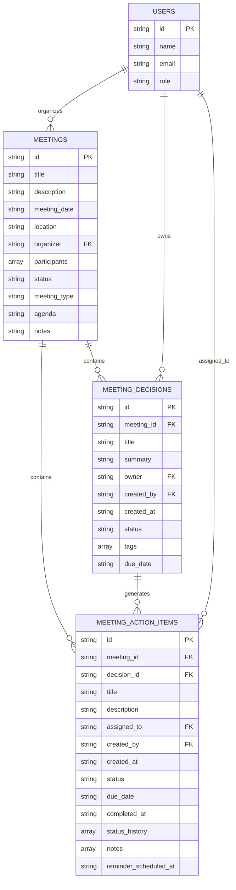
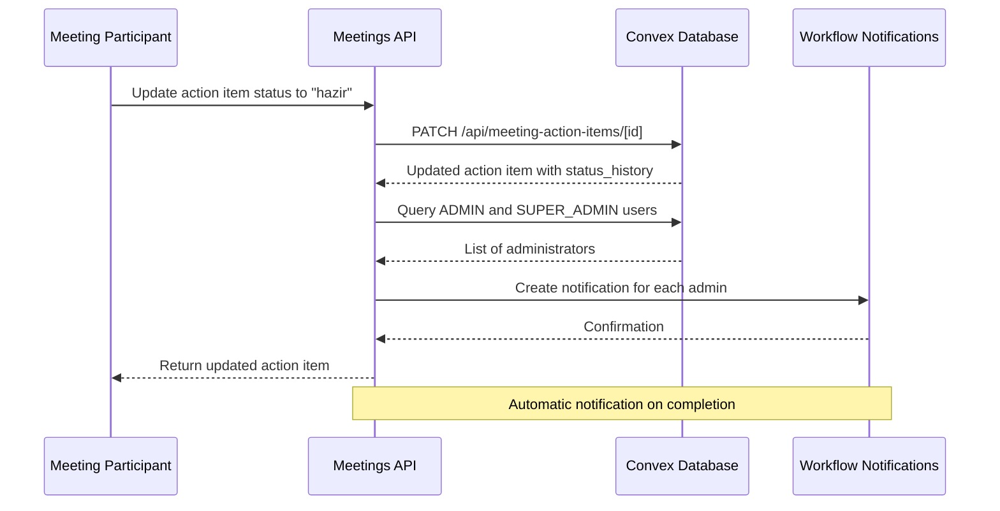

# Meetings API

<cite>
**Referenced Files in This Document**   
- [meetings.ts](file://convex/meetings.ts)
- [meeting_decisions.ts](file://convex/meeting_decisions.ts)
- [meeting_action_items.ts](file://convex/meeting_action_items.ts)
- [route.ts](file://src/app/api/meetings/route.ts)
- [route.ts](file://src/app/api/meeting-decisions/route.ts)
- [route.ts](file://src/app/api/meeting-action-items/route.ts)
- [meeting.ts](file://src/lib/validations/meeting.ts)
- [meetingActionItem.ts](file://src/lib/validations/meetingActionItem.ts)
</cite>

## Table of Contents

1. [Introduction](#introduction)
2. [Meetings Endpoints](#meetings-endpoints)
3. [Meeting Decisions Endpoints](#meeting-decisions-endpoints)
4. [Meeting Action Items Endpoints](#meeting-action-items-endpoints)
5. [Data Model and Relationships](#data-model-and-relationships)
6. [Error Handling](#error-handling)
7. [Integration with Task Management](#integration-with-task-management)
8. [Meeting Minute Generation](#meeting-minute-generation)

## Introduction

The Meetings API provides comprehensive functionality for managing meeting schedules, decisions, and action items within the PORTAL application. This API enables users to retrieve meeting information, manage associated decisions, and track action items to completion. The system supports filtering, validation, and integration with notification systems to ensure effective meeting management and follow-up.

**Section sources**

- [meetings.ts](file://convex/meetings.ts#L1-L124)
- [route.ts](file://src/app/api/meetings/route.ts#L1-L137)

## Meetings Endpoints

### GET /api/meetings

Retrieves a list of meetings with optional filtering by date range, organizer, and status. Supports pagination through limit and skip parameters.

**Query Parameters**

- `limit` (number, optional): Maximum number of meetings to return
- `skip` (number, optional): Number of meetings to skip for pagination
- `status` (string, optional): Filter by meeting status (scheduled, ongoing, completed, cancelled)
- `organizer` (string, optional): Filter by organizer ID
- `start_date` (string, optional): Filter meetings from this date onwards
- `end_date` (string, optional): Filter meetings up to this date

**Response Format**

```json
{
  "success": true,
  "data": [
    {
      "id": "meeting_id",
      "title": "string",
      "description": "string",
      "meeting_date": "string",
      "location": "string",
      "organizer": "user_id",
      "participants": ["user_id"],
      "status": "scheduled|ongoing|completed|cancelled",
      "meeting_type": "general|committee|board|other",
      "agenda": "string",
      "notes": "string"
    }
  ],
  "total": 0
}
```

### GET /api/meetings/[id]

Retrieves detailed information about a specific meeting including agenda, attendees, decisions, and action items.

**Path Parameter**

- `id` (string): The unique identifier of the meeting

**Response Format**

```json
{
  "success": true,
  "data": {
    "id": "meeting_id",
    "title": "string",
    "description": "string",
    "meeting_date": "string",
    "location": "string",
    "organizer": "user_id",
    "participants": ["user_id"],
    "status": "scheduled|ongoing|completed|cancelled",
    "meeting_type": "general|committee|board|other",
    "agenda": "string",
    "notes": "string"
  }
}
```

**Section sources**

- [meetings.ts](file://convex/meetings.ts#L43-L49)
- [route.ts](file://src/app/api/meetings/route.ts#L41-L69)

## Meeting Decisions Endpoints

### GET /api/meeting-decisions

Retrieves a list of meeting decisions with optional filtering by meeting ID, owner, and status.

**Query Parameters**

- `meeting_id` (string, optional): Filter decisions by meeting ID
- `owner` (string, optional): Filter decisions by owner ID
- `status` (string, optional): Filter by decision status (acik, devam, kapatildi)

**Response Format**

```json
{
  "success": true,
  "data": [
    {
      "id": "decision_id",
      "meeting_id": "meeting_id",
      "title": "string",
      "summary": "string",
      "owner": "user_id",
      "created_by": "user_id",
      "created_at": "string",
      "status": "acik|devam|kapatildi",
      "tags": ["string"],
      "due_date": "string"
    }
  ]
}
```

### CRUD Operations

The endpoint supports full CRUD operations for meeting decisions:

- **POST**: Create a new meeting decision
- **GET**: Retrieve decisions with filtering
- **PUT**: Update an existing decision
- **DELETE**: Remove a decision

Validation ensures that each decision has a meeting ID, title (minimum 3 characters), and creator.

**Section sources**

- [meeting_decisions.ts](file://convex/meeting_decisions.ts#L10-L42)
- [route.ts](file://src/app/api/meeting-decisions/route.ts#L35-L73)

## Meeting Action Items Endpoints

### GET /api/meeting-action-items

Retrieves a list of meeting action items with optional filtering by meeting ID, assigned user, and status.

**Query Parameters**

- `meeting_id` (string, optional): Filter action items by meeting ID
- `assigned_to` (string, optional): Filter by assigned user ID
- `status` (string, optional): Filter by status (beklemede, devam, hazir, iptal)

**Response Format**

```json
{
  "success": true,
  "data": [
    {
      "id": "action_item_id",
      "meeting_id": "meeting_id",
      "decision_id": "decision_id",
      "title": "string",
      "description": "string",
      "assigned_to": "user_id",
      "created_by": "user_id",
      "created_at": "string",
      "status": "beklemede|devam|hazir|iptal",
      "due_date": "string",
      "completed_at": "string",
      "status_history": [
        {
          "status": "string",
          "changed_at": "string",
          "changed_by": "user_id",
          "note": "string"
        }
      ],
      "notes": ["string"],
      "reminder_scheduled_at": "string"
    }
  ]
}
```

### CRUD Operations

The endpoint supports full CRUD operations for meeting action items:

- **POST**: Create a new action item
- **GET**: Retrieve action items with filtering
- **PUT**: Update an existing action item
- **DELETE**: Remove an action item

When an action item's status is updated to "hazir" (completed), the system automatically notifies administrators through the workflow notification system.

**Section sources**

- [meeting_action_items.ts](file://convex/meeting_action_items.ts#L12-L44)
- [route.ts](file://src/app/api/meeting-action-items/route.ts#L41-L79)

## Data Model and Relationships

The Meetings API implements a hierarchical data model where meetings serve as the parent entity for decisions and action items.



**Diagram sources**

- [meetings.ts](file://convex/meetings.ts#L5-L124)
- [meeting_decisions.ts](file://convex/meeting_decisions.ts#L4-L114)
- [meeting_action_items.ts](file://convex/meeting_action_items.ts#L5-L267)

**Section sources**

- [meetings.ts](file://convex/meetings.ts#L5-L124)
- [meeting_decisions.ts](file://convex/meeting_decisions.ts#L4-L114)
- [meeting_action_items.ts](file://convex/meeting_action_items.ts#L5-L267)

## Error Handling

The API implements comprehensive error handling for various scenarios:

### Validation Errors

- **400 Bad Request**: Returned when request data fails validation
  - Meeting title less than 3 characters
  - Missing required fields (meeting date, organizer)
  - Invalid status values
  - Participant list without organizer

### Authentication and Authorization

- **401 Unauthorized**: Missing or invalid authentication token
- **403 Forbidden**: User lacks required module access ('workflow')

### Resource Errors

- **404 Not Found**: Requested meeting, decision, or action item does not exist
- **409 Conflict**: Scheduling conflicts detected

### Server Errors

- **500 Internal Server Error**: Unexpected server error during processing

Error responses follow a consistent format:

```json
{
  "success": false,
  "error": "Error description",
  "details": ["validation messages"]
}
```

**Section sources**

- [route.ts](file://src/app/api/meetings/route.ts#L58-L69)
- [route.ts](file://src/app/api/meeting-decisions/route.ts#L57-L72)
- [route.ts](file://src/app/api/meeting-action-items/route.ts#L63-L78)

## Integration with Task Management

The Meeting Action Items system integrates with the broader task management functionality through several mechanisms:

1. **Status Change Notifications**: When an action item is marked as "hazir" (completed), administrators receive notifications via the workflow notification system.

2. **Decision-Action Item Relationship**: Action items can be linked to specific meeting decisions, creating a traceable workflow from decision to execution.

3. **Status History Tracking**: Each action item maintains a complete history of status changes, including timestamps and responsible users.

4. **Reminder System**: Action items support scheduled reminders to ensure timely completion.

5. **Cross-Reference Capability**: Action items contain references to both their parent meeting and associated decision, enabling comprehensive tracking.



**Diagram sources**

- [meeting_action_items.ts](file://convex/meeting_action_items.ts#L154-L188)
- [meeting_action_items.ts](file://convex/meeting_action_items.ts#L190-L252)

**Section sources**

- [meeting_action_items.ts](file://convex/meeting_action_items.ts#L154-L252)

## Meeting Minute Generation

The API supports meeting minute generation through the structured data model and comprehensive field collection:

### Data Collection for Minutes

- **Meeting Details**: Title, date, time, location, organizer
- **Participants**: Complete list of attendees
- **Agenda Items**: Structured agenda from the meeting record
- **Decisions**: All decisions made during the meeting
- **Action Items**: Tasks assigned with responsible parties and deadlines

### Generation Process

1. Retrieve meeting details via GET /api/meetings/[id]
2. Fetch associated decisions via GET /api/meeting-decisions?meeting_id=[id]
3. Retrieve action items via GET /api/meeting-action-items?meeting_id=[id]
4. Compile information into structured minute format
5. Apply organization-specific templates and formatting

The validation schema enforces data quality requirements for minute generation, including minimum title length, required meeting dates, and participant validation to ensure all organizers are included in the participant list.

**Section sources**

- [meeting.ts](file://src/lib/validations/meeting.ts#L58-L94)
- [meetings.ts](file://convex/meetings.ts#L52-L78)
- [meeting_decisions.ts](file://convex/meeting_decisions.ts#L51-L77)
- [meeting_action_items.ts](file://convex/meeting_action_items.ts#L53-L93)
