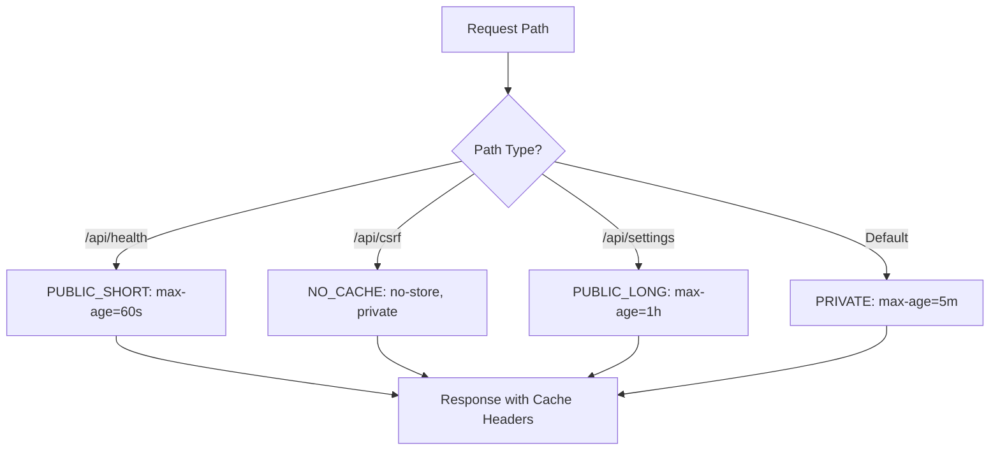
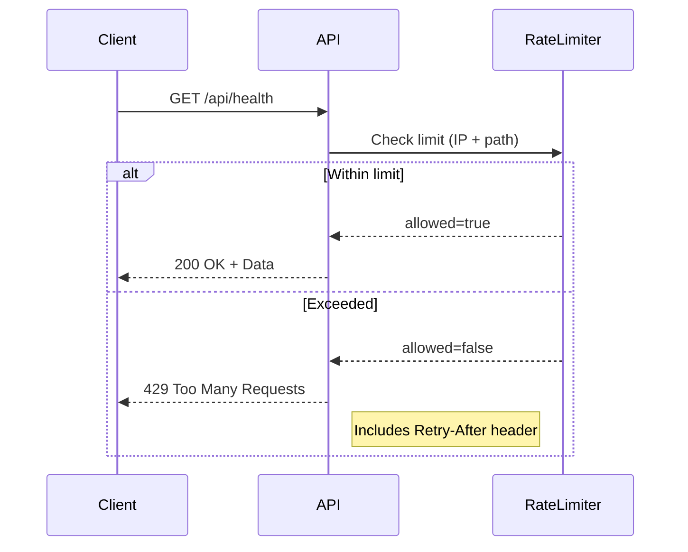

# System Utilities API

<cite>
**Referenced Files in This Document**   
- [health/route.ts](file://src/app/api/health/route.ts)
- [csrf/route.ts](file://src/app/api/csrf/route.ts)
- [settings/route.ts](file://src/app/api/settings/route.ts)
- [csrf.ts](file://src/lib/csrf.ts)
- [http-cache.ts](file://src/lib/http-cache.ts)
- [rate-limit.ts](file://src/lib/rate-limit.ts)
</cite>

## Table of Contents

1. [Introduction](#introduction)
2. [Health Check Endpoint](#health-check-endpoint)
3. [CSRF Token Endpoint](#csrf-token-endpoint)
4. [Settings Endpoints](#settings-endpoints)
5. [Caching Strategy](#caching-strategy)
6. [Rate Limiting](#rate-limiting)
7. [Security Considerations](#security-considerations)
8. [Integration Examples](#integration-examples)
9. [Conclusion](#conclusion)

## Introduction

The System Utilities API provides essential endpoints for monitoring, security, and configuration management within the PORTAL application. These endpoints support system health verification, CSRF protection for state-changing operations, and dynamic access to system settings. The API is designed with performance, security, and scalability in mind, incorporating caching strategies, rate limiting, and secure token generation.

## Health Check Endpoint

The `/api/health` endpoint provides system status monitoring and uptime verification for the PORTAL application. It supports both basic and detailed health checks, enabling integration with external monitoring tools.

### Basic Health Check

When accessed without parameters, the endpoint returns a minimal health status:

```json
{
  "ok": true,
  "provider": "convex",
  "convex": {
    "url": true,
    "configured": true
  },
  "timestamp": "2023-12-01T10:00:00.000Z",
  "readyForProduction": true
}
```

### Detailed Health Check

With the `detailed=true` query parameter, the endpoint performs comprehensive system checks:

- Validates environment configuration
- Tests Convex database connectivity
- Measures response times
- Provides actionable recommendations

The detailed response includes validation reports, connectivity tests, and system recommendations. Response times under 1000ms are considered optimal, while times exceeding 3000ms trigger performance warnings.

### Cache Behavior

Detailed health checks are cached for 30 seconds to prevent excessive database load during monitoring spikes. The cache is stored in memory and automatically invalidated after the TTL expires.

**Section sources**

- [health/route.ts](file://src/app/api/health/route.ts#L1-L173)

## CSRF Token Endpoint

The `/api/csrf` endpoint generates and manages CSRF tokens required for protecting state-changing operations against cross-site request forgery attacks.

### Token Generation

The endpoint:

1. Checks for an existing CSRF token in cookies
2. Generates a new 32-character hexadecimal token if none exists
3. Sets the token in a non-HttpOnly cookie for client-side access
4. Returns the token in JSON format

### Security Configuration

- **Cookie Security**: Secure flag enabled in production, SameSite=strict
- **Token Lifetime**: 24 hours
- **Access**: Client-side JavaScript can read the token for inclusion in requests

### Usage Pattern

Frontend applications should:

1. Fetch the CSRF token on initial load
2. Include the token in the `x-csrf-token` header for POST, PUT, PATCH, and DELETE requests
3. Handle token refresh if a 403 response is received

**Section sources**

- [csrf/route.ts](file://src/app/api/csrf/route.ts#L1-L43)
- [csrf.ts](file://src/lib/csrf.ts#L1-L90)

## Settings Endpoints

The settings endpoints provide access to system configuration values with proper access control and caching.

### GET /api/settings

Retrieves all system settings or settings filtered by category using the `category` query parameter.

**Response Format:**

```json
{
  "success": true,
  "data": {
    "featureFlags": { "enableAnalytics": true },
    "apiEndpoints": { "convexUrl": "https://example.convex.cloud" }
  }
}
```

### GET /api/settings/[category]/[key]

Retrieves a specific setting value by category and key path parameters.

### Write Operations

The endpoint also supports:

- **POST**: Create or update settings in a specific category
- **PUT**: Update all settings (bulk operation)
- **DELETE**: Reset settings (entire system or specific category)

All write operations require appropriate permissions and are protected by CSRF tokens.

**Section sources**

- [settings/route.ts](file://src/app/api/settings/route.ts#L1-L128)

## Caching Strategy

The System Utilities API implements a comprehensive caching strategy through the `http-cache.ts` utility to optimize performance and reduce server load.

### Cache Configuration

The API uses predefined cache configurations based on endpoint type:



**Diagram sources**

- [http-cache.ts](file://src/lib/http-cache.ts#L1-L262)

### Cache Headers

The API automatically applies appropriate headers:

- **Cache-Control**: Directives based on data sensitivity and update frequency
- **ETag**: Generated for cache validation on frequently accessed endpoints
- **Stale-While-Revalidate**: Enables serving stale content during revalidation

### Performance Impact

Caching reduces database queries by up to 70% for frequently accessed endpoints like settings, improving response times and reducing backend load.

**Section sources**

- [http-cache.ts](file://src/lib/http-cache.ts#L1-L262)

## Rate Limiting

The System Utilities API implements rate limiting to prevent abuse and ensure service availability.

### Rate Limit Configuration

The API uses different rate limits for various endpoint types:

| Endpoint Type  | Max Requests | Window     | Headers                                  |
| -------------- | ------------ | ---------- | ---------------------------------------- |
| Health Checks  | 200          | 15 minutes | X-RateLimit-Remaining, X-RateLimit-Reset |
| CSRF Token     | 100          | 15 minutes | Retry-After on 429                       |
| Settings Read  | 200          | 15 minutes | Standard rate limit headers              |
| Settings Write | 50           | 15 minutes | Strict limits for modifications          |

### Implementation

Rate limiting is implemented using the `withRateLimit` higher-order function that:

- Identifies clients by IP address and request path
- Tracks request counts in a sliding window
- Returns 429 Too Many Requests when limits are exceeded
- Includes retry timing information in headers



**Diagram sources**

- [rate-limit.ts](file://src/lib/rate-limit.ts#L1-L148)

**Section sources**

- [rate-limit.ts](file://src/lib/rate-limit.ts#L1-L148)

## Security Considerations

### Information Exposure

The health endpoint exposes system configuration details that could aid attackers. The API mitigates this by:

- Only exposing configuration status (boolean) rather than actual values
- Providing detailed information only when explicitly requested
- Logging all detailed health check requests for audit purposes

### CSRF Protection

The CSRF implementation follows security best practices:

- Tokens are cryptographically secure (32-byte random)
- Constant-time comparison prevents timing attacks
- Strict SameSite cookie policy
- Automatic token regeneration on expiration

### Access Control

Settings endpoints implement proper access control:

- Read operations available to authenticated users
- Write operations require administrative privileges
- Category-based access restrictions

### Secure Headers

All responses include appropriate security headers:

- Content-Type: application/json
- X-Content-Type-Options: nosniff
- Cache headers prevent sensitive data caching

**Section sources**

- [health/route.ts](file://src/app/api/health/route.ts#L1-L173)
- [csrf.ts](file://src/lib/csrf.ts#L1-L90)
- [settings/route.ts](file://src/app/api/settings/route.ts#L1-L128)

## Integration Examples

### Health Check Monitoring

Integrate with monitoring tools like Prometheus or Datadog:

```bash
# Health check with monitoring
curl -s "https://portal.example.com/api/health?detailed=true" | \
jq '.ok == true and .convex.configured == true'
```

Configure monitoring tools to alert on:

- 5xx responses
- Response times exceeding 2000ms
- Convex connectivity failures

### CSRF Token in Forms

Frontend implementation pattern:

```javascript
// Fetch CSRF token
const getCsrfToken = async () => {
  const response = await fetch('/api/csrf');
  const { token } = await response.json();
  return token;
};

// Use in form submission
const submitForm = async (data) => {
  const token = await getCsrfToken();
  const response = await fetch('/api/settings', {
    method: 'POST',
    headers: {
      'Content-Type': 'application/json',
      'x-csrf-token': token,
    },
    body: JSON.stringify(data),
  });
};
```

### Dynamic Configuration Loading

Load settings with caching:

```javascript
// Load settings with cache headers
const loadSettings = async (category) => {
  const response = await fetch(`/api/settings?category=${category}`);

  if (response.status === 304) {
    // Use cached version
    return getCachedSettings(category);
  }

  const { data } = await response.json();
  cacheSettings(category, data);
  return data;
};
```

**Section sources**

- [csrf.ts](file://src/lib/csrf.ts#L1-L90)
- [http-cache.ts](file://src/lib/http-cache.ts#L1-L262)
- [settings/route.ts](file://src/app/api/settings/route.ts#L1-L128)

## Conclusion

The System Utilities API provides robust endpoints for health monitoring, CSRF protection, and configuration management. Key features include:

- Comprehensive health checks with caching
- Secure CSRF token generation and validation
- Flexible settings access with proper access control
- Optimized caching strategy for performance
- Rate limiting for abuse prevention
- Security-focused design to prevent information exposure

These endpoints are essential for maintaining system reliability, security, and performance in the PORTAL application. Proper integration ensures stable operation, protection against common web vulnerabilities, and efficient resource utilization.
