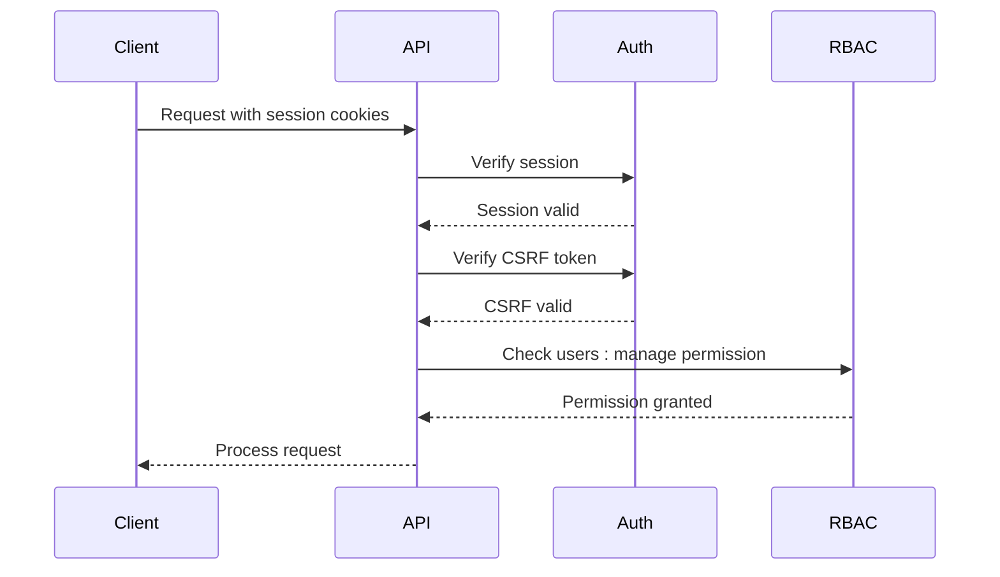
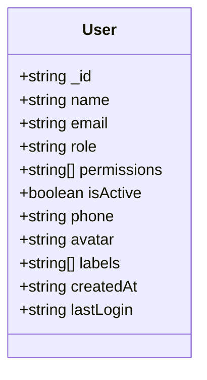
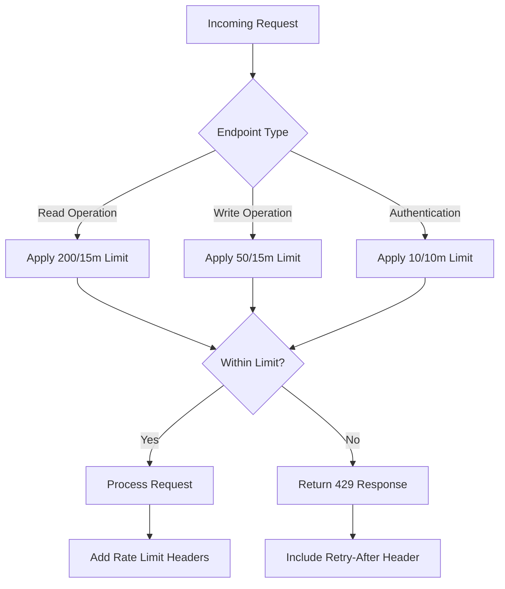
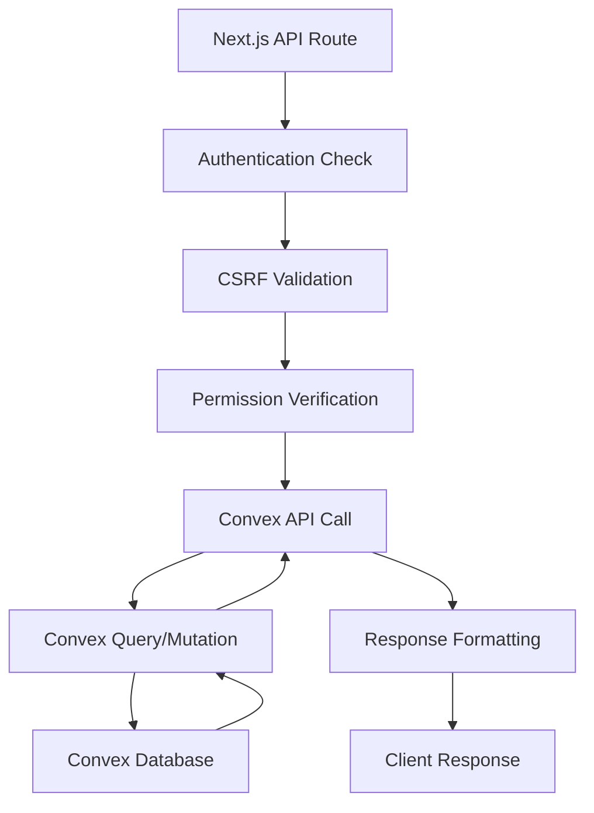

# Users API

<cite>
**Referenced Files in This Document**   
- [users.ts](file://convex/users.ts)
- [route.ts](file://src/app/api/users/route.ts)
- [route.ts](file://src/app/api/users/[id]/route.ts)
- [auth-utils.ts](file://src/lib/api/auth-utils.ts)
- [permissions.ts](file://src/types/permissions.ts)
- [rate-limit-config.ts](file://src/lib/rate-limit-config.ts)
</cite>

## Table of Contents

1. [Introduction](#introduction)
2. [Authentication and Permissions](#authentication-and-permissions)
3. [GET /api/users - List Users](#get-apiusers---list-users)
4. [GET /api/users/[id] - Get User Details](#get-apiusersid---get-user-details)
5. [POST /api/users - Create User](#post-apiusers---create-user)
6. [PATCH /api/users/[id] - Update User](#patch-apiusersid---update-user)
7. [DELETE /api/users/[id] - Delete User](#delete-apiusersid---delete-user)
8. [Rate Limiting Policies](#rate-limiting-policies)
9. [Error Responses](#error-responses)
10. [Data Synchronization](#data-synchronization)

## Introduction

The Users API provides comprehensive user management functionality for the PORTAL application. This API enables administrators to retrieve, create, update, and delete user accounts with robust security measures including role-based access control (RBAC), CSRF protection, and rate limiting. The API endpoints are designed to support paginated user lists with filtering capabilities and detailed user profile retrieval.

The user management system is built on a Next.js API routes architecture that integrates with a Convex backend for data persistence. All operations require administrative privileges, ensuring that only authorized personnel can manage user accounts. The API follows RESTful principles with predictable resource URLs and standard HTTP methods.

**Section sources**

- [route.ts](file://src/app/api/users/route.ts#L1-L230)
- [route.ts](file://src/app/api/users/[id]/route.ts#L1-L233)

## Authentication and Permissions

Access to the Users API endpoints is restricted to administrators with the appropriate permissions. All requests require authentication via session cookies, and users must possess the `users:manage` permission to perform any operations on user accounts.

The permission system is implemented through the RBAC framework defined in the application's permission model. The required permission for user management is defined in the `SPECIAL_PERMISSIONS` constant:

```mermaid
erDiagram
PERMISSIONS {
string users:manage PK
string beneficiaries:access
string donations:access
string aid_applications:access
string scholarships:access
string messages:access
string finance:access
string reports:access
string settings:access
string workflow:access
string partners:access
}
```

The authentication flow follows this sequence:

1. The client sends a request with session cookies
2. The API verifies the CSRF token to prevent cross-site request forgery
3. The system validates the user's session and permissions
4. If the user has the `users:manage` permission, the request proceeds
5. Otherwise, a 403 Forbidden response is returned



**Diagram sources**

- [auth-utils.ts](file://src/lib/api/auth-utils.ts#L107-L133)
- [permissions.ts](file://src/types/permissions.ts#L1-L39)

**Section sources**

- [auth-utils.ts](file://src/lib/api/auth-utils.ts#L107-L133)
- [permissions.ts](file://src/types/permissions.ts#L1-L39)

## GET /api/users - List Users

Retrieves a paginated list of users with optional filtering parameters. This endpoint supports searching by name, filtering by role or active status, and custom pagination.

### Request

```
GET /api/users?search=John&role=admin&isActive=true&limit=50
```

### Query Parameters

| Parameter | Type    | Required | Description                          |
| --------- | ------- | -------- | ------------------------------------ |
| search    | string  | No       | Search term for user names           |
| role      | string  | No       | Filter by user role                  |
| isActive  | boolean | No       | Filter by active status              |
| limit     | number  | No       | Number of results per page (max 100) |

### Response

```json
{
  "success": true,
  "data": [
    {
      "_id": "user_123",
      "name": "John Doe",
      "email": "john@example.com",
      "role": "admin",
      "permissions": ["users:manage", "beneficiaries:access"],
      "isActive": true,
      "phone": "5551234567",
      "avatar": "https://example.com/avatar.jpg",
      "labels": ["team-leader"],
      "createdAt": "2023-01-01T00:00:00Z",
      "lastLogin": "2023-12-01T10:00:00Z"
    }
  ],
  "total": 1,
  "continueCursor": null,
  "isDone": true
}
```

The response includes a cursor-based pagination system where `continueCursor` indicates there are more results available. Clients should pass this cursor value in subsequent requests to retrieve the next page of results.

**Section sources**

- [route.ts](file://src/app/api/users/route.ts#L106-L152)
- [users.ts](file://convex/users.ts#L6-L63)

## GET /api/users/[id] - Get User Details

Retrieves detailed information about a specific user by their unique identifier.

### Request

```
GET /api/users/user_123
```

### Response

```json
{
  "success": true,
  "data": {
    "_id": "user_123",
    "name": "John Doe",
    "email": "john@example.com",
    "role": "admin",
    "permissions": ["users:manage", "beneficiaries:access"],
    "isActive": true,
    "phone": "5551234567",
    "avatar": "https://example.com/avatar.jpg",
    "labels": ["team-leader"],
    "createdAt": "2023-01-01T00:00:00Z",
    "lastLogin": "2023-12-01T10:00:00Z"
  }
}
```

The response schema includes all user profile data, role information, permission assignments, and account status. The `permissions` field contains an array of permission strings that define the user's access rights within the system.



**Diagram sources**

- [users.ts](file://convex/users.ts#L66-L71)

**Section sources**

- [route.ts](file://src/app/api/users/[id]/route.ts#L29-L63)

## POST /api/users - Create User

Creates a new user account with the provided details. This operation requires admin privileges and includes comprehensive validation.

### Request

```
POST /api/users
Content-Type: application/json
```

```json
{
  "name": "Jane Smith",
  "email": "jane@example.com",
  "role": "staff",
  "permissions": ["beneficiaries:access", "donations:access"],
  "password": "SecurePass123!",
  "isActive": true,
  "phone": "5559876543",
  "avatar": "https://example.com/avatar2.jpg",
  "labels": ["new-hire"]
}
```

### Request Validation

The request body is validated using the following rules:

- Name: Minimum 2 characters
- Email: Valid email format
- Role: Minimum 2 characters
- Permissions: Must be valid permission strings from the system
- Password: Must meet strength requirements (8+ characters, uppercase, lowercase, number, special character)
- isActive: Boolean value

The validation process normalizes input data by trimming whitespace and converting emails to lowercase before processing.

**Section sources**

- [route.ts](file://src/app/api/users/route.ts#L154-L228)
- [users.ts](file://convex/users.ts#L84-L122)

## PATCH /api/users/[id] - Update User

Updates an existing user's information. This endpoint supports partial updates, allowing clients to modify specific fields without affecting others.

### Request

```
PATCH /api/users/user_123
Content-Type: application/json
```

```json
{
  "name": "John Updated",
  "email": "john.updated@example.com",
  "role": "super-admin",
  "permissions": ["users:manage", "beneficiaries:access", "donations:access"],
  "isActive": false,
  "password": "NewSecurePass456!"
}
```

### Update Logic

The update operation follows these rules:

1. Email changes are validated for uniqueness across the system
2. Password updates trigger re-hashing before storage
3. Permission updates are filtered to only include valid system permissions
4. All string fields are trimmed of whitespace
5. The update preserves existing values for fields not included in the request

The system prevents email conflicts by checking if the new email is already in use by another user account.

**Section sources**

- [route.ts](file://src/app/api/users/[id]/route.ts#L69-L156)
- [users.ts](file://convex/users.ts#L124-L207)

## DELETE /api/users/[id] - Delete User

Removes a user account from the system. This operation is permanent and cannot be undone.

### Request

```
DELETE /api/users/user_123
```

### Response

```json
{
  "success": true,
  "message": "User successfully deleted"
}
```

The deletion process includes:

1. CSRF token verification
2. Permission validation
3. User existence check
4. Database record deletion

The endpoint returns a success message upon completion. If the user does not exist, a 404 Not Found response is returned.

**Section sources**

- [route.ts](file://src/app/api/users/[id]/route.ts#L182-L227)
- [users.ts](file://convex/users.ts#L209-L218)

## Rate Limiting Policies

The Users API implements rate limiting to prevent abuse and ensure system stability. Different endpoints have varying rate limits based on their functionality and resource requirements.

### Rate Limit Configuration

| Endpoint Pattern                 | Limit        | Window     | Description               |
| -------------------------------- | ------------ | ---------- | ------------------------- |
| `/api/users` (GET)               | 200 requests | 15 minutes | Read-only operations      |
| `/api/users` (POST, PUT, DELETE) | 50 requests  | 15 minutes | Data modification         |
| `/api/auth/*`                    | 10 requests  | 10 minutes | Authentication operations |

The rate limiting system uses the client's IP address combined with the request method and endpoint path as the identifier for tracking request rates. Authenticated requests are also tracked by user ID to provide more granular control.



Rate-limited responses include the following headers:

- `X-RateLimit-Remaining`: Number of requests left in the current window
- `X-RateLimit-Reset`: Timestamp when the rate limit resets
- `Retry-After`: Seconds to wait before retrying

**Diagram sources**

- [rate-limit-config.ts](file://src/lib/rate-limit-config.ts#L21-L107)

**Section sources**

- [rate-limit-config.ts](file://src/lib/rate-limit-config.ts#L1-L194)
- [rate-limit.ts](file://src/lib/rate-limit.ts#L1-L148)

## Error Responses

The Users API returns standardized error responses for various failure scenarios. All error responses follow the same structure:

```json
{
  "success": false,
  "error": "Descriptive error message"
}
```

### Common Error Scenarios

| Status Code | Error Scenario           | Response Body                                         |
| ----------- | ------------------------ | ----------------------------------------------------- |
| 400         | Validation error         | Field-specific validation messages                    |
| 401         | Authentication required  | "Oturum bulunamadı"                                   |
| 403         | Insufficient permissions | "Bu kaynağa erişim yetkiniz yok"                      |
| 404         | User not found           | "Kullanıcı bulunamadı"                                |
| 409         | Email already exists     | "Bu e-posta adresi zaten kayıtlı"                     |
| 429         | Rate limit exceeded      | "Çok fazla istek gönderdiniz. Lütfen biraz bekleyin." |
| 500         | Internal server error    | "Veri alınamadı" or "İşlem başarısız"                 |

The error handling system normalizes error messages from the backend and presents them in a consistent format to the client. Specific validation errors provide detailed information about which fields failed validation and why.

**Section sources**

- [route.ts](file://src/app/api/users/route.ts#L140-L151)
- [route.ts](file://src/app/api/users/[id]/route.ts#L53-L62)

## Data Synchronization

The Users API facilitates data synchronization between the Next.js frontend and the Convex backend through a well-defined integration layer.

### Architecture

The system follows a clean separation of concerns:

1. Next.js API routes handle HTTP requests and responses
2. Authentication and authorization are processed through middleware
3. Business logic is implemented in Convex query and mutation functions
4. Data persistence occurs in the Convex database



The `convexUsers` object imported from `@/lib/convex/api` provides a type-safe interface to the Convex backend functions. This abstraction layer ensures that API routes can call backend functions without directly importing Convex modules, maintaining separation between the frontend and backend concerns.

User data synchronization occurs in real-time through Convex's reactive query system. When a user record is updated, all connected clients automatically receive the updated data without requiring manual refresh.

**Diagram sources**

- [route.ts](file://src/app/api/users/route.ts#L2)
- [route.ts](file://src/app/api/users/[id]/route.ts#L3)

**Section sources**

- [route.ts](file://src/app/api/users/route.ts#L2)
- [route.ts](file://src/app/api/users/[id]/route.ts#L3)
- [users.ts](file://convex/users.ts)
