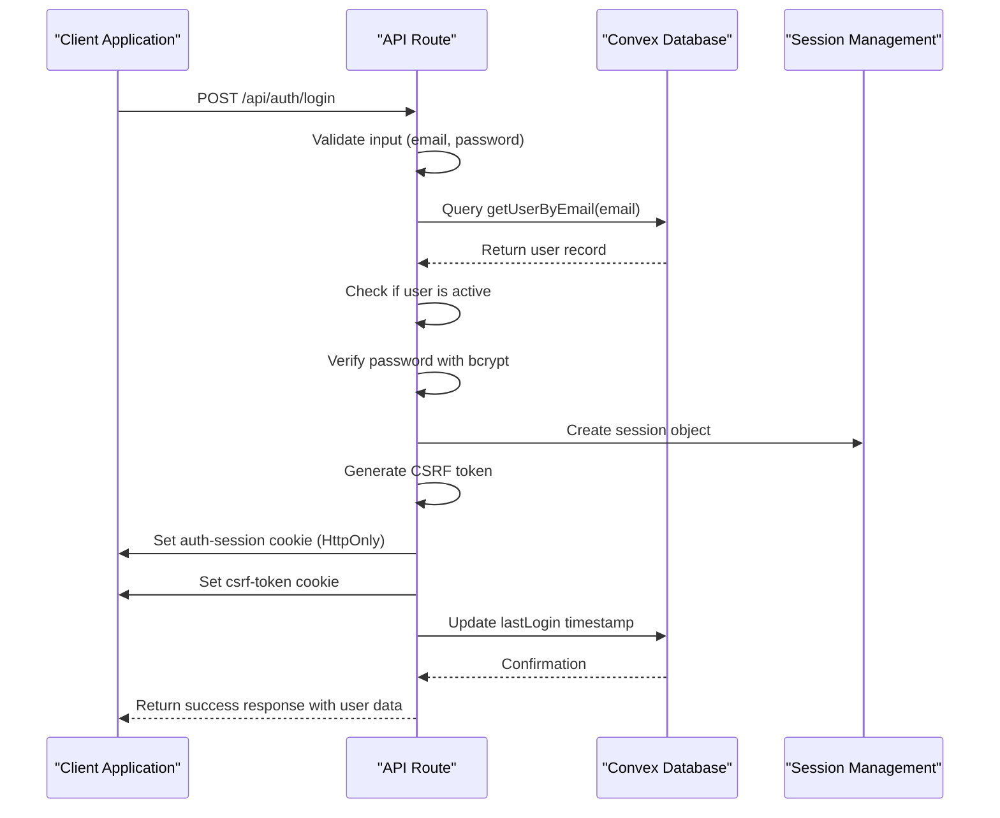
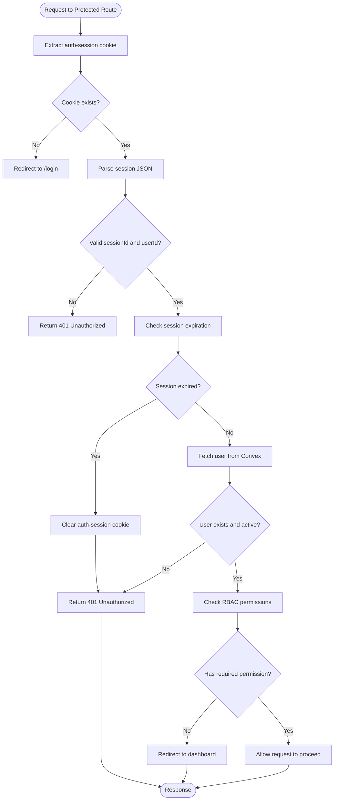
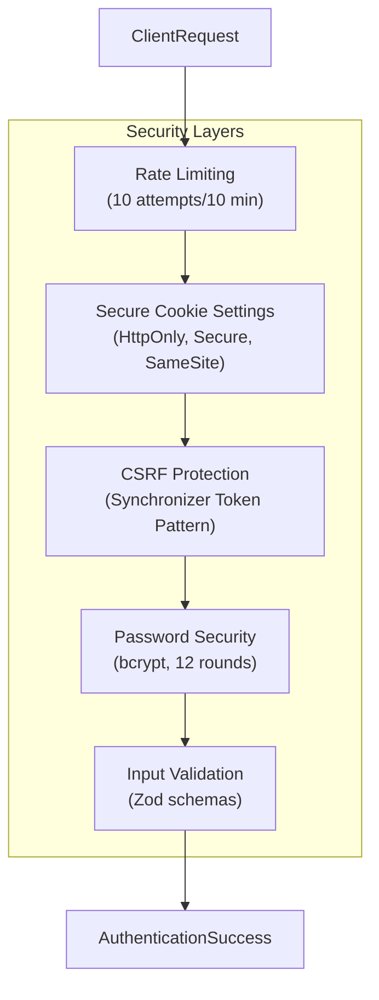

# Authentication Flow

<cite>
**Referenced Files in This Document**   
- [auth.ts](file://convex/auth.ts)
- [login/route.ts](file://src/app/api/auth/login/route.ts)
- [logout/route.ts](file://src/app/api/auth/logout/route.ts)
- [session/route.ts](file://src/app/api/auth/session/route.ts)
- [session.ts](file://src/lib/auth/session.ts)
- [password.ts](file://src/lib/auth/password.ts)
- [middleware.ts](file://src/middleware.ts)
- [csrf.ts](file://src/lib/csrf.ts)
- [rate-limit.ts](file://src/lib/rate-limit.ts)
</cite>

## Table of Contents

1. [Authentication Overview](#authentication-overview)
2. [Login Process](#login-process)
3. [Session Management](#session-management)
4. [Logout Procedure](#logout-procedure)
5. [Security Features](#security-features)
6. [API Request/Response Examples](#api-requestresponse-examples)
7. [Error Handling](#error-handling)
8. [Configuration and Customization](#configuration-and-customization)

## Authentication Overview

The PORTAL application implements a secure session-based authentication system using Next.js middleware, Convex database integration, and industry-standard security practices. The authentication flow consists of three main endpoints: login, session validation, and logout. User credentials are verified against the Convex database, with password hashing handled via bcrypt.js. Sessions are maintained using HttpOnly cookies, and CSRF protection is implemented for all state-changing operations.

The system supports role-based access control (RBAC) with six distinct user roles: Admin, Manager, Staff, Volunteer, Donor, and Viewer. Each role has specific permissions defined in the system, controlling access to various application features and data.

**Section sources**

- [auth.ts](file://convex/auth.ts#L1-L82)
- [middleware.ts](file://src/middleware.ts#L1-L229)

## Login Process

The login process begins with a POST request to the `/api/auth/login` endpoint, which validates user credentials and establishes a session upon successful authentication. The process involves several key steps:

1. **Input Validation**: The system first validates that both email and password are provided in the request body.
2. **User Lookup**: The system queries the Convex database using the `getUserByEmail` function to retrieve the user record.
3. **Account Status Check**: The system verifies that the user account is active before proceeding.
4. **Password Verification**: The provided password is verified against the stored hash using the `verifyPassword` function from the password utility.
5. **Session Creation**: Upon successful authentication, a session is created and stored in an HttpOnly cookie.
6. **CSRF Token Generation**: A CSRF token is generated and stored in a separate cookie to protect against cross-site request forgery attacks.
7. **Last Login Update**: The user's last login timestamp is updated in the database.

The login endpoint is protected by rate limiting to prevent brute force attacks, allowing only 10 login attempts per 10 minutes per client IP address.



**Diagram sources**

- [login/route.ts](file://src/app/api/auth/login/route.ts#L1-L178)
- [auth.ts](file://convex/auth.ts#L33-L48)
- [password.ts](file://src/lib/auth/password.ts#L18-L20)

**Section sources**

- [login/route.ts](file://src/app/api/auth/login/route.ts#L1-L178)
- [auth.ts](file://convex/auth.ts#L33-L48)
- [password.ts](file://src/lib/auth/password.ts#L1-L54)

## Session Management

Session management in PORTAL is handled through the `/api/auth/session` endpoint and supporting utility functions in the session module. The system uses a two-cookie approach to maintain user sessions securely:

1. **auth-session**: An HttpOnly cookie containing the session ID, user ID, and expiration time, serialized as JSON.
2. **csrf-token**: A non-HttpOnly cookie containing a CSRF token for protecting state-changing operations.

The session validation process works as follows:

1. When a client makes a request to a protected route, the middleware extracts the `auth-session` cookie.
2. The session cookie is parsed and validated for required fields (sessionId, userId).
3. The system checks if the session has expired by comparing the expiration time with the current time.
4. If the session is valid, the corresponding user data is retrieved from Convex.
5. The user's permissions are used to enforce role-based access control for protected routes.

The `getUserFromSession` function handles both production user sessions and development mock sessions, allowing for different permission levels during development.



**Diagram sources**

- [middleware.ts](file://src/middleware.ts#L136-L215)
- [session.ts](file://src/lib/auth/session.ts#L26-L181)

**Section sources**

- [session/route.ts](file://src/app/api/auth/session/route.ts#L1-L65)
- [session.ts](file://src/lib/auth/session.ts#L1-L181)
- [middleware.ts](file://src/middleware.ts#L1-L229)

## Logout Procedure

The logout procedure is initiated by a POST request to the `/api/auth/logout` endpoint, which invalidates the user's session by clearing authentication cookies. The process is designed to be robust, ensuring session cleanup even if errors occur during the process.

When a logout request is received:

1. The system attempts to clear both the `auth-session` and `csrf-token` cookies by setting them with an empty value and an immediate expiration time (maxAge: 0).
2. If an error occurs during the cookie clearing process, the system still attempts to clear the cookies in a try-catch block to ensure session invalidation.
3. A success response is returned regardless of whether the cookie clearing was completely successful, providing a consistent user experience.

The logout endpoint is idempotent, meaning multiple logout requests are handled gracefully without causing errors. This design ensures that users are effectively logged out even in error conditions.

**Section sources**

- [logout/route.ts](file://src/app/api/auth/logout/route.ts#L1-L73)

## Security Features

PORTAL implements multiple security features to protect against common web application vulnerabilities:

### Rate Limiting

The authentication system employs rate limiting on login attempts to prevent brute force attacks. The `authRateLimit` configuration allows only 10 login attempts per 10 minutes per client IP address. This limit is configurable through environment variables (`RATE_LIMIT_AUTH_MAX` and `RATE_LIMIT_AUTH_WINDOW`).

### Secure Cookie Settings

Authentication cookies use security best practices:

- **HttpOnly flag**: Prevents client-side JavaScript access to the auth-session cookie
- **Secure flag**: Ensures cookies are only sent over HTTPS in production
- **SameSite=strict**: Prevents cross-site request forgery attacks
- **Appropriate expiration**: Session duration varies based on the "remember me" option

### CSRF Protection

The system implements CSRF protection using a synchronizer token pattern:

- CSRF tokens are generated using cryptographically secure random bytes
- Tokens are stored in a non-HttpOnly cookie so client-side code can access them
- Each state-changing request must include the CSRF token in the `x-csrf-token` header
- Token validation uses constant-time comparison to prevent timing attacks

### Password Security

Password handling follows security best practices:

- Passwords are hashed using bcrypt with 12 salt rounds
- Password strength is validated (minimum 8 characters, containing letters and numbers)
- Password hashes are never exposed in API responses
- The system checks for active user accounts before password verification



**Diagram sources**

- [rate-limit.ts](file://src/lib/rate-limit.ts#L1-L148)
- [csrf.ts](file://src/lib/csrf.ts#L1-L90)
- [password.ts](file://src/lib/auth/password.ts#L1-L54)
- [middleware.ts](file://src/middleware.ts#L1-L229)

**Section sources**

- [rate-limit.ts](file://src/lib/rate-limit.ts#L92-L100)
- [csrf.ts](file://src/lib/csrf.ts#L1-L90)
- [password.ts](file://src/lib/auth/password.ts#L1-L54)

## API Request/Response Examples

### Login Request

```json
POST /api/auth/login
Content-Type: application/json

{
  "email": "admin@portal.com",
  "password": "securePassword123",
  "rememberMe": true
}
```

### Successful Login Response

```json
{
  "success": true,
  "data": {
    "user": {
      "id": "user_123",
      "email": "admin@portal.com",
      "name": "Admin User",
      "role": "Admin",
      "permissions": ["beneficiaries:access", "donations:access", "users:manage"],
      "isActive": true
    },
    "session": {
      "sessionId": "session_12345",
      "expire": "2024-01-01T00:00:00.000Z"
    }
  }
}
```

### Session Check Request

```json
GET /api/auth/session
```

### Valid Session Response

```json
{
  "success": true,
  "data": {
    "userId": "user_123",
    "expiresAt": "2024-01-01T00:00:00.000Z"
  }
}
```

### Logout Request

```json
POST /api/auth/logout
```

### Logout Response

```json
{
  "success": true,
  "message": "Successfully logged out"
}
```

**Section sources**

- [login/route.ts](file://src/app/api/auth/login/route.ts#L1-L178)
- [session/route.ts](file://src/app/api/auth/session/route.ts#L1-L65)
- [logout/route.ts](file://src/app/api/auth/logout/route.ts#L1-L73)

## Error Handling

The authentication system implements comprehensive error handling for various failure scenarios:

### Failed Login Scenarios

- **Missing credentials**: Returns 400 Bad Request with "Email and password are required"
- **User not found**: Returns 401 Unauthorized with "Invalid email or password"
- **Inactive account**: Returns 403 Forbidden with "Account is not active"
- **Invalid password**: Returns 401 Unauthorized with "Invalid email or password"
- **System errors**: Returns 500 Internal Server Error with appropriate message

### Session Validation Errors

- **No active session**: Returns 401 Unauthorized with "No active session"
- **Expired session**: Returns 401 Unauthorized with "Session expired"
- **Invalid session data**: Returns 401 Unauthorized with "Invalid session"

### Logout Errors

The logout endpoint is designed to succeed even if errors occur during cookie cleanup, ensuring users are logged out regardless of technical issues.

All authentication errors are logged with appropriate context for monitoring and debugging purposes, while ensuring sensitive information like full email addresses is not exposed in logs.

**Section sources**

- [login/route.ts](file://src/app/api/auth/login/route.ts#L155-L177)
- [session/route.ts](file://src/app/api/auth/session/route.ts#L50-L63)
- [logout/route.ts](file://src/app/api/auth/logout/route.ts#L34-L72)

## Configuration and Customization

### Session Duration

Session duration can be customized based on the "remember me" option:

- **Standard session**: 24 hours when "remember me" is false
- **Extended session**: 30 days when "remember me" is true

These durations can be modified by changing the `maxAge` values in the cookie settings within the login route.

### Multi-Factor Authentication Extensions

While the current implementation does not include multi-factor authentication (MFA), the architecture supports MFA extensions through the following approaches:

1. **Post-login verification**: After successful password authentication, redirect to an MFA verification step that requires a second factor (e.g., TOTP code, SMS code).
2. **Conditional MFA**: Implement policies that require MFA for certain actions or user roles.
3. **MFA enrollment**: Add endpoints for users to register MFA methods (authenticator apps, phone numbers).

To implement MFA, additional endpoints would be needed:

- `/api/auth/mfa/setup` - Initialize MFA setup
- `/api/auth/mfa/verify` - Verify MFA code
- `/api/auth/mfa/recovery` - Handle MFA recovery codes

The session management system would need to be extended to track MFA status, potentially adding an `mfaVerified` flag to the session object.

**Section sources**

- [login/route.ts](file://src/app/api/auth/login/route.ts#L92-L116)
- [session.ts](file://src/lib/auth/session.ts#L7-L21)
- [e2e/settings.spec.ts](file://e2e/settings.spec.ts#L147-L185)
