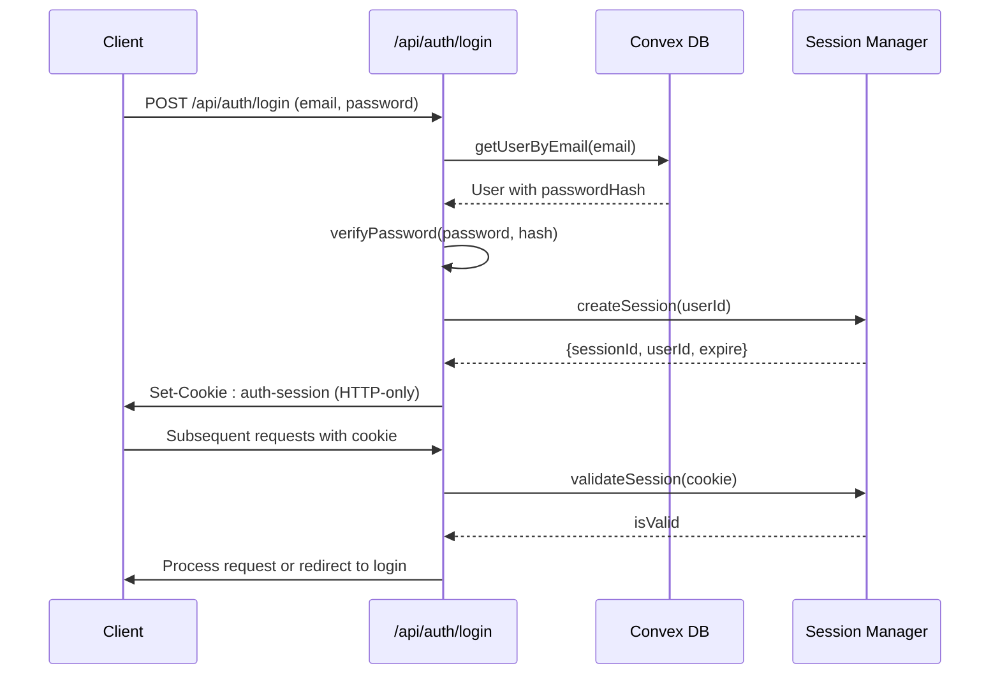
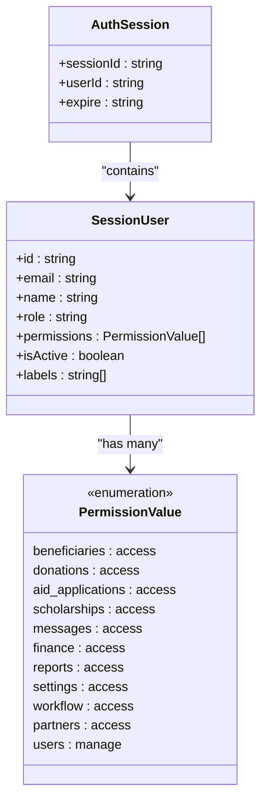
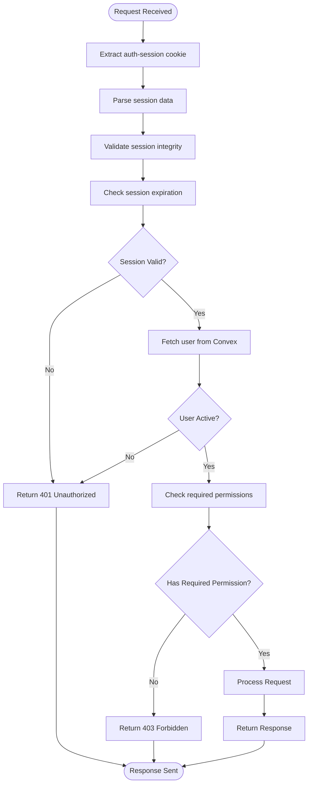

# Authentication and Authorization

<cite>
**Referenced Files in This Document**   
- [auth.ts](file://convex/auth.ts)
- [get-user.ts](file://src/lib/auth/get-user.ts)
- [password.ts](file://src/lib/auth/password.ts)
- [session.ts](file://src/lib/auth/session.ts)
- [permissions.ts](file://src/types/permissions.ts)
- [permission-checkbox-group.tsx](file://src/components/users/permission-checkbox-group.tsx)
</cite>

## Table of Contents

1. [Authentication Flow](#authentication-flow)
2. [Session Management](#session-management)
3. [Role-Based Access Control (RBAC)](#role-based-access-control-rbac)
4. [Permission Implementation](#permission-implementation)
5. [Security Considerations](#security-considerations)
6. [Extending Roles and Permissions](#extending-roles-and-permissions)

## Authentication Flow

The authentication system in PORTAL is built on Convex backend functions integrated with Next.js API routes. The login process begins at the `/api/auth/login` endpoint, where user credentials are validated. The system retrieves user data via the `getUserByEmail` query in `auth.ts`, which returns the full user record including the password hash for verification purposes.

Password verification is performed in the Next.js layer using bcrypt, as Convex cannot execute native modules like bcrypt directly. Upon successful validation, a session cookie named `auth-session` is created and securely transmitted to the client. The `updateLastLogin` mutation is then invoked to record the login timestamp in the database.

The authentication flow concludes with the generation of a JWT-like session object containing the user ID, session ID, and expiration timestamp. This token is stored in an HTTP-only cookie to prevent XSS attacks and ensure secure transmission.

**Section sources**

- [auth.ts](file://convex/auth.ts#L34-L48)
- [get-user.ts](file://src/lib/auth/get-user.ts#L13-L47)
- [password.ts](file://src/lib/auth/password.ts#L19-L20)

## Session Management

PORTAL implements a server-side session management system using encrypted cookies. The session mechanism is defined in `session.ts`, which exports key functions for parsing, validating, and extracting user sessions. Each session contains a unique `sessionId`, `userId`, and optional `expire` timestamp.

Session validation occurs through the `isSessionExpired` function, which compares the current time against the stored expiration date. Sessions are automatically invalidated after a configurable period of inactivity. The `getAuthSessionFromRequest` and `getAuthSessionFromCookies` functions provide flexible access to session data across different execution contexts (API routes vs server components).

The logout process is handled by the `/api/auth/logout` route, which clears the `auth-session` cookie on the client side. The corresponding Convex `logout` mutation serves as a placeholder for future server-side session invalidation logic, though current session management is cookie-based.

Token refresh functionality is implemented through automatic session renewal during active usage. When a valid session is detected near its expiration time, the system silently extends the session lifetime before issuing a new cookie.

**Diagram sources**

- [session.ts](file://src/lib/auth/session.ts#L8-L71)
- [auth.ts](file://convex/auth.ts#L74-L79)

**Section sources**

- [session.ts](file://src/lib/auth/session.ts#L1-L181)
- [auth.ts](file://convex/auth.ts#L54-L67)

## Role-Based Access Control (RBAC)

PORTAL implements a granular RBAC system with six distinct user roles: Dernek Başkanı (Association President), Yönetici (Manager), Üye (Member), Görüntüleyici (Viewer), Personel (Staff), and special administrative roles. These roles are mapped to specific permission sets defined in the `permissions.ts` file.

The system distinguishes between module-level permissions (access to major application sections) and special permissions (administrative capabilities). Module permissions include access to beneficiaries, donations, aid applications, scholarships, messages, finance, reports, settings, workflow, and partners. The sole special permission, `USERS_MANAGE`, grants full user administration rights.

Role definitions are implemented through the `getUserFromSession` function in `session.ts`, which maps mock user IDs to predefined permission sets during development. In production, these permissions are stored directly in the user document within Convex. The system supports both role-based assignment (predefined role → permission set) and custom permission configurations.

**Diagram sources**

- [session.ts](file://src/lib/auth/session.ts#L8-L22)
- [permissions.ts](file://src/types/permissions.ts#L1-L38)

**Section sources**

- [permissions.ts](file://src/types/permissions.ts#L1-L38)
- [session.ts](file://src/lib/auth/session.ts#L76-L167)

## Permission Implementation

Permission checks are implemented consistently across both frontend and backend layers. On the backend, API routes use the `getCurrentUser` function from `get-user.ts` to retrieve the authenticated user's permission set before processing requests. This function queries Convex for the full user record and returns it with sensitive fields like password hashes omitted.

Frontend components utilize the `PermissionCheckboxGroup` component to manage user permissions in the admin interface. This component renders a structured list of checkboxes for each available permission, using human-readable labels from the `PERMISSION_LABELS` mapping. The component supports two modes: standard module access and extended management permissions.

API routes enforce permissions through conditional logic based on the user's `permissions` array. For example, the `/api/users` route checks for `users:manage` permission before allowing user creation, modification, or deletion operations. Similarly, financial data endpoints verify `finance:access` before returning sensitive information.

**Diagram sources**

- [get-user.ts](file://src/lib/auth/get-user.ts#L55-L68)
- [permission-checkbox-group.tsx](file://src/components/users/permission-checkbox-group.tsx#L29-L72)

**Section sources**

- [get-user.ts](file://src/lib/auth/get-user.ts#L13-L71)
- [permission-checkbox-group.tsx](file://src/components/users/permission-checkbox-group.tsx#L1-L74)

## Security Considerations

The authentication system incorporates multiple security measures to protect user data and prevent common web vulnerabilities. Passwords are hashed using bcrypt with 12 salt rounds, providing strong protection against brute force attacks. The `validatePasswordStrength` function enforces minimum security requirements, including 8-character minimum length, presence of both letters and numbers, and maximum 128-character length.

Session cookies are configured as HTTP-only and secure, preventing access via JavaScript and ensuring transmission only over HTTPS. The system implements automatic session expiration and renewal to minimize the risk of long-lived active sessions. CSRF protection is provided through the dedicated `/api/csrf` route, which generates and validates anti-forgery tokens for state-changing operations.

The architecture follows the principle of least privilege, with database queries in Convex explicitly excluding sensitive fields like `passwordHash` from responses. All authentication-related operations are logged through the audit logging system for security monitoring and incident response. The codebase avoids storing plaintext credentials or session tokens in logs or client-side storage.

**Section sources**

- [password.ts](file://src/lib/auth/password.ts#L8-L54)
- [session.ts](file://src/lib/auth/session.ts#L27-L53)
- [auth.ts](file://convex/auth.ts#L22-L25)

## Extending Roles and Permissions

Adding new roles or modifying existing permissions requires coordinated changes across multiple files. To introduce a new module permission, developers must first add the permission key to `MODULE_PERMISSIONS` in `permissions.ts`, along with its corresponding label in `PERMISSION_LABELS`.

For new roles with custom permission sets, the `getUserFromSession` function in `session.ts` should be updated to include the new role mapping. When creating entirely new special permissions (e.g., audit log access), both `SPECIAL_PERMISSIONS` and `ALL_PERMISSIONS` must be extended accordingly.

The `PermissionCheckboxGroup` component automatically includes new permissions in the admin interface, but developers may need to adjust the `DEFAULT_ORDER` array to control the display sequence. Backend API routes should be updated to enforce the new permissions using the established pattern of checking the user's `permissions` array.

When modifying existing roles, it's essential to consider backward compatibility and perform thorough testing across all affected user journeys. The e2e test suite includes authentication scenarios that should be updated to reflect new role configurations.

**Section sources**

- [permissions.ts](file://src/types/permissions.ts#L1-L38)
- [session.ts](file://src/lib/auth/session.ts#L82-L142)
- [permission-checkbox-group.tsx](file://src/components/users/permission-checkbox-group.tsx#L8-L19)
