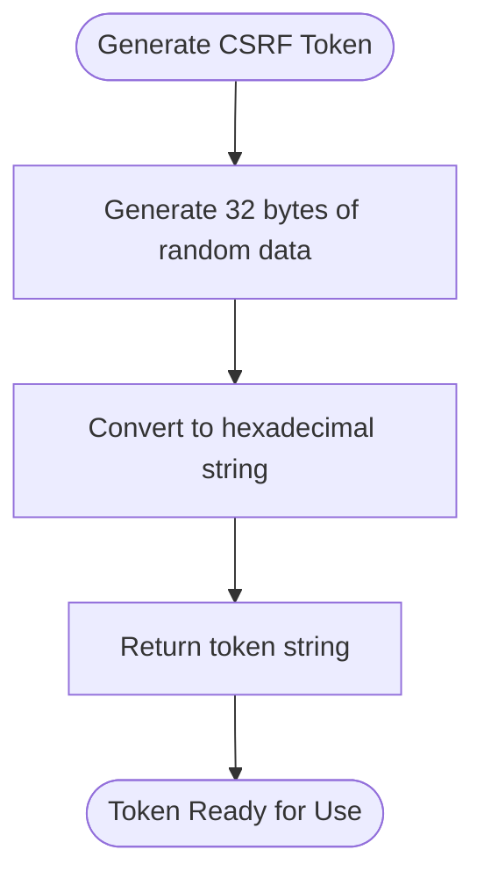
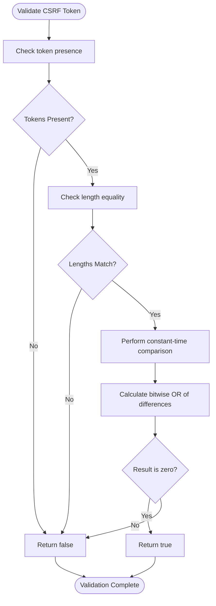
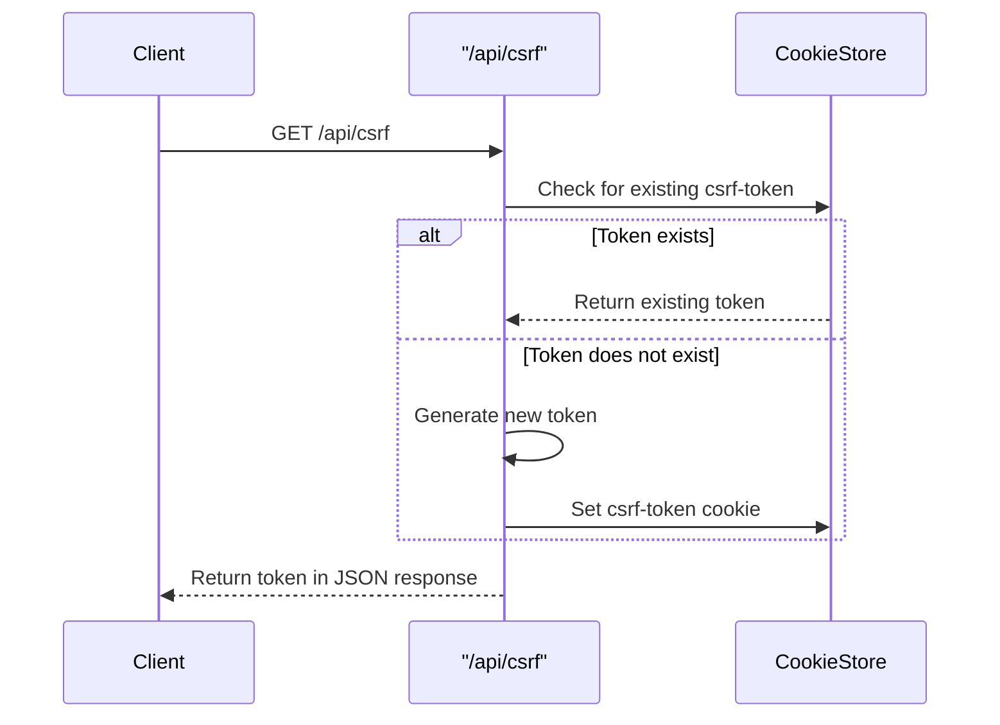
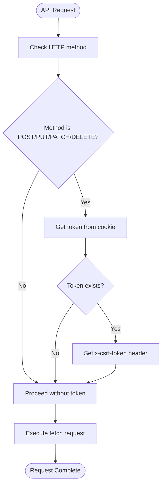
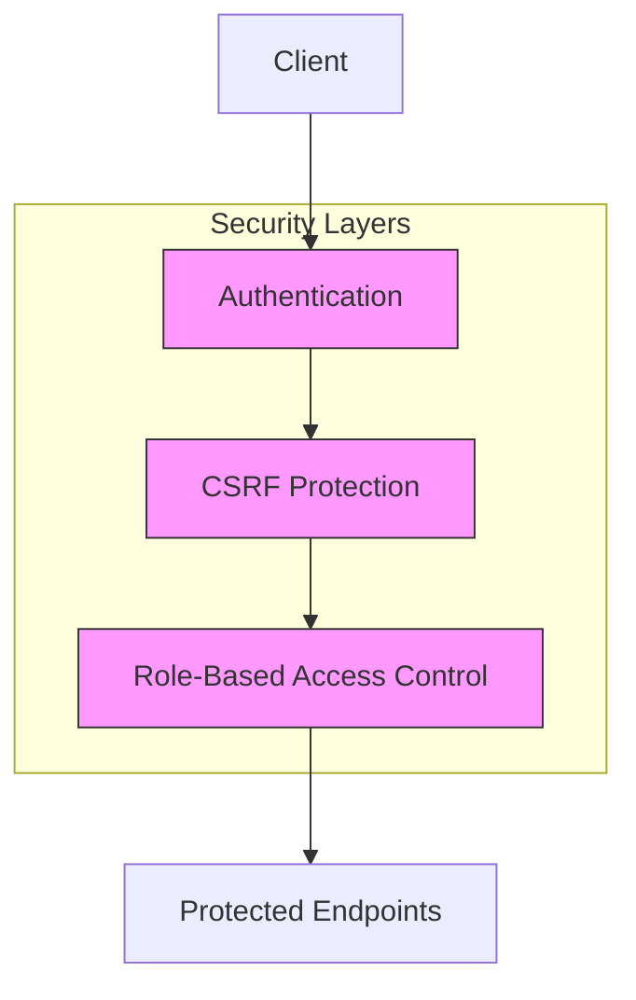

# CSRF Protection

<cite>
**Referenced Files in This Document**   
- [csrf.ts](file://src/lib/csrf.ts)
- [route.ts](file://src/app/api/csrf/route.ts)
- [auth-utils.ts](file://src/lib/api/auth-utils.ts)
- [middleware.ts](file://src/middleware.ts)
</cite>

## Table of Contents

1. [Introduction](#introduction)
2. [Token Generation Mechanism](#token-generation-mechanism)
3. [Token Validation Process](#token-validation-process)
4. [CSRF Token Endpoint](#csrf-token-endpoint)
5. [Integration with Frontend Requests](#integration-with-frontend-requests)
6. [SameSite Cookie Policy](#samesite-cookie-policy)
7. [Security Architecture Integration](#security-architecture-integration)
8. [Testing CSRF Protection](#testing-csrf-protection)
9. [Token Expiration and Renewal](#token-expiration-and-renewal)
10. [Third-Party Integration Security](#third-party-integration-security)
11. [OWASP Compliance](#owasp-compliance)

## Introduction

The PORTAL application implements a robust Cross-Site Request Forgery (CSRF) protection mechanism to safeguard state-changing operations against unauthorized requests. This documentation details the cryptographic token generation, validation process, and integration patterns used throughout the application. The implementation follows security best practices by using cryptographically secure randomness, constant-time comparisons, and proper cookie policies to prevent CSRF attacks while maintaining usability across both form submissions and API calls.

## Token Generation Mechanism

The CSRF token generation process uses Node.js's built-in `crypto` module to create cryptographically secure random tokens. Each token is generated with a fixed length of 32 bytes, providing sufficient entropy to prevent guessing attacks. The implementation ensures that tokens are unpredictable and unique for each session.

The token generation function utilizes `randomBytes()` from the `crypto` module, which is cryptographically strong and suitable for security-sensitive applications. The generated binary data is then converted to a hexadecimal string representation for safe transmission and storage.

**Diagram sources**

- [csrf.ts](file://src/lib/csrf.ts#L13-L15)

**Section sources**

- [csrf.ts](file://src/lib/csrf.ts#L1-L15)

## Token Validation Process

Token validation employs a constant-time comparison algorithm to prevent timing attacks that could potentially reveal information about the expected token. The validation process first checks for the presence of both the submitted token and the expected token, then verifies they have identical lengths before performing the character-by-character comparison.

The constant-time comparison works by processing all characters regardless of early mismatches, ensuring that the execution time does not depend on the position of the first differing character. This prevents attackers from using timing information to gradually discover the correct token value.

**Diagram sources**

- [csrf.ts](file://src/lib/csrf.ts#L27-L44)

**Section sources**

- [csrf.ts](file://src/lib/csrf.ts#L27-L44)
- [auth-utils.ts](file://src/lib/api/auth-utils.ts#L64-L73)

## CSRF Token Endpoint

The `/api/csrf` endpoint serves as the primary mechanism for clients to obtain valid CSRF tokens. This endpoint operates with specific security considerations: it generates a new token only if one doesn't already exist in the client's cookies, ensuring token persistence across sessions while maintaining security.

When a client requests a CSRF token, the endpoint first checks for an existing token in the cookie store. If no token exists, a new cryptographically secure token is generated and stored in a cookie with appropriate security flags. The same token value is then returned in the JSON response body for client-side use.

The CSRF token cookie is configured with critical security attributes:

- `httpOnly: false` - Allows client-side JavaScript to read the token for inclusion in API requests
- `secure: true` in production - Ensures the cookie is only transmitted over HTTPS connections
- `sameSite: 'strict'` - Prevents the cookie from being sent in cross-site requests
- `maxAge: 86400` - Sets a 24-hour expiration period for token rotation

**Diagram sources**

- [route.ts](file://src/app/api/csrf/route.ts#L9-L42)

**Section sources**

- [route.ts](file://src/app/api/csrf/route.ts#L1-L42)
- [middleware.ts](file://src/middleware.ts#L17-L20)

## Integration with Frontend Requests

The CSRF protection system integrates seamlessly with both traditional form submissions and modern API calls through automated header injection. Client-side code can retrieve the CSRF token from cookies and include it in state-changing requests using the designated header name `x-csrf-token`.

For API integrations, the implementation provides a `fetchWithCsrf` utility function that automatically injects the CSRF token into appropriate requests. This wrapper function checks the HTTP method and only includes the token for state-changing operations (POST, PUT, PATCH, DELETE), following the principle of least privilege.

The automated header injection system follows these rules:

- Token is only included for non-GET methods
- Header name is standardized across the application
- Client-side retrieval is handled through a dedicated utility function
- Error handling is implemented for cases where the token cannot be retrieved

**Diagram sources**

- [csrf.ts](file://src/lib/csrf.ts#L69-L89)

**Section sources**

- [csrf.ts](file://src/lib/csrf.ts#L65-L89)
- [auth-utils.ts](file://src/lib/api/auth-utils.ts#L64-L73)

## SameSite Cookie Policy

The CSRF protection implementation leverages the SameSite cookie attribute as an additional defense layer against cross-site request forgery attacks. The `csrf-token` cookie is configured with `sameSite: 'strict'`, which prevents the browser from sending the cookie in cross-site requests, effectively mitigating most CSRF attack vectors.

The SameSite policy works in conjunction with the token-based protection to provide defense in depth:

- `SameSite=Strict` - Cookie is only sent in first-party contexts
- The cookie is not included in requests initiated from external sites
- Links from external sites to the application will not carry the CSRF token
- Form submissions from external domains cannot include the token

This configuration ensures that even if an attacker manages to trick a user into visiting a malicious site, that site cannot successfully forge requests to the PORTAL application because the CSRF token cookie will not be sent by the browser in cross-site contexts.

**Section sources**

- [route.ts](file://src/app/api/csrf/route.ts#L24)
- [middleware.ts](file://src/middleware.ts#L17)

## Security Architecture Integration

The CSRF protection system is integrated into the overall security architecture through middleware and authentication utilities. The validation process is automatically applied to protected API routes through the `verifyCsrfToken` function, which is called as part of the authentication flow for state-changing operations.

The middleware configuration explicitly lists the CSRF endpoint as a public route, allowing unauthenticated access to retrieve tokens while protecting all other state-changing endpoints. This design ensures that users can obtain tokens before authentication while maintaining protection for all sensitive operations.

Protected API routes in the application require both authentication and CSRF validation, implementing a defense-in-depth approach. The system checks for valid sessions and CSRF tokens independently, ensuring that compromising one protection mechanism does not automatically compromise the other.

**Diagram sources**

- [middleware.ts](file://src/middleware.ts#L27-L36)
- [auth-utils.ts](file://src/lib/api/auth-utils.ts#L64-L73)

**Section sources**

- [middleware.ts](file://src/middleware.ts#L1-L229)
- [auth-utils.ts](file://src/lib/api/auth-utils.ts#L1-L150)

## Testing CSRF Protection

The application includes comprehensive testing for CSRF protection mechanisms, particularly in the end-to-end test suite. Tests verify that the CSRF token can be properly retrieved and included in authenticated requests, ensuring the protection system works as intended in real-world scenarios.

The testing approach includes:

- Verification that CSRF tokens are available in the client context
- Testing of API requests with and without proper CSRF tokens
- Validation of error responses when CSRF tokens are missing or invalid
- Confirmation that token retrieval works across different authentication states

Automated tests use utility functions to retrieve CSRF tokens from the page context, ensuring that test requests accurately simulate real user behavior. This approach helps maintain the integrity of the CSRF protection while allowing automated testing of protected endpoints.

**Section sources**

- [auth.spec.ts](file://e2e/auth.spec.ts#L34)
- [csrf.ts](file://src/lib/csrf.ts#L47-L63)

## Token Expiration and Renewal

CSRF tokens in the PORTAL application have a defined lifespan of 24 hours, after which they expire and are automatically renewed. This expiration policy balances security and usability by limiting the window of opportunity for token misuse while avoiding excessive user disruption.

When a token expires or is not present, the `/api/csrf` endpoint generates a new token and sets it in the cookie store. The renewal process is transparent to the user and occurs automatically when needed. During logout operations, the CSRF token cookie is explicitly cleared to ensure complete session termination.

The token renewal mechanism follows these principles:

- Tokens are persistent for 24 hours
- Renewal occurs automatically when tokens expire
- No renewal occurs for active sessions within the 24-hour window
- Tokens are cleared during logout for complete session invalidation

**Section sources**

- [route.ts](file://src/app/api/csrf/route.ts#L25)
- [logout/route.ts](file://src/app/api/auth/logout/route.ts#L52-L58)

## Third-Party Integration Security

The CSRF protection implementation considers security implications for third-party integrations by maintaining clear boundaries between first-party and third-party contexts. The `SameSite=strict` cookie policy inherently protects against unauthorized third-party access by preventing the CSRF token from being sent in cross-origin requests.

For legitimate third-party integrations, the system relies on alternative authentication mechanisms that do not depend on session cookies, such as API keys or OAuth tokens. This separation ensures that external services can interact with the API without compromising the CSRF protection for web-based user interactions.

The implementation avoids exposing CSRF tokens through insecure channels and ensures that token validation is always performed server-side, preventing bypass through client-side manipulation.

**Section sources**

- [middleware.ts](file://src/middleware.ts#L17-L20)
- [route.ts](file://src/app/api/csrf/route.ts#L21-L27)

## OWASP Compliance

The CSRF protection implementation in PORTAL aligns with OWASP recommendations for CSRF defense. The system follows the Synchronizer Token Pattern (STP), which is considered one of the most effective defenses against CSRF attacks.

Key OWASP compliance features include:

- Use of cryptographically secure random tokens
- Server-side token validation with constant-time comparison
- Proper cookie security attributes (Secure, HttpOnly, SameSite)
- Token binding to user sessions
- Adequate token entropy (256 bits)
- Protection for all state-changing operations

The implementation avoids known vulnerabilities such as predictable token generation, insecure comparison methods, and improper cookie handling. By following these best practices, the system provides robust protection against CSRF attacks while maintaining usability and performance.

**Section sources**

- [csrf.ts](file://src/lib/csrf.ts#L1-L89)
- [auth-utils.ts](file://src/lib/api/auth-utils.ts#L64-L73)
- [route.ts](file://src/app/api/csrf/route.ts#L21-L27)
