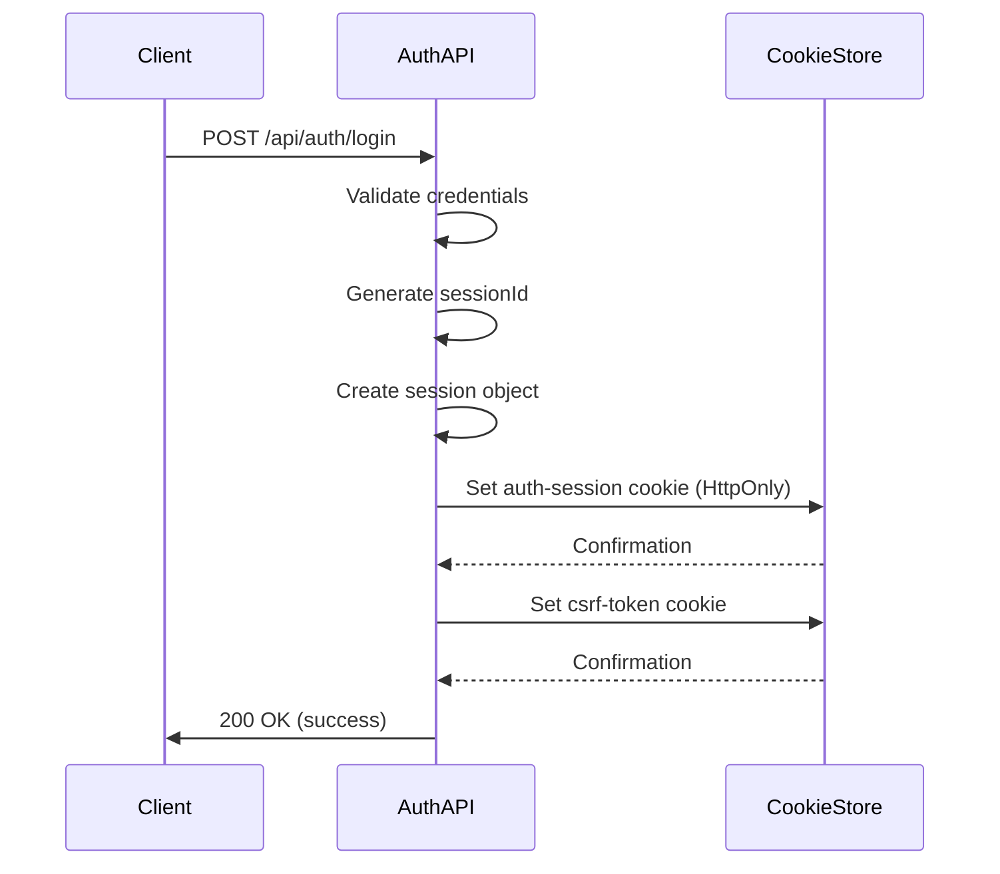
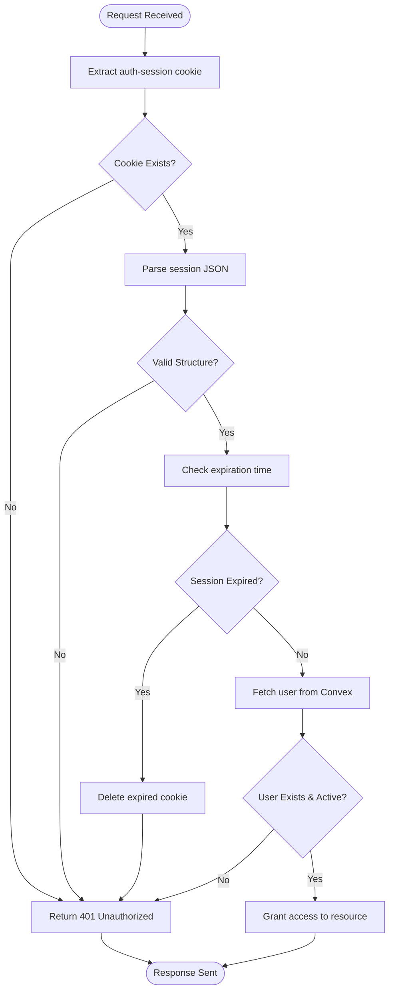
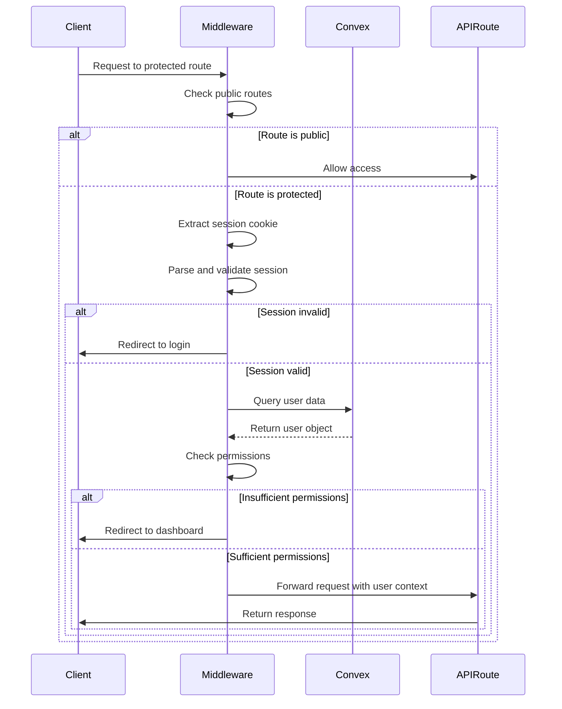
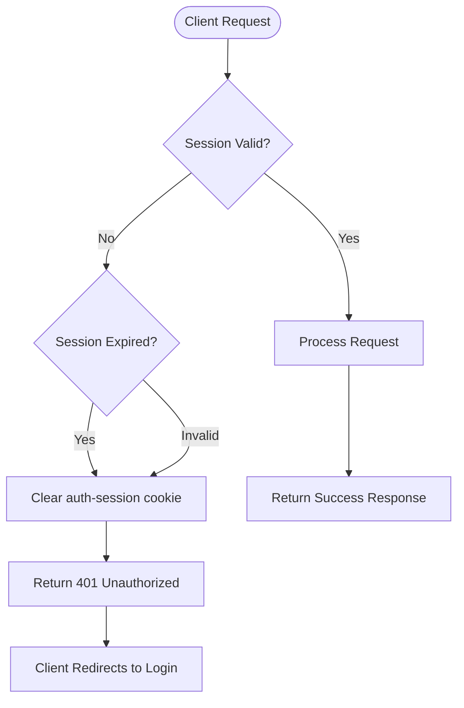
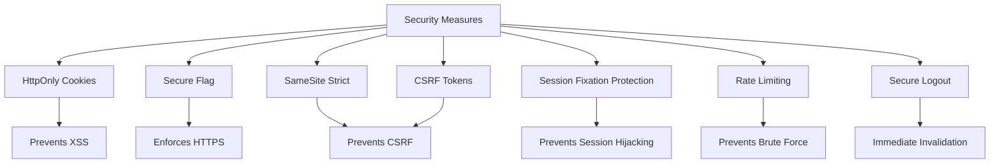

# Session Management

<cite>
**Referenced Files in This Document**   
- [session.ts](file://src/lib/auth/session.ts)
- [auth.ts](file://convex/auth.ts)
- [auth/login/route.ts](file://src/app/api/auth/login/route.ts)
- [auth/logout/route.ts](file://src/app/api/auth/logout/route.ts)
- [auth/session/route.ts](file://src/app/api/auth/session/route.ts)
- [csrf/route.ts](file://src/app/api/csrf/route.ts)
- [middleware.ts](file://src/middleware.ts)
- [get-user.ts](file://src/lib/auth/get-user.ts)
- [types/auth.ts](file://src/types/auth.ts)
</cite>

## Table of Contents

1. [Introduction](#introduction)
2. [JWT-Based Session Mechanism](#jwt-based-session-mechanism)
3. [Session Persistence with HTTP-Only Cookies](#session-persistence-with-http-only-cookies)
4. [Session Validation on Subsequent Requests](#session-validation-on-subsequent-requests)
5. [Next.js Middleware and Convex Authentication Integration](#nextjs-middleware-and-convex-authentication-integration)
6. [Session Refresh Logic and Expired Token Handling](#session-refresh-logic-and-expired-token-handling)
7. [Security Considerations](#security-considerations)
8. [Troubleshooting Common Session Issues](#troubleshooting-common-session-issues)
9. [Session Configuration and Remember-Me Functionality](#session-configuration-and-remember-me-functionality)

## Introduction

The PORTAL application implements a secure session management system using JWT-based authentication integrated with Convex backend services. This document details the architecture, implementation, and security aspects of the session management system, focusing on how user sessions are created, maintained, validated, and secured throughout the application lifecycle.

## JWT-Based Session Mechanism

### Token Structure

The session mechanism in PORTAL uses a JSON Web Token (JWT)-like structure stored in HTTP-only cookies. The session token contains essential user identification and expiration information:

- `sessionId`: Unique identifier for the session
- `userId`: Convex database ID of the authenticated user
- `expire`: ISO timestamp indicating when the session expires

This structure is defined in the `AuthSession` interface and serialized as a JSON string in the cookie value.

### Signing Strategy

While the system doesn't use standard JWT tokens with cryptographic signatures, it employs secure session management practices:

- Session tokens are generated server-side with cryptographically secure random values
- The session cookie is protected by being marked as HttpOnly and Secure
- Server-side validation ensures session integrity
- CSRF protection is implemented alongside session management

### Expiration Policies

The system implements flexible expiration policies based on user preferences:

- Standard sessions expire after 24 hours of inactivity
- "Remember me" sessions extend to 30 days
- Sessions are invalidated immediately upon logout
- Expired sessions are automatically cleared and require re-authentication

**Section sources**

- [session.ts](file://src/lib/auth/session.ts#L8-L12)
- [auth/login/route.ts](file://src/app/api/auth/login/route.ts#L92-L143)

## Session Persistence with HTTP-Only Cookies

### Cookie Implementation

Sessions are persisted using HTTP-only cookies to prevent client-side JavaScript access, mitigating XSS attack risks. The primary session cookie is named `auth-session` and includes the following attributes:

- `httpOnly: true`: Prevents access via JavaScript
- `secure: true` (in production): Ensures transmission over HTTPS only
- `sameSite: 'strict'`: Prevents CSRF attacks
- Appropriate `maxAge` based on remember-me preference
- `path: '/'`: Available across the entire application

### Cookie Security Attributes

The system enforces strict cookie security policies:

- **Secure**: Cookies are only sent over HTTPS in production environments
- **SameSite**: Strict mode prevents cross-site request forgery
- **HttpOnly**: Protects against XSS attacks by preventing JavaScript access
- **Path**: Scoped to root path for application-wide availability

### Session Creation Flow

When a user successfully authenticates:

1. A unique session ID is generated
2. Session data is serialized to JSON
3. The `auth-session` cookie is set with HttpOnly and other security attributes
4. A CSRF token cookie is also set for form protection

**Diagram sources**

- [auth/login/route.ts](file://src/app/api/auth/login/route.ts#L92-L143)
- [session.ts](file://src/lib/auth/session.ts#L1-L181)

**Section sources**

- [auth/login/route.ts](file://src/app/api/auth/login/route.ts#L92-L143)
- [session.ts](file://src/lib/auth/session.ts#L1-L181)

## Session Validation on Subsequent Requests

### Request Interception

The Next.js middleware intercepts all incoming requests to validate session state before allowing access to protected routes. This validation occurs for both API endpoints and page routes.

### Validation Process

The session validation process follows these steps:

1. Extract the `auth-session` cookie from the request
2. Parse the JSON session data
3. Validate the session structure (sessionId and userId present)
4. Check if the session has expired
5. Retrieve the associated user from Convex database
6. Verify user is active

### Validation Functions

Key validation functions include:

- `parseAuthSession()`: Safely parses and validates the session cookie structure
- `isSessionExpired()`: Determines if a session has passed its expiration time
- `getUserFromSession()`: Retrieves and returns the authenticated user associated with the session

**Diagram sources**

- [session.ts](file://src/lib/auth/session.ts#L26-L52)
- [middleware.ts](file://src/middleware.ts#L136-L214)

**Section sources**

- [session.ts](file://src/lib/auth/session.ts#L26-L52)
- [middleware.ts](file://src/middleware.ts#L136-L214)

## Next.js Middleware and Convex Authentication Integration

### Middleware Configuration

The session management system integrates tightly with Next.js middleware to protect routes and enforce authentication policies. The middleware configuration specifies which routes require authentication and which are publicly accessible.

### Route Protection Strategy

The system implements a comprehensive route protection strategy:

- Public routes: Login, authentication endpoints, health checks
- Protected API routes: All data endpoints requiring authentication
- Protected page routes: Dashboard and feature-specific routes

### Permission-Based Access Control

The middleware enforces role-based and permission-based access control:

- Users must have specific permissions to access certain routes
- Administrative routes require special permissions
- The system checks both role and permission requirements

### Integration Flow

**Diagram sources**

- [middleware.ts](file://src/middleware.ts#L11-L197)
- [auth.ts](file://convex/auth.ts#L9-L27)

**Section sources**

- [middleware.ts](file://src/middleware.ts#L11-L197)
- [auth.ts](file://convex/auth.ts#L9-L27)

## Session Refresh Logic and Expired Token Handling

### Session Expiration Detection

The system proactively detects and handles expired sessions through multiple mechanisms:

- Middleware checks expiration on every request to protected routes
- API endpoint `/api/auth/session` validates session state for client-side checks
- Client-side code can poll session status to provide seamless UX

### Automatic Cleanup

When an expired session is detected:

- The `auth-session` cookie is automatically deleted
- Subsequent requests will require re-authentication
- Users are redirected to the login page with appropriate messaging

### Client-Side Session Management

The system provides endpoints for client-side session management:

- `GET /api/auth/session`: Checks current session status
- Returns session validity and expiration time
- Allows client applications to update their authentication state

### Error Handling

The system implements consistent error handling for session-related issues:

- 401 Unauthorized responses for invalid or expired sessions
- Clear error messages to guide users
- Logging of session validation failures for monitoring

**Diagram sources**

- [auth/session/route.ts](file://src/app/api/auth/session/route.ts#L1-L64)
- [session.ts](file://src/lib/auth/session.ts#L45-L52)

**Section sources**

- [auth/session/route.ts](file://src/app/api/auth/session/route.ts#L1-L64)
- [session.ts](file://src/lib/auth/session.ts#L45-L52)

## Security Considerations

### Secure Cookie Attributes

The session management system implements multiple security measures through cookie attributes:

| Attribute | Production Value | Development Value | Purpose                    |
| --------- | ---------------- | ----------------- | -------------------------- |
| HttpOnly  | true             | true              | Prevents XSS attacks       |
| Secure    | true             | false             | Ensures HTTPS transmission |
| SameSite  | 'strict'         | 'strict'          | Prevents CSRF attacks      |
| maxAge    | 24-720 hours     | 24-720 hours      | Controls session duration  |

### Session Fixation Protection

The system protects against session fixation attacks by:

- Generating a new session ID on each successful login
- Using cryptographically secure random values for session IDs
- Not reusing previous session identifiers

### CSRF Mitigation

The system implements comprehensive CSRF protection:

- CSRF tokens are generated and stored in non-HttpOnly cookies
- Tokens are required for state-changing operations
- Constant-time comparison prevents timing attacks
- Tokens are validated on all protected API endpoints

### Additional Security Measures

- Rate limiting on authentication endpoints
- Logging of authentication events
- Immediate session invalidation on logout
- Secure handling of sensitive user data

**Diagram sources**

- [auth/login/route.ts](file://src/app/api/auth/login/route.ts#L92-L143)
- [csrf/route.ts](file://src/app/api/csrf/route.ts#L1-L42)
- [auth/logout/route.ts](file://src/app/api/auth/logout/route.ts#L1-L50)

**Section sources**

- [auth/login/route.ts](file://src/app/api/auth/login/route.ts#L92-L143)
- [csrf/route.ts](file://src/app/api/csrf/route.ts#L1-L42)
- [auth/logout/route.ts](file://src/app/api/auth/logout/route.ts#L1-L50)

## Troubleshooting Common Session Issues

### Unexpected Logouts

Unexpected logouts can occur due to:

- Session expiration (24 hours standard, 30 days with remember-me)
- Cookie clearance by browser or user
- Inconsistent domain or path settings
- Clock skew between client and server

**Troubleshooting Steps:**

1. Verify the `auth-session` cookie exists in browser storage
2. Check cookie expiration time
3. Confirm cookie attributes (HttpOnly, Secure, SameSite)
4. Ensure consistent domain usage
5. Verify server and client clocks are synchronized

### Invalid Session Errors

Invalid session errors typically indicate:

- Corrupted session data
- User account deactivation
- Server-side session validation failure

**Resolution:**

- Clear all application cookies and re-authenticate
- Verify user account status in the admin panel
- Check server logs for validation errors

### CSRF Token Issues

CSRF token problems may manifest as:

- Form submission failures
- 403 Forbidden responses
- Missing or invalid token errors

**Solutions:**

- Ensure CSRF token endpoint is accessible
- Verify token is included in request headers
- Check that CSRF cookie is not blocked

**Section sources**

- [auth/session/route.ts](file://src/app/api/auth/session/route.ts#L1-L64)
- [middleware.ts](file://src/middleware.ts#L136-L214)
- [get-user.ts](file://src/lib/auth/get-user.ts#L13-L47)

## Session Configuration and Remember-Me Functionality

### Session Timeout Configuration

The system allows configuration of session timeouts through:

- Environment variables for default values
- User preferences for remember-me functionality
- Route-specific timeout policies

The default session durations are:

- Standard session: 24 hours
- Remember-me session: 30 days

### Remember-Me Implementation

The remember-me functionality is implemented as follows:

- Users can opt-in during login
- Extended session duration (30 days vs 24 hours)
- Same security measures apply (HttpOnly, Secure, SameSite)
- Users can revoke remember-me sessions through account settings

### Configuration Management

Session configuration is managed through:

- Environment variables for security secrets
- Application settings for timeout policies
- Code-level configuration for route protections

The system validates configuration settings during startup and enforces secure defaults in development environments.

**Section sources**

- [auth/login/route.ts](file://src/app/api/auth/login/route.ts#L92-L143)
- [env-validation.ts](file://src/lib/env-validation.ts#L118-L142)
- [session.ts](file://src/lib/auth/session.ts#L1-L181)
