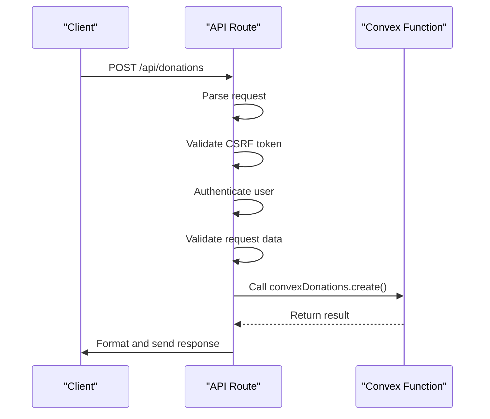
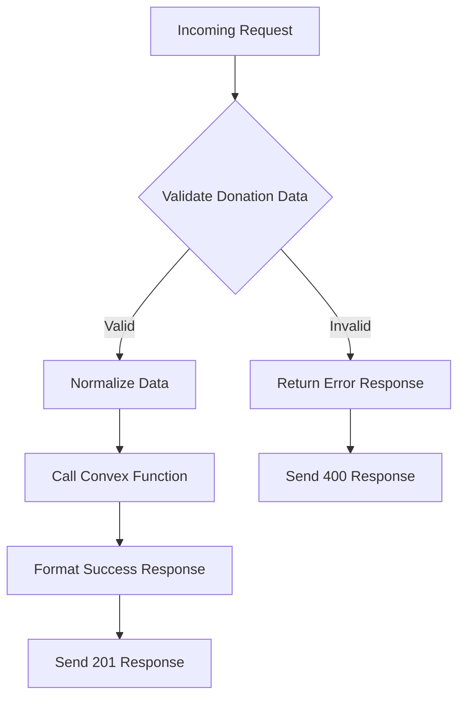
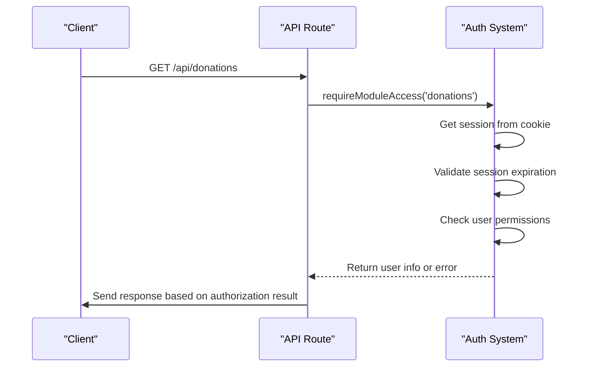
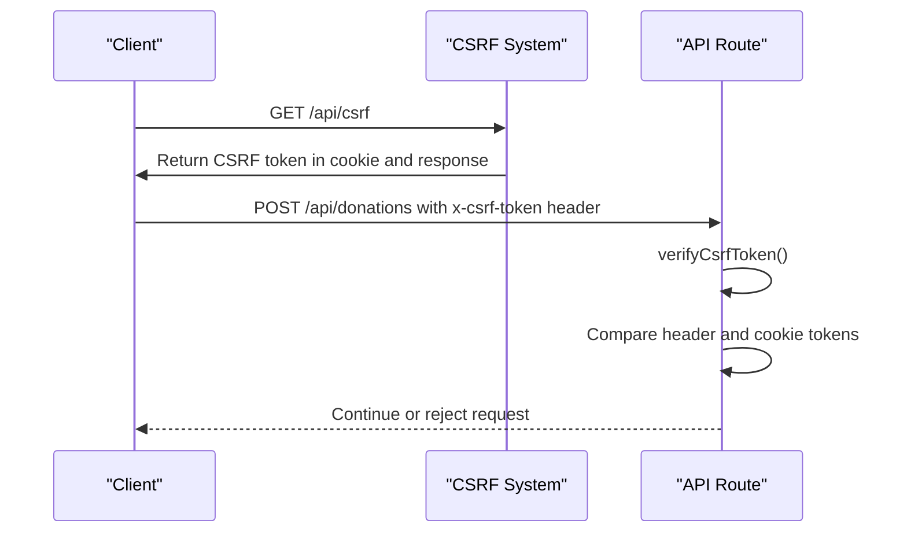
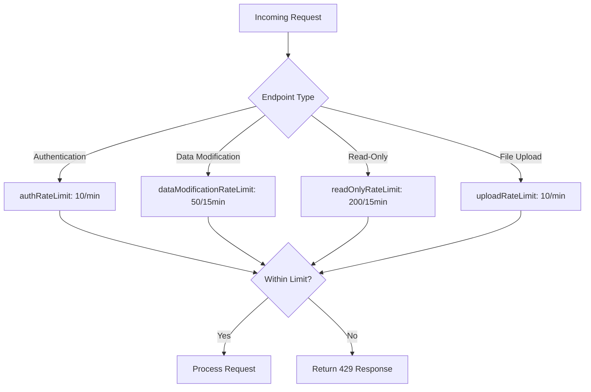
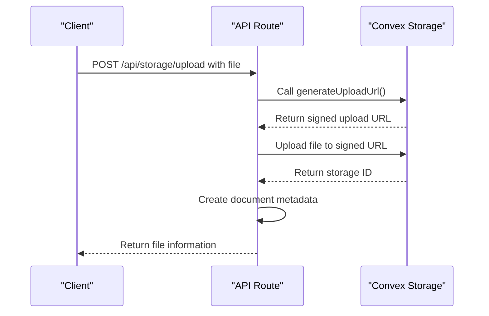
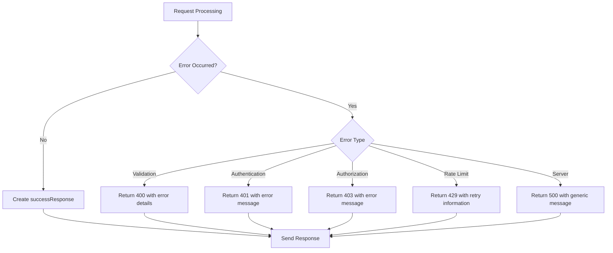
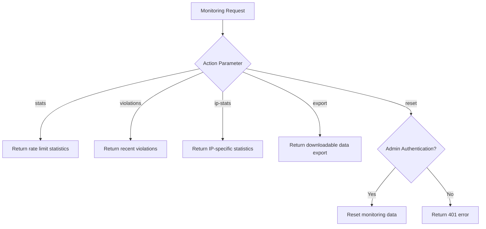

# API Routes and HTTP Adapters

<cite>
**Referenced Files in This Document**   
- [donations/route.ts](file://src/app/api/donations/route.ts)
- [auth/session/route.ts](file://src/app/api/auth/session/route.ts)
- [csrf/route.ts](file://src/app/api/csrf/route.ts)
- [monitoring/rate-limit/route.ts](file://src/app/api/monitoring/rate-limit/route.ts)
- [storage/upload/route.ts](file://src/app/api/storage/upload/route.ts)
- [route-helpers.ts](file://src/lib/api/route-helpers.ts)
- [auth-utils.ts](file://src/lib/api/auth-utils.ts)
- [rate-limit-config.ts](file://src/lib/rate-limit-config.ts)
- [rate-limit-monitor.ts](file://src/lib/rate-limit-monitor.ts)
- [server.ts](file://src/lib/convex/server.ts)
- [csrf.ts](file://src/lib/csrf.ts)
</cite>

## Table of Contents

1. [Introduction](#introduction)
2. [API Routes Structure](#api-routes-structure)
3. [HTTP to Convex Translation](#http-to-convex-translation)
4. [Request Validation with Zod](#request-validation-with-zod)
5. [Authentication and Authorization](#authentication-and-authorization)
6. [CSRF Protection](#csrf-protection)
7. [Rate Limiting](#rate-limiting)
8. [File Upload Handling](#file-upload-handling)
9. [Error Handling and Response Formatting](#error-handling-and-response-formatting)
10. [API Versioning and Monitoring](#api-versioning-and-monitoring)
11. [Best Practices](#best-practices)

## Introduction

The API routes layer in PORTAL serves as the HTTP adapter between RESTful clients and Convex backend functions. This layer translates incoming HTTP requests into Convex function calls, handling request parsing, validation, authentication, and response formatting. Built using Next.js App Router conventions, the API routes provide a clean separation between HTTP concerns and business logic, enabling a robust and maintainable architecture.

**Section sources**

- [donations/route.ts](file://src/app/api/donations/route.ts)

## API Routes Structure

The API routes follow Next.js App Router conventions with a modular structure organized by domain entities. Each route directory corresponds to a specific domain (e.g., donations, beneficiaries, users) and contains route handlers for different HTTP methods. Dynamic routes are implemented using bracket notation (e.g., [id]) for parameterized endpoints.

The structure enables clear separation of concerns, with each route handler focusing on HTTP-specific concerns while delegating business logic to Convex functions. This approach ensures consistency across the API surface while maintaining flexibility for domain-specific requirements.

```mermaid
graph TB
A[API Routes] --> B[donations/]
A --> C[beneficiaries/]
A --> D[users/]
A --> E[auth/]
A --> F[storage/]
A --> G[monitoring/]
B --> H[route.ts]
B --> I[[id]/route.ts]
E --> J[session/route.ts]
E --> K[login/route.ts]
F --> L[upload/route.ts]
G --> M[rate-limit/route.ts]
```

**Diagram sources**

- [donations/route.ts](file://src/app/api/donations/route.ts)
- [auth/session/route.ts](file://src/app/api/auth/session/route.ts)
- [storage/upload/route.ts](file://src/app/api/storage/upload/route.ts)
- [monitoring/rate-limit/route.ts](file://src/app/api/monitoring/rate-limit/route.ts)

**Section sources**

- [donations/route.ts](file://src/app/api/donations/route.ts)
- [auth/session/route.ts](file://src/app/api/auth/session/route.ts)

## HTTP to Convex Translation

API routes act as adapters that translate RESTful HTTP requests into Convex function calls. The translation process involves several steps: request parsing, authentication, validation, Convex function invocation, and response formatting. The `getConvexHttp()` function from `src/lib/convex/server.ts` provides access to the Convex HTTP client, enabling server-side function calls.

For example, when handling a POST request to `/api/donations`, the route parses the request body, validates the data, authenticates the user, and then calls the corresponding Convex mutation through the Convex HTTP client. This pattern ensures that all business logic remains encapsulated within Convex functions while the API routes handle HTTP-specific concerns.



**Diagram sources**

- [donations/route.ts](file://src/app/api/donations/route.ts)
- [server.ts](file://src/lib/convex/server.ts)

**Section sources**

- [donations/route.ts](file://src/app/api/donations/route.ts)
- [server.ts](file://src/lib/convex/server.ts)

## Request Validation with Zod

The API routes implement comprehensive request validation to ensure data integrity and security. While the codebase does not explicitly use Zod, it implements a similar validation pattern through custom validation functions. The validation process occurs before any business logic execution, preventing invalid data from reaching the Convex functions.

In the donations route, the `validateDonation` function performs several checks on the incoming data, including required fields, data types, and business rules. The validation function returns both a success indicator and detailed error messages, enabling clients to understand and correct submission issues.



**Diagram sources**

- [donations/route.ts](file://src/app/api/donations/route.ts)

**Section sources**

- [donations/route.ts](file://src/app/api/donations/route.ts)

## Authentication and Authorization

The API routes implement a robust authentication and authorization system to protect sensitive operations. Authentication is handled through session cookies, with the `auth/session` route providing a mechanism to check the current authentication state. The session information is stored in an encrypted cookie containing the user ID and expiration timestamp.

Authorization is implemented through role-based and permission-based access control. The `requireModuleAccess` function in `auth-utils.ts` checks whether the authenticated user has the necessary permissions to access a specific module. This function throws an `ApiAuthError` if the user lacks the required permissions, which is then translated into an appropriate HTTP response.



**Diagram sources**

- [donations/route.ts](file://src/app/api/donations/route.ts)
- [auth-utils.ts](file://src/lib/api/auth-utils.ts)
- [auth/session/route.ts](file://src/app/api/auth/session/route.ts)

**Section sources**

- [donations/route.ts](file://src/app/api/donations/route.ts)
- [auth-utils.ts](file://src/lib/api/auth-utils.ts)
- [auth/session/route.ts](file://src/app/api/auth/session/route.ts)

## CSRF Protection

The API routes implement CSRF (Cross-Site Request Forgery) protection to prevent unauthorized state-changing operations. The CSRF protection mechanism uses a synchronizer token pattern, where a unique token is generated and stored in a cookie, then required in a request header for state-changing operations.

The `/api/csrf` endpoint generates and returns a CSRF token, which clients must include in the `x-csrf-token` header for POST, PUT, PATCH, and DELETE requests. The `verifyCsrfToken` function in `auth-utils.ts` validates that the token in the header matches the token in the cookie, using constant-time comparison to prevent timing attacks.



**Diagram sources**

- [csrf/route.ts](file://src/app/api/csrf/route.ts)
- [csrf.ts](file://src/lib/csrf.ts)
- [auth-utils.ts](file://src/lib/api/auth-utils.ts)

**Section sources**

- [csrf/route.ts](file://src/app/api/csrf/route.ts)
- [csrf.ts](file://src/lib/csrf.ts)
- [auth-utils.ts](file://src/lib/api/auth-utils.ts)

## Rate Limiting

The API routes implement rate limiting to protect against abuse and ensure system stability. The rate limiting system uses a configurable approach with different limits for different types of endpoints. Authentication endpoints have stricter limits, while read-only endpoints have more generous limits.

The rate limiting configuration is defined in `rate-limit-config.ts`, with different rate limit functions for authentication, data modification, read-only operations, and file uploads. The system tracks violations and provides monitoring capabilities through the `/api/monitoring/rate-limit` endpoint, which can return statistics, recent violations, and IP-specific information.



**Diagram sources**

- [rate-limit-config.ts](file://src/lib/rate-limit-config.ts)
- [monitoring/rate-limit/route.ts](file://src/app/api/monitoring/rate-limit/route.ts)

**Section sources**

- [rate-limit-config.ts](file://src/lib/rate-limit-config.ts)
- [monitoring/rate-limit/route.ts](file://src/app/api/monitoring/rate-limit/route.ts)

## File Upload Handling

The file upload system provides a secure and efficient mechanism for handling file uploads through the `/api/storage/upload` endpoint. The process follows a two-step approach: first generating an upload URL from Convex, then uploading the file directly to Convex's storage service.

This approach minimizes server load by avoiding direct file processing on the Next.js server. After successful upload, the system creates metadata records in the database, linking the stored file to relevant entities such as beneficiaries. The upload endpoint includes validation for file size (maximum 10MB) and file type (images, PDFs, and Office documents).



**Diagram sources**

- [storage/upload/route.ts](file://src/app/api/storage/upload/route.ts)
- [storage.ts](file://convex/storage.ts)

**Section sources**

- [storage/upload/route.ts](file://src/app/api/storage/upload/route.ts)

## Error Handling and Response Formatting

The API routes implement a consistent error handling and response formatting strategy across all endpoints. The `route-helpers.ts` file provides utility functions for creating standardized success and error responses, ensuring a uniform API interface.

Error responses include a success flag, error message, and optional details, while success responses include the success flag, data, and optional message. The system distinguishes between different error types, including validation errors, authentication errors, and server errors, returning appropriate HTTP status codes (400 for validation, 401 for authentication, 403 for authorization, 429 for rate limiting, and 500 for server errors).



**Diagram sources**

- [route-helpers.ts](file://src/lib/api/route-helpers.ts)
- [donations/route.ts](file://src/app/api/donations/route.ts)

**Section sources**

- [route-helpers.ts](file://src/lib/api/route-helpers.ts)
- [donations/route.ts](file://src/app/api/donations/route.ts)

## API Versioning and Monitoring

The API routes are designed with versioning and monitoring in mind, though explicit versioning is not currently implemented in the codebase. The modular structure supports future versioning by allowing new versions to be added as separate route directories (e.g., v1/donations, v2/donations).

Monitoring is implemented through the `/api/monitoring/rate-limit` endpoint, which provides comprehensive insights into rate limiting behavior. The endpoint supports various actions including retrieving statistics, recent violations, IP-specific information, and exporting data. Administrators can also reset monitoring data with appropriate authentication.



**Diagram sources**

- [monitoring/rate-limit/route.ts](file://src/app/api/monitoring/rate-limit/route.ts)
- [rate-limit-monitor.ts](file://src/lib/rate-limit-monitor.ts)

**Section sources**

- [monitoring/rate-limit/route.ts](file://src/app/api/monitoring/rate-limit/route.ts)
- [rate-limit-monitor.ts](file://src/lib/rate-limit-monitor.ts)

## Best Practices

The API routes implementation follows several best practices for building robust and maintainable HTTP adapters:

1. **Separation of Concerns**: Clear separation between HTTP handling (routes) and business logic (Convex functions)
2. **Consistent Error Handling**: Standardized error responses across all endpoints
3. **Security First**: Implementation of CSRF protection, rate limiting, and proper authentication/authorization
4. **Performance Optimization**: Direct file uploads to Convex storage to minimize server load
5. **Type Safety**: Use of TypeScript for type checking and IDE support
6. **Monitoring and Observability**: Comprehensive rate limit monitoring with export capabilities
7. **Configurable Limits**: Rate limiting configuration that can be adjusted based on environment and requirements

These practices ensure that the API routes layer is secure, performant, and maintainable, providing a reliable interface between clients and the Convex backend.

**Section sources**

- [donations/route.ts](file://src/app/api/donations/route.ts)
- [rate-limit-config.ts](file://src/lib/rate-limit-config.ts)
- [route-helpers.ts](file://src/lib/api/route-helpers.ts)
