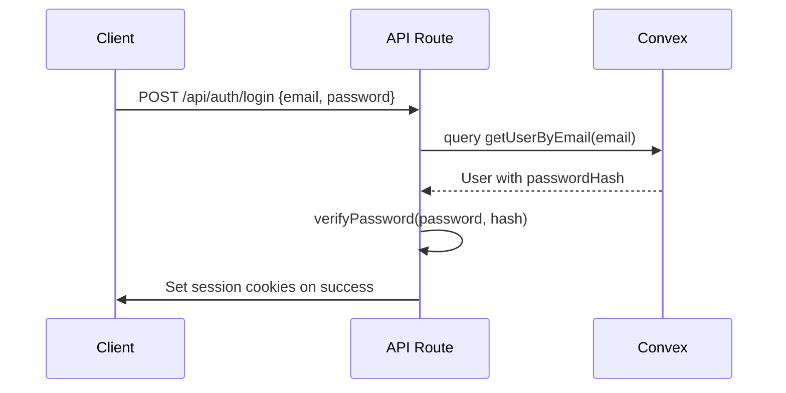
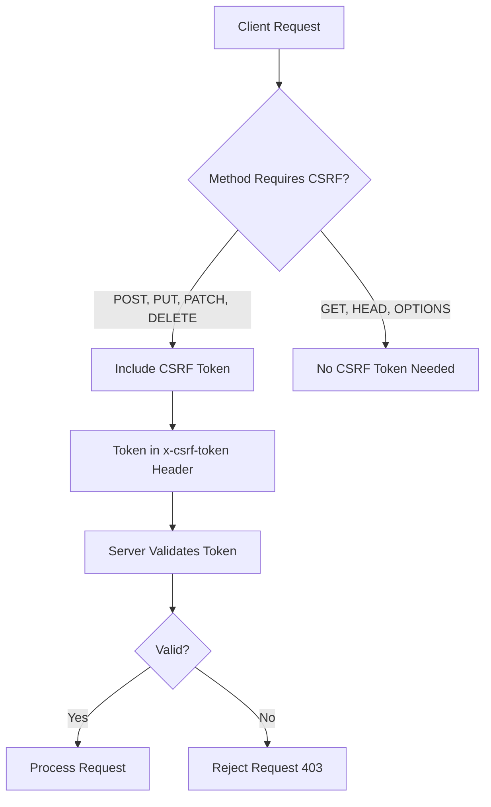
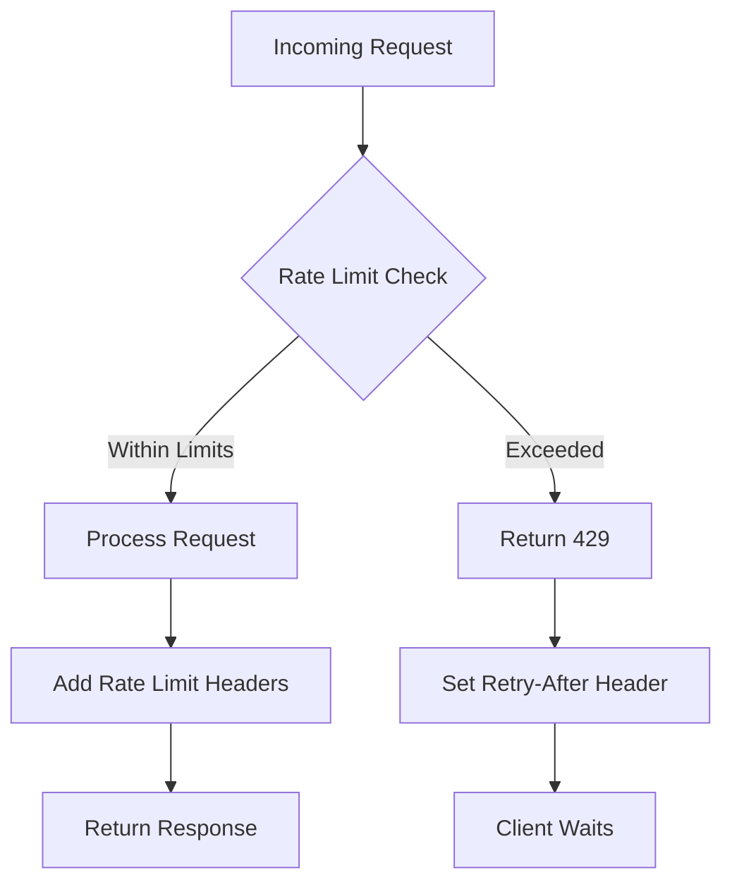
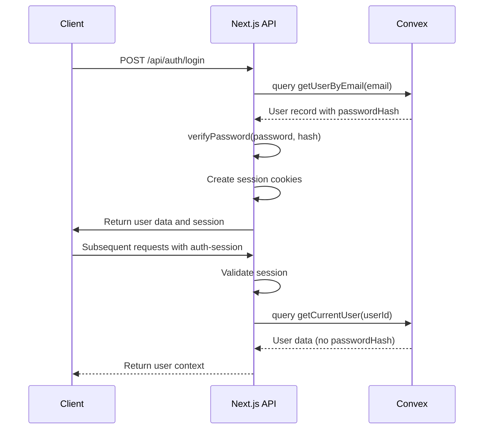

# Authentication API Endpoints

<cite>
**Referenced Files in This Document**   
- [login/route.ts](file://src/app/api/auth/login/route.ts)
- [logout/route.ts](file://src/app/api/auth/logout/route.ts)
- [session/route.ts](file://src/app/api/auth/session/route.ts)
- [auth.ts](file://convex/auth.ts)
- [password.ts](file://src/lib/auth/password.ts)
- [session.ts](file://src/lib/auth/session.ts)
- [csrf.ts](file://src/lib/csrf.ts)
- [rate-limit.ts](file://src/lib/rate-limit.ts)
- [rate-limit-config.ts](file://src/lib/rate-limit-config.ts)
- [auth.ts](file://src/types/auth.ts)
</cite>

## Table of Contents

1. [Introduction](#introduction)
2. [Authentication Endpoints](#authentication-endpoints)
   - [POST /api/auth/login](#post-apiauthlogin)
   - [GET /api/auth/session](#get-apiauthsession)
   - [POST /api/auth/logout](#post-apiauthlogout)
3. [Security Considerations](#security-considerations)
   - [Password Hashing](#password-hashing)
   - [CSRF Protection](#csrf-protection)
   - [Secure Cookie Handling](#secure-cookie-handling)
   - [Rate Limiting](#rate-limiting)
4. [Error Responses](#error-responses)
5. [Client-Side Integration](#client-side-integration)
6. [Convex Authentication Integration](#convex-authentication-integration)

## Introduction

The PORTAL application provides a secure authentication system with three primary endpoints: login, session validation, and logout. These endpoints handle user authentication state using session cookies, CSRF tokens, and integration with the Convex backend for user data storage and retrieval. The system implements multiple security measures including password hashing, CSRF protection, secure cookie policies, and rate limiting to protect against common web vulnerabilities.

**Section sources**

- [login/route.ts](file://src/app/api/auth/login/route.ts)
- [logout/route.ts](file://src/app/api/auth/logout/route.ts)
- [session/route.ts](file://src/app/api/auth/session/route.ts)

## Authentication Endpoints

### POST /api/auth/login

Handles user authentication by validating credentials and establishing a session.

**Request**

- **Method**: POST
- **Endpoint**: `/api/auth/login`
- **Content-Type**: `application/json`

**Request Body Schema**

```json
{
  "email": "string",
  "password": "string",
  "rememberMe": "boolean (optional)"
}
```

**CSRF Token Requirement**
The endpoint itself does not require a CSRF token for login (as it's a stateless authentication operation), but the system generates a CSRF token upon successful login for subsequent state-changing operations.

**Session Creation**
Upon successful authentication:

1. A session cookie named `auth-session` is created with:
   - HttpOnly flag enabled
   - Secure flag enabled in production
   - SameSite=strict
   - Max-Age based on rememberMe flag (30 days if true, 24 hours if false)
2. A CSRF token cookie named `csrf-token` is created for subsequent requests
3. Session includes sessionId, userId, and expiration time

**Response Format**

```json
{
  "success": true,
  "data": {
    "user": {
      "id": "string",
      "email": "string",
      "name": "string",
      "role": "string",
      "permissions": ["string"],
      "isActive": "boolean",
      "createdAt": "string",
      "updatedAt": "string",
      "phone": "string",
      "labels": ["string"]
    },
    "session": {
      "sessionId": "string",
      "expire": "string (ISO date)"
    }
  }
}
```

**Section sources**

- [login/route.ts](file://src/app/api/auth/login/route.ts)
- [auth.ts](file://convex/auth.ts)
- [password.ts](file://src/lib/auth/password.ts)

### GET /api/auth/session

Validates the current authentication session and retrieves user context.

**Authentication Method**

- Uses the `auth-session` cookie for authentication
- No additional headers required

**Response Structure**

```json
{
  "success": true,
  "data": {
    "userId": "string",
    "expiresAt": "string (ISO date)"
  }
}
```

The endpoint validates the session by:

1. Checking for the presence of the `auth-session` cookie
2. Parsing the session data from the cookie
3. Verifying the session expiration time
4. Returning basic session information without sensitive data

**Section sources**

- [session/route.ts](file://src/app/api/auth/session/route.ts)
- [session.ts](file://src/lib/auth/session.ts)

### POST /api/auth/logout

Invalidates the current authentication session.

**Functionality**

- Clears both `auth-session` and `csrf-token` cookies
- Sets cookie maxAge to 0 (immediate expiration)
- Returns success response regardless of cookie presence
- Implements error handling to ensure cookies are cleared even if errors occur

**Response Format**

```json
{
  "success": true,
  "message": "Başarıyla çıkış yapıldı"
}
```

**Section sources**

- [logout/route.ts](file://src/app/api/auth/logout/route.ts)

## Security Considerations

### Password Hashing

The system uses bcryptjs for secure password hashing with the following configuration:

- Salt rounds: 12 (higher than default for increased security)
- Password validation includes requirements for:
  - Minimum 8 characters
  - Maximum 128 characters
  - At least one number
  - At least one letter

Password verification occurs server-side in the Next.js API route, not in Convex, as bcrypt cannot run in the Convex environment due to native module restrictions.



**Diagram sources**

- [login/route.ts](file://src/app/api/auth/login/route.ts)
- [password.ts](file://src/lib/auth/password.ts)
- [auth.ts](file://convex/auth.ts)

### CSRF Protection

The system implements CSRF protection using token-based validation:

**Mechanism**

- CSRF token generated using cryptographically secure random bytes (32 bytes)
- Token stored in a non-HttpOnly cookie (`csrf-token`)
- Token must be included in the `x-csrf-token` header for state-changing operations
- Constant-time comparison to prevent timing attacks

**Token Generation**

- Generated during login process
- Valid for 24 hours
- Regenerated on each login



**Diagram sources**

- [csrf.ts](file://src/lib/csrf.ts)
- [login/route.ts](file://src/app/api/auth/login/route.ts)

### Secure Cookie Handling

The authentication system implements secure cookie practices:

**Session Cookie (`auth-session`)**

- HttpOnly: true (prevents client-side JavaScript access)
- Secure: true in production (HTTPS only)
- SameSite: strict (prevents CSRF)
- Path: / (available across entire domain)
- Max-Age: 24 hours (7 days if rememberMe)

**CSRF Token Cookie (`csrf-token`)**

- HttpOnly: false (accessible to client-side JavaScript)
- Secure: true in production (HTTPS only)
- SameSite: strict
- Path: /

**Section sources**

- [login/route.ts](file://src/app/api/auth/login/route.ts)
- [logout/route.ts](file://src/app/api/auth/logout/route.ts)

### Rate Limiting

The authentication endpoints are protected by rate limiting to prevent brute force attacks.

**Configuration**

- **Endpoint Pattern**: `/api/auth/`
- **Max Requests**: 10 attempts per 10 minutes (configurable via environment variables)
- **Skip Counting**: Both successful and failed requests are excluded from rate limit counting
- **Headers**: Returns standard rate limit headers (`X-RateLimit-Remaining`, `X-RateLimit-Reset`, `Retry-After`)

**Implementation**
The rate limiting is applied using a middleware wrapper that:

1. Identifies the client by IP address and request details
2. Checks the rate limit using a sliding window algorithm
3. Returns 429 Too Many Requests if limit is exceeded
4. Adds rate limit headers to all responses



**Diagram sources**

- [rate-limit.ts](file://src/lib/rate-limit.ts)
- [rate-limit-config.ts](file://src/lib/rate-limit-config.ts)

## Error Responses

The authentication endpoints return standardized error responses:

**401 Unauthorized**

- When credentials are invalid
- When no active session exists
- Response: `{ success: false, error: "Geçersiz email veya şifre" }`

**403 Forbidden**

- When account is inactive
- Response: `{ success: false, error: "Hesap aktif değil" }`

**429 Too Many Requests**

- When rate limit is exceeded
- Response includes `Retry-After` header
- Response: `{ success: false, error: "Çok fazla istek gönderdiniz. Lütfen biraz bekleyin.", retryAfter: seconds }`

**500 Internal Server Error**

- When unexpected errors occur
- Generic error message returned for security

**Section sources**

- [login/route.ts](file://src/app/api/auth/login/route.ts)
- [session/route.ts](file://src/app/api/auth/session/route.ts)
- [rate-limit.ts](file://src/lib/rate-limit.ts)

## Client-Side Integration

Example implementations for client-side authentication flows:

### Using fetch with CSRF

```javascript
// Login function
async function login(email, password, rememberMe = false) {
  const response = await fetch('/api/auth/login', {
    method: 'POST',
    headers: {
      'Content-Type': 'application/json',
    },
    body: JSON.stringify({ email, password, rememberMe }),
  });

  if (response.ok) {
    const data = await response.json();
    // Store user data in application state
    return data;
  }

  throw new Error(await response.json());
}

// API call with CSRF token
async function fetchWithCsrf(url, options = {}) {
  const csrfToken = getCsrfTokenFromCookie();

  const headers = new Headers(options.headers);
  if (csrfToken && ['POST', 'PUT', 'PATCH', 'DELETE'].includes(options.method || 'GET')) {
    headers.set('x-csrf-token', csrfToken);
  }

  return fetch(url, {
    ...options,
    headers,
  });
}
```

### Using Axios with Interceptors

```javascript
import axios from 'axios';

const apiClient = axios.create({
  baseURL: '/api',
  withCredentials: true,
});

// Request interceptor to add CSRF token
apiClient.interceptors.request.use((config) => {
  const csrfToken = getCsrfTokenFromCookie();
  if (csrfToken && ['post', 'put', 'patch', 'delete'].includes(config.method)) {
    config.headers['x-csrf-token'] = csrfToken;
  }
  return config;
});

// Response interceptor for error handling
apiClient.interceptors.response.use(
  (response) => response,
  (error) => {
    if (error.response?.status === 401) {
      // Handle unauthorized - redirect to login
      window.location.href = '/login';
    }
    return Promise.reject(error);
  }
);
```

**Section sources**

- [csrf.ts](file://src/lib/csrf.ts)
- [login/route.ts](file://src/app/api/auth/login/route.ts)

## Convex Authentication Integration

The authentication system integrates with Convex for user data storage and retrieval:

**Architecture**

- User data stored in Convex `users` collection
- Password hashes stored in Convex but verified in Next.js
- Authentication state managed in Next.js API routes
- Session state stored in HTTP-only cookies

**Key Functions**

- `getUserByEmail`: Convex query to retrieve user by email (including password hash)
- `updateLastLogin`: Convex mutation to update user's last login timestamp
- `getCurrentUser`: Convex query to retrieve user by ID (excluding password hash)

**Data Flow**

1. Client submits credentials to `/api/auth/login`
2. API route queries Convex for user by email
3. Password verification occurs in Next.js runtime
4. Session established with cookies
5. Subsequent requests validated against session cookie



**Diagram sources**

- [auth.ts](file://convex/auth.ts)
- [login/route.ts](file://src/app/api/auth/login/route.ts)
- [session.ts](file://src/lib/auth/session.ts)
