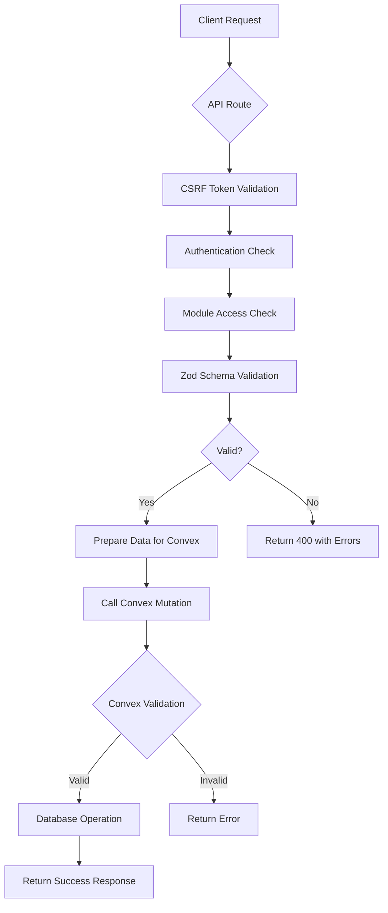
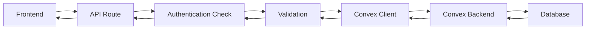

# CRUD Operations API

<cite>
**Referenced Files in This Document**   
- [beneficiaries.ts](file://convex/beneficiaries.ts)
- [donations.ts](file://convex/donations.ts)
- [tasks.ts](file://convex/tasks.ts)
- [meetings.ts](file://convex/meetings.ts)
- [aid_applications.ts](file://convex/aid_applications.ts)
- [beneficiary.ts](file://src/lib/validations/beneficiary.ts)
- [task.ts](file://src/lib/validations/task.ts)
- [meeting.ts](file://src/lib/validations/meeting.ts)
- [aid-application.ts](file://src/lib/validations/aid-application.ts)
- [beneficiaries/route.ts](file://src/app/api/beneficiaries/route.ts)
- [donations/route.ts](file://src/app/api/donations/route.ts)
- [tasks/route.ts](file://src/app/api/tasks/route.ts)
- [meetings/route.ts](file://src/app/api/meetings/route.ts)
- [aid-applications/route.ts](file://src/app/api/aid-applications/route.ts)
</cite>

## Table of Contents

1. [Introduction](#introduction)
2. [API Overview](#api-overview)
3. [Beneficiaries CRUD](#beneficiaries-crud)
4. [Donations CRUD](#donations-crud)
5. [Tasks CRUD](#tasks-crud)
6. [Meetings CRUD](#meetings-crud)
7. [Aid Applications CRUD](#aid-applications-crud)
8. [Validation System](#validation-system)
9. [Error Handling](#error-handling)
10. [Data Persistence](#data-persistence)

## Introduction

This document provides comprehensive API documentation for the core CRUD (Create, Read, Update, Delete) operations in the PORTAL system. The API endpoints follow RESTful patterns and are implemented for five key entities: beneficiaries, donations, tasks, meetings, and aid-applications. Each endpoint is secured with authentication and authorization, implements comprehensive validation using Zod schemas, and integrates with Convex for data persistence. The API supports pagination, filtering, and proper error handling to ensure robust and reliable operations.

## API Overview

The PORTAL system implements a RESTful API architecture with standardized patterns across all entities. Each resource follows the same URL structure and HTTP method conventions:

- **GET /api/{resource}**: List resources with pagination and filtering
- **POST /api/{resource}**: Create a new resource with validation
- **GET /api/{resource}/{id}**: Retrieve a specific resource by ID
- **PUT/PATCH /api/{resource}/{id}**: Update an existing resource
- **DELETE /api/{resource}/{id}**: Delete a resource

All endpoints require authentication and appropriate module access. The API uses JSON for request and response payloads, with consistent response formats that include success status, data, and error information. The system implements CSRF protection for write operations and comprehensive logging for all requests.

**Section sources**

- [beneficiaries/route.ts](file://src/app/api/beneficiaries/route.ts)
- [donations/route.ts](file://src/app/api/donations/route.ts)
- [tasks/route.ts](file://src/app/api/tasks/route.ts)
- [meetings/route.ts](file://src/app/api/meetings/route.ts)
- [aid-applications/route.ts](file://src/app/api/aid-applications/route.ts)

## Beneficiaries CRUD

The beneficiaries API provides comprehensive management of beneficiary records, which are central to the PORTAL system. The API supports full CRUD operations with extensive validation and filtering capabilities.

### GET /api/beneficiaries

Retrieves a paginated list of beneficiaries with optional filtering by status, city, or search term. The endpoint supports cursor-based pagination through limit and skip parameters.

**Query Parameters:**

- `limit` (number): Number of records to return (default: 50)
- `skip` (number): Number of records to skip (for pagination)
- `status` (string): Filter by beneficiary status (TASLAK, AKTIF, PASIF, SILINDI)
- `city` (string): Filter by city
- `search` (string): Search term for full-text search on beneficiary name

**Response Schema:**

```json
{
  "success": true,
  "data": [
    {
      "_id": "string",
      "name": "string",
      "tc_no": "string",
      "phone": "string",
      "email": "string",
      "status": "TASLAK|AKTIF|PASIF|SILINDI",
      "city": "string",
      "district": "string",
      "neighborhood": "string",
      "family_size": "number"
      // ... other fields
    }
  ],
  "total": "number",
  "message": "string"
}
```

### POST /api/beneficiaries

Creates a new beneficiary record with comprehensive validation. The endpoint requires CSRF token verification and module access.

**Request Body Schema:**

- `name` (string, required): Beneficiary's full name (min 2 characters)
- `tc_no` (string, required): Turkish ID number (11 digits, validated with algorithm)
- `phone` (string, required): Phone number (10-15 digits)
- `address` (string, required): Address (min 10 characters)
- `email` (string, optional): Valid email address
- `status` (string, optional): Status (TASLAK, AKTIF, PASIF, SILINDI)
- `city` (string, optional): City
- `district` (string, optional): District
- `neighborhood` (string, optional): Neighborhood
- `family_size` (number, optional): Family size
- Various additional fields for comprehensive beneficiary information

**Validation:** The endpoint implements server-side validation that checks:

- Required fields are present and meet minimum length requirements
- TC number is 11 digits and passes the official validation algorithm
- Phone number format is valid
- Email format is valid (if provided)
- Status value is one of the allowed options

**Response:** Returns HTTP 201 on success with the created beneficiary object, or HTTP 400 with validation errors, HTTP 409 if the TC number already exists, or HTTP 500 for server errors.

**Section sources**

- [beneficiaries/route.ts](file://src/app/api/beneficiaries/route.ts#L82-L248)
- [beneficiaries.ts](file://convex/beneficiaries.ts#L7-L229)

## Donations CRUD

The donations API manages donation records, tracking contributions from donors to the organization. The system supports various donation types and payment methods.

### GET /api/donations

Retrieves a paginated list of donations with filtering capabilities.

**Query Parameters:**

- `limit` (number): Number of records to return (default: 50)
- `skip` (number): Number of records to skip
- `status` (string): Filter by donation status (pending, completed, cancelled)
- `donor_email` (string): Filter by donor email
- `is_kumbara` (boolean): Filter by kumbara (piggy bank) donations

**Response Schema:**

```json
{
  "success": true,
  "data": [
    {
      "_id": "string",
      "donor_name": "string",
      "donor_phone": "string",
      "donor_email": "string",
      "amount": "number",
      "currency": "TRY|USD|EUR",
      "donation_type": "string",
      "payment_method": "string",
      "donation_purpose": "string",
      "status": "pending|completed|cancelled",
      "receipt_number": "string"
      // ... other fields
    }
  ],
  "total": "number"
}
```

### POST /api/donations

Creates a new donation record with validation.

**Request Body Schema:**

- `donor_name` (string, required): Donor's name (min 2 characters)
- `amount` (number, required): Donation amount (positive)
- `currency` (string, required): Currency (TRY, USD, EUR)
- `donor_email` (string, optional): Donor's email (valid format)
- `donor_phone` (string, optional): Donor's phone number
- `status` (string, optional): Donation status (default: pending)
- Various other fields for donation details

**Validation:** The endpoint validates:

- Donor name meets minimum length
- Amount is positive
- Currency is one of the allowed values
- Email and phone formats are valid (if provided)

**Response:** Returns HTTP 201 on success, HTTP 400 for validation errors, or HTTP 500 for server errors.

**Section sources**

- [donations/route.ts](file://src/app/api/donations/route.ts#L50-L148)
- [donations.ts](file://convex/donations.ts#L4-L149)

## Tasks CRUD

The tasks API manages workflow tasks within the organization, enabling assignment, tracking, and completion of work items.

### GET /api/tasks

Retrieves a paginated list of tasks with filtering by status, assignee, or creator.

**Query Parameters:**

- `limit` (number): Number of records to return (default: 50)
- `skip` (number): Number of records to skip
- `status` (string): Filter by task status (pending, in_progress, completed, cancelled)
- `assigned_to` (string): Filter by assignee user ID
- `created_by` (string): Filter by creator user ID

**Response Schema:**

```json
{
  "success": true,
  "data": [
    {
      "_id": "string",
      "title": "string",
      "description": "string",
      "assigned_to": "string",
      "created_by": "string",
      "priority": "low|normal|high|urgent",
      "status": "pending|in_progress|completed|cancelled",
      "due_date": "string",
      "category": "string",
      "tags": ["string"],
      "is_read": "boolean"
    }
  ],
  "total": "number"
}
```

### POST /api/tasks

Creates a new task with validation.

**Request Body Schema:**

- `title` (string, required): Task title (min 3 characters)
- `description` (string, optional): Task description
- `assigned_to` (string, optional): User ID of assignee
- `created_by` (string, required): User ID of creator
- `priority` (string, required): Priority level (low, normal, high, urgent)
- `status` (string, required): Initial status (pending, in_progress, completed, cancelled)
- `due_date` (string, optional): Due date (ISO 8601 format)
- `category` (string, optional): Task category
- `tags` (array, optional): Array of string tags (max 10, no duplicates)
- `is_read` (boolean, required): Read status

**Validation:** The endpoint validates:

- Title meets minimum length
- Priority and status are valid values
- Tags are unique and meet format requirements
- Due date is today or in the future (if provided)

**Response:** Returns HTTP 201 on success, HTTP 400 for validation errors, or HTTP 500 for server errors.

**Section sources**

- [tasks/route.ts](file://src/app/api/tasks/route.ts#L39-L136)
- [tasks.ts](file://convex/tasks.ts#L4-L140)

## Meetings CRUD

The meetings API manages organizational meetings, including scheduling, participant tracking, and documentation.

### GET /api/meetings

Retrieves a paginated list of meetings with filtering by status or organizer.

**Query Parameters:**

- `limit` (number): Number of records to return (default: 50)
- `skip` (number): Number of records to skip
- `status` (string): Filter by meeting status (scheduled, ongoing, completed, cancelled)
- `organizer` (string): Filter by organizer user ID

**Response Schema:**

```json
{
  "success": true,
  "data": [
    {
      "_id": "string",
      "title": "string",
      "description": "string",
      "meeting_date": "string",
      "location": "string",
      "organizer": "string",
      "participants": ["string"],
      "status": "scheduled|ongoing|completed|cancelled",
      "meeting_type": "general|committee|board|other",
      "agenda": "string",
      "notes": "string"
    }
  ],
  "total": "number"
}
```

### POST /api/meetings

Creates a new meeting with validation.

**Request Body Schema:**

- `title` (string, required): Meeting title (min 3 characters)
- `meeting_date` (string, required): Meeting date and time (ISO 8601 format)
- `organizer` (string, required): User ID of organizer
- `participants` (array, required): Array of participant user IDs (min 1)
- `status` (string, optional): Meeting status (default: scheduled)
- `meeting_type` (string, optional): Type of meeting (general, committee, board, other)
- Various other fields for meeting details

**Validation:** The endpoint validates:

- Title meets minimum length
- Meeting date is at least 1 hour in the future
- Organizer is included in participants list
- Status and meeting type are valid values

**Response:** Returns HTTP 201 on success, HTTP 400 for validation errors, or HTTP 500 for server errors.

**Section sources**

- [meetings/route.ts](file://src/app/api/meetings/route.ts#L38-L137)
- [meetings.ts](file://convex/meetings.ts#L4-L124)

## Aid Applications CRUD

The aid applications API manages applications for assistance from beneficiaries, tracking the review and approval process.

### GET /api/aid-applications

Retrieves a paginated list of aid applications with filtering by stage, status, or beneficiary.

**Query Parameters:**

- `limit` (number): Number of records to return (default: 50)
- `skip` (number): Number of records to skip
- `stage` (string): Filter by application stage (draft, under_review, approved, ongoing, completed)
- `status` (string): Filter by application status (open, closed)
- `beneficiary_id` (string): Filter by beneficiary ID

**Response Schema:**

```json
{
  "success": true,
  "data": [
    {
      "_id": "string",
      "application_date": "string",
      "applicant_type": "person|organization|partner",
      "applicant_name": "string",
      "beneficiary_id": "string",
      "one_time_aid": "number",
      "regular_financial_aid": "number",
      "regular_food_aid": "number",
      "in_kind_aid": "number",
      "service_referral": "number",
      "stage": "draft|under_review|approved|ongoing|completed",
      "status": "open|closed",
      "priority": "low|normal|high|urgent"
      // ... other fields
    }
  ],
  "total": "number"
}
```

### POST /api/aid-applications

Creates a new aid application with validation.

**Request Body Schema:**

- `applicant_name` (string, required): Applicant's name (min 2 characters)
- `application_date` (string, required): Application date (ISO 8601 format)
- `stage` (string, required): Application stage (draft, under_review, approved, ongoing, completed)
- `status` (string, required): Application status (open, closed)
- `beneficiary_id` (string, optional): ID of associated beneficiary
- Various fields for different types of aid requested
- Priority and notes fields

**Validation:** The endpoint validates:

- Applicant name is provided
- Application date is provided
- Stage and status are valid values
- Required fields are present

**Response:** Returns HTTP 201 on success, HTTP 400 for validation errors, or HTTP 500 for server errors.

**Section sources**

- [aid-applications/route.ts](file://src/app/api/aid-applications/route.ts#L29-L115)
- [aid_applications.ts](file://convex/aid_applications.ts#L4-L162)

## Validation System

The PORTAL system implements a robust validation system using Zod schemas to ensure data integrity across all API endpoints. Validation occurs at multiple levels: client-side, API route level, and Convex mutation level.

### Zod Validation Implementation

Each entity has corresponding Zod validation schemas defined in the `src/lib/validations/` directory. These schemas provide comprehensive type checking and runtime validation.

**Beneficiary Validation:**
The beneficiary validation schema (`beneficiary.ts`) includes:

- TC number validation with algorithmic checking
- Phone number format validation (Turkish mobile format)
- Email format validation
- Age validation with business rules (e.g., minors cannot be married)
- Conditional validation (e.g., chronic illness detail required if chronic illness is indicated)
- Refinement rules for complex business logic

**Task Validation:**
The task validation schema (`task.ts`) includes:

- Future date validation for due dates
- Tag format validation (alphanumeric with hyphens/underscores)
- Priority and status enum validation
- Duplicate tag prevention
- Business rule validation (e.g., warning if high-priority task is due soon)

**Meeting Validation:**
The meeting validation schema (`meeting.ts`) includes:

- Future date validation with buffer (meetings must be at least 1 hour in the future)
- Participant validation (organizer must be in participant list)
- Minimum participant count
- Duplicate participant prevention

**Aid Application Validation:**
The aid application validation schema (`aid-application.ts`) includes:

- Type validation for all fields
- Enum validation for stage, status, and priority
- Number validation for aid amounts (non-negative)
- Required field validation

### Validation Flow

The validation process follows a multi-layered approach:

1. **Client-side validation**: React forms use Zod schemas to provide immediate feedback
2. **API route validation**: Server-side validation in API routes using custom validation functions
3. **Convex mutation validation**: Schema validation at the database level

This layered approach ensures data integrity while providing appropriate feedback to users.



**Diagram sources**

- [beneficiary.ts](file://src/lib/validations/beneficiary.ts)
- [task.ts](file://src/lib/validations/task.ts)
- [meeting.ts](file://src/lib/validations/meeting.ts)
- [aid-application.ts](file://src/lib/validations/aid-application.ts)

**Section sources**

- [beneficiary.ts](file://src/lib/validations/beneficiary.ts)
- [task.ts](file://src/lib/validations/task.ts)
- [meeting.ts](file://src/lib/validations/meeting.ts)
- [aid-application.ts](file://src/lib/validations/aid-application.ts)

## Error Handling

The PORTAL system implements comprehensive error handling across all API endpoints to provide meaningful feedback and maintain system stability.

### HTTP Status Codes

The API uses standard HTTP status codes to indicate the result of operations:

- **200 OK**: Successful GET requests
- **201 Created**: Successful POST requests (resource created)
- **400 Bad Request**: Client error due to invalid input or missing required fields
- **401 Unauthorized**: Authentication required or failed
- **403 Forbidden**: Authenticated user lacks required permissions
- **404 Not Found**: Requested resource not found
- **409 Conflict**: Request conflicts with current state (e.g., duplicate TC number)
- **422 Unprocessable Entity**: Valid request but processing failed due to business rules
- **500 Internal Server Error**: Server error during processing

### Error Response Format

All error responses follow a consistent format:

```json
{
  "success": false,
  "error": "Error message in Turkish",
  "details": ["Array of validation error messages (if applicable)"]
}
```

For validation errors (HTTP 400), the response includes specific details about which fields failed validation. For example, when creating a beneficiary with invalid data:

```json
{
  "success": false,
  "error": "Doğrulama hatası",
  "details": [
    "Ad Soyad en az 2 karakter olmalıdır",
    "TC Kimlik No 11 haneli olmalıdır",
    "Geçerli bir telefon numarası giriniz"
  ]
}
```

### Specific Error Cases

**Beneficiaries:**

- **409 Conflict**: When attempting to create a beneficiary with a TC number that already exists
- **400 Bad Request**: For validation failures on required fields, format issues, or business rule violations

**Donations:**

- **400 Bad Request**: For invalid amount (zero or negative), invalid currency, or invalid contact information

**Tasks:**

- **400 Bad Request**: For invalid priority, status, or due date (past date)

**Meetings:**

- **400 Bad Request**: For past meeting dates, insufficient participants, or organizer not in participant list

**Aid Applications:**

- **400 Bad Request**: For invalid stage, status, or missing required fields

The system also implements comprehensive logging for all errors, capturing the endpoint, HTTP method, relevant identifiers (with sensitive data masked), and the error details for debugging and monitoring purposes.

**Section sources**

- [beneficiaries/route.ts](file://src/app/api/beneficiaries/route.ts)
- [donations/route.ts](file://src/app/api/donations/route.ts)
- [tasks/route.ts](file://src/app/api/tasks/route.ts)
- [meetings/route.ts](file://src/app/api/meetings/route.ts)
- [aid-applications/route.ts](file://src/app/api/aid-applications/route.ts)

## Data Persistence

The PORTAL system uses Convex as its backend-as-a-service platform for data persistence, providing a seamless integration between the Next.js frontend and the database.

### Convex Integration Architecture

The API routes in `src/app/api/` serve as the interface between the frontend and Convex backend. Each route imports helper functions from `@/lib/convex/api` that wrap Convex queries and mutations with additional functionality like authentication, logging, and error handling.



**Diagram sources**

- [beneficiaries/route.ts](file://src/app/api/beneficiaries/route.ts)
- [convex/beneficiaries.ts](file://convex/beneficiaries.ts)

### Query and Mutation Patterns

Each entity follows a consistent pattern for Convex queries and mutations:

**Queries:**

- `list`: Retrieves multiple records with pagination and filtering
- `get`: Retrieves a single record by ID
- Entity-specific queries (e.g., `getByTcNo` for beneficiaries)

**Mutations:**

- `create`: Inserts a new document into the collection
- `update`: Updates an existing document (using patch)
- `remove`: Deletes a document

The queries leverage Convex indexes for efficient filtering and sorting. For example, the beneficiaries collection has indexes on `status`, `city`, and `tc_no` fields to optimize common query patterns.

### Data Flow

The data flow for a typical CRUD operation follows these steps:

1. **Client Request**: Frontend sends HTTP request to API route
2. **Authentication**: API route verifies user authentication and module access
3. **Validation**: Request data is validated against Zod schemas
4. **Convex Operation**: Validated data is passed to Convex query or mutation
5. **Database Operation**: Convex performs the database operation
6. **Response**: Result is returned to the client in standardized format

This architecture ensures data consistency, security, and performance across all CRUD operations in the system.

**Section sources**

- [beneficiaries.ts](file://convex/beneficiaries.ts)
- [donations.ts](file://convex/donations.ts)
- [tasks.ts](file://convex/tasks.ts)
- [meetings.ts](file://convex/meetings.ts)
- [aid_applications.ts](file://convex/aid_applications.ts)
- [beneficiaries/route.ts](file://src/app/api/beneficiaries/route.ts)
- [donations/route.ts](file://src/app/api/donations/route.ts)
- [tasks/route.ts](file://src/app/api/tasks/route.ts)
- [meetings/route.ts](file://src/app/api/meetings/route.ts)
- [aid-applications/route.ts](file://src/app/api/aid-applications/route.ts)
