# File Upload and Storage API

<cite>
**Referenced Files in This Document**   
- [upload/route.ts](file://src/app/api/storage/upload/route.ts)
- [storage.ts](file://convex/storage.ts)
- [documents.ts](file://convex/documents.ts)
- [FileUpload.tsx](file://src/components/FileUpload.tsx)
- [rate-limit-config.ts](file://src/lib/rate-limit-config.ts)
</cite>

## Table of Contents

1. [Introduction](#introduction)
2. [Upload Endpoint](#upload-endpoint)
3. [File Retrieval Endpoint](#file-retrieval-endpoint)
4. [Storage Architecture](#storage-architecture)
5. [Client-Side Implementation](#client-side-implementation)
6. [Security and Access Control](#security-and-access-control)

## Introduction

The PORTAL file upload and storage system provides secure handling of file uploads and retrievals through Convex storage. The API supports multipart form data uploads with comprehensive validation, metadata extraction, and secure access controls. Files are stored in Convex's managed storage system with metadata linked to entities like beneficiaries, enabling organized file management across the application.

## Upload Endpoint

The POST `/api/storage/upload` endpoint handles file uploads through multipart form data processing. The endpoint performs comprehensive validation and metadata processing before storing files in Convex storage.

### Request Parameters

The endpoint accepts the following form data parameters:

**Form Data Parameters**

- `file`: The file to upload (required)
- `bucket`: Storage bucket name (optional, defaults to 'documents')
- `beneficiaryId`: ID of the beneficiary to associate with the file (optional)
- `documentType`: Type of document being uploaded (optional, defaults to 'other')

### File Validation

The upload endpoint implements strict validation rules to ensure file integrity and security:

**Validation Rules**

- **Size Limit**: Maximum 10MB per file
- **Allowed File Types**:
  - Images: JPEG, PNG, WebP
  - Documents: PDF, DOC, DOCX
- **Required Fields**: File field must be present

```mermaid
flowchart TD
Start([Upload Request]) --> ValidateInput["Validate Form Data"]
ValidateInput --> FilePresent{"File Provided?"}
FilePresent --> |No| ReturnError400["Return 400: File Not Found"]
FilePresent --> |Yes| ValidateSize["Validate File Size ≤ 10MB"]
ValidateSize --> SizeValid{"Size Valid?"}
SizeValid --> |No| ReturnError400Size["Return 400: File Too Large"]
SizeValid --> |Yes| ValidateType["Validate File Type"]
ValidateType --> TypeValid{"Type Valid?"}
TypeValid --> |No| ReturnError400Type["Return 400: Unsupported Type"]
TypeValid --> |Yes| GenerateURL["Generate Convex Upload URL"]
GenerateURL --> UploadToConvex["Upload to Convex Storage"]
UploadToConvex --> StoreMetadata["Store Document Metadata"]
StoreMetadata --> ReturnSuccess["Return Success Response"]
```



**Diagram sources**

- [upload/route.ts](file://src/app/api/storage/upload/route.ts#L1-L95)

**Section sources**

- [upload/route.ts](file://src/app/api/storage/upload/route.ts#L1-L95)

### Response Format

Upon successful upload, the endpoint returns a JSON response containing the file identifier and metadata:

**Success Response (200)**

```json
{
  "success": true,
  "data": {
    "fileId": "string",
    "fileName": "string",
    "fileSize": "number",
    "fileType": "string"
  }
}
```

**Error Responses**

- **400 Bad Request**: Missing file, file too large, or unsupported file type
- **500 Internal Server Error**: Upload processing failure

## File Retrieval Endpoint

The GET `/api/storage/[fileId]` endpoint provides secure access to stored files with access control enforcement.

### Request Parameters

- `fileId`: The storage identifier of the file to retrieve (path parameter)

### Access Control

The endpoint implements access control by:

1. Verifying the file exists in the database
2. Checking user permissions through authentication middleware
3. Validating the user has appropriate access rights to the file


**Diagram sources**

- [upload/route.ts](file://src/app/api/storage/upload/route.ts#L4-L95)
- [storage.ts](file://convex/storage.ts#L46-L52)
- [documents.ts](file://convex/documents.ts#L1-L49)

**Section sources**

- [upload/route.ts](file://src/app/api/storage/[fileId]/route.ts#L5-L30)

### Response Behavior

The endpoint returns:

- **302 Redirect**: To the signed Convex storage URL for successful requests
- **404 Not Found**: When the file does not exist
- **500 Internal Server Error**: When URL generation fails

## Storage Architecture

The file storage system leverages Convex's managed storage solution with a metadata database for comprehensive file management.

### Convex Storage Integration

Files are stored directly in Convex storage using signed URLs for secure upload and retrieval. The architecture separates file content from metadata, with metadata stored in the Convex database.


**Diagram sources**

- [storage.ts](file://convex/storage.ts#L1-L235)
- [documents.ts](file://convex/documents.ts#L1-L107)

**Section sources**

- [storage.ts](file://convex/storage.ts#L1-L235)
- [documents.ts](file://convex/documents.ts#L1-L107)

### Entity Linking

Uploaded files can be linked to specific entities in the system:

**Beneficiary Document Linking**
When a `beneficiaryId` is provided during upload, the system creates a document record associated with that beneficiary. This enables:

- Document categorization by beneficiary
- Access control based on beneficiary relationships
- Document retrieval through beneficiary queries

## Client-Side Implementation

The system provides a React component for seamless file upload integration in client applications.

### FileUpload Component

The `FileUpload` component provides a drag-and-drop interface with progress tracking and error handling.

**Component Properties**

- `onUploadComplete`: Callback function triggered on successful upload
- `onUploadError`: Callback function triggered on upload failure
- `bucket`: Target storage bucket (defaults to 'general')
- `accept`: Accepted file types (HTML accept attribute format)
- `maxSize`: Maximum file size in bytes (defaults to 10MB)
- `multiple`: Allow multiple file uploads (defaults to false)
- `disabled`: Disable the upload interface


**Diagram sources**

- [FileUpload.tsx](file://src/components/FileUpload.tsx#L39-L285)

**Section sources**

- [FileUpload.tsx](file://src/components/FileUpload.tsx#L39-L285)

### Example Usage

```javascript
import { FileUpload } from '@/components/FileUpload';

function DocumentUploader() {
  const handleUploadComplete = (storageId, metadata) => {
    console.log('Upload successful:', storageId, metadata);
    // Handle successful upload
  };

  const handleUploadError = (error) => {
    console.error('Upload failed:', error);
    // Handle upload error
  };

  return (
    <FileUpload
      onUploadComplete={handleUploadComplete}
      onUploadError={handleUploadError}
      bucket="beneficiary-documents"
      accept=".pdf,.jpg,.png"
      maxSize={10 * 1024 * 1024}
    />
  );
}
```

## Security and Access Control

The file upload and storage system implements multiple security layers to protect against unauthorized access and malicious uploads.

### Authentication and Authorization

All file operations require authenticated sessions. The system verifies user identity and checks appropriate permissions before allowing file operations.

**Rate Limiting**
The upload endpoint is protected by rate limiting to prevent abuse:

- 10 uploads per minute per user
- Configured in the rate limit configuration system


**Diagram sources**

- [rate-limit-config.ts](file://src/lib/rate-limit-config.ts#L1-L34)
- [upload/route.ts](file://src/app/api/storage/upload/route.ts#L1-L95)

**Section sources**

- [rate-limit-config.ts](file://src/lib/rate-limit-config.ts#L1-L34)
- [upload/route.ts](file://src/app/api/storage/upload/route.ts#L1-L95)

### File Security

The system implements the following file security measures:

- **Content Validation**: Strict MIME type checking
- **Size Restrictions**: 10MB maximum to prevent resource exhaustion
- **Secure Storage**: Files stored in Convex's encrypted storage
- **Signed URLs**: Time-limited URLs for file access
- **Access Control**: Database-level permissions enforcement
