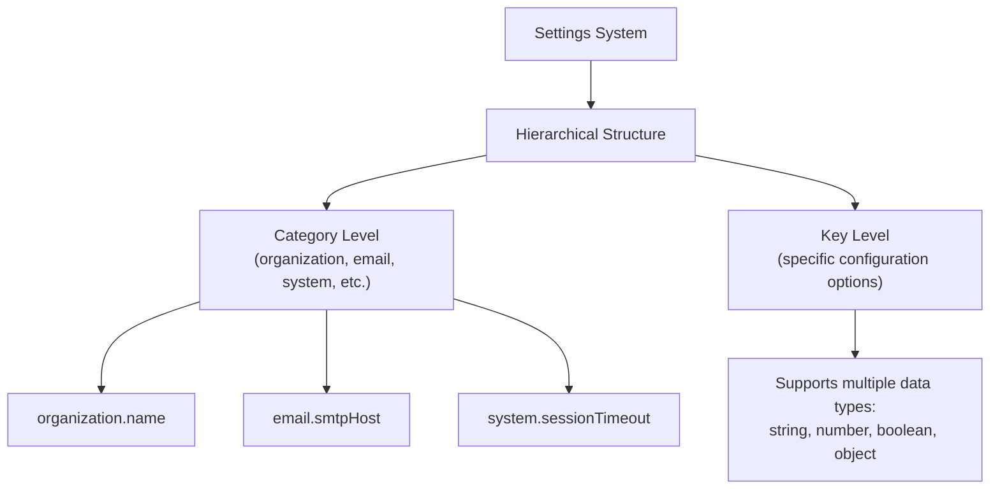
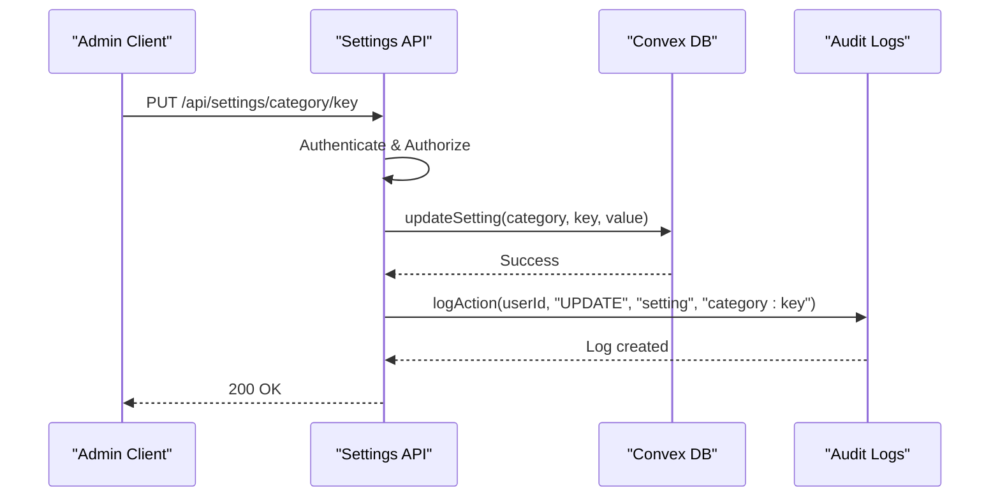

# Settings and Configuration API

<cite>
**Referenced Files in This Document**   
- [system_settings.ts](file://convex/system_settings.ts)
- [route.ts](file://src/app/api/settings/route.ts)
- [route.ts](file://src/app/api/settings/[category]/[key]/route.ts)
- [audit_logs.ts](file://convex/audit_logs.ts)
- [settings.ts](file://src/lib/api/settings.ts)
</cite>

## Table of Contents

1. [Introduction](#introduction)
2. [API Endpoints](#api-endpoints)
3. [Hierarchical Structure](#hierarchical-structure)
4. [Settings Storage and Validation](#settings-storage-and-validation)
5. [Access Control and Authentication](#access-control-and-authentication)
6. [Change Logging and Audit Trail](#change-logging-and-audit-trail)
7. [Common Operations Examples](#common-operations-examples)
8. [Error Handling](#error-handling)
9. [Client Integration](#client-integration)

## Introduction

The Settings and Configuration API provides a comprehensive interface for managing system-wide configuration values in PORTAL. This API enables administrators to retrieve, update, and manage settings organized in a hierarchical structure of categories and keys. All settings are securely stored in Convex database and changes are logged for audit purposes. The API follows RESTful principles and provides both granular and bulk operations for efficient configuration management.

## API Endpoints

### GET /api/settings

Retrieves all configuration settings or settings for a specific category. When no category parameter is provided, returns all settings grouped by category. When a category is specified via query parameter, returns only settings for that category.

### GET /api/settings/{category}/{key}

Retrieves the value of a specific setting identified by its category and key. Returns the setting's value along with its category and key information in a structured response format.

### POST /api/settings/{category}

Updates multiple settings within a specific category. Accepts a JSON payload containing key-value pairs to update. Creates new settings if they don't exist or updates existing ones. This endpoint is optimized for bulk category updates.

### PUT /api/settings/{category}/{key}

Updates a single setting value. Accepts a JSON payload with the new value. Creates the setting if it doesn't exist or updates it if it does. This is the preferred method for updating individual configuration values.

### PUT /api/settings

Performs bulk update of all settings. Accepts a complete settings structure with categories and their respective key-value pairs. Processes each category and setting individually to ensure data consistency.

### DELETE /api/settings

Resets settings to defaults. When called without parameters, resets all settings. When a category parameter is provided, resets only that specific category's settings.

**Section sources**

- [route.ts](file://src/app/api/settings/route.ts#L6-L128)
- [route.ts](file://src/app/api/settings/[category]/[key]/route.ts#L6-L69)

## Hierarchical Structure

The settings system employs a two-level hierarchical structure using categories and keys to organize configuration values. This structure provides logical grouping of related settings while allowing granular access to individual values.

### Category Types

The system supports the following predefined categories:

- **organization**: Organization profile and contact information
- **email**: Email server configuration and sender settings
- **notifications**: Notification preferences and delivery methods
- **system**: System-wide operational parameters
- **security**: Security policies and authentication settings
- **appearance**: UI/UX customization options
- **integrations**: Third-party service integrations
- **reports**: Reporting and analytics configurations

### Key-Value Organization

Each category contains multiple keys representing specific configuration options. For example, the "email" category might contain keys like "smtpHost", "smtpPort", and "fromEmail". This hierarchical approach enables both broad operations (e.g., retrieving all email settings) and precise targeting (e.g., updating just the SMTP port).



**Diagram sources**

- [settings.ts](file://src/lib/api/settings.ts#L6-L14)
- [system_settings.ts](file://convex/system_settings.ts#L5-L21)

## Settings Storage and Validation

All settings are persisted in Convex database using the system_settings table, which stores configuration values with metadata for management and security purposes.

### Data Model

The system_settings table contains the following fields:

- **category**: String identifier for the setting's category
- **key**: String identifier for the specific setting
- **value**: The setting's value (supports multiple data types)
- **data_type**: Auto-detected data type (string, number, boolean, object, array)
- **is_sensitive**: Boolean flag indicating if the setting contains sensitive information
- **updated_by**: Reference to the user who last modified the setting
- **updated_at**: Timestamp of the last modification

### Validation Mechanisms

The system implements several validation and data integrity measures:

- **Type Detection**: Automatically detects and records the data type of each setting value
- **Sensitive Data Detection**: Automatically flags settings as sensitive if their keys contain terms like "password", "secret", or "key"
- **Structure Validation**: Ensures settings objects maintain proper structure during updates
- **Batch Processing**: Processes bulk updates in individual transactions to prevent partial updates

```mermaid
classDiagram
class SystemSettings {
+string category
+string key
+unknown value
+string data_type
+boolean is_sensitive
+string updated_by
+string updated_at
}
class SettingsStorage {
+getSettings() Map~string, Map~string, unknown~~
+getSettingsByCategory(category) Map~string, unknown~
+getSetting(category, key) unknown
+updateSettings(category, settings) void
+updateSetting(category, key, value) void
+resetSettings(category?) void
}
SystemSettings --> SettingsStorage : "stored in"
SettingsStorage ..> "Convex DB" : "persists to"
```

**Diagram sources**

- [system_settings.ts](file://convex/system_settings.ts#L73-L125)
- [system_settings.ts](file://convex/system_settings.ts#L128-L174)

## Access Control and Authentication

The settings API enforces strict access control to protect configuration integrity and security.

### Authentication Requirements

All settings endpoints require authentication. The system verifies the user's session before processing any requests. This is implemented through Next.js API routes that check authentication status before forwarding requests to Convex operations.

### Authorization Rules

Access to settings is restricted to administrative users only. The system checks user roles and permissions before allowing read or write operations on configuration data. Regular users cannot access the settings API endpoints.

### Sensitive Data Protection

The system automatically identifies and flags sensitive settings (such as passwords or API keys) based on their key names. While these values are stored in the same manner as other settings, this flagging mechanism enables additional security measures in the future, such as encryption or access logging.

**Section sources**

- [route.ts](file://src/app/api/settings/route.ts#L36-L63)
- [route.ts](file://src/app/api/settings/[category]/[key]/route.ts#L33-L66)

## Change Logging and Audit Trail

All modifications to settings are recorded in the audit logs system to maintain accountability and support compliance requirements.

### Audit Log Structure

When a setting is modified, the system creates an audit log entry with the following information:

- **userId**: The ID of the user who made the change
- **userName**: The name of the user who made the change
- **action**: The type of action (UPDATE)
- **resource**: The resource type ("setting")
- **resourceId**: A composite identifier of "category:key"
- **changes**: Details of the change (not implemented in current version)
- **ipAddress**: The IP address from which the request originated
- **userAgent**: The user agent string of the client
- **timestamp**: When the change occurred

### Log Creation Process

The audit logging is implemented as a separate operation from the settings update. After successfully updating a setting, the system calls the audit_logs.logAction mutation to record the change. This ensures that configuration changes are always accompanied by appropriate audit trail entries.



**Diagram sources**

- [system_settings.ts](file://convex/system_settings.ts#L128-L174)
- [audit_logs.ts](file://convex/audit_logs.ts#L12-L34)

## Common Operations Examples

This section demonstrates typical usage patterns for the settings API.

### Retrieving All Settings

```http
GET /api/settings HTTP/1.1
Authorization: Bearer <admin_token>
```

### Retrieving Category Settings

```http
GET /api/settings?category=organization HTTP/1.1
Authorization: Bearer <admin_token>
```

### Getting Specific Setting

```http
GET /api/settings/email/smtpHost HTTP/1.1
Authorization: Bearer <admin_token>
```

### Updating Single Setting

```http
PUT /api/settings/security/requireTwoFactor HTTP/1.1
Authorization: Bearer <admin_token>
Content-Type: application/json

{
  "value": true
}
```

### Bulk Category Update

```http
POST /api/settings/email HTTP/1.1
Authorization: Bearer <admin_token>
Content-Type: application/json

{
  "settings": {
    "smtpHost": "smtp.gmail.com",
    "smtpPort": 587,
    "fromEmail": "noreply@portal.com"
  }
}
```

### Bulk Settings Update

```http
PUT /api/settings HTTP/1.1
Authorization: Bearer <admin_token>
Content-Type: application/json

{
  "settings": {
    "system": {
      "sessionTimeout": 30,
      "maintenanceMode": false
    },
    "security": {
      "requireTwoFactor": true,
      "passwordMinLength": 8
    }
  }
}
```

**Section sources**

- [route.ts](file://src/app/api/settings/route.ts#L35-L128)
- [route.ts](file://src/app/api/settings/[category]/[key]/route.ts#L33-L69)

## Error Handling

The API implements comprehensive error handling to provide meaningful feedback for various failure scenarios.

### Common Error Responses

- **400 Bad Request**: Invalid request format, missing required fields, or invalid data types
- **401 Unauthorized**: Authentication failed or missing credentials
- **403 Forbidden**: User lacks required permissions to perform the operation
- **404 Not Found**: Requested category or key does not exist (for specific endpoints)
- **500 Internal Server Error**: Unexpected server error during processing

### Error Response Format

All error responses follow a consistent format:

```json
{
  "success": false,
  "error": "Descriptive error message"
}
```

The error messages are designed to be user-friendly while providing sufficient information for troubleshooting. Server-side errors are logged with full details, but only generic messages are exposed to clients to prevent information leakage.

**Section sources**

- [route.ts](file://src/app/api/settings/route.ts#L25-L31)
- [route.ts](file://src/app/api/settings/route.ts#L57-L63)

## Client Integration

The PORTAL system provides a type-safe API client for convenient integration with the settings API.

### SettingsApiClient

The `settingsApi` instance exported from `src/lib/api/settings.ts` provides a comprehensive interface for interacting with the settings endpoints. It includes methods for all operations with proper typing and error handling.

### Available Methods

- **getSettings(category?)**: Retrieve all settings or settings for a specific category
- **getCategorySettings(category)**: Retrieve all settings for a specific category
- **getSetting(category, key)**: Retrieve a specific setting value
- **updateCategorySettings(category, settings)**: Update multiple settings in a category
- **updateSetting(category, key, value)**: Update a single setting value
- **updateAllSettings(settings)**: Bulk update all settings
- **resetSettings(category?)**: Reset settings to defaults

The client handles authentication automatically by including credentials in requests and provides type safety through TypeScript interfaces that define the structure of settings and responses.

**Section sources**

- [settings.ts](file://src/lib/api/settings.ts#L108-L271)
- [route.ts](file://src/app/api/settings/route.ts#L6-L128)
