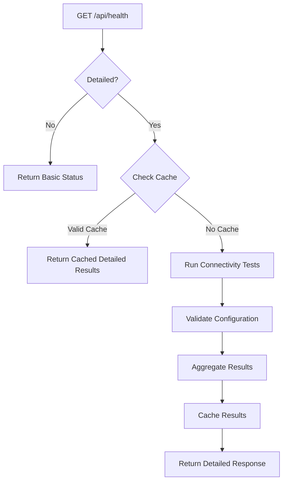
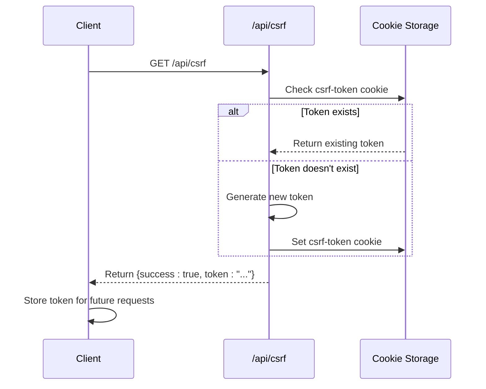
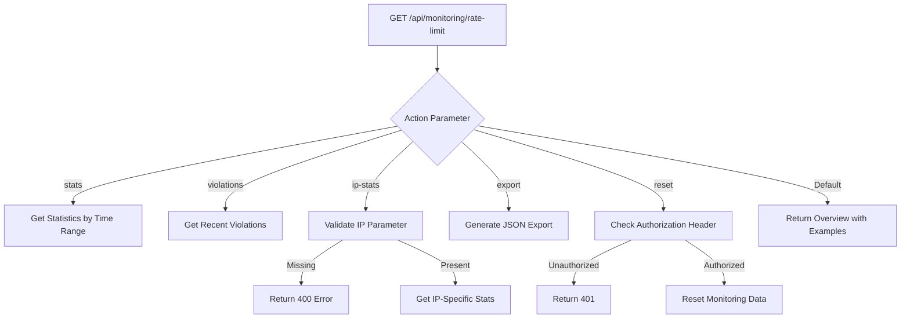
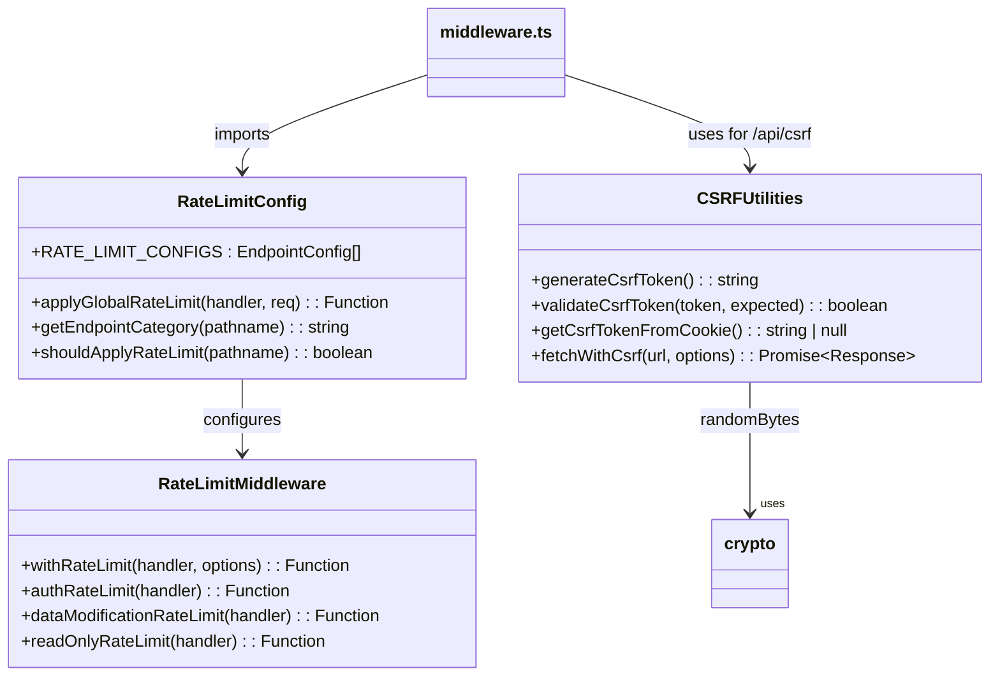

# System Utilities and Monitoring API

<cite>
**Referenced Files in This Document**   
- [health/route.ts](file://src/app/api/health/route.ts)
- [csrf/route.ts](file://src/app/api/csrf/route.ts)
- [monitoring/rate-limit/route.ts](file://src/app/api/monitoring/rate-limit/route.ts)
- [csrf.ts](file://src/lib/csrf.ts)
- [rate-limit.ts](file://src/lib/rate-limit.ts)
- [rate-limit-config.ts](file://src/lib/rate-limit-config.ts)
- [middleware.ts](file://src/middleware.ts)
- [logger.ts](file://src/lib/logger.ts)
</cite>

## Table of Contents

1. [Introduction](#introduction)
2. [Health Check Endpoint](#health-check-endpoint)
3. [CSRF Token Generation](#csrf-token-generation)
4. [Rate Limit Monitoring](#rate-limit-monitoring)
5. [Security Implementation](#security-implementation)
6. [Error Responses](#error-responses)
7. [Monitoring and Production Considerations](#monitoring-and-production-considerations)

## Introduction

This document provides comprehensive API documentation for the system utility endpoints in PORTAL. It covers the health check, CSRF protection, and rate limiting monitoring functionalities that support system stability, security, and observability. These endpoints are critical for maintaining application integrity, preventing abuse, and ensuring reliable operation in production environments.

## Health Check Endpoint

The `GET /api/health` endpoint provides system status information and can be used for uptime monitoring and service availability checks. It supports both basic and detailed health assessments.

### Response Format

The endpoint returns a JSON object with the following structure:

- **ok**: Boolean indicating overall system health
- **provider**: Backend provider type (e.g., "convex")
- **convex**: Object containing Convex configuration status
  - **url**: Boolean indicating if Convex URL is configured
  - **configured**: Boolean indicating overall Convex configuration validity
- **timestamp**: ISO timestamp of the response
- **readyForProduction**: Boolean indicating if the system is ready for production use

When the `detailed=true` query parameter is provided, additional diagnostic information is included:

- **validation**: Configuration validation results
- **connectivity**: Service connectivity test results
- **recommendations**: Actionable recommendations for issues detected
- **cached**: Boolean indicating if results are from cache (30-second TTL)

### Uptime Monitoring Integration

The health endpoint is designed to integrate with external monitoring services. It returns HTTP status code 200 for healthy systems and 503 (Service Unavailable) when critical services fail connectivity tests. The endpoint is explicitly excluded from rate limiting in the middleware configuration to ensure monitoring tools can reliably check system status.



**Diagram sources**

- [health/route.ts](file://src/app/api/health/route.ts#L10-L172)
- [middleware.ts](file://src/middleware.ts#L142-L144)

**Section sources**

- [health/route.ts](file://src/app/api/health/route.ts#L10-L172)

## CSRF Token Generation

The `GET /api/csrf` endpoint generates and returns CSRF tokens for form security. It implements a cryptographic token pattern to prevent cross-site request forgery attacks on state-changing operations.

### Token Management

The endpoint follows these steps:

1. Checks for an existing CSRF token in the `csrf-token` cookie
2. Generates a new cryptographically secure token if none exists
3. Sets the token in a cookie with appropriate security attributes
4. Returns the token in the JSON response

The CSRF token cookie is configured with:

- **httpOnly: false** - Allows client-side JavaScript to read the token for inclusion in requests
- **secure: true** in production - Ensures transmission only over HTTPS
- **sameSite: strict** - Prevents cross-site request inclusion
- **maxAge: 86400 seconds** (24 hours) - Token expiration period

### Integration with Forms

Client applications should:

1. Call `/api/csrf` to obtain a token
2. Include the token in a header (typically `x-csrf-token`) for POST, PUT, PATCH, and DELETE requests
3. The server validates the token against the cookie value using constant-time comparison to prevent timing attacks



**Diagram sources**

- [csrf/route.ts](file://src/app/api/csrf/route.ts#L9-L42)
- [csrf.ts](file://src/lib/csrf.ts#L14-L45)

**Section sources**

- [csrf/route.ts](file://src/app/api/csrf/route.ts#L9-L42)
- [csrf.ts](file://src/lib/csrf.ts#L14-L90)

## Rate Limit Monitoring

The `GET /api/monitoring/rate-limit` and `POST /api/monitoring/rate-limit` endpoints provide comprehensive monitoring and management capabilities for the rate limiting system.

### GET Endpoint Actions

The GET endpoint supports multiple actions via the `action` query parameter:

| Action     | Description                             | Parameters                             |
| ---------- | --------------------------------------- | -------------------------------------- |
| stats      | Get overall rate limit statistics       | timeRange: 1h, 24h, 7d, 30d            |
| violations | Get recent rate limit violations        | limit: number (default: 50)            |
| ip-stats   | Get statistics for specific IP          | ip: IP address, timeRange: 1h, 24h, 7d |
| export     | Export all monitoring data as JSON file | -                                      |
| reset      | Reset monitoring data (admin only)      | Requires Bearer token                  |

When no action is specified, the endpoint returns an overview with available actions and examples.

### POST Endpoint Actions

The POST endpoint supports:

- **record-violation**: Manually record a rate limit violation (for testing)
- **bulk-export**: Export monitoring data with timestamped filename

### Authentication Requirements

The `reset` action requires administrative authentication via Bearer token in the Authorization header, ensuring only authorized personnel can clear monitoring data.



**Diagram sources**

- [monitoring/rate-limit/route.ts](file://src/app/api/monitoring/rate-limit/route.ts#L27-L126)

**Section sources**

- [monitoring/rate-limit/route.ts](file://src/app/api/monitoring/rate-limit/route.ts#L27-L195)

## Security Implementation

### CSRF Protection

The CSRF protection system uses cryptographically secure tokens generated with Node.js `crypto.randomBytes()`. The implementation includes:

- **Token Generation**: 32-byte random tokens converted to hexadecimal strings
- **Validation**: Constant-time string comparison to prevent timing attacks
- **Header Name**: `x-csrf-token` (configurable via constant)
- **Client Utilities**: Helper functions for automatically including tokens in fetch requests

The system is integrated with Next.js middleware, where the `/api/csrf` endpoint is explicitly marked as public, allowing unauthenticated access to retrieve tokens.

### Rate Limiting Implementation

The rate limiting system uses IP-based tracking with configurable storage (Redis or in-memory). Key features include:

- **Identifier Construction**: Combines client IP, HTTP method, and request path
- **Configurable Windows**: Different limits for different endpoint types
- **Response Headers**: Standard rate limit headers (X-RateLimit-Remaining, X-RateLimit-Reset, Retry-After)
- **Status Code**: 429 Too Many Requests for exceeded limits

Endpoint-specific rate limiting is configured in `rate-limit-config.ts`, which defines patterns and corresponding rate limit functions for different API categories.



**Diagram sources**

- [csrf.ts](file://src/lib/csrf.ts#L6-L90)
- [rate-limit.ts](file://src/lib/rate-limit.ts#L11-L147)
- [rate-limit-config.ts](file://src/lib/rate-limit-config.ts#L20-L107)
- [middleware.ts](file://src/middleware.ts#L1-L228)

**Section sources**

- [csrf.ts](file://src/lib/csrf.ts#L6-L90)
- [rate-limit.ts](file://src/lib/rate-limit.ts#L1-L147)
- [rate-limit-config.ts](file://src/lib/rate-limit-config.ts#L1-L193)

## Error Responses

All system utility endpoints follow consistent error response patterns:

### Health Endpoint Errors

- Returns HTTP 200 with detailed error information in the response body
- Includes `connectivityError` field with error message when connectivity tests fail
- Provides recommendations for resolving configuration issues

### CSRF Endpoint Errors

```json
{
  "success": false,
  "error": "Failed to generate CSRF token"
}
```

- HTTP status code: 500
- Minimal error details to avoid information leakage

### Rate Limit Monitoring Errors

```json
{
  "success": false,
  "error": "Failed to process monitoring request",
  "details": "Error message"
}
```

- HTTP status code: 500 for server errors
- Additional status codes:
  - 400 Bad Request: Invalid parameters (e.g., missing IP for ip-stats)
  - 401 Unauthorized: Missing or invalid admin token for reset action
  - 429 Too Many Requests: Rate limit exceeded on monitoring endpoint itself

**Section sources**

- [health/route.ts](file://src/app/api/health/route.ts#L87-L118)
- [csrf/route.ts](file://src/app/api/csrf/route.ts#L34-L40)
- [monitoring/rate-limit/route.ts](file://src/app/api/monitoring/rate-limit/route.ts#L127-L137)

## Monitoring and Production Considerations

### Caching Strategy

The health endpoint implements a 30-second cache for detailed checks to reduce load on backend services while providing timely status information. This balances monitoring frequency with system performance.

### Logging and Observability

All utility endpoints integrate with the centralized logging system (`logger.ts`), which:

- Masks sensitive information (passwords, tokens, TC numbers)
- Integrates with Sentry for error tracking in production
- Includes contextual information (endpoint, method, status code) in logs
- Truncates stack traces in production to reduce log volume

### Rate Limit Configuration

The system uses environment variables to configure rate limits:

- `RATE_LIMIT_AUTH_MAX`: Maximum authentication attempts
- `RATE_LIMIT_AUTH_WINDOW`: Authentication rate limit window (ms)
- Similar variables for data modification, read operations, uploads, and searches

The configuration is validated at startup to detect duplicate patterns or missing required properties.

### Production Recommendations

1. **Monitor Health Endpoint**: Integrate with external monitoring tools using the basic health check
2. **Secure Monitoring Endpoint**: Protect the rate limit monitoring endpoint with appropriate access controls
3. **Regular Cache Validation**: Ensure the 30-second health check cache aligns with your monitoring requirements
4. **Log Retention**: Configure appropriate retention policies for rate limit violation logs
5. **Alerting**: Set up alerts for repeated rate limit violations that may indicate abuse or attacks

**Section sources**

- [logger.ts](file://src/lib/logger.ts#L1-L212)
- [rate-limit-config.ts](file://src/lib/rate-limit-config.ts#L164-L193)
- [health/route.ts](file://src/app/api/health/route.ts#L7-L8)
- [rate-limit.ts](file://src/lib/rate-limit.ts#L4-L9)
