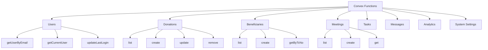
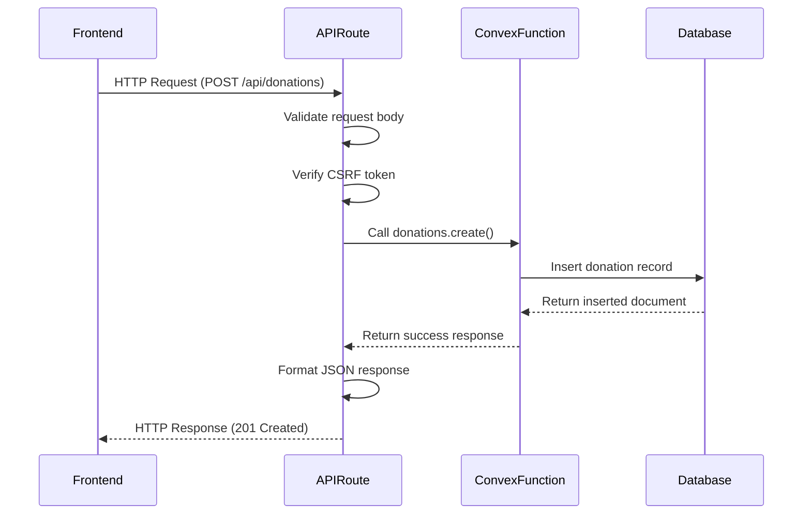
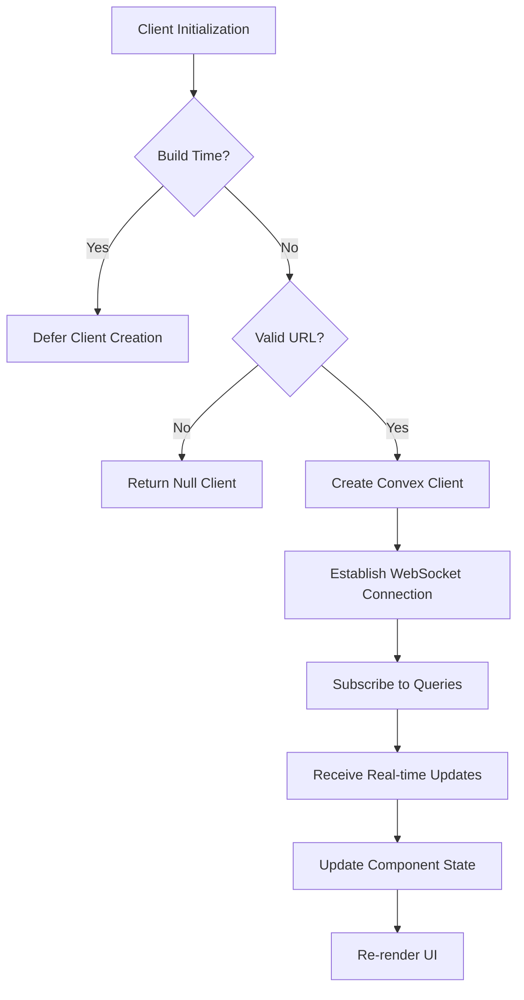
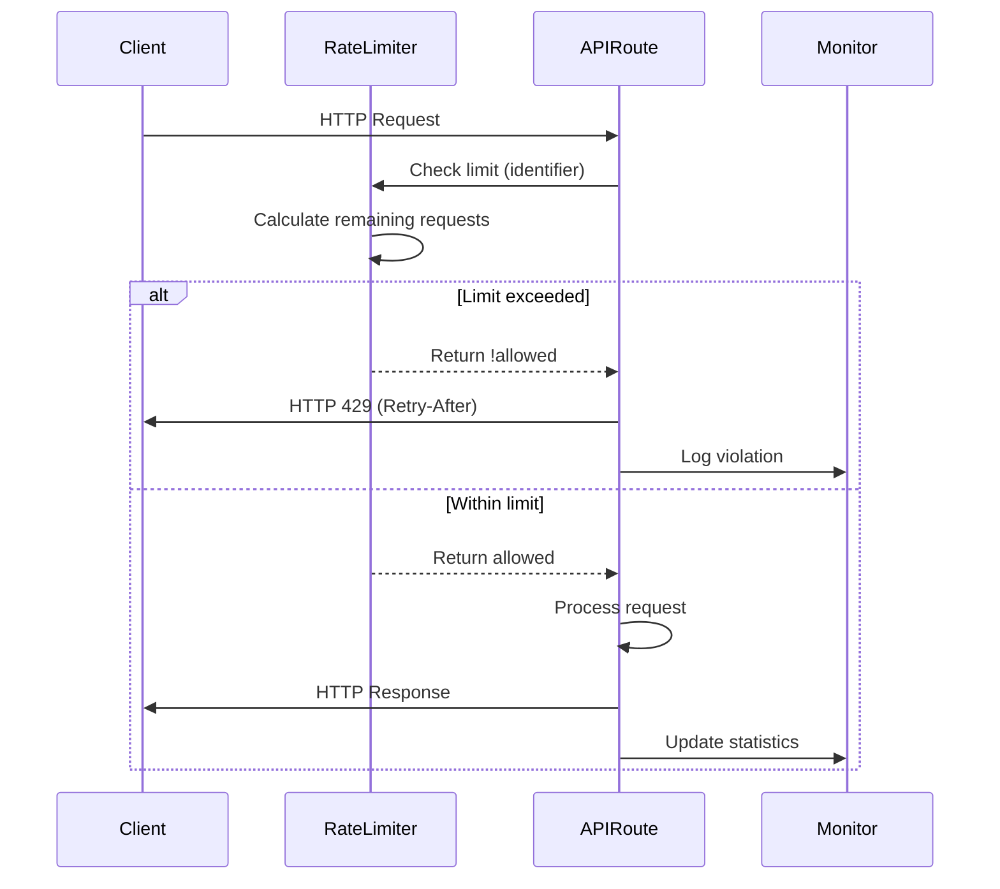
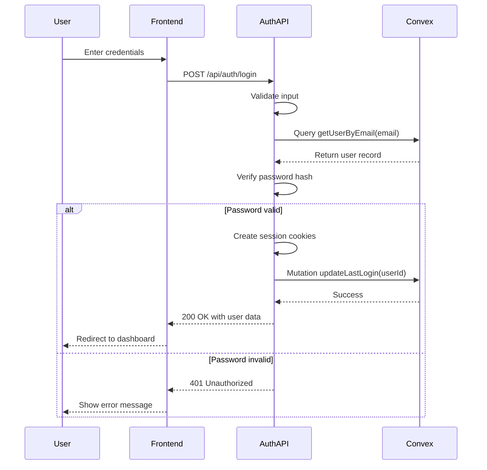

# Backend Architecture

<cite>
**Referenced Files in This Document**   
- [auth.ts](file://convex/auth.ts)
- [donations.ts](file://convex/donations.ts)
- [client.ts](file://src/lib/convex/client.ts)
- [server.ts](file://src/lib/convex/server.ts)
- [middleware.ts](file://src/middleware.ts)
- [api.ts](file://src/lib/convex/api.ts)
- [rate-limit.ts](file://src/lib/rate-limit.ts)
- [session.ts](file://src/lib/auth/session.ts)
- [route.ts](file://src/app/api/auth/login/route.ts)
- [route.ts](file://src/app/api/donations/route.ts)
- [route.ts](file://src/app/api/monitoring/rate-limit/route.ts)
</cite>

## Table of Contents

1. [Introduction](#introduction)
2. [System Context and Architecture Overview](#system-context-and-architecture-overview)
3. [Convex Backend-as-a-Service Integration](#convex-backend-as-a-service-integration)
4. [Feature-Domain Organization of Convex Functions](#feature-domain-organization-of-convex-functions)
5. [API Layer as HTTP-Convex Adapter](#api-layer-as-http-convex-adapter)
6. [Client-Server Communication with Convex SDK](#client-server-communication-with-convex-sdk)
7. [Security Architecture](#security-architecture)
8. [Rate Limiting Implementation](#rate-limiting-implementation)
9. [Authentication Flow](#authentication-flow)
10. [Conclusion](#conclusion)

## Introduction

The PORTAL backend architecture leverages Convex as a Backend-as-a-Service (BaaS) platform to provide a real-time, serverless backend infrastructure. This document details the architectural design, focusing on the integration between the Next.js frontend, the API layer, and Convex functions. The architecture follows a domain-driven design with Convex functions organized by feature domains such as users, beneficiaries, donations, and meetings. The API layer serves as an adapter between HTTP requests and Convex functions, while the Convex client SDK enables real-time data synchronization between client and server.

## System Context and Architecture Overview

The PORTAL system consists of three main architectural layers: the frontend application, the API layer, and the Convex backend. The frontend, built with Next.js, communicates with the backend through API routes that act as adapters between HTTP requests and Convex functions. Convex serves as the primary data store and business logic execution environment, providing real-time capabilities and automatic data synchronization.

```mermaid
graph TD
A[Frontend Application] --> B[API Routes]
B --> C[Convex Functions]
C --> D[(Convex Database)]
D --> C
C --> B
B --> A
E[Convex Client SDK] < --> C
A < --> E
```

**Diagram sources**

- [middleware.ts](file://src/middleware.ts#L1-L229)
- [client.ts](file://src/lib/convex/client.ts#L1-L108)
- [server.ts](file://src/lib/convex/server.ts)

**Section sources**

- [middleware.ts](file://src/middleware.ts#L1-L229)
- [client.ts](file://src/lib/convex/client.ts#L1-L108)

## Convex Backend-as-a-Service Integration

Convex is integrated as the primary backend service for PORTAL, providing a serverless environment for data storage, query execution, and business logic implementation. The integration is established through the Convex React client on the frontend and the Convex HTTP client on the server-side API routes. This dual-client approach allows for real-time data synchronization in the frontend while maintaining secure server-side operations.

The Convex integration includes type-safe API generation through the `_generated` directory, which provides TypeScript definitions for all Convex functions. This ensures compile-time safety when calling Convex functions from both client and server code. The integration also includes proper error handling and connection management, with fallback mechanisms for build-time and configuration errors.

**Section sources**

- [client.ts](file://src/lib/convex/client.ts#L1-L108)
- [server.ts](file://src/lib/convex/server.ts)
- [api.d.ts](file://convex/_generated/api.d.ts)

## Feature-Domain Organization of Convex Functions

Convex functions are organized by feature domain, with each domain having its own TypeScript file in the `convex/` directory. This domain-driven approach groups related business logic together, improving code maintainability and discoverability. Each domain file contains both query functions (for data retrieval) and mutation functions (for data modification).

The architecture follows a consistent pattern across domains: each function is exported with clear type definitions using Convex's value system (`v`). Query functions are used for read operations and are optimized for real-time subscriptions, while mutation functions handle write operations and include appropriate validation and error handling.



**Diagram sources**

- [users.ts](file://convex/users.ts)
- [donations.ts](file://convex/donations.ts)
- [beneficiaries.ts](file://convex/beneficiaries.ts)
- [meetings.ts](file://convex/meetings.ts)

**Section sources**

- [donations.ts](file://convex/donations.ts#L1-L149)
- [auth.ts](file://convex/auth.ts#L1-L82)

## API Layer as HTTP-Convex Adapter

The API layer, located in `src/app/api/`, serves as an adapter between HTTP requests and Convex functions. Each API route corresponds to a specific feature domain and exposes REST-like endpoints that translate HTTP methods to appropriate Convex operations. This layer handles HTTP-specific concerns such as request parsing, response formatting, authentication, and error handling.

The API routes follow a consistent pattern: they import the appropriate Convex function through the generated API types, handle request validation, execute the Convex function, and format the response. This adapter pattern allows the frontend to interact with the backend using standard HTTP semantics while leveraging Convex's real-time capabilities.



**Diagram sources**

- [route.ts](file://src/app/api/donations/route.ts#L1-L148)
- [donations.ts](file://convex/donations.ts#L1-L149)
- [api.ts](file://src/lib/convex/api.ts#L1-L442)

**Section sources**

- [route.ts](file://src/app/api/donations/route.ts#L1-L148)
- [api.ts](file://src/lib/convex/api.ts#L1-L442)

## Client-Server Communication with Convex SDK

Client-server communication in PORTAL is facilitated by the Convex client SDK, which provides real-time data synchronization between the frontend and backend. The SDK handles connection management, data fetching, caching, and automatic reconnection. It uses a subscription model where components can subscribe to specific queries and receive automatic updates when the underlying data changes.

The client implementation includes robust error handling and connection state management, with special consideration for build-time and configuration scenarios. The SDK is initialized with the Convex URL from environment variables, with validation to ensure proper configuration. During build time, the client is deferred to prevent errors in static site generation.



**Diagram sources**

- [client.ts](file://src/lib/convex/client.ts#L1-L108)
- [server.ts](file://src/lib/convex/server.ts)

**Section sources**

- [client.ts](file://src/lib/convex/client.ts#L1-L108)

## Security Architecture

The security architecture of PORTAL implements multiple layers of protection, including authentication, authorization, CSRF protection, and rate limiting. The middleware component enforces access control by checking user sessions and permissions for protected routes. Role-based access control is implemented through permission checks that verify user roles and permissions against route requirements.

Authentication is handled through session cookies with HttpOnly flags for security. The system uses CSRF tokens to prevent cross-site request forgery attacks, with tokens validated on state-changing operations. Sensitive operations are protected by requiring both authentication and CSRF tokens, ensuring that requests originate from legitimate users.

**Section sources**

- [middleware.ts](file://src/middleware.ts#L1-L229)
- [session.ts](file://src/lib/auth/session.ts#L1-L181)
- [route.ts](file://src/app/api/auth/login/route.ts#L1-L178)

## Rate Limiting Implementation

Rate limiting is implemented to protect the backend from abuse and ensure fair usage of resources. The system uses a flexible rate limiting framework that can be applied to different endpoints with varying thresholds. Different rate limit configurations are defined for authentication endpoints, data modification operations, read-only operations, and file uploads.

The rate limiting system tracks requests by client IP address and HTTP method, with configurable windows and maximum request counts. Violations are logged and appropriate HTTP 429 responses are returned with Retry-After headers. A monitoring endpoint provides visibility into rate limiting statistics and violations, allowing administrators to analyze traffic patterns and adjust limits as needed.



**Diagram sources**

- [rate-limit.ts](file://src/lib/rate-limit.ts#L1-L148)
- [route.ts](file://src/app/api/monitoring/rate-limit/route.ts#L1-L196)

**Section sources**

- [rate-limit.ts](file://src/lib/rate-limit.ts#L1-L148)
- [route.ts](file://src/app/api/monitoring/rate-limit/route.ts#L1-L196)

## Authentication Flow

The authentication flow in PORTAL follows a secure, multi-step process that verifies user credentials and establishes a session. When a user attempts to log in, the system first validates the input credentials, then queries Convex to retrieve the user record by email. The password is verified using bcrypt in the Next.js API route, as Convex cannot execute native modules like bcrypt.

Upon successful authentication, the system creates a session with a session ID and expiration time, storing it in an HttpOnly cookie for security. A CSRF token is also generated and stored in a separate cookie to protect against cross-site request forgery. The user's last login time is updated in Convex through a mutation function. Subsequent requests include the session cookie, which is validated by middleware to establish the user's identity and permissions.



**Diagram sources**

- [route.ts](file://src/app/api/auth/login/route.ts#L1-L178)
- [auth.ts](file://convex/auth.ts#L1-L82)
- [session.ts](file://src/lib/auth/session.ts#L1-L181)

**Section sources**

- [route.ts](file://src/app/api/auth/login/route.ts#L1-L178)
- [auth.ts](file://convex/auth.ts#L1-L82)
- [session.ts](file://src/lib/auth/session.ts#L1-L181)

## Conclusion

The PORTAL backend architecture effectively leverages Convex as a Backend-as-a-Service platform to provide a scalable, real-time backend infrastructure. The domain-driven organization of Convex functions by feature areas enhances code maintainability and clarity. The API layer serves as a robust adapter between HTTP requests and Convex functions, handling protocol translation, authentication, and error handling. The security architecture implements comprehensive protection through authentication, authorization, CSRF protection, and rate limiting. The client-server communication pattern using the Convex SDK enables real-time data synchronization while maintaining security and performance. This architecture provides a solid foundation for the PORTAL application, balancing developer productivity with system reliability and security.
