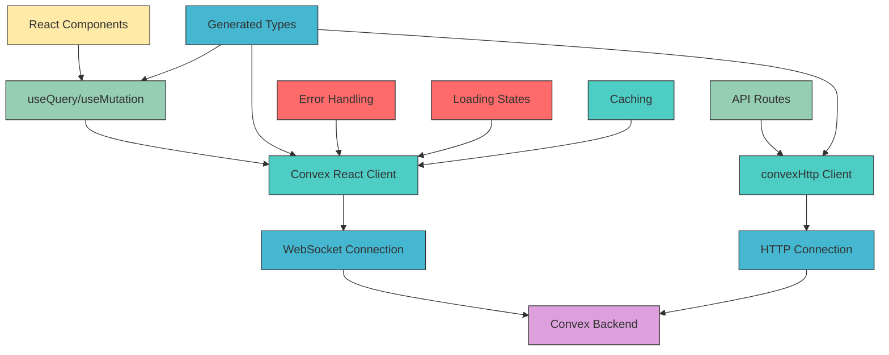
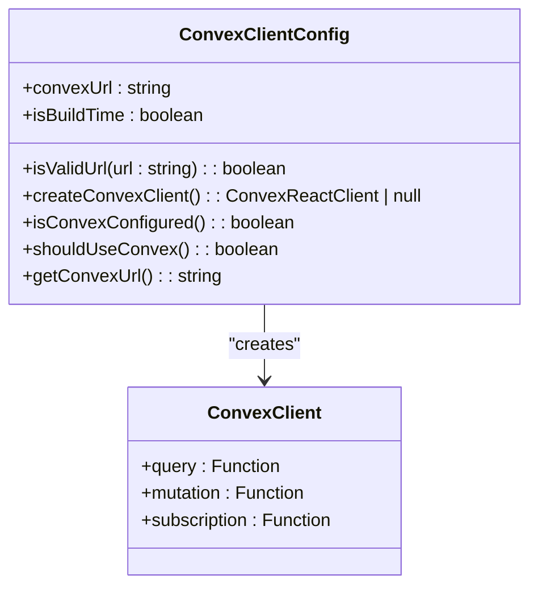
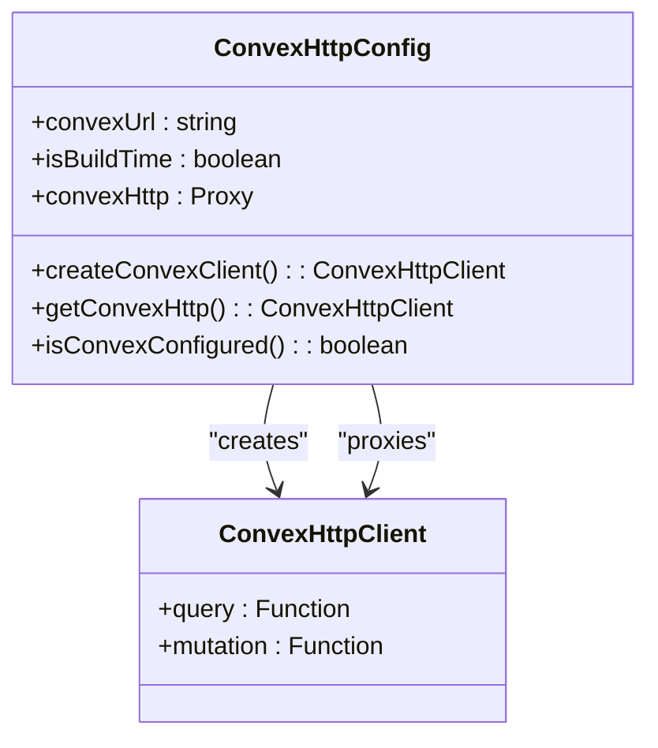
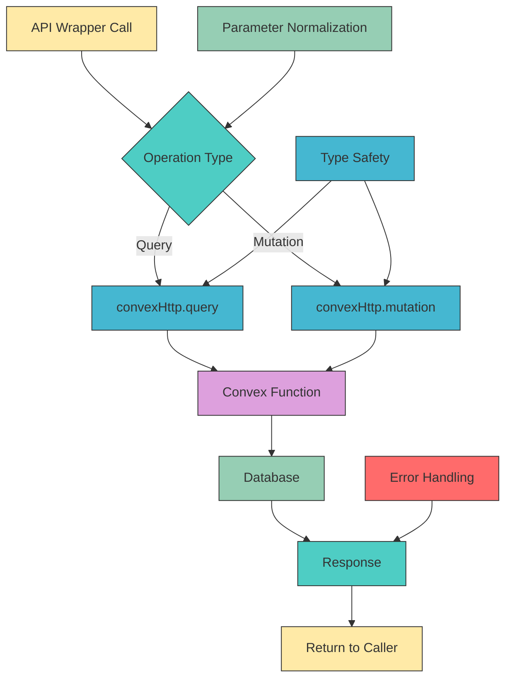
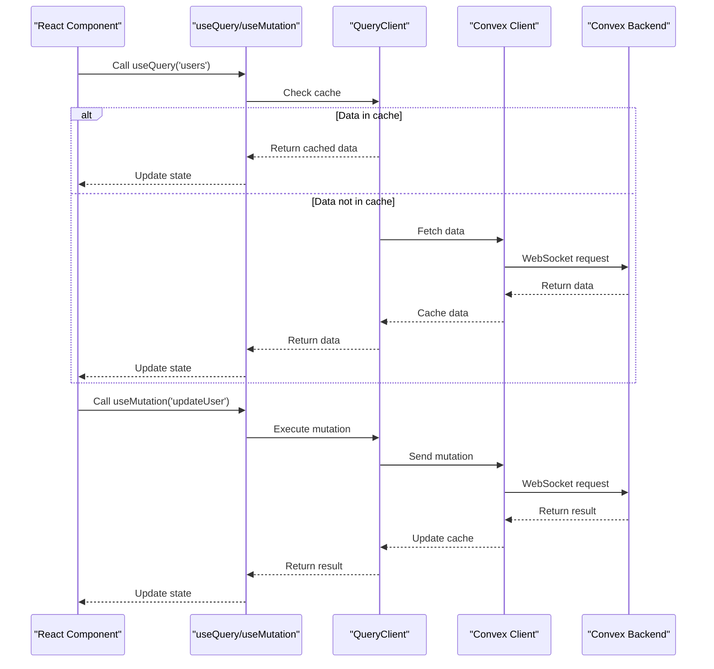
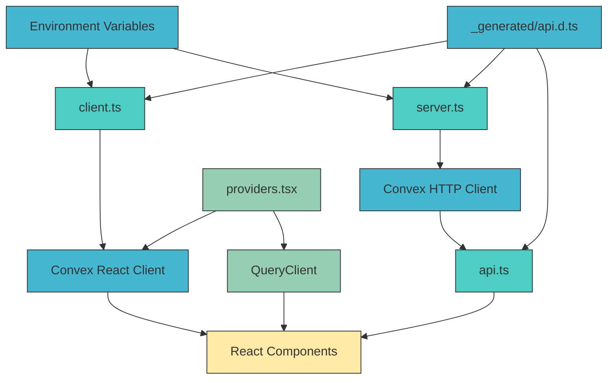

# Convex Client Integration

<cite>
**Referenced Files in This Document**   
- [client.ts](file://src/lib/convex/client.ts)
- [server.ts](file://src/lib/convex/server.ts)
- [api.ts](file://src/lib/convex/api.ts)
- [_generated/api.d.ts](file://convex/_generated/api.d.ts)
- [providers.tsx](file://src/app/providers.tsx)
- [users-table.tsx](file://src/components/tables/users-table.tsx)
- [page.tsx](file://src/app/(dashboard)/kullanici/page.tsx)
- [convex-api-client.ts](file://src/lib/api/convex-api-client.ts)
- [api-cache.ts](file://src/lib/api-cache.ts)
</cite>

## Table of Contents

1. [Introduction](#introduction)
2. [Project Structure](#project-structure)
3. [Core Components](#core-components)
4. [Architecture Overview](#architecture-overview)
5. [Detailed Component Analysis](#detailed-component-analysis)
6. [Dependency Analysis](#dependency-analysis)
7. [Performance Considerations](#performance-considerations)
8. [Troubleshooting Guide](#troubleshooting-guide)
9. [Conclusion](#conclusion)

## Introduction

The Convex client integration in PORTAL provides a robust, type-safe interface for interacting with the Convex backend. This documentation details the implementation of the client layer, including connection management, authentication handling, and wrapper utilities that abstract common patterns for accessing Convex functions. The integration enables real-time data synchronization through React hooks while maintaining proper error handling, loading states, and caching behavior. The architecture is designed to handle both client and server components seamlessly, with special consideration for build-time constraints and production deployment requirements.

## Project Structure

The Convex integration is organized across several key directories and files within the PORTAL application. The client-side implementation resides in `src/lib/convex/`, containing the core client configuration, server utilities, and API wrappers. Generated types from Convex are stored in `convex/_generated/`, providing type safety across the application. API routes in `src/app/api/` serve as the interface between the frontend and Convex backend, while React components in various dashboard sections utilize the Convex integration for data access and manipulation.

```mermaid
graph TB
subgraph "Client Layer"
A[src/lib/convex/client.ts] --> B[Convex React Client]
C[src/lib/convex/server.ts] --> D[HTTP Client]
E[src/lib/convex/api.ts] --> F[API Wrappers]
end
subgraph "Generated Types"
G[convex/_generated/api.d.ts] --> H[Type Definitions]
end
subgraph "Application Layer"
I[src/app/providers.tsx] --> J[Provider Setup]
K[src/components/] --> L[UI Components]
M[src/app/(dashboard)/] --> N[Dashboard Pages]
end
B --> I
D --> E
H --> B
H --> D
E --> M
J --> K
style A fill:#4ECDC4,stroke:#333
style C fill:#4ECDC4,stroke:#333
style E fill:#4ECDC4,stroke:#333
style G fill:#45B7D1,stroke:#333
style I fill:#96CEB4,stroke:#333
style K fill:#FFEAA7,stroke:#333
style M fill:#FFEAA7,stroke:#333
```

**Diagram sources**

- [client.ts](file://src/lib/convex/client.ts)
- [server.ts](file://src/lib/convex/server.ts)
- [api.ts](file://src/lib/convex/api.ts)
- [\_generated/api.d.ts](file://convex/_generated/api.d.ts)
- [providers.tsx](file://src/app/providers.tsx)

**Section sources**

- [client.ts](file://src/lib/convex/client.ts)
- [server.ts](file://src/lib/convex/server.ts)
- [api.ts](file://src/lib/convex/api.ts)
- [\_generated/api.d.ts](file://convex/_generated/api.d.ts)

## Core Components

The Convex client integration consists of three primary components: the client configuration in `client.ts`, the server utilities in `server.ts`, and the API wrappers in `api.ts`. These components work together to provide a seamless interface between the frontend application and the Convex backend. The client handles real-time data synchronization through WebSockets, while the server utilities manage HTTP connections for server-side operations. The API wrappers abstract common patterns for calling Convex functions, providing a consistent interface across the application.

**Section sources**

- [client.ts](file://src/lib/convex/client.ts#L1-L108)
- [server.ts](file://src/lib/convex/server.ts#L1-L71)
- [api.ts](file://src/lib/convex/api.ts#L1-L442)

## Architecture Overview

The Convex integration architecture follows a layered approach, separating concerns between connection management, API abstraction, and component integration. The client layer establishes a WebSocket connection to Convex for real-time data synchronization, while the server layer uses HTTP clients for server-side operations. API wrappers provide a unified interface for accessing Convex functions, with generated types ensuring type safety throughout the application. React components consume data through hooks, which handle loading states, error conditions, and caching automatically.



**Diagram sources**

- [client.ts](file://src/lib/convex/client.ts#L1-L108)
- [server.ts](file://src/lib/convex/server.ts#L1-L71)
- [api.ts](file://src/lib/convex/api.ts#L1-L442)
- [\_generated/api.d.ts](file://convex/_generated/api.d.ts)

## Detailed Component Analysis

### Client Configuration Analysis

The client configuration in `client.ts` handles the creation and management of the Convex React client instance. It includes robust validation for the Convex URL, ensuring proper formatting and preventing initialization with placeholder values. The implementation includes special handling for build-time scenarios, where the client is deferred to prevent errors during static generation. Environment variables are validated before client creation, and comprehensive error handling provides clear feedback during development.



**Diagram sources**

- [client.ts](file://src/lib/convex/client.ts#L1-L108)

**Section sources**

- [client.ts](file://src/lib/convex/client.ts#L1-L108)

### Server Utilities Analysis

The server utilities in `server.ts` provide a lazy-initialized HTTP client for server-side operations. This implementation prevents errors during build time by creating a placeholder client when the Convex URL is not available. The utilities include a Proxy pattern that delays client creation until actual property access, ensuring optimal performance. The module also exports generated API references for type safety, enabling autocomplete and compile-time checking for all Convex function calls.



**Diagram sources**

- [server.ts](file://src/lib/convex/server.ts#L1-L71)

**Section sources**

- [server.ts](file://src/lib/convex/server.ts#L1-L71)

### API Wrappers Analysis

The API wrappers in `api.ts` provide a comprehensive interface for calling Convex functions from both client and server components. Each domain (beneficiaries, donations, tasks, etc.) has its own wrapper with methods for common operations like list, get, create, update, and remove. The wrappers normalize query parameters from Next.js API routes and handle authentication context when required. Type safety is ensured through the imported `api` reference from generated types, providing autocomplete and compile-time validation.



**Diagram sources**

- [api.ts](file://src/lib/convex/api.ts#L1-L442)

**Section sources**

- [api.ts](file://src/lib/convex/api.ts#L1-L442)

### Generated Types Analysis

The generated types in `_generated/api.d.ts` provide complete type safety for all Convex functions. These types are automatically generated from the Convex backend and include references to all queries, mutations, and internal functions. The module uses TypeScript's `ApiFromModules` utility to create a type-safe interface for the entire API surface. This enables autocomplete, parameter validation, and return type checking throughout the application, significantly reducing runtime errors and improving developer experience.

```mermaid
classDiagram
class GeneratedApi {
+api : ApiFromModules
+internal : FilterApi
+components : {}
}
class ApiFromModules {
+aid_applications : ModuleApi
+auth : ModuleApi
+beneficiaries : ModuleApi
+donations : ModuleApi
+tasks : ModuleApi
+meetings : ModuleApi
+users : ModuleApi
}
class ModuleApi {
+list : FunctionReference
+get : FunctionReference
+create : FunctionReference
+update : FunctionReference
+remove : FunctionReference
}
GeneratedApi --> ApiFromModules
ApiFromModules --> ModuleApi
```

**Diagram sources**

- [\_generated/api.d.ts](file://convex/_generated/api.d.ts)

**Section sources**

- [\_generated/api.d.ts](file://convex/_generated/api.d.ts)

### Component Integration Analysis

React components integrate with the Convex client through the `useQuery` and `useMutation` hooks provided by `@tanstack/react-query`. The `providers.tsx` file sets up the Convex provider and query client, ensuring proper initialization and error handling. Components like `users-table.tsx` and dashboard pages demonstrate the pattern of using queries to fetch data and mutations to update it. The integration handles loading states, error conditions, and caching automatically, providing a seamless user experience.



**Diagram sources**

- [providers.tsx](file://src/app/providers.tsx)
- [users-table.tsx](file://src/components/tables/users-table.tsx)
- [page.tsx](<file://src/app/(dashboard)/kullanici/page.tsx>)

**Section sources**

- [providers.tsx](file://src/app/providers.tsx)
- [users-table.tsx](file://src/components/tables/users-table.tsx)
- [page.tsx](<file://src/app/(dashboard)/kullanici/page.tsx>)

## Dependency Analysis

The Convex client integration has a well-defined dependency structure that ensures proper initialization and error handling. The client depends on environment variables for configuration, with fallbacks for build-time scenarios. The server utilities depend on the generated API types for type safety, creating a compile-time contract between frontend and backend. API wrappers depend on both the HTTP client and generated types, forming the bridge between the application and Convex backend. React components depend on the query client and Convex provider for data access.



**Diagram sources**

- [client.ts](file://src/lib/convex/client.ts)
- [server.ts](file://src/lib/convex/server.ts)
- [api.ts](file://src/lib/convex/api.ts)
- [\_generated/api.d.ts](file://convex/_generated/api.d.ts)
- [providers.tsx](file://src/app/providers.tsx)

**Section sources**

- [client.ts](file://src/lib/convex/client.ts)
- [server.ts](file://src/lib/convex/server.ts)
- [api.ts](file://src/lib/convex/api.ts)
- [\_generated/api.d.ts](file://convex/_generated/api.d.ts)
- [providers.tsx](file://src/app/providers.tsx)

## Performance Considerations

The Convex client integration includes several performance optimizations to ensure efficient data access and memory management. The client implements intelligent subscription management, automatically unsubscribing from queries when components unmount to prevent memory leaks. Caching behavior is optimized through the use of React Query's built-in caching, with configurable stale times and garbage collection. The implementation includes build-time detection to prevent unnecessary client creation during static generation, reducing bundle size and improving build performance.

Additional performance considerations include:

- Lazy initialization of HTTP clients to prevent build errors
- Efficient WebSocket connection management with automatic reconnection
- Type-safe API access that eliminates runtime type errors
- Comprehensive error handling that prevents application crashes
- Loading state management that provides immediate user feedback
- Memory leak prevention through proper cleanup of subscriptions

The integration also includes monitoring and debugging utilities that help identify performance bottlenecks and optimize data access patterns. These features ensure that the application remains responsive and efficient, even with complex data requirements and high user loads.

**Section sources**

- [client.ts](file://src/lib/convex/client.ts)
- [server.ts](file://src/lib/convex/server.ts)
- [api.ts](file://src/lib/convex/api.ts)
- [api-cache.ts](file://src/lib/api-cache.ts)

## Troubleshooting Guide

Common issues with the Convex client integration typically relate to configuration, authentication, or network connectivity. The most frequent problem is improper configuration of the `NEXT_PUBLIC_CONVEX_URL` environment variable, which prevents client initialization. During development, ensure the URL is correctly set and not a placeholder value. The client includes validation that logs warnings when the URL format is incorrect.

Authentication issues may occur when the authentication token is missing or expired. The integration relies on the application's authentication system to provide tokens, so ensure the auth store is properly initialized before accessing Convex functions. Network connectivity issues can manifest as failed queries or mutations; check the browser's developer tools for WebSocket connection errors.

For debugging, the integration includes several utilities:

- Development logs that indicate client initialization status
- Type checking that catches API usage errors at compile time
- Error boundaries that prevent application crashes
- Console utilities exposed in development mode for manual testing

When troubleshooting performance issues, monitor subscription counts and ensure components properly clean up subscriptions when unmounting. Use the React Query devtools to inspect cache behavior and identify unnecessary refetching.

**Section sources**

- [client.ts](file://src/lib/convex/client.ts)
- [server.ts](file://src/lib/convex/server.ts)
- [providers.tsx](file://src/app/providers.tsx)

## Conclusion

The Convex client integration in PORTAL provides a robust, type-safe interface for accessing backend data with real-time synchronization capabilities. The architecture effectively separates concerns between connection management, API abstraction, and component integration, creating a maintainable and scalable solution. Key strengths include comprehensive type safety through generated types, intelligent handling of build-time constraints, and seamless integration with React's component model.

The implementation demonstrates best practices in client-server communication, with proper error handling, loading state management, and performance optimizations. The use of React Query for data fetching and caching ensures efficient data access while preventing common issues like memory leaks and duplicate requests. The wrapper utilities in `api.ts` provide a clean, consistent interface for accessing Convex functions, reducing boilerplate code and improving developer productivity.

Overall, the integration successfully balances the requirements of real-time data synchronization with the constraints of a production web application, providing a reliable foundation for the PORTAL application's data access needs.
