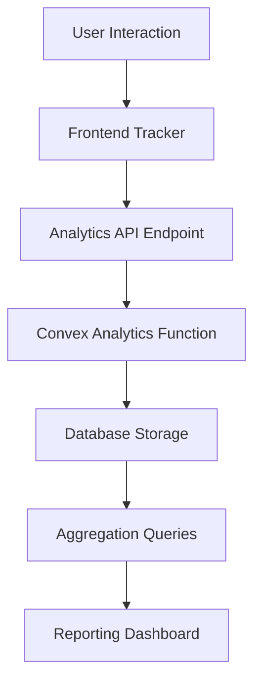
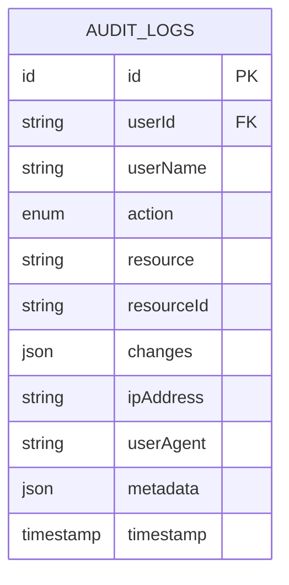
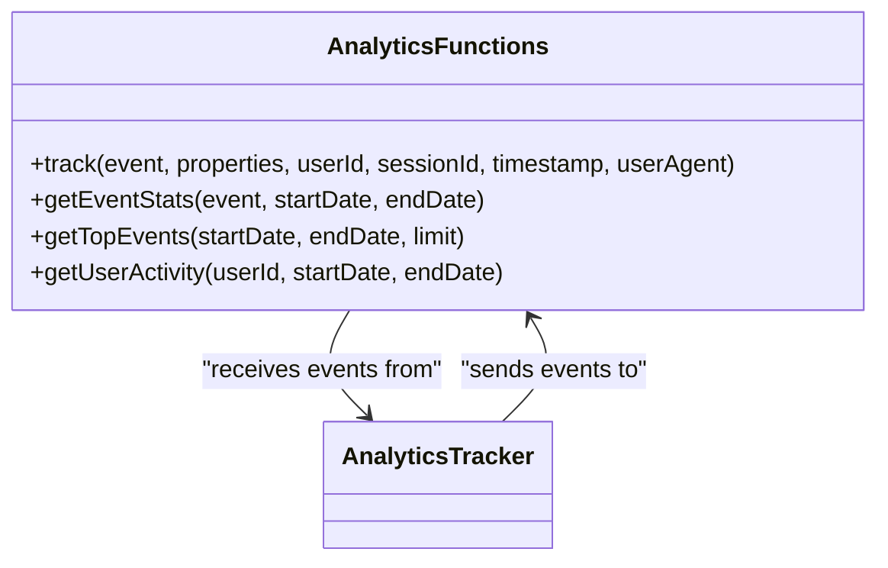
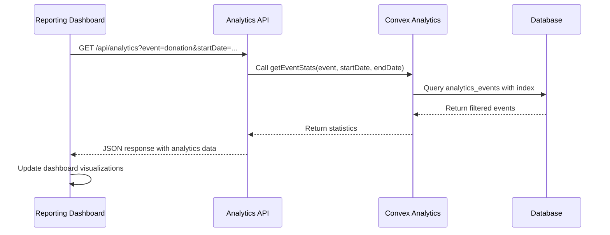
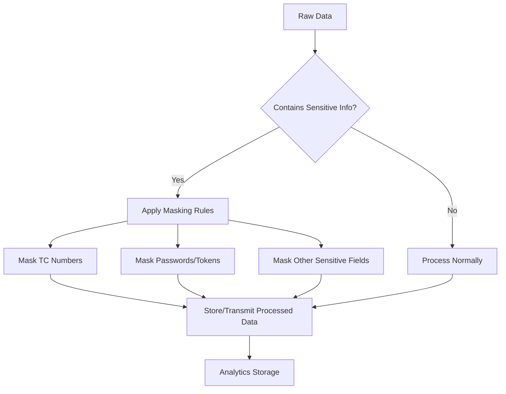

# Analytics and Reporting

<cite>
**Referenced Files in This Document**   
- [analytics.ts](file://convex/analytics.ts)
- [audit_logs.ts](file://convex/audit_logs.ts)
- [analytics/route.ts](file://src/app/api/analytics/route.ts)
- [analytics-tracker.tsx](file://src/components/ui/analytics-tracker.tsx)
- [financial-dashboard/page.tsx](file://src/app/(dashboard)/financial-dashboard/page.tsx)
- [KumbaraStats.tsx](file://src/components/kumbara/KumbaraStats.tsx)
- [logger.ts](file://src/lib/logger.ts)
</cite>

## Table of Contents

1. [Introduction](#introduction)
2. [Analytics Functions and Data Aggregation](#analytics-functions-and-data-aggregation)
3. [Audit Logs Collection Schema](#audit-logs-collection-schema)
4. [Business Logic in analytics.ts](#business-logic-in-analyticsts)
5. [Query Optimization and Performance](#query-optimization-and-performance)
6. [Audit Log Structure for Compliance](#audit-log-structure-for-compliance)
7. [Integration with Frontend Reporting Dashboards](#integration-with-frontend-reporting-dashboards)
8. [Data Privacy and Sensitive Information](#data-privacy-and-sensitive-information)
9. [Extending the Analytics Framework](#extending-the-analytics-framework)
10. [Conclusion](#conclusion)

## Introduction

The Analytics and Reporting system in Convex provides comprehensive tracking, monitoring, and reporting capabilities for the application. This system enables data-driven decision making by aggregating information across users, beneficiaries, donations, and financial records. The architecture combines real-time analytics tracking with comprehensive audit logging to ensure both operational visibility and regulatory compliance with standards such as KVKK and GDPR.

The system is designed with a clear separation between analytics events (user interactions and system metrics) and audit logs (critical security and compliance events). Analytics functions focus on usage patterns, donation trends, and system performance, while audit logs maintain an immutable record of all critical operations for compliance purposes.

**Section sources**

- [analytics.ts](file://convex/analytics.ts#L1-L116)
- [audit_logs.ts](file://convex/audit_logs.ts#L1-L178)

## Analytics Functions and Data Aggregation

The analytics system provides several key functions for aggregating data across different dimensions of the application. These functions are implemented as Convex queries that can be called from the frontend to generate reports and insights.

The primary analytics functions include:

- **Event tracking**: Captures user interactions and system events with detailed properties
- **Event statistics**: Provides counts and unique user metrics for specific events over time ranges
- **Top events**: Identifies the most frequently occurring events within a specified period
- **User activity**: Tracks individual user engagement patterns and interaction history

Data aggregation occurs across multiple entities including users, beneficiaries, donations, and financial records. The system uses efficient database queries with appropriate indexing to ensure performance, particularly when processing large datasets for reporting purposes.

**Diagram sources**

- [analytics.ts](file://convex/analytics.ts#L12-L116)
- [analytics/route.ts](file://src/app/api/analytics/route.ts#L1-L76)

**Section sources**

- [analytics.ts](file://convex/analytics.ts#L12-L116)

## Audit Logs Collection Schema

The audit logs collection schema is designed to track all critical system events with comprehensive metadata for compliance and security purposes. Each audit log entry contains essential information that enables forensic analysis and meets regulatory requirements.

The schema includes the following key fields:

- **userId**: Reference to the user who performed the action
- **userName**: Display name of the user for audit trail clarity
- **action**: Type of operation performed (CREATE, UPDATE, DELETE, VIEW)
- **resource**: Type of entity affected by the action
- **resourceId**: Identifier of the specific resource
- **changes**: Detailed record of data modifications (when applicable)
- **ipAddress**: Client IP address for security monitoring
- **userAgent**: Browser/device information
- **metadata**: Additional context-specific information
- **timestamp**: ISO timestamp of when the action occurred

This comprehensive schema ensures that all critical operations are properly documented with sufficient detail for compliance audits and security investigations.

**Diagram sources**

- [audit_logs.ts](file://convex/audit_logs.ts#L12-L34)

**Section sources**

- [audit_logs.ts](file://convex/audit_logs.ts#L12-L34)

## Business Logic in analytics.ts

The business logic in analytics.ts implements the core functionality for tracking and analyzing system usage patterns. The module exports several key functions that handle different aspects of analytics processing.

The `track` mutation function serves as the entry point for all analytics events, inserting event data into the analytics_events collection. This function accepts parameters including the event name, properties, optional user ID, session ID, timestamp, and user agent information.

The `getEventStats` query provides detailed statistics for a specific event type within a date range, returning the total count, number of unique users, and a sample of recent events. This function uses indexed database queries for efficient filtering and aggregation.

The `getTopEvents` query analyzes event frequency across all event types, sorting them by occurrence count to identify the most popular actions within the system. This function implements server-side sorting and limiting to optimize performance.

The `getUserActivity` query tracks individual user engagement, providing insights into user behavior patterns and interaction frequency with the platform.

**Diagram sources**

- [analytics.ts](file://convex/analytics.ts#L12-L116)
- [analytics-tracker.tsx](file://src/components/ui/analytics-tracker.tsx#L12-L74)

**Section sources**

- [analytics.ts](file://convex/analytics.ts#L12-L116)

## Query Optimization and Performance

The analytics queries are optimized for performance through several key strategies. The system leverages Convex's indexing capabilities to ensure efficient data retrieval, particularly for time-series data and user-specific queries.

All primary query fields are indexed to enable fast lookups:

- The `analytics_events` collection has an index on the `event` field for efficient event-type filtering
- A timestamp index enables rapid date-range queries
- A user index allows quick retrieval of individual user activity

The implementation uses server-side filtering and aggregation to minimize data transfer between the database and application server. For example, the `getEventStats` function applies date filtering after retrieving events through an indexed query, reducing the amount of data processed in memory.

Pagination and limiting are implemented to prevent excessive data retrieval, with default limits applied to queries that could potentially return large result sets. The system also implements client-side caching through React Query, reducing redundant server requests for frequently accessed analytics data.

Performance monitoring is integrated throughout the analytics pipeline, with timing measurements and logging to identify potential bottlenecks.

**Section sources**

- [analytics.ts](file://convex/analytics.ts#L36-L52)
- [analytics.ts](file://convex/analytics.ts#L66-L86)

## Audit Log Structure for Compliance

The audit log structure is specifically designed to meet compliance requirements for regulations such as KVKK and GDPR. The system ensures that all critical operations are properly recorded with sufficient detail for audit purposes.

Each audit log entry captures the who, what, when, and how of system operations:

- **Who**: User ID and name establish accountability
- **What**: Action type and resource details specify the operation
- **When**: Precise timestamp enables chronological reconstruction
- **How**: Changes and metadata provide context for the operation

The system automatically captures network information including IP address and user agent, which helps detect suspicious activity and supports security investigations. For sensitive operations, the changes field records the specific data modifications, enabling reconstruction of data state changes over time.

The immutable nature of audit logs ensures that records cannot be altered after creation, maintaining the integrity of the audit trail. The system also implements appropriate access controls to ensure that audit log data is only accessible to authorized personnel.

**Section sources**

- [audit_logs.ts](file://convex/audit_logs.ts#L12-L34)
- [audit_logs.ts](file://convex/audit_logs.ts#L40-L91)

## Integration with Frontend Reporting Dashboards

The analytics system integrates with frontend reporting dashboards through a well-defined API interface. The integration follows a client-server architecture where the frontend components request analytics data from Convex functions via API endpoints.

The `AnalyticsTracker` class in the frontend manages client-side event collection, capturing user interactions, page views, and performance metrics. This tracker automatically sends events to the backend analytics endpoint, where they are processed and stored.

Reporting dashboards consume analytics data through dedicated API routes that transform Convex query results into JSON responses. For example, the financial dashboard would retrieve donation trends and beneficiary statistics through these endpoints to populate visualizations.

The integration includes error handling and fallback mechanisms to ensure dashboard functionality even when analytics services are temporarily unavailable. Client-side caching reduces server load and improves dashboard responsiveness.

**Diagram sources**

- [analytics/route.ts](file://src/app/api/analytics/route.ts#L51-L75)
- [analytics.ts](file://convex/analytics.ts#L29-L53)
- [financial-dashboard/page.tsx](<file://src/app/(dashboard)/financial-dashboard/page.tsx#L1-L21>)

**Section sources**

- [analytics/route.ts](file://src/app/api/analytics/route.ts#L51-L75)
- [analytics-tracker.tsx](file://src/components/ui/analytics-tracker.tsx#L87-L206)
- [financial-dashboard/page.tsx](<file://src/app/(dashboard)/financial-dashboard/page.tsx#L1-L21>)

## Data Privacy and Sensitive Information

The system implements comprehensive data privacy protections when aggregating sensitive information. These measures ensure compliance with KVKK and GDPR requirements while still enabling valuable analytics insights.

Sensitive data such as Turkish identification numbers (TC Kimlik) are automatically masked in logs and analytics outputs. The `maskTcNumber` function in the logger utility replaces the middle digits of TC numbers with asterisks, showing only the first three and last two digits (e.g., 123**\*\***90).

The `maskSensitive` function recursively processes objects to identify and mask fields containing sensitive information based on field names. This includes password fields, authentication tokens, and personal identification information.

All logging and analytics collection undergoes this masking process before being written to storage or sent to external services. This ensures that sensitive information is never exposed in logs, analytics data, or error reports.

The system also implements appropriate access controls and encryption for stored analytics data, with regular security audits to verify compliance with data protection standards.

**Diagram sources**

- [logger.ts](file://src/lib/logger.ts#L46-L64)
- [logger.ts](file://src/lib/logger.ts#L66-L96)

**Section sources**

- [logger.ts](file://src/lib/logger.ts#L46-L96)

## Extending the Analytics Framework

The analytics framework is designed to be extensible, allowing new metrics and reporting capabilities to be added as requirements evolve. The modular architecture supports the addition of new event types, analytics queries, and reporting dimensions.

To extend the framework with new metrics, developers can:

1. Define new event types in the tracking system
2. Create corresponding Convex query functions for aggregation
3. Implement frontend components to visualize the new metrics
4. Add appropriate indexes to optimize query performance

The system supports custom event properties, allowing contextual data to be captured alongside standard event information. This enables rich, multidimensional analysis of user behavior and system performance.

For complex analytics requirements, the framework can be extended with specialized aggregation functions that combine data from multiple collections. These functions should be optimized with appropriate indexing and pagination to maintain performance at scale.

The audit logging system can also be extended to capture additional event types or include more detailed metadata for specific operations, ensuring comprehensive coverage of all critical system activities.

**Section sources**

- [analytics.ts](file://convex/analytics.ts#L6-L23)
- [audit_logs.ts](file://convex/audit_logs.ts#L6-L12)

## Conclusion

The Analytics and Reporting system in Convex provides a robust foundation for data-driven decision making and regulatory compliance. By combining comprehensive usage analytics with detailed audit logging, the system delivers both operational insights and security assurance.

The architecture effectively separates analytics tracking from compliance logging while maintaining a cohesive data model. Performance optimizations through indexing and efficient querying ensure responsiveness even with large datasets. Data privacy protections are integrated throughout the system, with automatic masking of sensitive information to meet KVKK and GDPR requirements.

The integration between backend analytics functions and frontend reporting dashboards enables real-time visibility into system usage, donation trends, and beneficiary statistics. The extensible design allows the framework to evolve with changing business requirements, supporting the addition of new metrics and reporting capabilities.

This comprehensive approach to analytics and reporting positions the system to support data-informed decision making while maintaining the highest standards of security, privacy, and compliance.
