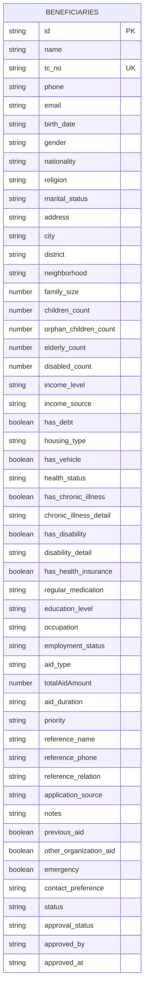
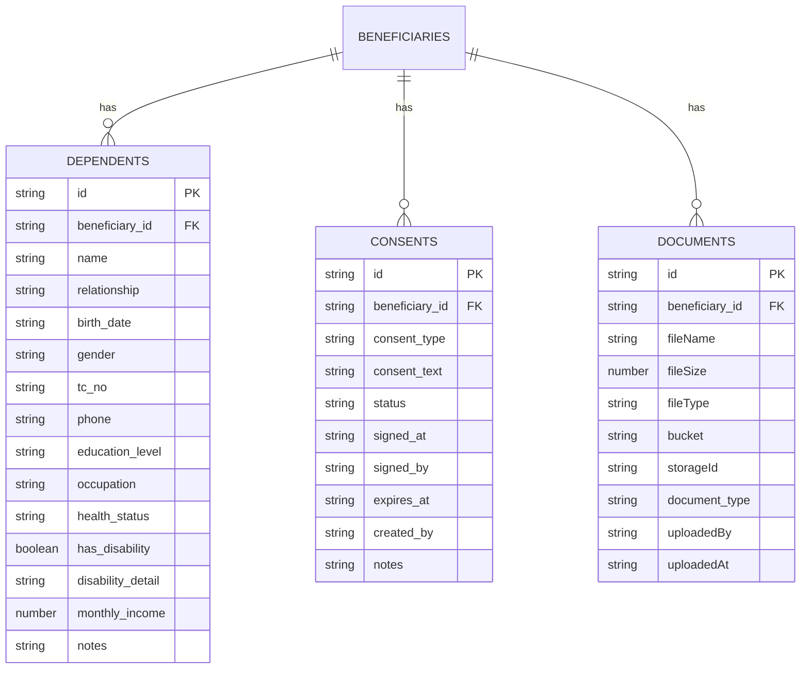

# Beneficiary Management

<cite>
**Referenced Files in This Document**   
- [beneficiaries.ts](file://convex/beneficiaries.ts)
- [dependents.ts](file://convex/dependents.ts)
- [consents.ts](file://convex/consents.ts)
- [documents.ts](file://convex/documents.ts)
</cite>

## Table of Contents

1. [Introduction](#introduction)
2. [Beneficiaries Collection Schema](#beneficiaries-collection-schema)
3. [Dependent Entities](#dependent-entities)
4. [Business Logic in beneficiaries.ts](#business-logic-in-beneficiariests)
5. [Complex Queries and Data Joins](#complex-queries-and-data-joins)
6. [Validation Rules](#validation-rules)
7. [Search Index and Lookup Mechanisms](#search-index-and-lookup-mechanisms)
8. [Data Integrity and Cascading Operations](#data-integrity-and-cascading-operations)
9. [Conclusion](#conclusion)

## Introduction

The Beneficiary Management system in Convex is designed to manage comprehensive profiles of individuals receiving aid, including personal, familial, financial, health, and historical data. This document details the architecture of the system, focusing on the `beneficiaries` collection and its relationships with dependent entities such as `dependents`, `consents`, and `documents`. It also covers the business logic governing CRUD operations, status transitions, and approval workflows.

**Section sources**

- [beneficiaries.ts](file://convex/beneficiaries.ts#L1-L229)

## Beneficiaries Collection Schema

The `beneficiaries` collection stores detailed information about each beneficiary, including personal identification, family composition, financial status, health details, and aid history. Key fields include:

- **Personal Information**: `name`, `tc_no` (Turkish ID number), `phone`, `email`, `birth_date`, `gender`, `nationality`, `religion`, `marital_status`
- **Address Details**: `address`, `city`, `district`, `neighborhood`
- **Family Composition**: `family_size`, `children_count`, `orphan_children_count`, `elderly_count`, `disabled_count`
- **Financial Status**: `income_level`, `income_source`, `has_debt`, `housing_type`, `has_vehicle`
- **Health Details**: `health_status`, `has_chronic_illness`, `chronic_illness_detail`, `has_disability`, `disability_detail`, `has_health_insurance`, `regular_medication`
- **Aid History**: `aid_type`, `totalAidAmount`, `aid_duration`, `priority`, `previous_aid`, `other_organization_aid`
- **Status and Approval**: `status` (TASLAK/AKTIF/PASIF/SILINDI), `approval_status`, `approved_by`, `approved_at`



**Diagram sources**

- [beneficiaries.ts](file://convex/beneficiaries.ts#L90-L149)

## Dependent Entities

The system maintains relationships between beneficiaries and their dependents, consents, and documents through separate collections.

### Dependents Collection

The `dependents` collection tracks family members or individuals dependent on the beneficiary. Each dependent is linked via `beneficiary_id`. Fields include `name`, `relationship`, `birth_date`, `gender`, `tc_no`, `phone`, `education_level`, `occupation`, `health_status`, `has_disability`, `disability_detail`, `monthly_income`, and `notes`.

### Consents Collection

The `consents` collection records permissions granted by the beneficiary. Each consent is linked via `beneficiary_id` and includes `consent_type`, `consent_text`, `status` (active/revoked/expired), `signed_at`, `signed_by`, `expires_at`, `created_by`, and `notes`.

### Documents Collection

The `documents` collection stores metadata about files associated with a beneficiary, including `fileName`, `fileSize`, `fileType`, `bucket`, `storageId`, `beneficiary_id`, `document_type`, `uploadedBy`, and `uploadedAt`. The actual files are stored in Convex storage.



**Diagram sources**

- [dependents.ts](file://convex/dependents.ts#L21-L63)
- [consents.ts](file://convex/consents.ts#L20-L44)
- [documents.ts](file://convex/documents.ts#L52-L77)

## Business Logic in beneficiaries.ts

The `beneficiaries.ts` file implements CRUD operations and business logic for managing beneficiary records.

### CRUD Operations

- **Create**: Validates TC number format and checks for duplicates before inserting a new record.
- **Read**: Provides `list` (with pagination and filters), `get` (by ID), and `getByTcNo` (by TC number) queries.
- **Update**: Allows partial updates with validation for TC number changes.
- **Delete**: Removes a beneficiary record.

### Status Transitions

Beneficiaries can have statuses: `TASLAK` (Draft), `AKTIF` (Active), `PASIF` (Inactive), or `SILINDI` (Deleted). Status changes are managed through the `update` mutation.

### Approval Workflows

The `approval_status` field supports `pending`, `approved`, or `rejected` states. The `approved_by` and `approved_at` fields track approval metadata.

**Section sources**

- [beneficiaries.ts](file://convex/beneficiaries.ts#L6-L228)

## Complex Queries and Data Joins

The system supports complex queries that join beneficiary data with related entities.

### Example: Get Beneficiary with Dependents and Consents

```typescript
// Pseudo-code for joining data
const beneficiary = await ctx.db.get(beneficiaryId);
const dependents = await ctx.db
  .query('dependents')
  .withIndex('by_beneficiary', (q) => q.eq('beneficiary_id', beneficiaryId))
  .collect();
const consents = await ctx.db
  .query('consents')
  .withIndex('by_beneficiary', (q) => q.eq('beneficiary_id', beneficiaryId))
  .collect();
```

### Example: Search by Name or TC Number

The `list` query uses a search index `by_search` for name-based searches and `by_tc_no` for TC number lookups.

**Section sources**

- [beneficiaries.ts](file://convex/beneficiaries.ts#L7-L61)
- [dependents.ts](file://convex/dependents.ts#L7-L18)
- [consents.ts](file://convex/consents.ts#L5-L16)

## Validation Rules

### TC Kimlik No Validation

The `isValidTcNumber` function ensures the TC number is exactly 11 digits using a regular expression `/^\d{11}$/`.

### Family Size Calculation

The `family_size` field is validated as a number and must be consistent with `children_count`, `elderly_count`, and `disabled_count`.

### Data Privacy Controls

Access to sensitive data (e.g., `getByTcNo`) requires authentication and ADMIN/MANAGER role.

**Section sources**

- [beneficiaries.ts](file://convex/beneficiaries.ts#L4-L5)
- [dependents.ts](file://convex/dependents.ts#L4-L5)

## Search Index and Lookup Mechanisms

The system uses Convex search indexes for efficient lookups:

- **by_search**: Enables full-text search on the `name` field.
- **by_tc_no**: Indexes the `tc_no` field for fast TC number lookups.
- **by_status**: Indexes the `status` field for filtering by status.
- **by_city**: Indexes the `city` field for location-based queries.

These indexes are used in the `list` and `getByTcNo` queries to optimize performance.

**Section sources**

- [beneficiaries.ts](file://convex/beneficiaries.ts#L18-L38)

## Data Integrity and Cascading Operations

### Data Integrity Constraints

- **Unique TC Number**: Prevents duplicate entries via `by_tc_no` index check.
- **Referential Integrity**: `dependents`, `consents`, and `documents` collections reference `beneficiaries` via `beneficiary_id`.

### Cascading Operations

- **Deactivation**: When a beneficiary is marked as `PASIF`, related records remain but are logically inactive.
- **Deletion**: The `remove` mutation deletes the beneficiary record, but dependent entities are not automatically deleted (no cascading delete).

**Section sources**

- [beneficiaries.ts](file://convex/beneficiaries.ts#L157-L164)
- [dependents.ts](file://convex/dependents.ts#L13-L15)

## Conclusion

The Beneficiary Management system in Convex provides a robust framework for managing beneficiary data with strong validation, efficient querying, and clear relationships to dependent entities. The architecture ensures data integrity and supports complex workflows while maintaining performance through indexed searches and role-based access controls.
