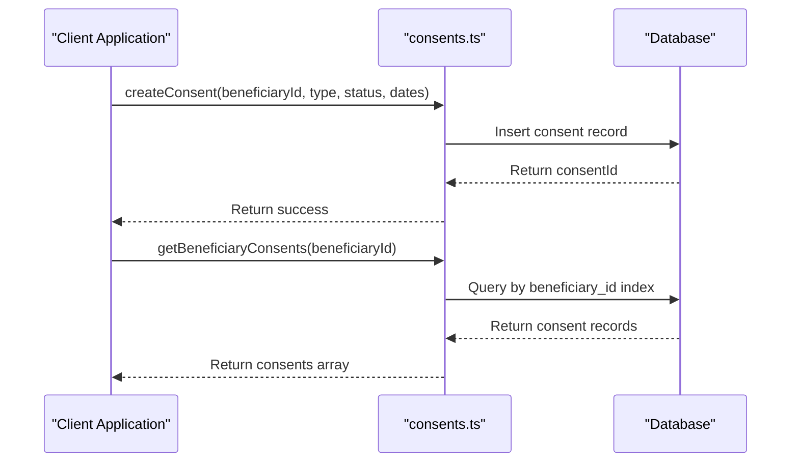
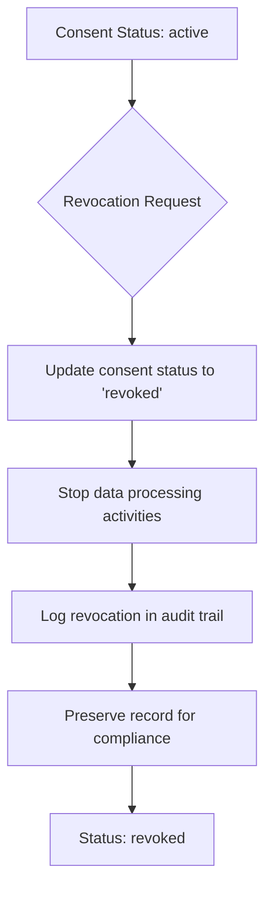

# Consent Management

<cite>
**Referenced Files in This Document**   
- [consents.ts](file://convex/consents.ts)
- [KVKK_GDPR_COMPLIANCE.md](file://docs/KVKK_GDPR_COMPLIANCE.md)
- [audit_logs.ts](file://convex/audit_logs.ts)
- [beneficiaries.ts](file://convex/beneficiaries.ts)
</cite>

## Table of Contents

1. [Introduction](#introduction)
2. [Consent Schema Structure](#consent-schema-structure)
3. [Relationship with Beneficiaries](#relationship-with-beneficiaries)
4. [Business Logic Implementation](#business-logic-implementation)
5. [Compliance with KVKK and GDPR](#compliance-with-kvkk-and-gdpr)
6. [Consent Revocation Process](#consent-revocation-process)
7. [Audit Logging and Monitoring](#audit-logging-and-monitoring)
8. [Common Issues and Handling](#common-issues-and-handling)
9. [Conclusion](#conclusion)

## Introduction

The Consent Management sub-feature within the Beneficiary Management system provides a structured approach to handling personal data consent in compliance with Turkish KVKK and EU GDPR regulations. This system enables the collection, tracking, and management of beneficiary consents through a well-defined schema and secure processing logic. The implementation ensures that all data processing activities are based on valid, documented consent with proper audit trails.

## Consent Schema Structure

The consent collection schema is designed to capture essential information about each consent record, including type, status, dates, and metadata. The schema fields are implemented in the `consents` table with strict validation rules.

**Key Schema Fields:**

- `consent_type`: Categorizes the purpose of consent (e.g., data_processing, communication)
- `status`: Tracks current state with allowed values: active, revoked, expired
- `signed_at`: Records the date when consent was obtained
- `expires_at`: Optional field indicating when consent expires
- `beneficiary_id`: Links consent to a specific beneficiary
- `created_by`: References the user who created the consent record
- `notes`: Additional contextual information about the consent

The schema enforces data integrity through type validation and required fields, ensuring only properly formatted consent records can be created.

**Section sources**

- [consents.ts](file://convex/consents.ts#L20-L46)

## Relationship with Beneficiaries

The system establishes a clear relationship between beneficiaries and their consent records through the `beneficiary_id` field. This foreign key relationship enables efficient retrieval of all consents associated with a specific beneficiary and maintains referential integrity.

Each consent record is directly linked to exactly one beneficiary, while a single beneficiary may have multiple consent records of different types. This one-to-many relationship supports comprehensive consent management across various data processing activities.

The relationship is optimized for querying through a database index on the `by_beneficiary` field, allowing fast retrieval of consent records without full table scans.

**Section sources**

- [consents.ts](file://convex/consents.ts#L5-L16)
- [beneficiaries.ts](file://convex/beneficiaries.ts#L1-L229)

## Business Logic Implementation

The business logic for consent management is implemented in the `consents.ts` file, providing operations for creating, updating, and retrieving consent records. The implementation follows a secure, auditable pattern using Convex database operations.

### Create Operation

The `createConsent` mutation inserts new consent records with validation of required fields including beneficiary ID, consent type, text, status, and signed date. The operation ensures that all consents are properly attributed to a beneficiary and created with a valid initial status.

### Update Operation

The `updateConsent` mutation allows modification of consent records, primarily for status changes (e.g., from active to revoked) or updating expiration dates. The implementation uses patch operations to modify only specified fields, preserving existing data integrity.

### Retrieve Operation

The `getBeneficiaryConsents` query retrieves all consent records for a specific beneficiary using the indexed `by_beneficiary` lookup. This enables efficient access to a beneficiary's complete consent history.

The system enforces valid status transitions and prevents invalid state changes through application-level validation.



**Diagram sources**

- [consents.ts](file://convex/consents.ts#L19-L72)

**Section sources**

- [consents.ts](file://convex/consents.ts#L19-L72)

## Compliance with KVKK and GDPR

The system implements comprehensive compliance measures with both Turkish KVKK and EU GDPR regulations as documented in the KVKK_GDPR_COMPLIANCE.md file. The consent management feature serves as a cornerstone for legal data processing.

### Legal Basis for Processing

Explicit consent is required before collecting or processing personal data, with the consent record serving as the legal basis. The system documents:

- Purpose of data collection
- Data usage scope
- Retention period
- Data subject rights

### Data Subject Rights

The implementation supports all major data subject rights:

- Right to access consent records
- Right to rectification of consent information
- Right to erasure (consent revocation)
- Right to data portability

Consent records include expiration dates and automatic expiration logic to comply with storage limitation principles.

**Section sources**

- [KVKK_GDPR_COMPLIANCE.md](file://docs/KVKK_GDPR_COMPLIANCE.md#L103-L120)

## Consent Revocation Process

The system provides a formal process for consent revocation that immediately impacts data processing activities. When a consent status is updated to "revoked" through the `updateConsent` mutation, the system triggers appropriate actions.

Revocation stops all future data processing activities covered by that consent and may initiate data deletion procedures based on retention policies. The original consent record is preserved for audit purposes, but marked as inactive.

The revocation process is irreversible and logged in the audit trail with details of who performed the revocation and when. This ensures accountability and compliance with regulatory requirements.



**Diagram sources**

- [consents.ts](file://convex/consents.ts#L49-L61)
- [audit_logs.ts](file://convex/audit_logs.ts#L11-L34)

**Section sources**

- [consents.ts](file://convex/consents.ts#L49-L61)

## Audit Logging and Monitoring

All consent operations are integrated with the system's audit logging mechanism to ensure complete traceability and compliance. The audit_logs.ts implementation captures critical information about consent-related activities.

Every create, update, and delete operation on consent records generates an audit log entry containing:

- User ID and name performing the action
- Action type (CREATE, UPDATE, DELETE)
- Resource type and ID
- Timestamp of the action
- IP address and user agent (when available)

The audit system enables monitoring of consent management activities and supports compliance audits by providing a complete history of consent changes. Administrators can retrieve the history of any consent record using the `getResourceHistory` query.

**Section sources**

- [audit_logs.ts](file://convex/audit_logs.ts#L11-L34)
- [consents.ts](file://convex/consents.ts#L20-L72)

## Common Issues and Handling

The system addresses several common issues related to consent management:

### Expired Consent Notifications

The system monitors consent expiration dates and can trigger notifications when consents are approaching expiration. This allows administrators to contact beneficiaries for renewal before processing activities must be suspended.

### Audit Logging Requirements

All consent operations are automatically logged without requiring additional developer intervention. The logging system captures sufficient detail to demonstrate compliance during audits.

### Data Processing Impact

When consents are revoked or expire, the system automatically restricts data processing activities. This prevents unauthorized use of personal data and ensures compliance with the principle of lawful processing.

### Retrieval of Active Consents

To retrieve all active consents for a beneficiary, the system combines the `getBeneficiaryConsents` query with client-side filtering for status:

```typescript
// Example usage pattern
const consents = await getBeneficiaryConsents(beneficiaryId);
const activeConsents = consents.filter((c) => c.status === 'active');
```

This pattern ensures that applications can easily identify which consents are currently valid for data processing.

**Section sources**

- [consents.ts](file://convex/consents.ts#L5-L16)
- [KVKK_GDPR_COMPLIANCE.md](file://docs/KVKK_GDPR_COMPLIANCE.md#L241-L331)

## Conclusion

The Consent Management sub-feature provides a robust, compliant solution for handling personal data consent in the Beneficiary Management system. By implementing a well-structured schema, clear beneficiary relationships, and comprehensive business logic, the system ensures that all data processing activities are based on valid consent. Integration with KVKK and GDPR compliance requirements, along with thorough audit logging, creates a trustworthy framework for managing sensitive personal data while respecting individual rights and regulatory obligations.
