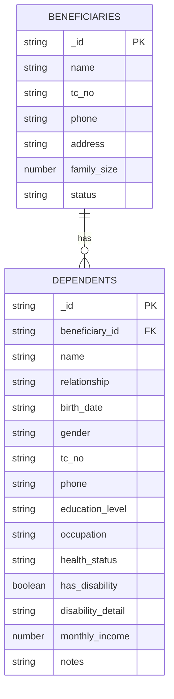
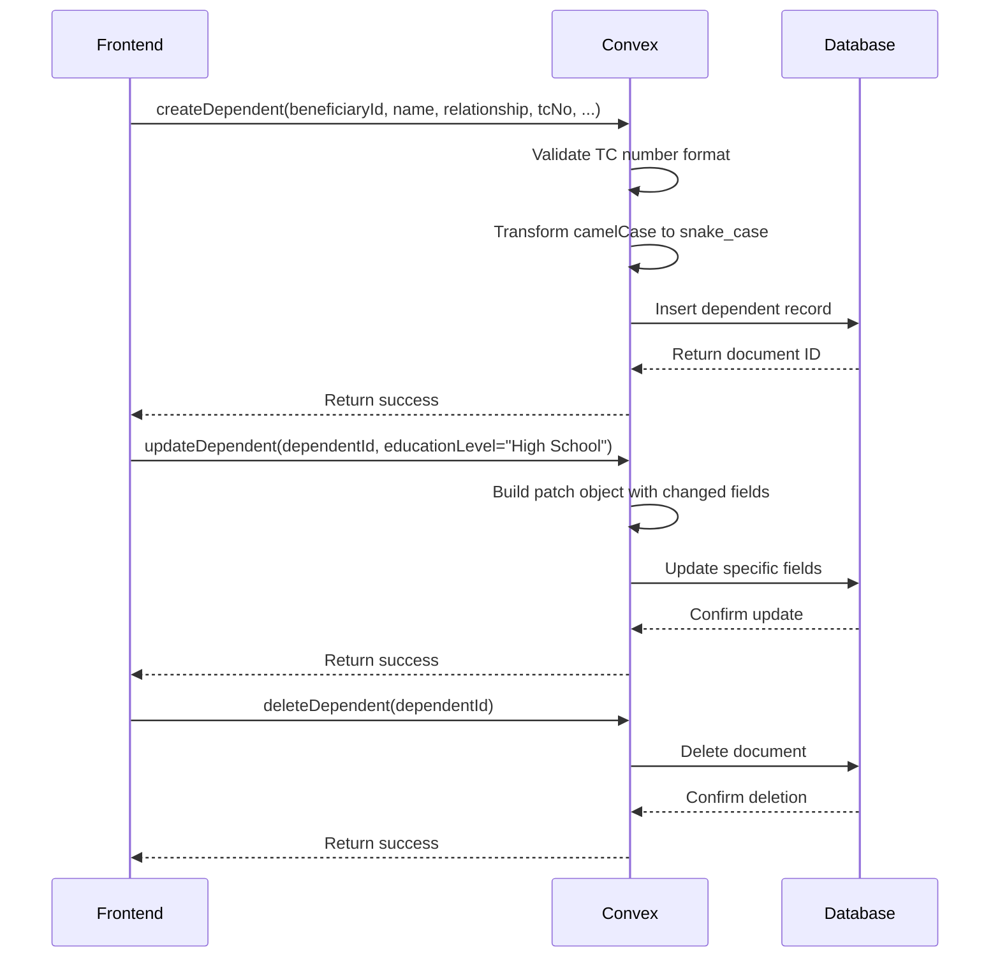
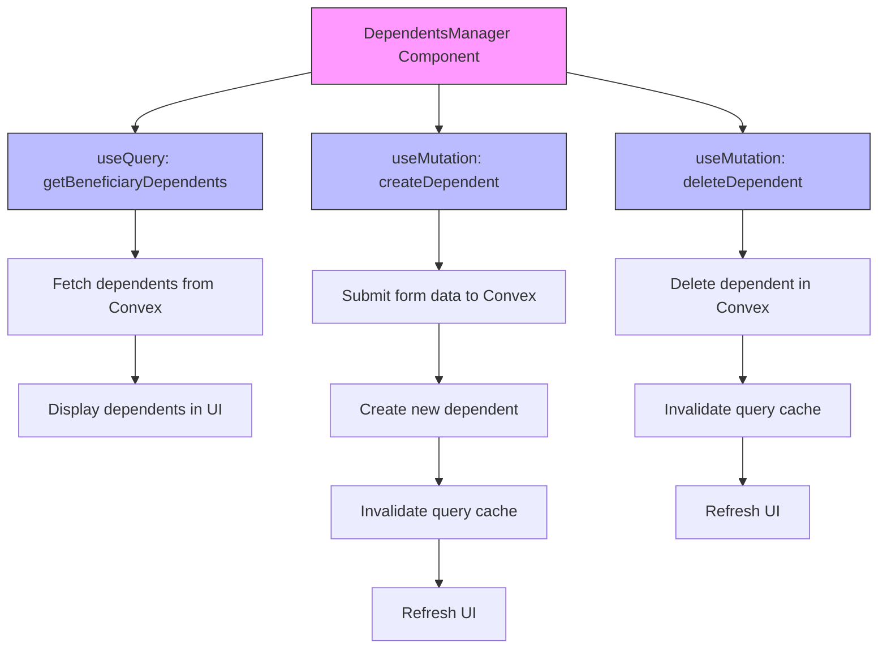

# Dependent Tracking

<cite>
**Referenced Files in This Document**   
- [dependents.ts](file://convex/dependents.ts)
- [DependentsManager.tsx](file://src/components/dependents/DependentsManager.tsx)
- [beneficiaries.ts](file://convex/beneficiaries.ts)
</cite>

## Table of Contents

1. [Introduction](#introduction)
2. [Dependents Collection Schema](#dependents-collection-schema)
3. [CRUD Operations and Business Logic](#crud-operations-and-business-logic)
4. [Data Retrieval and Indexing](#data-retrieval-and-indexing)
5. [Frontend Integration](#frontend-integration)
6. [Data Integrity and Privacy](#data-integrity-and-privacy)
7. [Common Usage Patterns](#common-usage-patterns)
8. [Troubleshooting and Error Handling](#troubleshooting-and-error-handling)

## Introduction

The Dependent Tracking sub-feature of the Beneficiary Management system enables comprehensive management of individuals dependent on beneficiaries. This functionality supports social assistance programs by maintaining detailed records of family members and dependents, including personal, educational, and health information. The system establishes a one-to-many relationship between beneficiaries and their dependents, allowing for holistic assessment of family needs and targeted aid distribution.

**Section sources**

- [dependents.ts](file://convex/dependents.ts#L1-L140)

## Dependents Collection Schema

The dependents collection schema is designed to capture comprehensive information about individuals dependent on beneficiaries. Each dependent record is linked to a beneficiary through the beneficiary_id foreign key, establishing the one-to-many relationship. The schema includes the following fields:

- **name**: String field storing the full name of the dependent (required)
- **relationship**: String field indicating the relationship type (e.g., child, spouse, parent)
- **birth_date**: Optional string field for the dependent's date of birth in ISO format
- **gender**: Optional string field for gender information
- **tc_no**: Optional string field for the Turkish Identification Number (11 digits)
- **phone**: Optional string field for contact information
- **education_level**: Optional string field for educational attainment
- **occupation**: Optional string field for employment status
- **health_status**: Optional string field for general health condition
- **has_disability**: Boolean flag indicating disability status (defaults to false)
- **disability_detail**: Optional string field for specific disability information
- **monthly_income**: Optional numeric field for income in Turkish Lira
- **notes**: Optional string field for additional information

The schema enforces data integrity through proper typing and validation rules, ensuring consistent data quality across the system.

**Diagram sources **

- [dependents.ts](file://convex/dependents.ts#L21-L63)
- [beneficiaries.ts](file://convex/beneficiaries.ts#L90-L169)

## CRUD Operations and Business Logic

The business logic for dependent management is implemented in the dependents.ts file, which contains Convex functions for creating, reading, updating, and deleting dependent records. These functions enforce data validation rules and maintain referential integrity with the beneficiaries collection.

The createDependent mutation validates input parameters and inserts a new dependent record linked to the specified beneficiary. It includes TC number validation using a regular expression pattern (/^\d{11}$/) to ensure the 11-digit format required for Turkish identification numbers. The function transforms camelCase input parameters to snake_case for database storage, maintaining consistency with the overall schema design.

The updateDependent mutation implements partial updates, allowing modification of specific fields without requiring all data to be resent. It includes conditional validation for the TC number field, only validating when the field is present and non-empty. The implementation uses a patch object to selectively update only the fields that have been modified, optimizing database operations.

The deleteDependent mutation removes a dependent record by its ID, with no additional validation required beyond the existence of the record.

**Diagram sources **

- [dependents.ts](file://convex/dependents.ts#L21-L137)

**Section sources**

- [dependents.ts](file://convex/dependents.ts#L21-L137)

## Data Retrieval and Indexing

The system provides efficient data retrieval through the getBeneficiaryDependents query function, which retrieves all dependents associated with a specific beneficiary. This function uses the by_beneficiary index to optimize query performance, enabling fast lookups based on the beneficiary_id foreign key.

The indexing strategy ensures that queries for dependents are performed efficiently, even as the dataset grows. The by_beneficiary index is created on the beneficiary_id field, allowing the database to quickly locate all dependent records for a given beneficiary without scanning the entire collection.

When retrieving dependents, the system returns a complete array of dependent objects, which can be used to display family information in the user interface. The query function accepts a beneficiaryId parameter and returns all matching dependent records, properly typed according to the schema definition.

**Section sources**

- [dependents.ts](file://convex/dependents.ts#L6-L18)

## Frontend Integration

The frontend integration is implemented through the DependentManager component, which provides a user interface for managing dependent records. This React component uses TanStack Query for data fetching and mutation handling, ensuring optimal performance and automatic cache management.

The component establishes a connection between the user interface and the Convex backend functions through the convexApiClient. It uses the getBeneficiaryDependents query to fetch all dependents for the current beneficiary, automatically updating the display when data changes. The create, update, and delete operations are handled through corresponding mutations that call the appropriate Convex functions.

The user interface includes a form for adding new dependents with validation for required fields. It displays existing dependents in a card-based layout, showing key information such as name, relationship, and important details like education level and health status. Each dependent card includes a delete button that triggers the deleteDependent mutation.

The component implements proper loading states and error handling, providing feedback to users during operations. Success and error notifications are displayed using the toast utility, enhancing the user experience.

**Diagram sources **

- [DependentsManager.tsx](file://src/components/dependents/DependentsManager.tsx#L35-L337)

**Section sources**

- [DependentsManager.tsx](file://src/components/dependents/DependentsManager.tsx#L35-L337)

## Data Integrity and Privacy

The system implements several measures to ensure data integrity and protect dependent information. TC number validation is performed on both creation and update operations, preventing the storage of invalid identification numbers. The validation function uses a regular expression to verify the 11-digit format required for Turkish identification numbers.

To maintain family size consistency, the system should be extended to update the family_size field in the beneficiary record when dependents are added or removed. This would ensure that the beneficiary's family size accurately reflects the current number of dependents.

Data privacy is addressed through proper access controls and field-level security. Sensitive information such as TC numbers and health details are stored securely and should only be accessible to authorized personnel. The system implements proper error handling that does not expose sensitive information in error messages.

The schema design includes appropriate field typing and constraints to prevent data corruption. Optional fields are properly marked, and default values are applied where appropriate (such as false for the has_disability field).

**Section sources**

- [dependents.ts](file://convex/dependents.ts#L40-L42)
- [dependents.ts](file://convex/dependents.ts#L85-L88)

## Common Usage Patterns

The Dependent Tracking system supports several common usage patterns for managing beneficiary families:

**Adding a Child**: To add a child to a beneficiary's family, users can click the "Yeni Kişi" (New Person) button in the DependentManager interface. The form should be pre-populated with "child" as the default relationship. Required fields include the child's name, with optional fields for birth date, TC number, and education level. Upon submission, the system creates a new dependent record linked to the beneficiary.

**Updating Education Status**: To update a dependent's education status, users can modify the educationLevel field through the editing interface. The system will send only the changed field to the backend, optimizing network usage. Common education levels include "İlkokul" (Primary School), "Ortaokul" (Middle School), "Lise" (High School), and "Üniversite" (University).

**Managing Health Information**: The health_status and has_disability fields allow tracking of dependents' medical conditions. When has_disability is set to true, the disability_detail field should be populated with specific information about the disability. This information helps determine eligibility for specific assistance programs.

**Family Composition Analysis**: The system enables analysis of family composition by relationship type. This information can be used to identify families with multiple children, elderly dependents, or members with disabilities, allowing for targeted assistance programs.

These usage patterns demonstrate the system's flexibility in managing diverse family situations while maintaining data integrity and supporting the organization's social assistance mission.

**Section sources**

- [DependentsManager.tsx](file://src/components/dependents/DependentsManager.tsx#L139-L143)
- [dependents.ts](file://convex/dependents.ts#L21-L63)

## Troubleshooting and Error Handling

The system implements comprehensive error handling to address common issues in dependent management. TC number validation errors are caught and reported with clear messages when the 11-digit format is not met. Network errors during CRUD operations are handled gracefully, with appropriate user feedback.

Common issues include:

- **TC Number Validation**: Invalid TC numbers trigger "Invalid TC number format" errors. Users should verify the 11-digit number and correct any typos.
- **Network Connectivity**: Loss of connection during operations is handled with appropriate error messages, advising users to check their internet connection.
- **Data Consistency**: Inconsistencies between the beneficiary's family_size and the actual number of dependents can occur if the system doesn't automatically update this field. This should be addressed through additional business logic.
- **Duplicate Entries**: The system does not currently prevent duplicate entries for the same person. Additional validation could be implemented to check for existing dependents with the same name and birth date.

Error messages are displayed using the toast notification system, providing immediate feedback to users. The backend functions return structured error responses that are translated into user-friendly messages in the frontend interface.

**Section sources**

- [dependents.ts](file://convex/dependents.ts#L40-L42)
- [DependentsManager.tsx](file://src/components/dependents/DependentsManager.tsx#L106-L107)
- [DependentsManager.tsx](file://src/components/dependents/DependentsManager.tsx#L120-L121)
