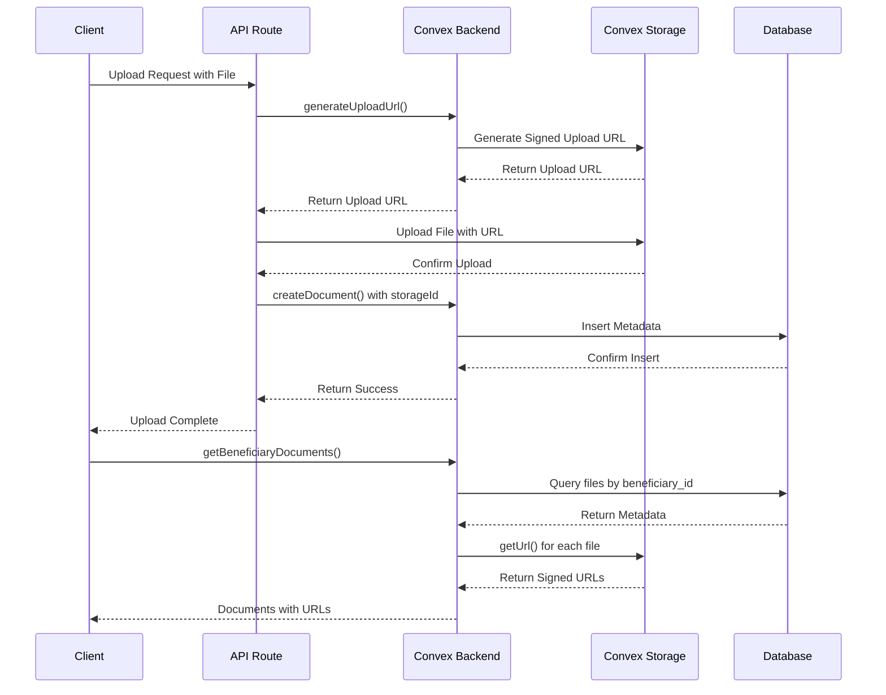
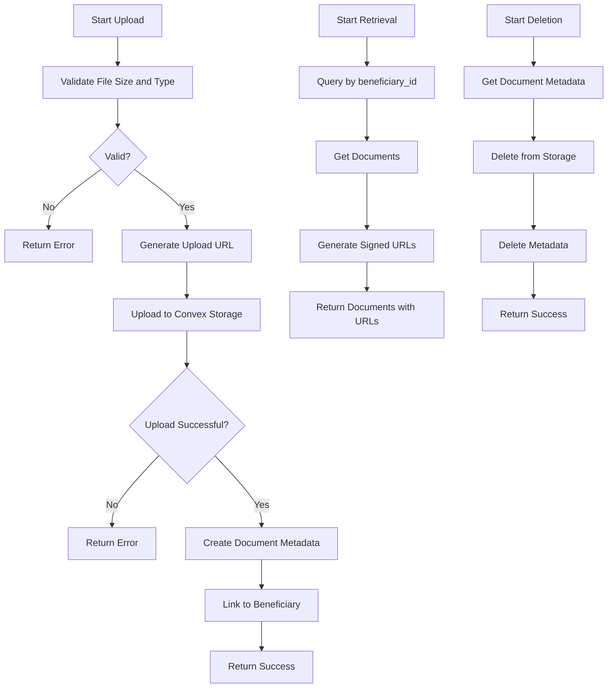

# Document Management

<cite>
**Referenced Files in This Document**   
- [documents.ts](file://convex/documents.ts)
- [schema.ts](file://convex/schema.ts)
- [storage.ts](file://convex/storage.ts)
- [DocumentsManager.tsx](file://src/components/documents/DocumentsManager.tsx)
- [route.ts](file://src/app/api/storage/upload/route.ts)
</cite>

## Table of Contents

1. [Introduction](#introduction)
2. [Files Collection Schema and Beneficiary Relationship](#files-collection-schema-and-beneficiary-relationship)
3. [Convex Storage and Database Metadata Integration](#convex-storage-and-database-metadata-integration)
4. [Document Management Business Logic](#document-management-business-logic)
5. [Security and Authorization](#security-and-authorization)
6. [Common Issues and Best Practices](#common-issues-and-best-practices)

## Introduction

The Document Management sub-feature within the Beneficiary Management system provides a comprehensive solution for handling files associated with beneficiaries. This system integrates Convex's file storage capabilities with a structured database schema to ensure secure, efficient, and organized document management. The implementation enables users to upload, retrieve, and delete documents while maintaining a clear relationship between files and beneficiaries through the `beneficiary_id` field. This documentation details the architecture, business logic, and security considerations of the document management system.

## Files Collection Schema and Beneficiary Relationship

The document management system is built around the `files` collection defined in the Convex schema. This collection stores metadata for all uploaded files and establishes a critical relationship with beneficiaries through the `beneficiary_id` field. The schema includes essential fields such as `fileName`, `fileSize`, `fileType`, `bucket`, `storageId`, `uploadedAt`, and `document_type`. The `beneficiary_id` field, defined as `v.optional(v.id('beneficiaries'))`, creates a direct link between a document and its associated beneficiary, enabling efficient querying and retrieval of all documents for a specific beneficiary.

The schema implements several indexes to optimize query performance, including `by_beneficiary` for retrieving documents by beneficiary ID, `by_storage_id` for accessing files by their storage identifier, `by_bucket` for organizing files by storage category, and `by_uploaded_by` for tracking file ownership. This indexing strategy ensures that document retrieval operations are performed efficiently, even as the system scales with increasing numbers of files and beneficiaries.

```mermaid
erDiagram
files {
string fileName
number fileSize
string fileType
string bucket
Id<_storage> storageId
Id<users> uploadedBy
string uploadedAt
Id<beneficiaries> beneficiary_id
string document_type
}
beneficiaries {
string name
string tc_no
string phone
string email
string status
}
files ||--o{ beneficiaries : "belongs to"
```

**Diagram sources**

- [schema.ts](file://convex/schema.ts#L581-L604)

**Section sources**

- [schema.ts](file://convex/schema.ts#L581-L604)

## Convex Storage and Database Metadata Integration

The document management system implements a dual-layer architecture that separates file storage from metadata management. Convex's file storage handles the actual binary content of uploaded files, while the database maintains structured metadata in the `files` collection. This separation of concerns provides several advantages, including optimized storage costs, improved performance, and enhanced security.

The integration between Convex storage and database metadata is facilitated through the `storageId` field, which serves as a reference to the `_storage` collection. When a file is uploaded, Convex generates a unique `storageId` that is stored in the database record, creating a bridge between the metadata and the actual file content. This design allows the system to retrieve file metadata quickly from the database while generating signed URLs for secure access to the file content in storage.

The system implements several Convex functions to manage this integration, including `generateUploadUrl` for creating temporary upload endpoints, `getUrl` for generating signed download URLs, and `delete` for removing files from storage. These functions work in conjunction with database operations to ensure that file operations are atomic and consistent across both storage and metadata layers.



**Diagram sources**

- [documents.ts](file://convex/documents.ts)
- [storage.ts](file://convex/storage.ts)
- [route.ts](file://src/app/api/storage/upload/route.ts)

**Section sources**

- [documents.ts](file://convex/documents.ts)
- [storage.ts](file://convex/storage.ts)
- [route.ts](file://src/app/api/storage/upload/route.ts)

## Document Management Business Logic

The business logic for document management is implemented across multiple layers of the application, from the Convex backend functions to the frontend components. The system provides three core operations: uploading, retrieving, and deleting documents, each with specific implementation details to ensure data integrity and user experience.

### Uploading Documents

The document upload process begins with the frontend `DocumentsManager` component, which handles file selection and initiates the upload process. When a user selects or drags a file, the component sends a POST request to the `/api/storage/upload` API route with the file and metadata. This route validates the file size (capped at 10MB) and type (limited to images, PDFs, and common document formats) before proceeding.

The upload process follows a two-step approach: first, the system generates an upload URL using Convex's `generateUploadUrl` function, then uploads the file directly to Convex storage using this URL. Upon successful upload, the system creates a document metadata record in the database using the `createDocument` mutation, linking the file to the appropriate beneficiary through the `beneficiary_id` field.

### Retrieving Documents

Document retrieval is handled by the `getBeneficiaryDocuments` query, which fetches all documents associated with a specific beneficiary. The query uses the `by_beneficiary` index to efficiently locate relevant records in the `files` collection. For each document, the system generates a signed URL using `ctx.storage.getUrl(doc.storageId)` to enable secure access to the file content. This approach ensures that users can view and download documents without exposing direct storage paths.

### Deleting Documents

The document deletion process implements a critical safety mechanism by ensuring that files are removed from both the database and Convex storage. The `deleteDocument` mutation first retrieves the document metadata to obtain the `storageId`, then deletes the file from Convex storage using `ctx.storage.delete(document.storageId)`, and finally removes the metadata record from the database with `ctx.db.delete(args.documentId)`. This two-step deletion process prevents orphaned files in storage and maintains data consistency.



**Diagram sources**

- [documents.ts](file://convex/documents.ts)
- [route.ts](file://src/app/api/storage/upload/route.ts)

**Section sources**

- [documents.ts](file://convex/documents.ts#L4-L98)
- [route.ts](file://src/app/api/storage/upload/route.ts#L5-L96)
- [DocumentsManager.tsx](file://src/components/documents/DocumentsManager.tsx#L79-L107)

## Security and Authorization

The document management system implements several security measures to protect sensitive beneficiary information. Access control is enforced through Convex's authentication and authorization mechanisms, ensuring that only authorized users can perform document operations. The system generates signed URLs for file access, which include expiration times and access restrictions to prevent unauthorized sharing.

The implementation includes validation at multiple levels: file type validation in the API route restricts uploads to approved formats, file size validation prevents excessive storage usage, and beneficiary ID validation ensures that documents are properly associated with existing beneficiaries. Additionally, the system implements proper error handling to prevent information leakage in error messages.

Authorization checks are performed implicitly through the Convex security model, which requires authenticated sessions for accessing document operations. The frontend components also implement client-side checks to ensure that users have appropriate permissions before allowing document operations, providing an additional layer of security.

**Section sources**

- [documents.ts](file://convex/documents.ts)
- [route.ts](file://src/app/api/storage/upload/route.ts)
- [DocumentsManager.tsx](file://src/components/documents/DocumentsManager.tsx)

## Common Issues and Best Practices

The document management system addresses several common challenges in file handling and provides guidance for optimal usage.

### Handling Large File Uploads

While the system currently limits file uploads to 10MB, this constraint helps prevent performance issues and excessive storage costs. For larger files, the system could be extended to support chunked uploads or external storage integration. The validation process in the API route ensures that oversized files are rejected before consuming server resources.

### Managing Document Types

The system supports a defined set of document types including images (JPEG, PNG, WebP), PDFs, and common office document formats. This controlled approach ensures compatibility and security by preventing potentially harmful file types. The `document_type` field in the metadata allows for additional categorization of documents beyond their MIME type.

### Ensuring Data Privacy

Sensitive beneficiary documents are protected through multiple mechanisms: encrypted storage in Convex, signed URLs with limited lifetimes, and access controls based on user roles. The system should be extended with audit logging to track document access and modifications, providing an additional layer of accountability for sensitive data handling.

**Section sources**

- [route.ts](file://src/app/api/storage/upload/route.ts#L20-L44)
- [schema.ts](file://convex/schema.ts#L596-L599)
- [documents.ts](file://convex/documents.ts#L60-L61)
