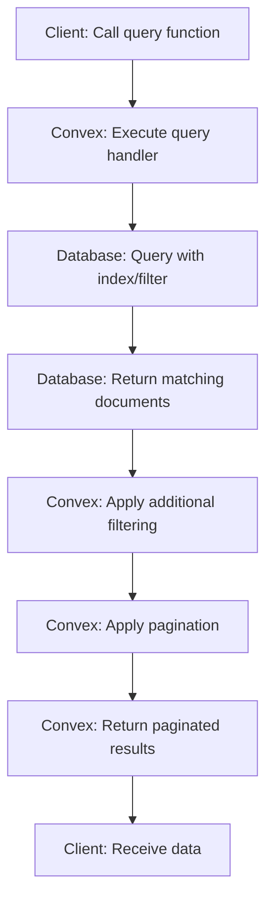
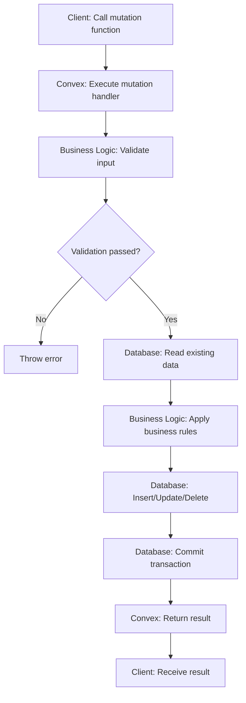
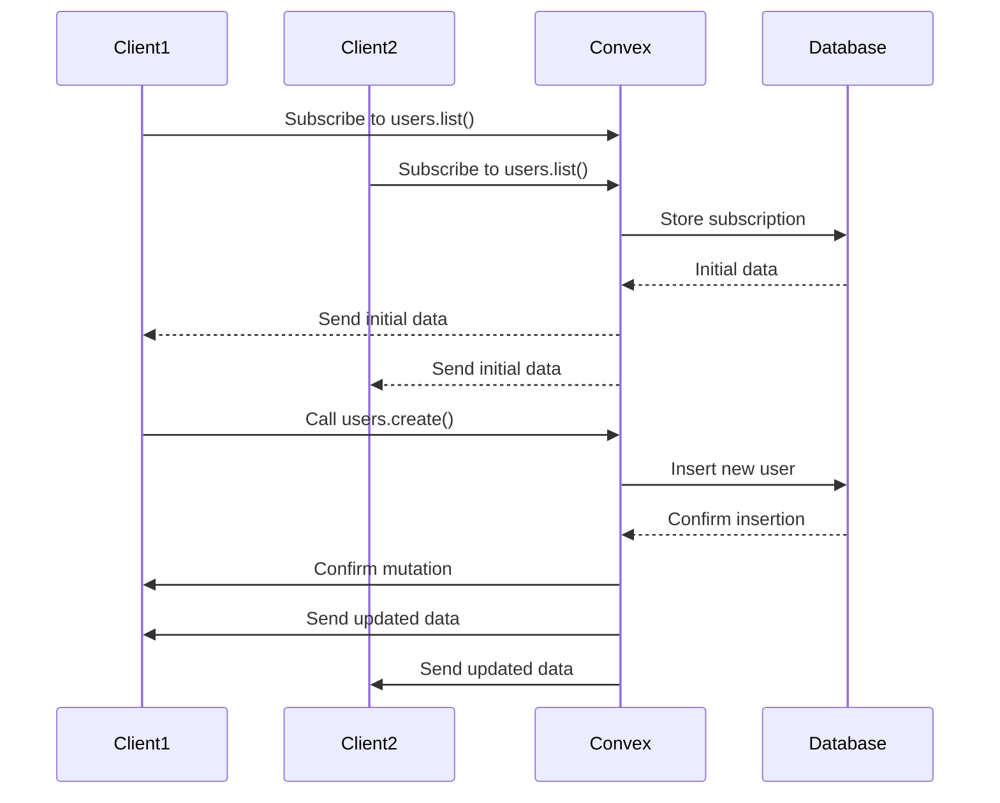
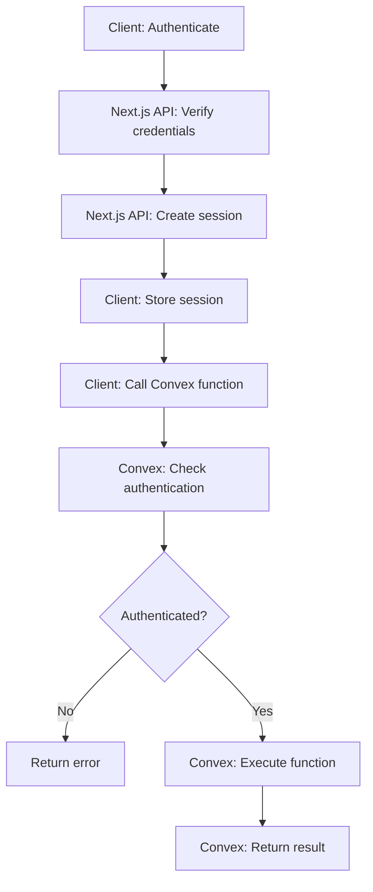
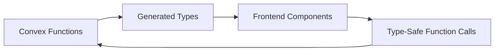
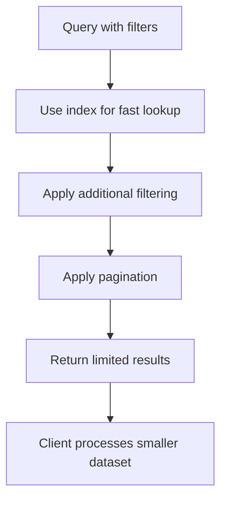
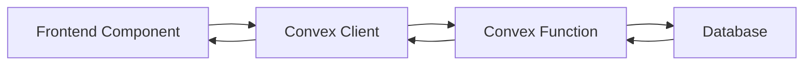

# Convex Functions and Data Model

<cite>
**Referenced Files in This Document**   
- [schema.ts](file://convex/schema.ts)
- [users.ts](file://convex/users.ts)
- [beneficiaries.ts](file://convex/beneficiaries.ts)
- [auth.ts](file://convex/auth.ts)
- [tasks.ts](file://convex/tasks.ts)
- [meetings.ts](file://convex/meetings.ts)
- [donations.ts](file://convex/donations.ts)
- [finance_records.ts](file://convex/finance_records.ts)
- [aid_applications.ts](file://convex/aid_applications.ts)
- [meeting_decisions.ts](file://convex/meeting_decisions.ts)
- [meeting_action_items.ts](file://convex/meeting_action_items.ts)
- [workflow_notifications.ts](file://convex/workflow_notifications.ts)
- [messages.ts](file://convex/messages.ts)
- [communication_logs.ts](file://convex/communication_logs.ts)
- [audit_logs.ts](file://convex/audit_logs.ts)
- [partners.ts](file://convex/partners.ts)
- [bank_accounts.ts](file://convex/bank_accounts.ts)
- [consents.ts](file://convex/consents.ts)
- [dependents.ts](file://convex/dependents.ts)
- [system_settings.ts](file://convex/system_settings.ts)
- [scholarships.ts](file://convex/scholarships.ts)
- [parameters.ts](file://convex/parameters.ts)
- [files.ts](file://convex/files.ts)
- [_generated/api.d.ts](file://convex/_generated/api.d.ts)
- [client.ts](file://src/lib/convex/client.ts)
</cite>

## Table of Contents

1. [Introduction](#introduction)
2. [Data Model and Schema Definition](#data-model-and-schema-definition)
3. [Convex Functions Organization](#convex-functions-organization)
4. [Query Functions and Data Retrieval](#query-functions-and-data-retrieval)
5. [Mutation Functions and State Modification](#mutation-functions-and-state-modification)
6. [Real-time Data Synchronization](#real-time-data-synchronization)
7. [Security and Access Control](#security-and-access-control)
8. [Type Safety and Generated API](#type-safety-and-generated-api)
9. [Performance Considerations](#performance-considerations)
10. [Integration with Frontend Components](#integration-with-frontend-components)
11. [Conclusion](#conclusion)

## Introduction

The Convex backend layer of PORTAL provides a serverless, real-time data platform that serves as the foundation for the application's business logic and data management. This documentation details the architecture of Convex functions, data modeling, and integration patterns that enable efficient, secure, and scalable operations for managing beneficiaries, donations, tasks, meetings, and other domain-specific entities. The system leverages Convex's query and mutation system to encapsulate business logic, ensuring data consistency and enabling real-time updates across clients.

## Data Model and Schema Definition

The data model for PORTAL is defined in the `schema.ts` file, which uses Convex's schema definition system to declare collections, indexes, and data validation rules. The schema establishes the structure of all data entities in the application, ensuring type safety and consistency across the system.

```mermaid
erDiagram
users {
string name
string email
string role
string[] permissions
string phone
string avatar
boolean isActive
string[] labels
string createdAt
string lastLogin
}
beneficiaries {
string name
string tc_no
string phone
string email
string birth_date
string gender
string nationality
string religion
string marital_status
string address
string city
string district
string neighborhood
number family_size
number children_count
number orphan_children_count
number elderly_count
number disabled_count
string income_level
string income_source
boolean has_debt
string housing_type
boolean has_vehicle
string health_status
boolean has_chronic_illness
string chronic_illness_detail
boolean has_disability
string disability_detail
boolean has_health_insurance
string regular_medication
string education_level
string occupation
string employment_status
string aid_type
number totalAidAmount
string aid_duration
string priority
string reference_name
string reference_phone
string reference_relation
string application_source
string notes
boolean previous_aid
boolean other_organization_aid
boolean emergency
string contact_preference
string status
string approval_status
string approved_by
string approved_at
}
donations {
string donor_name
string donor_phone
string donor_email
number amount
string currency
string donation_type
string payment_method
string donation_purpose
string notes
string receipt_number
string receipt_file_id
string status
boolean is_kumbara
string kumbara_location
string collection_date
string kumbara_institution
object location_coordinates
string location_address
object[] route_points
number route_distance
number route_duration
}
tasks {
string title
string description
Id<'users'> assigned_to
Id<'users'> created_by
string priority
string status
string due_date
string completed_at
string category
string[] tags
boolean is_read
}
meetings {
string title
string description
string meeting_date
string location
Id<'users'> organizer
Id<'users'>[] participants
string status
string meeting_type
string agenda
string notes
}
messages {
string message_type
Id<'users'> sender
Id<'users'>[] recipients
string subject
string content
string sent_at
string status
boolean is_bulk
string template_id
}
aid_applications {
string application_date
string applicant_type
string applicant_name
Id<'beneficiaries'> beneficiary_id
number one_time_aid
number regular_financial_aid
number regular_food_aid
number in_kind_aid
number service_referral
string stage
string status
string description
string notes
string priority
Id<'users'> processed_by
string processed_at
Id<'users'> approved_by
string approved_at
string completed_at
}
finance_records {
string record_type
string category
number amount
string currency
string description
string transaction_date
string payment_method
string receipt_number
string receipt_file_id
string related_to
Id<'users'> created_by
Id<'users'> approved_by
string status
}
meeting_decisions {
Id<'meetings'> meeting_id
string title
string summary
Id<'users'> owner
Id<'users'> created_by
string created_at
string status
string[] tags
string due_date
}
meeting_action_items {
Id<'meetings'> meeting_id
Id<'meeting_decisions'> decision_id
string title
string description
Id<'users'> assigned_to
Id<'users'> created_by
string created_at
string status
string due_date
string completed_at
object[] status_history
string[] notes
string reminder_scheduled_at
}
workflow_notifications {
Id<'users'> recipient
Id<'users'> triggered_by
string category
string title
string body
string status
string created_at
string sent_at
string read_at
object reference
any metadata
}
users ||--o{ tasks : "creates"
users ||--o{ meetings : "organizes"
users ||--o{ messages : "sends"
users ||--o{ finance_records : "creates"
users ||--o{ workflow_notifications : "receives"
beneficiaries ||--o{ aid_applications : "receives"
beneficiaries ||--o{ bank_accounts : "has"
beneficiaries ||--o{ consents : "gives"
beneficiaries ||--o{ dependents : "supports"
meetings ||--o{ meeting_decisions : "contains"
meeting_decisions ||--o{ meeting_action_items : "generates"
donations ||--o{ finance_records : "generates"
aid_applications ||--o{ finance_records : "generates"
```

**Diagram sources**

- [schema.ts](file://convex/schema.ts#L4-L806)

**Section sources**

- [schema.ts](file://convex/schema.ts#L4-L806)

## Convex Functions Organization

The Convex functions in PORTAL are organized by feature domain, with each domain having its own TypeScript file in the `convex/` directory. This modular organization groups related business logic together, making the codebase more maintainable and easier to understand. Each function file corresponds to a specific domain entity such as users, beneficiaries, donations, tasks, and meetings.

The organization follows a consistent pattern where each domain has query functions for data retrieval and mutation functions for state modification. This separation of concerns ensures that data access patterns are predictable and that business logic is encapsulated within the appropriate domain context. The functions are designed to be called from the frontend via the Convex client, enabling a clean separation between the UI layer and the business logic layer.

**Section sources**

- [users.ts](file://convex/users.ts)
- [beneficiaries.ts](file://convex/beneficiaries.ts)
- [donations.ts](file://convex/donations.ts)
- [tasks.ts](file://convex/tasks.ts)
- [meetings.ts](file://convex/meetings.ts)
- [aid_applications.ts](file://convex/aid_applications.ts)
- [finance_records.ts](file://convex/finance_records.ts)

## Query Functions and Data Retrieval

Query functions in Convex are used to retrieve data from the database in a read-only manner. These functions are defined using the `query` function from Convex and are designed to fetch data based on specific criteria. The query functions in PORTAL implement various filtering, sorting, and pagination capabilities to support the application's data retrieval needs.

For example, the `list` query function in the `users.ts` file allows retrieving users with optional filtering by search term, role, and active status, along with pagination support. Similarly, the `list` function in `beneficiaries.ts` supports filtering by status, city, and search term, enabling efficient data retrieval for different use cases.



**Diagram sources**

- [users.ts](file://convex/users.ts#L6-L63)
- [beneficiaries.ts](file://convex/beneficiaries.ts#L6-L60)
- [tasks.ts](file://convex/tasks.ts#L4-L43)
- [meetings.ts](file://convex/meetings.ts#L4-L40)
- [donations.ts](file://convex/donations.ts#L4-L52)
- [finance_records.ts](file://convex/finance_records.ts#L4-L43)
- [aid_applications.ts](file://convex/aid_applications.ts#L4-L43)

**Section sources**

- [users.ts](file://convex/users.ts#L6-L63)
- [beneficiaries.ts](file://convex/beneficiaries.ts#L6-L60)
- [tasks.ts](file://convex/tasks.ts#L4-L43)
- [meetings.ts](file://convex/meetings.ts#L4-L40)
- [donations.ts](file://convex/donations.ts#L4-L52)
- [finance_records.ts](file://convex/finance_records.ts#L4-L43)
- [aid_applications.ts](file://convex/aid_applications.ts#L4-L43)

## Mutation Functions and State Modification

Mutation functions in Convex are used to modify the state of the application by inserting, updating, or deleting data in the database. These functions are defined using the `mutation` function from Convex and ensure that all state changes are atomic and consistent. The mutation functions in PORTAL implement business logic for creating, updating, and deleting domain entities while enforcing data validation rules.

For example, the `create` mutation in `users.ts` handles user creation by normalizing the email address, checking for existing users with the same email, and inserting the new user record with appropriate default values. Similarly, the `create` mutation in `beneficiaries.ts` validates the Turkish National Identity Number (TC Kimlik No) format and checks for existing beneficiaries with the same TC number before creating a new record.



**Diagram sources**

- [users.ts](file://convex/users.ts#L83-L121)
- [beneficiaries.ts](file://convex/beneficiaries.ts#L89-L169)
- [tasks.ts](file://convex/tasks.ts#L54-L80)
- [meetings.ts](file://convex/meetings.ts#L51-L77)
- [donations.ts](file://convex/donations.ts#L76-L108)
- [finance_records.ts](file://convex/finance_records.ts#L54-L76)
- [aid_applications.ts](file://convex/aid_applications.ts#L54-L91)

**Section sources**

- [users.ts](file://convex/users.ts#L83-L121)
- [beneficiaries.ts](file://convex/beneficiaries.ts#L89-L169)
- [tasks.ts](file://convex/tasks.ts#L54-L80)
- [meetings.ts](file://convex/meetings.ts#L51-L77)
- [donations.ts](file://convex/donations.ts#L76-L108)
- [finance_records.ts](file://convex/finance_records.ts#L54-L76)
- [aid_applications.ts](file://convex/aid_applications.ts#L54-L91)

## Real-time Data Synchronization

Convex provides real-time data synchronization capabilities that enable the PORTAL application to maintain consistent state across all connected clients. When data is modified through mutation functions, Convex automatically propagates the changes to all clients that are subscribed to the relevant queries. This enables optimistic UI patterns where the user interface can be updated immediately based on the expected outcome of a mutation, with the actual data synchronization happening in the background.

The real-time synchronization is implemented through Convex's subscription system, where frontend components can subscribe to query functions and receive updates whenever the underlying data changes. This eliminates the need for manual polling and ensures that all users see the most up-to-date information without requiring page refreshes.



**Diagram sources**

- [users.ts](file://convex/users.ts)
- [client.ts](file://src/lib/convex/client.ts)

**Section sources**

- [users.ts](file://convex/users.ts)
- [client.ts](file://src/lib/convex/client.ts)

## Security and Access Control

Security in the Convex backend layer is implemented through a combination of function-level access control and data validation. While the provided code does not explicitly show access control rules, the architecture supports implementing role-based access control (RBAC) to restrict access to sensitive functions and data based on user roles and permissions.

The `auth.ts` file contains authentication-related functions that handle user authentication and session management. The `getCurrentUser` query function retrieves the current user's information while excluding the password hash for security. The `getUserByEmail` function is used for login purposes and returns the user with the password hash for verification in the Next.js API routes.



**Diagram sources**

- [auth.ts](file://convex/auth.ts#L8-L81)
- [client.ts](file://src/lib/convex/client.ts)

**Section sources**

- [auth.ts](file://convex/auth.ts#L8-L81)
- [client.ts](file://src/lib/convex/client.ts)

## Type Safety and Generated API

Convex provides strong type safety through TypeScript, with generated types that ensure consistency between the backend and frontend code. The `_generated/api.d.ts` file contains the generated API types that are automatically created based on the Convex functions defined in the application. These types provide compile-time checking for function arguments and return values, reducing the likelihood of runtime errors.

The generated API types are used by the frontend components to call Convex functions with the correct parameters and handle the returned data with the appropriate types. This creates a seamless development experience where the frontend code can be written with full type safety, knowing that the function signatures and data structures are consistent with the backend implementation.



**Diagram sources**

- [\_generated/api.d.ts](file://convex/_generated/api.d.ts)
- [client.ts](file://src/lib/convex/client.ts)

**Section sources**

- [\_generated/api.d.ts](file://convex/_generated/api.d.ts)
- [client.ts](file://src/lib/convex/client.ts)

## Performance Considerations

The Convex backend layer of PORTAL incorporates several performance optimization strategies to ensure efficient data retrieval and modification. These include the use of indexes, search indexes, and query optimization techniques to minimize database query times and reduce the amount of data transferred between the server and clients.

The schema definition includes multiple indexes on frequently queried fields, such as email addresses for users, TC numbers for beneficiaries, and status fields for various entities. These indexes enable fast lookups and filtering operations, improving the performance of query functions. Additionally, search indexes are used for full-text search capabilities, allowing efficient searching of user and partner names.

Query optimization is achieved through the use of appropriate filtering and pagination strategies. The query functions implement server-side filtering and pagination to reduce the amount of data transferred and processed by the client. This is particularly important for large datasets, where retrieving all data at once would be inefficient and could impact application performance.



**Diagram sources**

- [schema.ts](file://convex/schema.ts)
- [users.ts](file://convex/users.ts)
- [beneficiaries.ts](file://convex/beneficiaries.ts)

**Section sources**

- [schema.ts](file://convex/schema.ts)
- [users.ts](file://convex/users.ts)
- [beneficiaries.ts](file://convex/beneficiaries.ts)

## Integration with Frontend Components

The Convex functions are integrated with frontend components through the Convex client library, which provides a simple API for calling query and mutation functions from React components. The `client.ts` file in the `src/lib/convex/` directory initializes the Convex client and exports it for use throughout the application.

Frontend components use the Convex client to subscribe to query functions and receive real-time updates when data changes. This enables reactive UI patterns where the user interface automatically updates in response to data changes, providing a seamless user experience. Mutation functions are called from frontend components to modify data, with the results automatically propagated to all subscribed components.

The integration between the frontend and backend is facilitated by the generated API types, which ensure that function calls are type-safe and that data structures are consistent across the application. This reduces the likelihood of runtime errors and makes the development process more efficient.



**Diagram sources**

- [client.ts](file://src/lib/convex/client.ts)
- [users.ts](file://convex/users.ts)
- [beneficiaries.ts](file://convex/beneficiaries.ts)

**Section sources**

- [client.ts](file://src/lib/convex/client.ts)
- [users.ts](file://convex/users.ts)
- [beneficiaries.ts](file://convex/beneficiaries.ts)

## Conclusion

The Convex backend layer of PORTAL provides a robust, scalable, and secure foundation for the application's business logic and data management. By organizing functions by feature domain and leveraging Convex's serverless query and mutation system, the architecture enables efficient data retrieval and modification while maintaining data consistency and integrity. The real-time data synchronization capabilities and optimistic UI patterns enhance the user experience by providing immediate feedback and automatic updates across clients. Security is ensured through access control and data validation, while type safety is maintained through generated API types. Performance is optimized through the use of indexes, search indexes, and query optimization techniques, ensuring efficient operation even with large datasets. The integration with frontend components is seamless, enabling reactive UI patterns and type-safe function calls throughout the application.
