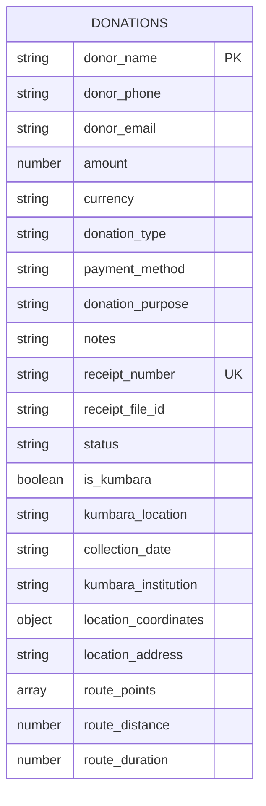
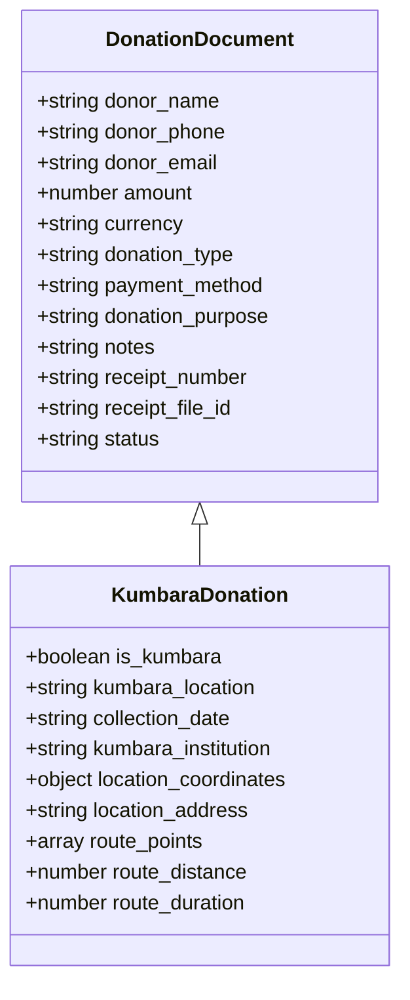
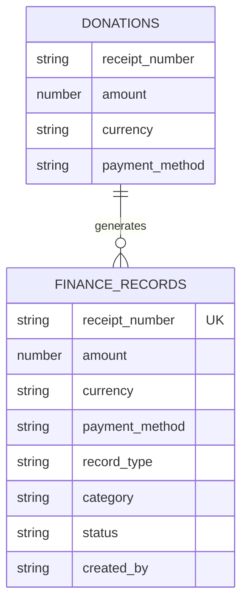
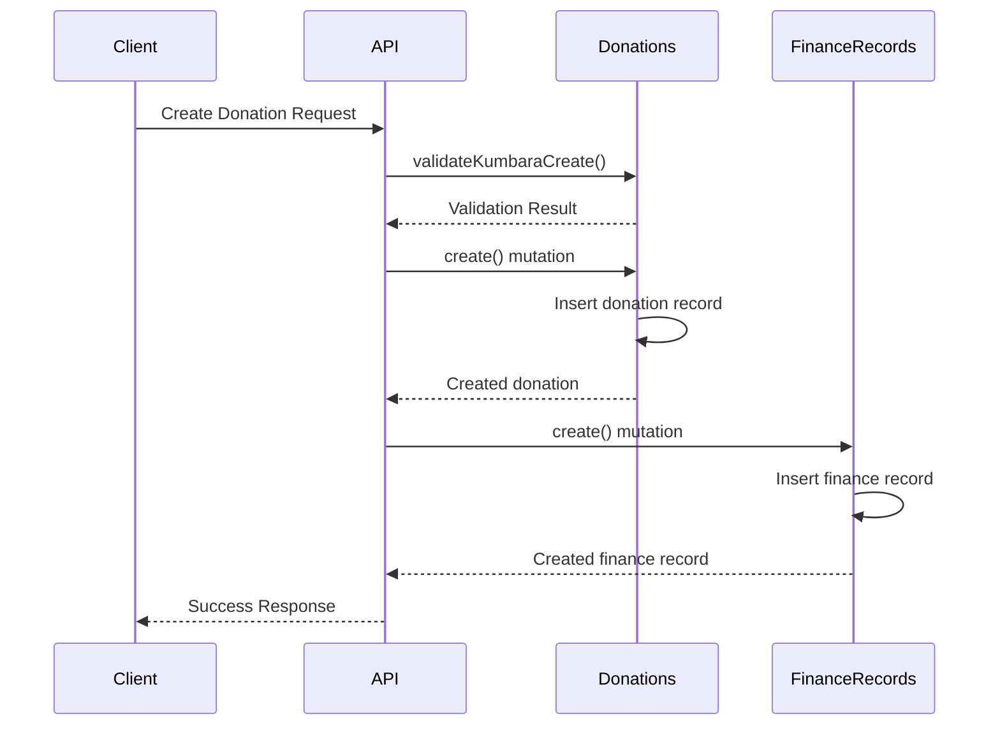
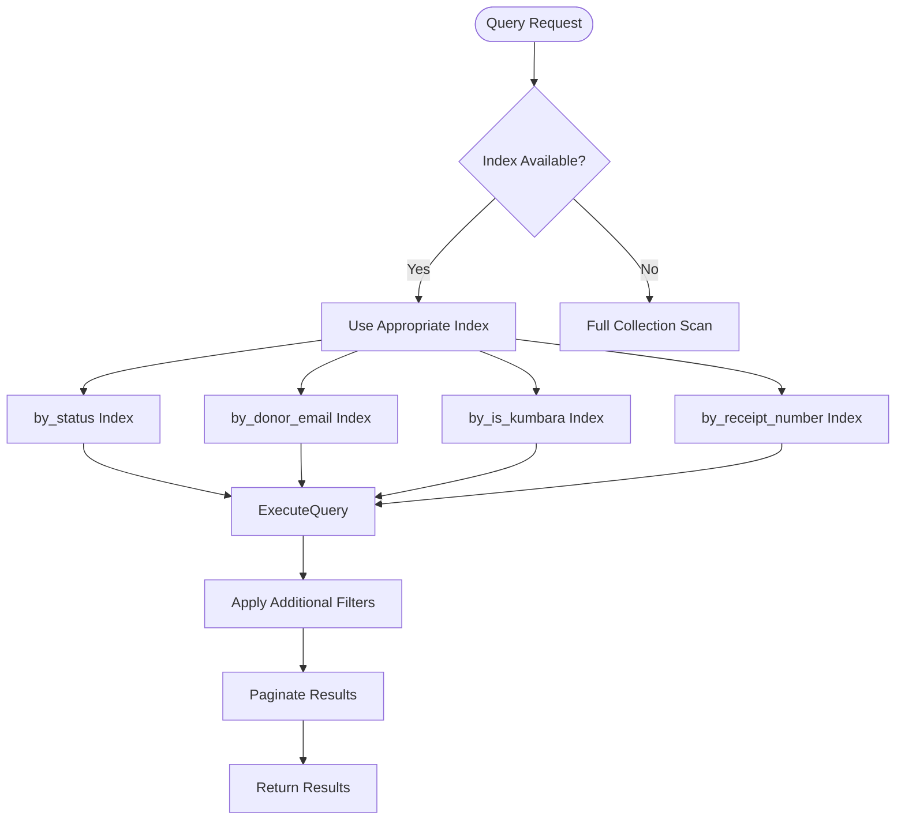
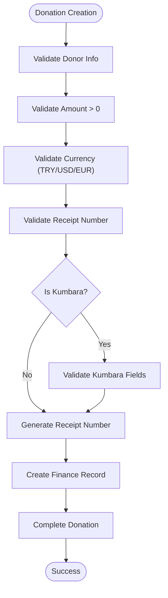

# Donation Processing

<cite>
**Referenced Files in This Document**   
- [donations.ts](file://convex/donations.ts)
- [finance_records.ts](file://convex/finance_records.ts)
- [kumbara.ts](file://src/lib/validations/kumbara.ts)
- [database.ts](file://src/types/database.ts)
</cite>

## Table of Contents

1. [Introduction](#introduction)
2. [Donation Data Model](#donation-data-model)
3. [Kumbara vs Standard Donations](#kumbara-vs-standard-donations)
4. [Financial Record Integration](#financial-record-integration)
5. [Data Validation and Mutation Workflow](#data-validation-and-mutation-workflow)
6. [Indexing and Query Strategy](#indexing-and-query-strategy)
7. [Business Rules and Validation](#business-rules-and-validation)
8. [Performance Considerations](#performance-considerations)

## Introduction

The Donation Processing system manages both standard donations and Kumbara (money box) donations, providing comprehensive tracking of donor information, payment details, and receipt management. The system integrates with financial records for accounting purposes and supports high-volume donation processing with robust validation and reconciliation capabilities.

**Section sources**

- [donations.ts](file://convex/donations.ts#L1-L149)

## Donation Data Model

The donation collection schema captures comprehensive information about each donation, including donor details, financial information, and transaction metadata.

**Diagram sources**

- [donations.ts](file://convex/donations.ts#L76-L108)
- [database.ts](file://src/types/database.ts#L148-L171)

**Section sources**

- [donations.ts](file://convex/donations.ts#L76-L108)
- [database.ts](file://src/types/database.ts#L148-L171)

## Kumbara vs Standard Donations

The system distinguishes between standard donations and Kumbara donations through the `is_kumbara` field, with additional location and route data captured for Kumbara collections.

**Diagram sources**

- [donations.ts](file://convex/donations.ts#L96-L104)
- [kumbara.ts](file://src/lib/validations/kumbara.ts#L57-L91)

**Section sources**

- [donations.ts](file://convex/donations.ts#L96-L104)
- [kumbara.ts](file://src/lib/validations/kumbara.ts#L57-L91)

## Financial Record Integration

Donations are linked to financial records for accounting purposes, ensuring proper reconciliation and financial reporting.

**Diagram sources**

- [donations.ts](file://convex/donations.ts#L88-L89)
- [finance_records.ts](file://convex/finance_records.ts#L64-L65)

**Section sources**

- [donations.ts](file://convex/donations.ts#L88-L89)
- [finance_records.ts](file://convex/finance_records.ts#L54-L76)

## Data Validation and Mutation Workflow

The system implements a comprehensive validation and mutation workflow to ensure data integrity and proper financial record creation.

**Diagram sources**

- [donations.ts](file://convex/donations.ts#L76-L108)
- [finance_records.ts](file://convex/finance_records.ts#L54-L76)
- [kumbara.ts](file://src/lib/validations/kumbara.ts#L197-L216)

**Section sources**

- [donations.ts](file://convex/donations.ts#L76-L108)
- [finance_records.ts](file://convex/finance_records.ts#L54-L76)
- [kumbara.ts](file://src/lib/validations/kumbara.ts#L197-L216)

## Indexing and Query Strategy

The system implements targeted indexing to optimize query performance for common access patterns.

**Diagram sources**

- [donations.ts](file://convex/donations.ts#L17-L41)
- [donations.ts](file://convex/donations.ts#L63-L73)

**Section sources**

- [donations.ts](file://convex/donations.ts#L17-L41)
- [donations.ts](file://convex/donations.ts#L63-L73)

## Business Rules and Validation

The system enforces comprehensive business rules for donation validation, receipt generation, and financial reconciliation.

**Diagram sources**

- [kumbara.ts](file://src/lib/validations/kumbara.ts#L6-L51)
- [donations.ts](file://convex/donations.ts#L88-L89)

**Section sources**

- [kumbara.ts](file://src/lib/validations/kumbara.ts#L6-L51)
- [donations.ts](file://convex/donations.ts#L88-L89)

## Performance Considerations

The system is designed to handle high-volume donation processing and reporting with optimized data access patterns.

```mermaid
graph TB
subgraph "Performance Optimization"
A[Batch Processing] --> B[Indexed Queries]
B --> C[Efficient Pagination]
C --> D[Asynchronous Operations]
D --> E[Caching Strategy]
end
subgraph "Scalability"
F[Horizontal Scaling] --> G[Database Optimization]
G --> H[Load Balancing]
H --> I[Monitoring]
end
subgraph "Reporting"
J[Aggregation Queries] --> K[Pre-calculated Stats]
K --> L[Background Processing]
L --> M[Cache Results]
end
```

**Diagram sources**

- [donations.ts](file://convex/donations.ts#L44-L47)
- [donations.ts](file://convex/donations.ts#L1-L42)

**Section sources**

- [donations.ts](file://convex/donations.ts#L44-L47)
- [donations.ts](file://convex/donations.ts#L1-L42)
