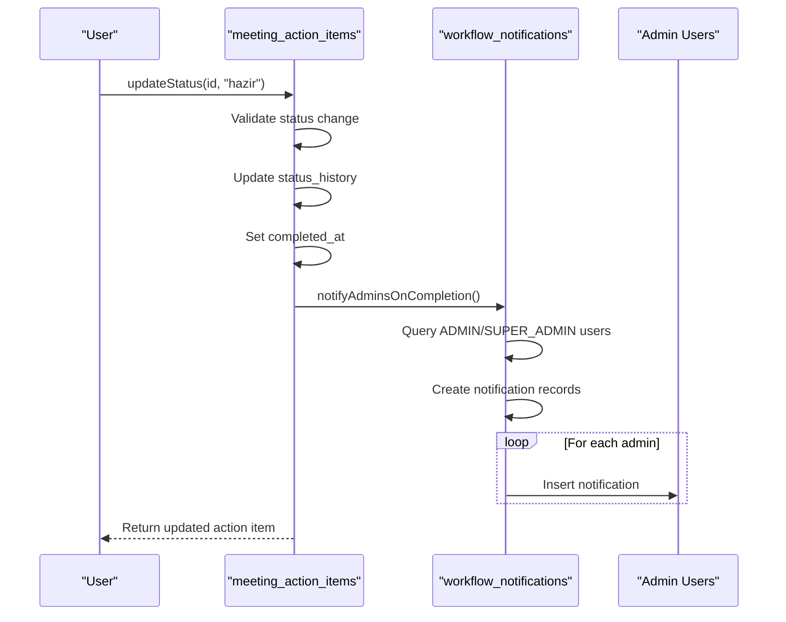
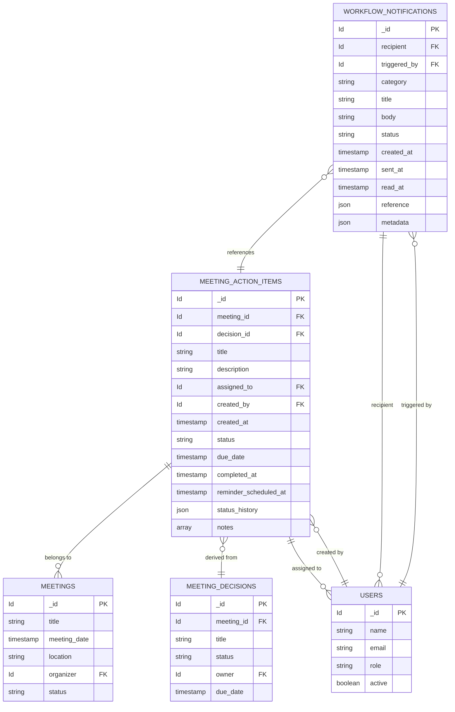

# Action Items

<cite>
**Referenced Files in This Document**   
- [meeting_action_items.ts](file://convex/meeting_action_items.ts)
- [meetingActionItem.ts](file://src/lib/validations/meetingActionItem.ts)
- [workflow_notifications.ts](file://convex/workflow_notifications.ts)
- [database.ts](file://src/types/database.ts)
</cite>

## Table of Contents

1. [Introduction](#introduction)
2. [Entity Relationships](#entity-relationships)
3. [Field Definitions](#field-definitions)
4. [Status Workflow and Business Rules](#status-workflow-and-business-rules)
5. [Indexing Strategy](#indexing-strategy)
6. [Notification System](#notification-system)
7. [Data Model Diagram](#data-model-diagram)
8. [Performance Considerations](#performance-considerations)

## Introduction

The meeting_action_items collection represents actionable tasks derived from meetings within the system. Each action item is tied to a specific meeting and may optionally be associated with a meeting decision. The system tracks the complete lifecycle of action items through status changes, assignment, and completion workflows. This documentation provides a comprehensive overview of the data model, relationships, business logic, and performance characteristics of the action items system.

## Entity Relationships

The meeting_action_items collection maintains several critical relationships with other entities in the system:

- **Meeting (mandatory)**: Every action item must be associated with a meeting via the `meeting_id` field, establishing the primary context for the action item.
- **Decision (optional)**: An action item may be linked to a specific meeting decision through the `decision_id` field, creating a parent-child relationship between decisions and their resulting actions.
- **User (assigned_to)**: Action items are assigned to specific users who are responsible for their completion, referenced by the `assigned_to` field.
- **User (created_by)**: The user who created the action item is tracked via the `created_by` field for audit and accountability purposes.

These relationships ensure traceability from strategic decisions to tactical execution within the organization's workflow.

**Section sources**

- [meeting_action_items.ts](file://convex/meeting_action_items.ts#L53-L91)
- [database.ts](file://src/types/database.ts#L537)

## Field Definitions

The meeting_action_items collection contains the following fields that define its structure and behavior:

- **title**: String field representing the brief description of the action item.
- **description**: Optional string field providing additional details about the task.
- **status**: Enum field with values "beklemede" (pending), "devam" (in progress), "hazir" (completed), or "iptal" (cancelled), tracking the current state of the action item.
- **due_date**: Optional string field (ISO date format) indicating the deadline for completion.
- **assigned_to**: Reference to the user responsible for completing the action item.
- **created_by**: Reference to the user who created the action item.
- **created_at**: Timestamp of when the action item was created.
- **completed_at**: Timestamp set when the status changes to "hazir", indicating completion time.
- **status_history**: Array of objects that record every status change, including the new status, timestamp, user who made the change, and an optional note.
- **notes**: Optional array of strings for additional comments or updates on the action item.
- **reminder_scheduled_at**: Optional timestamp indicating when a reminder for the action item is scheduled.

The status_history array is particularly important as it maintains an immutable audit trail of all state transitions, enabling full traceability of the action item's lifecycle.

**Section sources**

- [meeting_action_items.ts](file://convex/meeting_action_items.ts#L53-L91)
- [meetingActionItem.ts](file://src/lib/validations/meetingActionItem.ts#L1-L9)

## Status Workflow and Business Rules

The action item system implements a well-defined workflow with specific business rules governing state transitions:

1. **Initial State**: When created, action items default to "beklemede" (pending) status unless otherwise specified.
2. **Status Transitions**: The system allows transitions between all status values, but certain transitions trigger additional business logic:
   - Transition to "hazir" (completed) automatically sets the `completed_at` timestamp.
   - Any status change adds a new entry to the `status_history` array with details of the change.
3. **Cascading Updates**: When an action item's status is updated, the system performs cascading updates to maintain data consistency:
   - The `status_history` array is appended with the new state.
   - The `completed_at` field is set only when status becomes "hazir".
   - The main status field is updated atomically with the history.

The system enforces data integrity by validating all status changes against the allowed values and ensuring that the `changed_by` user is properly recorded for audit purposes.

**Section sources**

- [meeting_action_items.ts](file://convex/meeting_action_items.ts#L95-L139)
- [meeting_action_items.ts](file://convex/meeting_action_items.ts#L154-L187)

## Indexing Strategy

The meeting_action_items collection employs a strategic indexing approach to optimize query performance for common access patterns:

- **by_meeting index**: Enables efficient retrieval of all action items associated with a specific meeting, supporting the primary use case of viewing meeting follow-ups.
- **by_assigned_to index**: Facilitates quick access to all action items assigned to a particular user, essential for personal task management views.
- **by_status index**: Allows rapid filtering of action items by their current status, supporting workflow management and reporting.

These indexes are specifically designed to support the most common query patterns in the application, ensuring responsive performance even as the volume of action items grows. The indexing strategy follows the principle of optimizing for read operations that are frequent and critical to user experience.

**Section sources**

- [meeting_action_items.ts](file://convex/meeting_action_items.ts#L12-L42)

## Notification System

The system implements an automated notification mechanism that triggers when specific business events occur:

- **Completion Notifications**: When an action item's status changes to "hazir" (completed), the system automatically notifies all administrators and super administrators.
- **Recipient Identification**: The notification system queries the users collection using the "by_role" index to identify all users with ADMIN or SUPER_ADMIN roles.
- **Notification Content**: Generated notifications include:
  - Reference to the completed action item
  - Link to the associated meeting
  - Optional note from the user who completed the task
  - Standardized message indicating task completion

The notification workflow is implemented in the `notifyAdminsOnCompletion` function, which creates entries in the workflow_notifications collection. This decoupled approach ensures that notification logic is separate from the core action item management, promoting maintainability and extensibility.

**Diagram sources**

- [meeting_action_items.ts](file://convex/meeting_action_items.ts#L189-L251)
- [workflow_notifications.ts](file://convex/workflow_notifications.ts#L76-L103)

**Section sources**

- [meeting_action_items.ts](file://convex/meeting_action_items.ts#L189-L251)
- [workflow_notifications.ts](file://convex/workflow_notifications.ts#L76-L103)

## Data Model Diagram

The following entity relationship diagram illustrates the structure of the meeting_action_items collection and its relationships with other entities in the system.

**Diagram sources**

- [meeting_action_items.ts](file://convex/meeting_action_items.ts#L53-L91)
- [meetings.ts](file://convex/meetings.ts#L1-L49)
- [meeting_decisions.ts](file://convex/meeting_decisions.ts#L1-L49)
- [users.ts](file://convex/users.ts)
- [workflow_notifications.ts](file://convex/workflow_notifications.ts#L76-L103)

## Performance Considerations

The action items system is designed with performance optimization in mind, particularly for handling large volumes of records:

- **Index-Driven Queries**: All primary access patterns leverage dedicated indexes (by_meeting, by_assigned_to, by_status), ensuring O(log n) lookup performance regardless of collection size.
- **Efficient History Tracking**: The status_history array uses an append-only design, which is optimized for the database's storage engine and minimizes write amplification.
- **Batch Operations**: Notification delivery uses Promise.all() to insert notifications for multiple administrators concurrently, reducing overall latency.
- **Selective Updates**: The patch operation updates only changed fields rather than replacing the entire document, minimizing network overhead and storage operations.
- **Memory Efficiency**: The system avoids loading entire collections into memory by using database-level filtering and pagination where appropriate.

For very large datasets, the system could be further optimized by:

- Implementing time-based partitioning for historical action items
- Adding composite indexes for multi-field queries
- Introducing caching layers for frequently accessed action item lists
- Implementing soft deletion instead of hard deletion to preserve audit trails

The current design balances performance, data integrity, and maintainability, providing a robust foundation for the organization's action tracking needs.

**Section sources**

- [meeting_action_items.ts](file://convex/meeting_action_items.ts#L12-L42)
- [meeting_action_items.ts](file://convex/meeting_action_items.ts#L226-L251)
