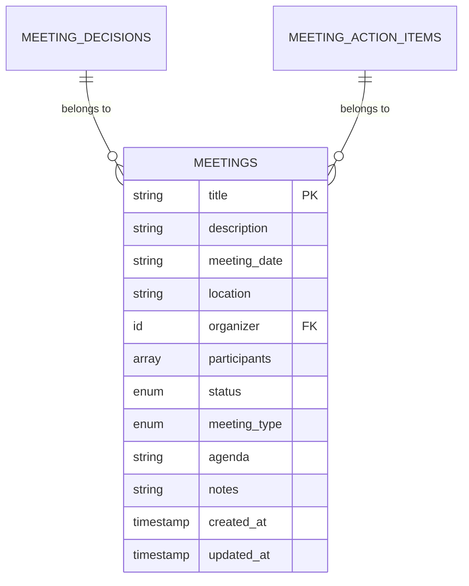
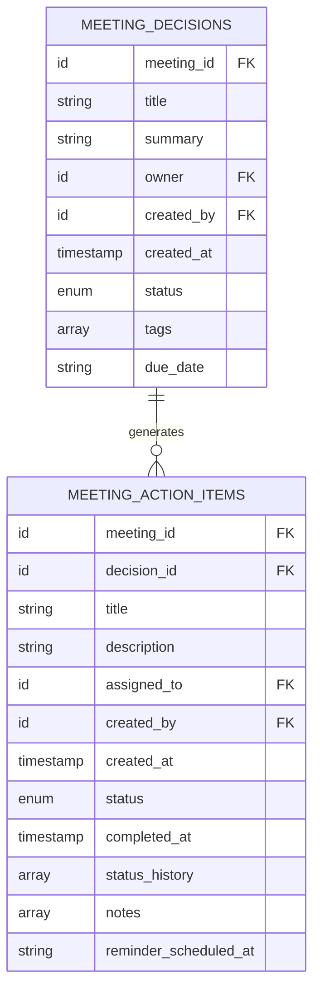
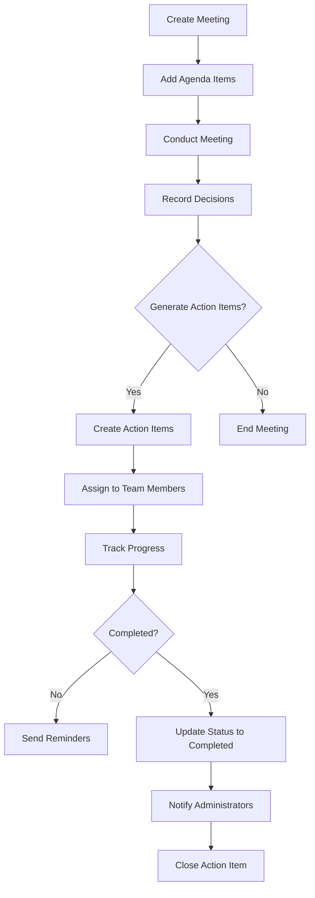
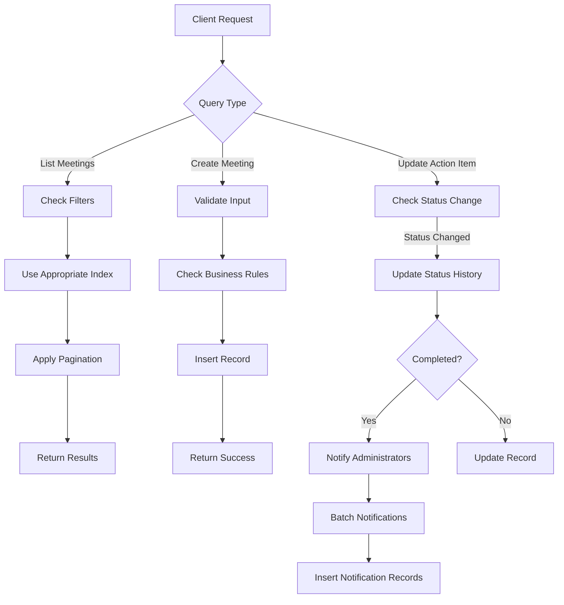
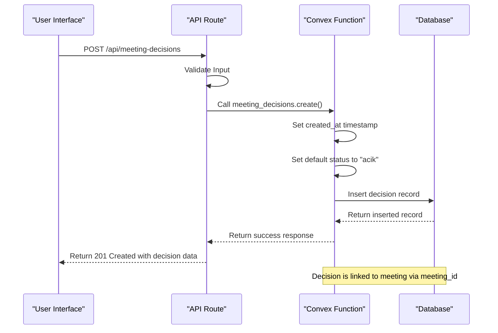
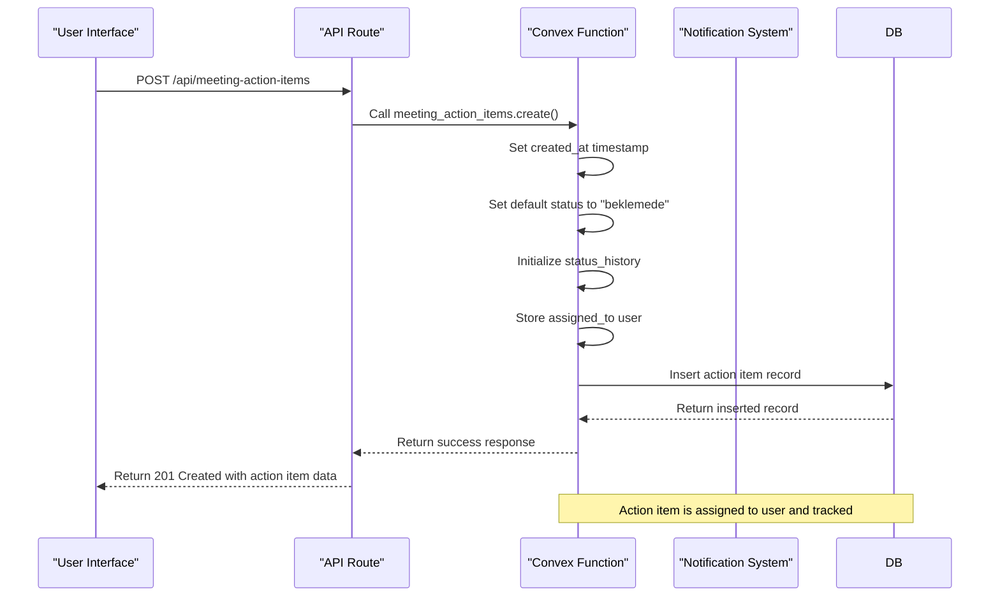

# Meeting Coordination

<cite>
**Referenced Files in This Document**   
- [meetings.ts](file://convex/meetings.ts)
- [meeting_decisions.ts](file://convex/meeting_decisions.ts)
- [meeting_action_items.ts](file://convex/meeting_action_items.ts)
- [meeting.ts](file://src/lib/validations/meeting.ts)
- [CalendarView.tsx](file://src/components/meetings/CalendarView.tsx)
</cite>

## Table of Contents

1. [Introduction](#introduction)
2. [Meetings Collection Schema](#meetings-collection-schema)
3. [Related Collections](#related-collections)
4. [Business Rules and Workflows](#business-rules-and-workflows)
5. [Indexing Strategy](#indexing-strategy)
6. [Performance Considerations](#performance-considerations)
7. [Implementation Examples](#implementation-examples)

## Introduction

The Meeting Coordination system provides a comprehensive solution for managing organizational meetings, tracking decisions, and following up on action items. This documentation details the architecture of the system, focusing on the core collections, their relationships, business rules, and performance characteristics. The system is built on Convex, providing real-time data synchronization and serverless functions for business logic implementation.

## Meetings Collection Schema

The meetings collection serves as the central entity in the coordination system, storing all essential information about scheduled meetings. The schema includes the following fields:

- **title**: String field with minimum 3 and maximum 200 characters
- **description**: Optional string field with maximum 2000 characters
- **meeting_date**: ISO date string, required to be at least one hour in the future for new meetings
- **location**: Optional string field with maximum 200 characters
- **organizer**: Reference to the user ID who organized the meeting
- **participants**: Array of user IDs attending the meeting (minimum 1, maximum 50)
- **status**: Enum field with values: scheduled, ongoing, completed, cancelled
- **meeting_type**: Enum field with values: general, committee, board, other
- **agenda**: Optional string field with maximum 2000 characters
- **notes**: Optional string field with maximum 2000 characters

The system enforces a business rule that the organizer must be included in the participants list. Validation is performed using Zod schemas in the frontend, with different rules for creating new meetings versus editing existing ones (editing allows past dates).

**Diagram sources**

- [meetings.ts](file://convex/meetings.ts#L51-L77)
- [meeting.ts](file://src/lib/validations/meeting.ts#L58-L94)

**Section sources**

- [meetings.ts](file://convex/meetings.ts#L51-L77)
- [meeting.ts](file://src/lib/validations/meeting.ts#L58-L94)

## Related Collections

### Meeting Decisions

The meeting_decisions collection stores outcomes and resolutions from meetings. Each decision is linked to a specific meeting through the meeting_id field. Key fields include:

- **meeting_id**: Reference to the parent meeting
- **title**: Required string describing the decision
- **summary**: Optional detailed explanation
- **owner**: Optional user ID responsible for implementing the decision
- **created_by**: User ID who recorded the decision
- **created_at**: Timestamp of creation
- **status**: Status with values: acik (open), devam (in progress), kapatildi (closed)
- **tags**: Optional array of string tags for categorization
- **due_date**: Optional deadline for implementation

Decisions can be queried by meeting, owner, or status, enabling efficient filtering and reporting.

### Meeting Action Items

The meeting_action_items collection tracks tasks generated from meetings. Each action item has a comprehensive tracking system with the following fields:

- **meeting_id**: Reference to the parent meeting
- **decision_id**: Optional reference to a specific decision that generated the action
- **title**: Required string describing the task
- **description**: Optional detailed explanation
- **assigned_to**: User ID responsible for completing the task
- **created_by**: User ID who created the action item
- **created_at**: Timestamp of creation
- **status**: Status with values: beklemede (pending), devam (in progress), hazir (completed), iptal (cancelled)
- **due_date**: Optional deadline
- **completed_at**: Timestamp when marked as completed
- **status_history**: Array of status change records with timestamps and responsible users
- **notes**: Optional array of text notes
- **reminder_scheduled_at**: Optional timestamp for automated reminders

The system maintains a complete audit trail through the status_history array, which records every status change with the changer, timestamp, and optional note.

**Diagram sources**

- [meeting_decisions.ts](file://convex/meeting_decisions.ts#L51-L76)
- [meeting_action_items.ts](file://convex/meeting_action_items.ts#L53-L92)

**Section sources**

- [meeting_decisions.ts](file://convex/meeting_decisions.ts#L51-L76)
- [meeting_action_items.ts](file://convex/meeting_action_items.ts#L53-L92)

## Business Rules and Workflows

The system implements several business rules to ensure data integrity and proper workflow execution:

1. **Meeting Creation Rules**:
   - Meeting dates must be at least one hour in the future
   - Organizer must be included in the participants list
   - Minimum of one participant required
   - Maximum of 50 participants allowed
   - No duplicate participants permitted

2. **Decision Tracking Workflow**:
   - Decisions are created during or after meetings
   - Each decision is linked to a specific meeting
   - Status transitions follow the sequence: acik → devam → kapatildi
   - Owners can be assigned to ensure accountability

3. **Action Item Follow-up Process**:
   - Action items can be created directly from meetings or linked to specific decisions
   - Comprehensive status tracking with historical record
   - Automated notifications to administrators when action items are completed
   - Status changes are recorded with audit trail

4. **Cascading Behaviors**:
   - When a meeting is deleted, related decisions and action items are not automatically removed (preserving historical data)
   - Status changes in action items trigger notification workflows
   - Completion of action items generates notifications to relevant administrators

**Diagram sources**

- [meeting_action_items.ts](file://convex/meeting_action_items.ts#L189-L252)
- [meetings.ts](file://convex/meetings.ts#L51-L77)

**Section sources**

- [meeting_action_items.ts](file://convex/meeting_action_items.ts#L189-L252)
- [meetings.ts](file://convex/meetings.ts#L51-L77)

## Indexing Strategy

The system employs a strategic indexing approach to optimize query performance for common access patterns:

1. **Meetings Collection**:
   - by_status: Index on status field for filtering meetings by their current state
   - by_organizer: Index on organizer field for retrieving meetings organized by specific users
   - by_meeting_date: Index on meeting_date field for chronological sorting and date-based filtering

2. **Meeting Decisions Collection**:
   - by_meeting: Index on meeting_id field for retrieving all decisions from a specific meeting
   - by_owner: Index on owner field for tracking decisions assigned to specific users
   - by_status: Index on status field for filtering decisions by their implementation status

3. **Meeting Action Items Collection**:
   - by_meeting: Index on meeting_id field for retrieving all action items from a specific meeting
   - by_assigned_to: Index on assigned_to field for workload distribution and assignment tracking
   - by_status: Index on status field for monitoring progress and identifying bottlenecks

The indexing strategy prioritizes the most common query patterns, particularly those related to meeting scheduling (date-based queries) and participant lookup (organizer and assigned_to queries). This ensures optimal performance for calendar views and user-specific dashboards.

**Section sources**

- [meetings.ts](file://convex/meetings.ts#L15-L29)
- [meeting_decisions.ts](file://convex/meeting_decisions.ts#L19-L37)
- [meeting_action_items.ts](file://convex/meeting_action_items.ts#L21-L39)

## Performance Considerations

The system addresses performance challenges related to large participant lists and real-time meeting updates through several optimization strategies:

1. **Large Participant Lists**:
   - Participant arrays are limited to 50 members to prevent performance degradation
   - The system validates for duplicate participants to maintain data integrity
   - When displaying meetings with many participants, only the count is shown rather than individual names
   - Indexing on organizer and assigned_to fields enables efficient queries even with large datasets

2. **Real-time Meeting Updates**:
   - The Convex platform provides real-time data synchronization out of the box
   - Calendar views implement efficient data grouping by date to minimize rendering complexity
   - The system uses memoization (useMemo) in the CalendarView component to prevent unnecessary re-renders
   - Pagination is implemented in the list queries with default limits to prevent excessive data transfer

3. **Scalability Features**:
   - Serverless functions automatically scale with demand
   - Database queries use indexed fields to ensure consistent performance
   - The system implements proper error handling and logging for monitoring performance issues
   - Frontend components are optimized to handle data updates efficiently

4. **Notification System**:
   - The notifyAdminsOnCompletion function batches notifications to administrators when action items are completed
   - The system queries for administrators and super administrators separately, then combines the results
   - Notifications are inserted into the workflow_notifications collection for reliable delivery

**Diagram sources**

- [meeting_action_items.ts](file://convex/meeting_action_items.ts#L109-L151)
- [meetings.ts](file://convex/meetings.ts#L12-L40)

**Section sources**

- [meeting_action_items.ts](file://convex/meeting_action_items.ts#L109-L151)
- [meetings.ts](file://convex/meetings.ts#L12-L40)

## Implementation Examples

### Meeting Creation with Automatic Action Items

When a meeting is created, the system does not automatically generate action items. Instead, action items are created manually during or after the meeting based on decisions made. This approach provides flexibility while maintaining accountability.

### Decision Linking to Meetings

The system explicitly links decisions to meetings through the meeting_id field. When creating a decision, the client must specify the meeting_id, ensuring that all decisions are properly contextualized within their originating meeting.

**Diagram sources**

- [meeting_decisions.ts](file://convex/meeting_decisions.ts#L62-L76)
- [meeting_action_items.ts](file://convex/meeting_action_items.ts#L66-L92)

### Action Item Assignment to Users

Action items are assigned to specific users through the assigned_to field. The system maintains a complete audit trail of assignments and status changes through the status_history array.

**Diagram sources**

- [meeting_action_items.ts](file://convex/meeting_action_items.ts#L66-L92)
- [meeting_action_items.ts](file://convex/meeting_action_items.ts#L189-L252)

**Section sources**

- [meeting_action_items.ts](file://convex/meeting_action_items.ts#L66-L92)
- [meeting_action_items.ts](file://convex/meeting_action_items.ts#L189-L252)
