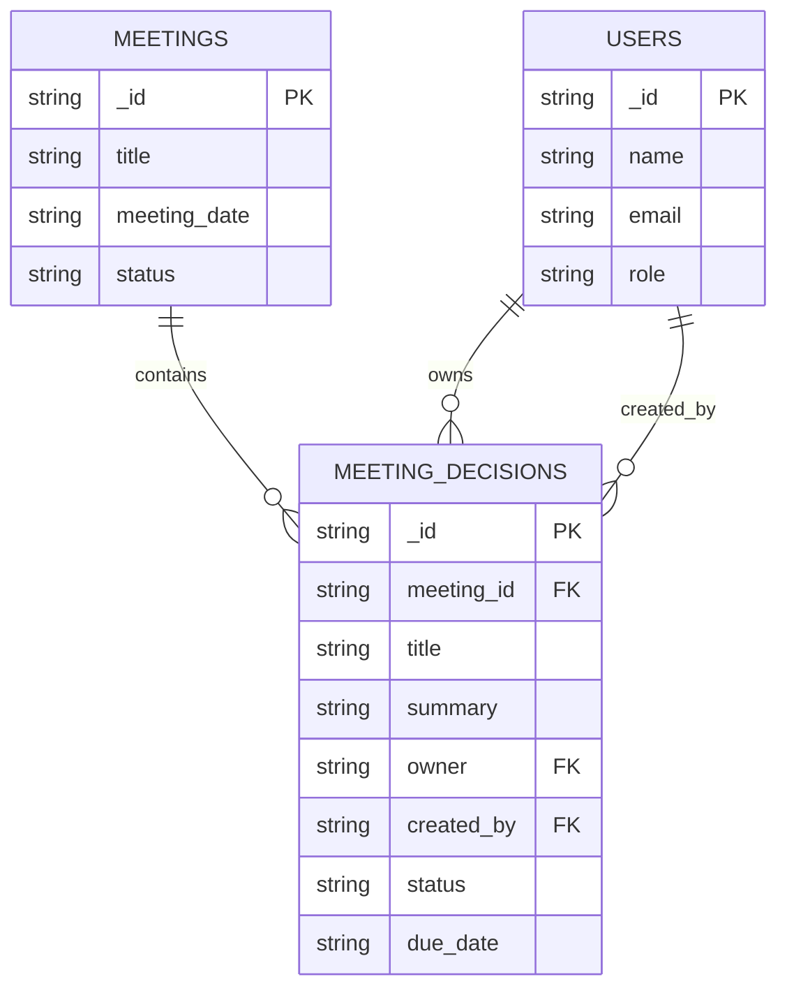
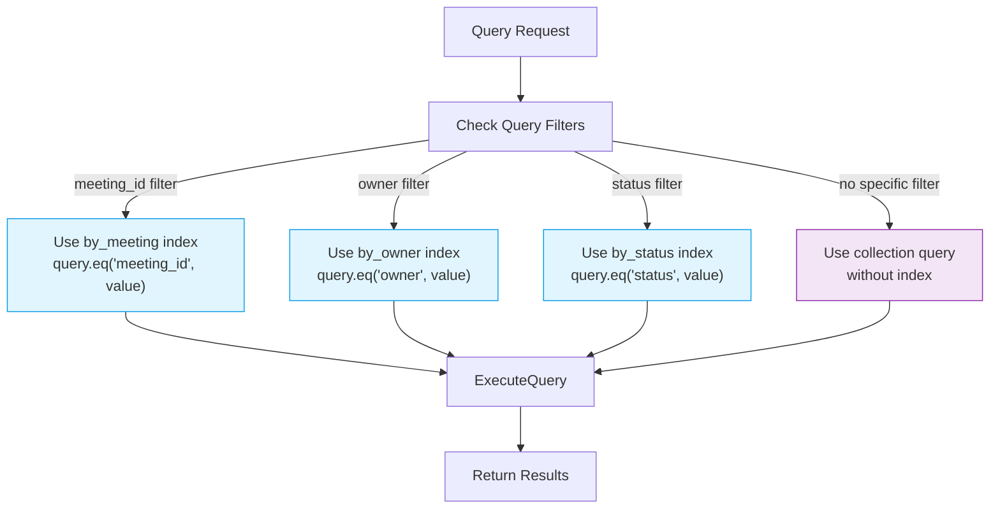
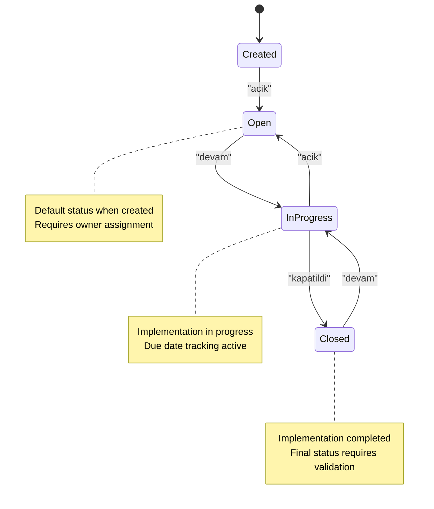
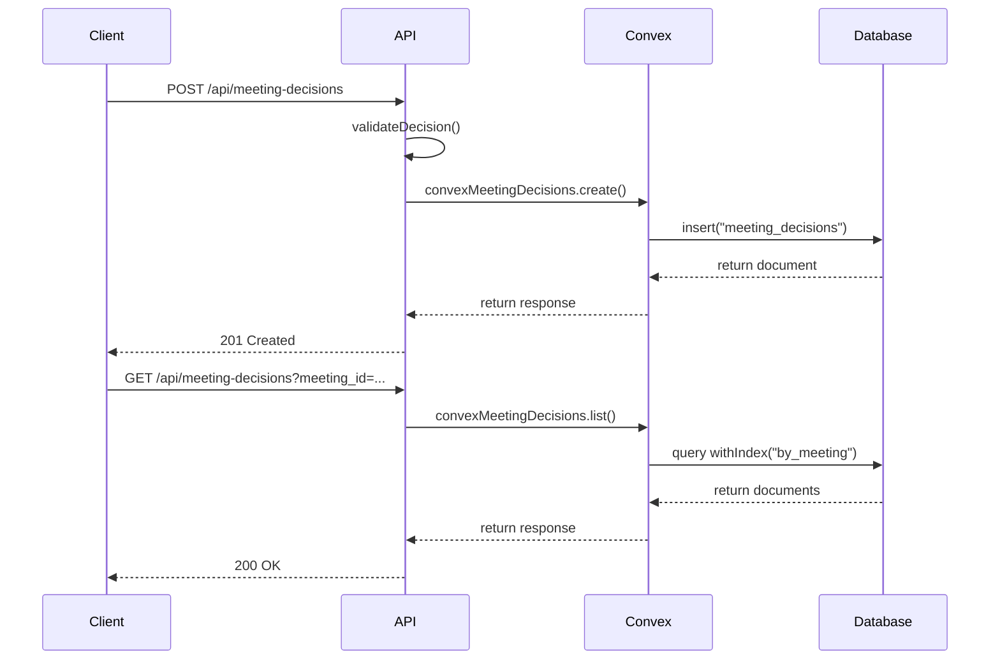

# Meeting Decisions

<cite>
**Referenced Files in This Document**   
- [meeting_decisions.ts](file://convex/meeting_decisions.ts)
- [database.ts](file://src/types/database.ts)
- [meeting.ts](file://src/lib/validations/meeting.ts)
- [route.ts](file://src/app/api/meeting-decisions/route.ts)
- [users.ts](file://convex/users.ts)
- [meetings.ts](file://convex/meetings.ts)
</cite>

## Table of Contents

1. [Introduction](#introduction)
2. [Entity Relationships](#entity-relationships)
3. [Field Definitions](#field-definitions)
4. [Indexing Strategy](#indexing-strategy)
5. [Business Rules](#business-rules)
6. [Convex Functions](#convex-functions)
7. [Performance Considerations](#performance-considerations)
8. [Audit Trail Support](#audit-trail-support)
9. [Conclusion](#conclusion)

## Introduction

The meeting_decisions collection serves as a central component in the organization's workflow management system, capturing key decisions made during meetings and enabling effective tracking of their implementation status. This document provides comprehensive documentation of the data model, including entity relationships, field definitions, indexing strategy, and business rules. The system supports decision lifecycle management from creation during meetings to final closure, with robust querying capabilities and audit trail functionality.

**Section sources**

- [meeting_decisions.ts](file://convex/meeting_decisions.ts#L1-L114)
- [database.ts](file://src/types/database.ts#L259-L270)

## Entity Relationships

The meeting_decisions collection maintains critical relationships with other core entities in the system, forming a connected network of organizational workflow data. The primary relationship is with the meetings collection through the meeting_id field, establishing a foreign key relationship that links each decision to its originating meeting. This relationship enables contextual understanding of decisions by providing access to meeting details such as agenda, participants, and notes.

Additionally, the collection maintains relationships with the users collection through two distinct fields: owner and created_by. The owner field represents the user responsible for implementing the decision, while the created_by field identifies the user who recorded the decision. This dual relationship supports accountability and responsibility tracking throughout the decision lifecycle.



**Diagram sources**

- [database.ts](file://src/types/database.ts#L259-L270)
- [meeting_decisions.ts](file://convex/meeting_decisions.ts#L53-L58)

**Section sources**

- [meeting_decisions.ts](file://convex/meeting_decisions.ts#L53-L58)
- [database.ts](file://src/types/database.ts#L259-L270)
- [meetings.ts](file://convex/meetings.ts#L54-L58)
- [users.ts](file://convex/users.ts#L86-L88)

## Field Definitions

The meeting_decisions collection contains several key fields that capture essential information about each decision. The title field is a required string that provides a concise summary of the decision, with validation ensuring a minimum length of 3 characters. The summary field is an optional string that allows for more detailed explanation of the decision context and rationale.

The status field uses a defined enumeration with three possible values: "acik" (open), "devam" (in progress), and "kapatildi" (closed). This field tracks the implementation status of the decision, with a default value of "acik" when a decision is created. The due_date field is an optional string that specifies the target completion date for the decision implementation.

Additional fields include tags (an optional array of strings for categorization), created_at (automatically populated with ISO timestamp), and references to related entities. The owner field is optional, allowing for decisions that may not be assigned to a specific individual, while the created_by field is required to ensure accountability for decision recording.

```mermaid
classDiagram
class MeetingDecision {
+string _id
+string meeting_id
+string title
+string summary
+string owner
+string created_by
+string created_at
+string status
+string[] tags
+string due_date
}
MeetingDecision : +validateTitle() : boolean
MeetingDecision : +validateStatus() : boolean
MeetingDecision : +isOverdue() : boolean
```

**Diagram sources**

- [database.ts](file://src/types/database.ts#L260-L269)
- [meeting_decisions.ts](file://convex/meeting_decisions.ts#L54-L60)

**Section sources**

- [meeting_decisions.ts](file://convex/meeting_decisions.ts#L54-L60)
- [database.ts](file://src/types/database.ts#L260-L269)
- [meeting.ts](file://src/lib/validations/meeting.ts#L55-L61)

## Indexing Strategy

The meeting_decisions collection employs a strategic indexing approach to optimize query performance for common access patterns. Three dedicated indexes support efficient filtering by key attributes: by_meeting, by_owner, and by_status. The by_meeting index enables rapid retrieval of all decisions associated with a specific meeting, which is essential for meeting follow-up and review processes.

The by_owner index facilitates efficient querying of decisions assigned to a particular user, supporting individual workload management and performance tracking. This index is particularly valuable for users to view their assigned decisions across multiple meetings. The by_status index allows for quick filtering of decisions by their implementation status, enabling status reporting and prioritization of open or in-progress items.

These indexes are explicitly referenced in the Convex query functions, ensuring that queries leverage the appropriate index for optimal performance. The indexing strategy follows the principle of indexing on fields that are frequently used as query filters, particularly those used in equality conditions.



**Diagram sources**

- [meeting_decisions.ts](file://convex/meeting_decisions.ts#L21-L38)
- [database.ts](file://src/types/database.ts#L260-L269)

**Section sources**

- [meeting_decisions.ts](file://convex/meeting_decisions.ts#L21-L38)
- [database.ts](file://src/types/database.ts#L260-L269)

## Business Rules

The meeting_decisions collection enforces several business rules to ensure data integrity and support effective decision tracking. Decisions can only be created during or after meetings, with the requirement that a valid meeting_id must be provided. This ensures that all decisions are properly contextualized within the meeting framework and prevents orphaned decisions.

When a decision is created, the system automatically sets the created_at timestamp and defaults the status to "acik" (open) if no status is specified. This ensures that all decisions have a clear starting point in their lifecycle. The created_by field is required, establishing accountability for decision recording and supporting audit trail requirements.

Status transitions follow a logical progression, allowing movement from "acik" to "devam" (in progress) to "kapatildi" (closed), but preventing invalid transitions such as reopening a closed decision without proper justification. The system allows reassignment of decision ownership, supporting delegation and workload redistribution while maintaining a record of the original assignment.



**Diagram sources**

- [meeting_decisions.ts](file://convex/meeting_decisions.ts#L72-L74)
- [meeting_decisions.ts](file://convex/meeting_decisions.ts#L85-L86)
- [route.ts](file://src/app/api/meeting-decisions/route.ts#L22-L27)

**Section sources**

- [meeting_decisions.ts](file://convex/meeting_decisions.ts#L72-L74)
- [route.ts](file://src/app/api/meeting-decisions/route.ts#L7-L32)
- [meeting_decisions.ts](file://convex/meeting_decisions.ts#L85-L86)

## Convex Functions

The meeting_decisions collection is accessed and manipulated through a set of Convex functions that provide a secure and validated interface. The create mutation requires a meeting_id, title, and created_by user, with optional fields for summary, owner, status, tags, and due_date. The function automatically sets the created_at timestamp and defaults the status to "acik" if not specified.

The list query function supports filtering by meeting_id, owner, or status, automatically selecting the appropriate index for optimal performance. When no filters are provided, it returns all decisions. The get query retrieves a specific decision by ID, while the update mutation allows modification of decision properties with validation to ensure data integrity.

The remove mutation implements soft deletion semantics by marking the decision as inactive rather than permanently removing it, preserving the audit trail. All functions include error handling for cases where a decision is not found, returning appropriate error messages to the client.



**Diagram sources**

- [meeting_decisions.ts](file://convex/meeting_decisions.ts#L51-L76)
- [route.ts](file://src/app/api/meeting-decisions/route.ts#L75-L113)
- [meeting_decisions.ts](file://convex/meeting_decisions.ts#L10-L40)

**Section sources**

- [meeting_decisions.ts](file://convex/meeting_decisions.ts#L51-L76)
- [route.ts](file://src/app/api/meeting-decisions/route.ts#L75-L113)
- [meeting_decisions.ts](file://convex/meeting_decisions.ts#L10-L40)

## Performance Considerations

The meeting_decisions data model is optimized for performance through strategic indexing and query patterns. The three primary indexes (by_meeting, by_owner, and by_status) enable efficient filtering for the most common use cases, ensuring sub-second response times even as the dataset grows. Queries that filter by meeting_id are particularly optimized, as they leverage the by_meeting index and typically return a limited set of decisions associated with a single meeting.

For queries that filter by owner, the system efficiently retrieves all decisions assigned to a specific user across multiple meetings, supporting individual workload management. Status-based queries are optimized for reporting and dashboard displays, allowing quick aggregation of decisions by their implementation status. The system avoids expensive operations such as full collection scans by ensuring that all queries use at least one of the available indexes when possible.

Pagination is supported through the list function's parameters, allowing clients to retrieve decisions in manageable chunks and reducing memory usage and network bandwidth. The API layer also implements caching for frequently accessed decision lists, further improving response times for common queries.

**Section sources**

- [meeting_decisions.ts](file://convex/meeting_decisions.ts#L21-L38)
- [meeting_decisions.ts](file://convex/meeting_decisions.ts#L10-L15)

## Audit Trail Support

The meeting_decisions data model provides robust support for audit trails by capturing essential metadata about each decision and its lifecycle. The created_by field establishes accountability for decision recording, while the created_at timestamp provides a precise record of when the decision was made. The status field tracks the implementation progress over time, creating a clear audit trail of the decision's journey from creation to closure.

The system preserves historical data through immutable timestamps and by avoiding hard deletes, ensuring that the complete history of decisions is maintained even if they are later modified or marked as closed. The combination of the meeting_id reference and decision creation timestamp allows for chronological reconstruction of meeting outcomes and decision-making processes.

Additional audit capabilities are provided through the integration with the workflow_notifications collection, which can generate notifications when decisions are created, updated, or closed. These notifications create additional timestamped records that enhance the audit trail by documenting when stakeholders were informed about decision status changes.

**Section sources**

- [meeting_decisions.ts](file://convex/meeting_decisions.ts#L71-L72)
- [database.ts](file://src/types/database.ts#L265-L266)
- [meeting_decisions.ts](file://convex/meeting_decisions.ts#L267-L268)

## Conclusion

The meeting_decisions collection provides a comprehensive data model for tracking and managing organizational decisions with strong support for accountability, performance, and audit requirements. The well-defined entity relationships, clear field definitions, and strategic indexing approach create a robust foundation for decision tracking across the organization. The integration with meetings and users collections ensures contextual relevance and accountability, while the status tracking and due date fields support effective implementation monitoring.

The Convex functions provide a secure and validated interface for creating, querying, and updating decisions, with business rules that ensure data integrity and support proper decision lifecycle management. The performance optimizations through indexing and query patterns ensure responsive user experiences even as the volume of decisions grows over time.

Overall, the meeting_decisions collection serves as a critical component in the organization's workflow management system, enabling transparent decision tracking, effective accountability, and comprehensive audit capabilities that support organizational governance and continuous improvement.
