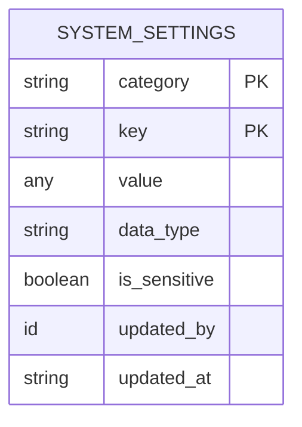
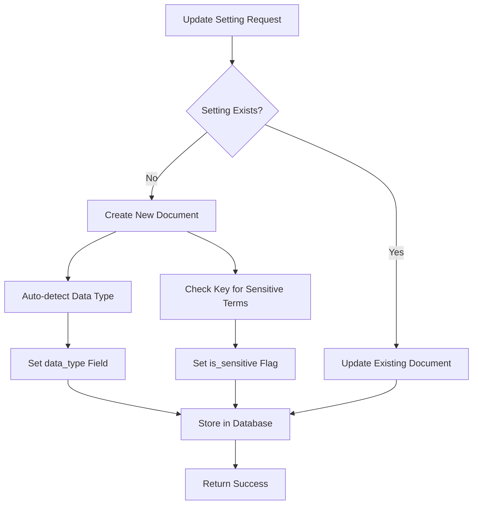
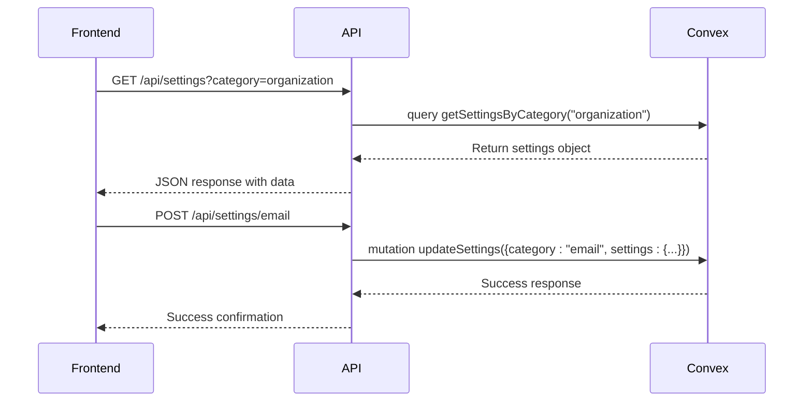

# System Configuration

<cite>
**Referenced Files in This Document**   
- [system_settings.ts](file://convex/system_settings.ts)
- [settings.ts](file://src/lib/api/settings.ts)
- [route.ts](file://src/app/api/settings/route.ts)
- [dataModel.d.ts](file://convex/_generated/dataModel.d.ts)
</cite>

## Table of Contents

1. [Introduction](#introduction)
2. [System Settings Schema](#system-settings-schema)
3. [Data Model and Indexing Strategy](#data-model-and-indexing-strategy)
4. [Business Logic for Setting Management](#business-logic-for-setting-management)
5. [Usage Examples](#usage-examples)
6. [Frontend Integration](#frontend-integration)
7. [Security Model](#security-model)
8. [Best Practices](#best-practices)
9. [Audit Trail Implementation](#audit-trail-implementation)

## Introduction

The System Configuration module provides a centralized, flexible, and secure way to manage application settings across different categories including organization, email, security, and system operations. The system uses a dynamic data model stored in the `system_settings` collection, allowing for various data types and efficient retrieval through optimized indexing. This documentation details the schema, business logic, integration points, and security mechanisms that make up this critical configuration system.

## System Settings Schema

The system_settings collection schema is designed to be flexible while maintaining consistency across different setting types. Each document in the collection contains the following fields:

- **category**: String field that groups settings into logical categories (e.g., "organization", "email", "security")
- **key**: Unique identifier for the setting within its category
- **value**: The actual setting value, which can be of various types (string, number, boolean, object, array)
- **data_type**: String field that stores the type of the value ("string", "number", "boolean", "object", "array")
- **is_sensitive**: Boolean flag that indicates whether the setting contains sensitive information
- **updated_by**: Reference to the user ID who last modified the setting
- **updated_at**: Timestamp of the last modification

The schema supports a hierarchical organization of settings through the category-key structure, enabling both broad category-level operations and granular single-setting modifications.

**Section sources**

- [system_settings.ts](file://convex/system_settings.ts#L1-L244)
- [dataModel.d.ts](file://convex/_generated/dataModel.d.ts#L1-L100)

## Data Model and Indexing Strategy

The system employs a flexible data model that supports multiple data types while ensuring type safety through automatic detection and storage. When a setting is created or updated, the system automatically determines the data type based on the value's JavaScript type and stores this information in the `data_type` field.

The indexing strategy is optimized for performance and scalability:

- **by_category**: Secondary index on the category field for efficient retrieval of all settings within a specific category
- **by_category_key**: Composite secondary index on both category and key fields for rapid lookup of individual settings

These indexes enable efficient queries for common operations such as retrieving all settings for a specific category or finding a particular setting by its category and key combination. The indexing approach minimizes read scope during operations, reducing potential conflicts in concurrent environments.

**Diagram sources**

- [system_settings.ts](file://convex/system_settings.ts#L25-L42)
- [system_settings.ts](file://convex/system_settings.ts#L50-L54)

**Section sources**

- [system_settings.ts](file://convex/system_settings.ts#L1-L244)

## Business Logic for Setting Management

The system_settings module implements comprehensive business logic for secure setting management through a set of Convex queries and mutations. The core operations include reading settings, updating settings, and resetting settings to defaults.

### Reading Operations

The system provides three query functions for retrieving settings:

- **getSettings**: Retrieves all settings and groups them by category
- **getSettingsByCategory**: Retrieves all settings for a specific category using the by_category index
- **getSetting**: Retrieves a single setting by category and key using the by_category_key index

### Writing Operations

The system implements several mutation functions for modifying settings:

- **updateSettings**: Updates multiple settings within a category (bulk update)
- **updateSetting**: Updates a single setting
- **resetSettings**: Resets settings to defaults, either for a specific category or globally

The update operations include automatic type detection and sensitive data flagging. When a setting is created, the system automatically sets the `is_sensitive` flag to true if the key contains terms like "password", "secret", or "key" (case-insensitive).

### Reset Operation Optimization

The resetSettings mutation is optimized to avoid write conflicts by deleting documents in batches rather than reading the entire table first. It processes deletions in batches of 50 documents, which reduces the likelihood of conflicts when other mutations are modifying settings concurrently.

**Diagram sources**

- [system_settings.ts](file://convex/system_settings.ts#L74-L126)
- [system_settings.ts](file://convex/system_settings.ts#L129-L175)

**Section sources**

- [system_settings.ts](file://convex/system_settings.ts#L71-L244)

## Usage Examples

The system configuration is used across various aspects of the application for different purposes:

### Organization Configuration

Organization settings store basic information about the organization using the system:

- Name, address, contact information
- Tax identification number
- Logo URL
- Website URL

Example: The organization category might contain settings like "name" (string), "phone" (string), and "logo_url" (string).

### Email Setup

Email settings configure the system's email delivery capabilities:

- SMTP server configuration (host, port, credentials)
- From address and name
- Email delivery enable/disable flag

Example: The email category might contain "smtpHost" (string), "smtpPort" (number), and "smtpPassword" (string, marked as sensitive).

### Feature Toggles

System settings are used as feature toggles to enable or disable functionality:

- Maintenance mode flag
- Session timeout duration
- Maximum login attempts before lockout

Example: The system category might contain "maintenanceMode" (boolean) and "sessionTimeout" (number).

**Section sources**

- [settings.ts](file://src/lib/api/settings.ts#L23-L101)
- [system_settings.ts](file://convex/system_settings.ts#L88-L92)

## Frontend Integration

The system configuration is integrated with frontend settings pages through a well-defined API layer. The frontend communicates with the backend through REST endpoints that map to the underlying Convex functions.

### API Endpoints

- **GET /api/settings**: Retrieves all settings or settings for a specific category (via query parameter)
- **POST /api/settings/[category]**: Updates all settings for a specific category
- **PUT /api/settings/[category]/[key]**: Updates a single setting
- **DELETE /api/settings**: Resets settings to defaults (optionally by category)

### Client-Side API

The settings.ts file in the lib/api directory provides a type-safe client API with methods corresponding to the backend operations:

- getSettings(), getCategorySettings(), getSetting() for reading
- updateCategorySettings(), updateSetting(), updateAllSettings() for writing
- resetSettings() for resetting

The frontend settings pages use these API methods to load, display, and save configuration values, providing a seamless user experience for administrators.

**Diagram sources**

- [route.ts](file://src/app/api/settings/route.ts#L6-L31)
- [route.ts](file://src/app/api/settings/route.ts#L35-L63)
- [settings.ts](file://src/lib/api/settings.ts#L109-L119)

**Section sources**

- [route.ts](file://src/app/api/settings/route.ts#L1-L128)
- [settings.ts](file://src/lib/api/settings.ts#L103-L271)

## Security Model

The system implements a comprehensive security model to protect sensitive configuration data:

### Sensitive Data Handling

The system automatically identifies potentially sensitive settings based on their keys. Any setting with "password", "secret", or "key" in its key name (case-insensitive) is automatically flagged as sensitive by setting the `is_sensitive` field to true. This flag can be used by frontend components to mask or otherwise protect the display of sensitive values.

### Access Control

Access to settings is restricted based on user permissions. The e2e tests indicate that users without SETTINGS_READ permission are denied access to the settings page, ensuring that only authorized personnel can view or modify configuration.

### Audit Trail

All setting modifications are tracked through the audit logging system. While not explicitly shown in the provided code, the presence of the updated_by field and the separate audit_logs module suggests that changes to settings are logged for compliance and troubleshooting purposes.

**Section sources**

- [system_settings.ts](file://convex/system_settings.ts#L117-L118)
- [system_settings.ts](file://convex/system_settings.ts#L167-L168)
- [e2e/settings.spec.ts](file://e2e/settings.spec.ts#L180-L198)

## Best Practices

When adding new configuration options or managing environment-specific settings, follow these best practices:

### Adding New Configuration Options

1. Choose an appropriate category that aligns with existing categories
2. Use clear, descriptive keys following camelCase naming convention
3. Consider whether the setting might contain sensitive information and ensure proper handling
4. Provide appropriate validation in the frontend components
5. Document the purpose and acceptable values of the setting

### Managing Environment-Specific Settings

1. Use the same schema across all environments (development, staging, production)
2. Manage environment-specific values through deployment processes rather than code changes
3. Ensure sensitive settings (like API keys) are properly protected in all environments
4. Use feature toggles to gradually roll out new functionality
5. Test configuration changes thoroughly in non-production environments before deployment

### Performance Considerations

1. Use bulk updates (updateSettings) when modifying multiple settings in the same category
2. Use single setting updates (updateSetting) for isolated changes to minimize write scope
3. Leverage the indexed queries for efficient lookups
4. Be mindful of the reset operation's batch processing nature in high-concurrency scenarios

**Section sources**

- [system_settings.ts](file://convex/system_settings.ts#L71-L244)
- [settings.ts](file://src/lib/api/settings.ts#L1-L271)

## Audit Trail Implementation

The system integrates with a comprehensive audit logging mechanism to track all configuration changes. Although the direct connection between setting modifications and audit logs is not explicitly shown in the provided code, the architecture supports this functionality through several mechanisms:

The resetSettings mutation includes an updatedBy parameter that captures the user responsible for the change, which can be used to populate audit logs. Similarly, the updateSettings and updateSetting mutations accept an updatedBy parameter, enabling attribution of changes to specific users.

The system's design follows the principle of maintaining an audit trail for compliance purposes, as evidenced by the separate audit_logs module and its associated API endpoints. This ensures that all critical operations, including configuration changes, are tracked and can be reviewed for security and compliance.

**Section sources**

- [system_settings.ts](file://convex/system_settings.ts#L78-L79)
- [system_settings.ts](file://convex/system_settings.ts#L134-L135)
- [audit_logs.ts](file://convex/audit_logs.ts#L1-L177)
