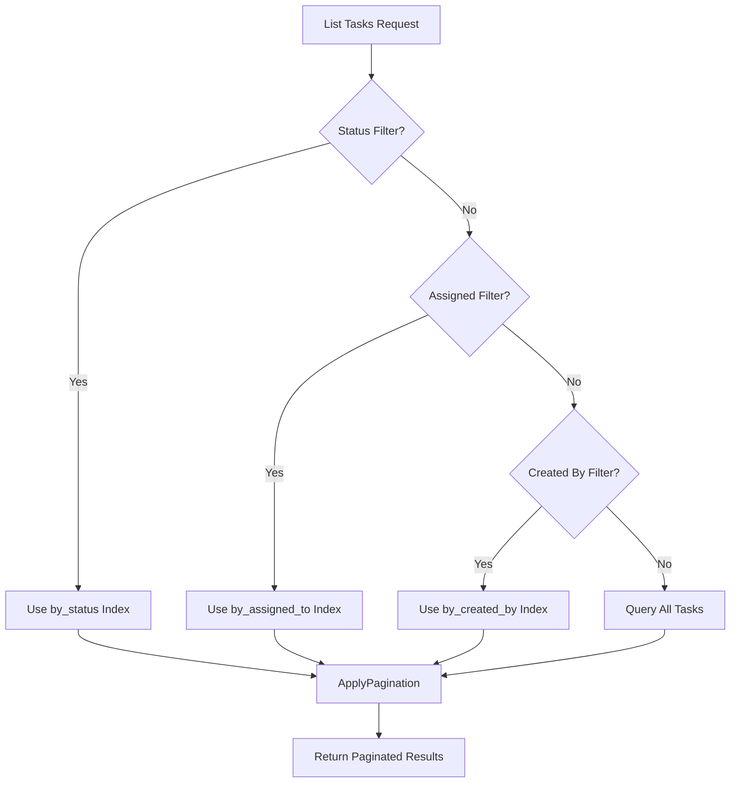
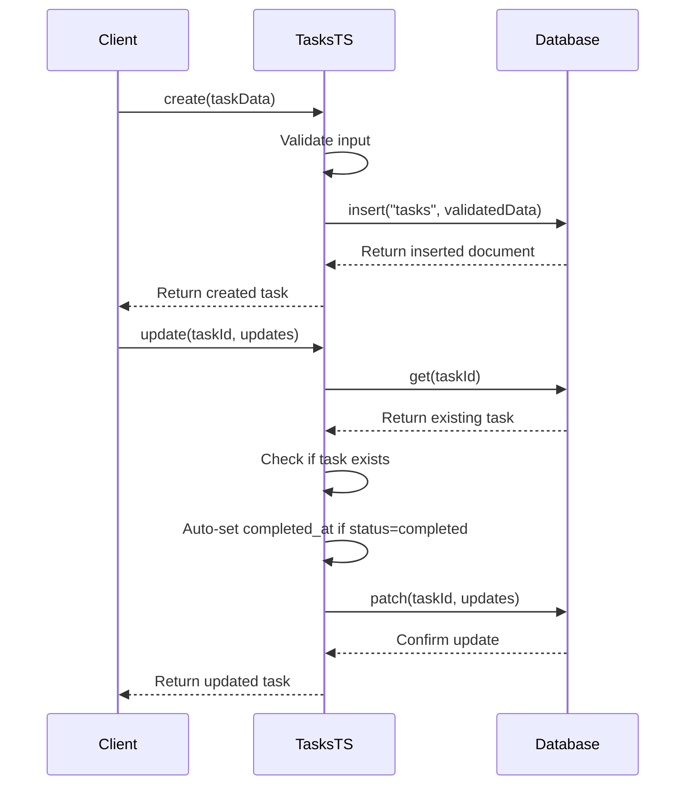
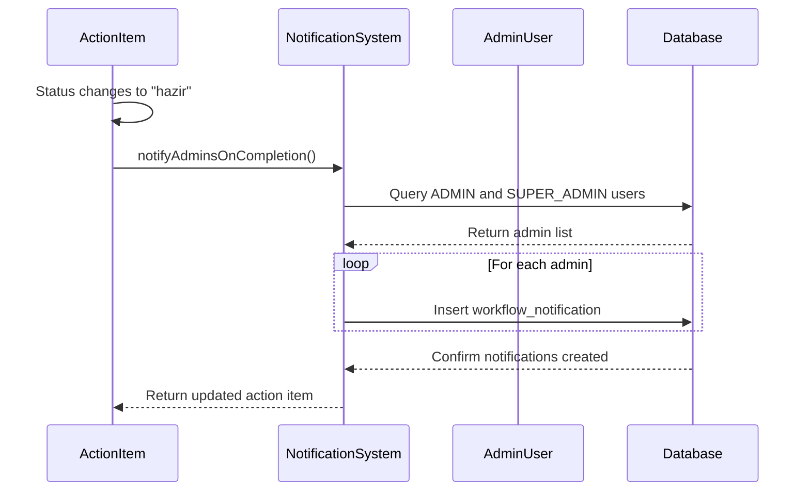
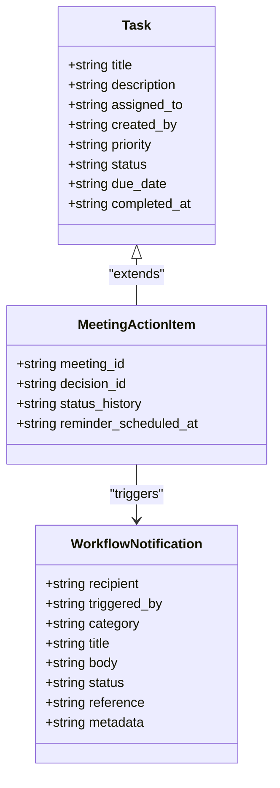

# Task Management

<cite>
**Referenced Files in This Document**   
- [tasks.ts](file://convex/tasks.ts)
- [KanbanBoard.tsx](file://src/components/tasks/KanbanBoard.tsx)
- [task.ts](file://src/lib/validations/task.ts)
- [meeting_action_items.ts](file://convex/meeting_action_items.ts)
- [workflow_notifications.ts](file://convex/workflow_notifications.ts)
- [page.tsx](file://src/app/(dashboard)/is/gorevler/page.tsx)
- [TaskForm.tsx](file://src/components/forms/TaskForm.tsx)
</cite>

## Table of Contents

1. [Introduction](#introduction)
2. [Task Collection Schema](#task-collection-schema)
3. [Indexing Strategy](#indexing-strategy)
4. [Business Logic in tasks.ts](#business-logic-in-tasksts)
5. [Integration with User Notifications](#integration-with-user-notifications)
6. [Meeting Action Items Integration](#meeting-action-items-integration)
7. [Data Access Patterns](#data-access-patterns)
8. [Concurrency Considerations](#concurrency-considerations)
9. [Real-Time Synchronization Optimization](#real-time-synchronization-optimization)

## Introduction

The Task Management system in Convex provides a comprehensive solution for tracking, assigning, and monitoring tasks within the organization. This documentation details the schema, business logic, integration points, and performance characteristics of the task management functionality. The system supports Kanban board views, personal dashboards, and integrates with meeting action items and user notifications to provide a cohesive workflow experience.

## Task Collection Schema

The task collection schema defines the structure and validation rules for task documents in the system. Key fields include:

- **title**: Required string (3-100 characters) representing the task title
- **description**: Optional string (up to 1000 characters) for detailed task information
- **assigned_to**: Optional reference to a user ID for task assignment
- **created_by**: Required reference to the user ID who created the task
- **priority**: Required field with values: low, normal, high, urgent
- **status**: Required field with workflow states: pending, in_progress, completed, cancelled
- **due_date**: Optional ISO date string for task deadlines
- **completed_at**: Timestamp automatically set when status changes to completed
- **category**: Optional string (up to 50 characters) for organizational categorization
- **tags**: Array of strings (max 10) for flexible task classification
- **is_read**: Boolean flag for read status tracking

The schema enforces validation rules including future date validation for due dates, duplicate tag prevention, and priority warnings for tasks due within 24 hours.

**Section sources**

- [tasks.ts](file://convex/tasks.ts#L55-L138)
- [task.ts](file://src/lib/validations/task.ts#L41-L125)

## Indexing Strategy

The system implements a targeted indexing strategy to optimize query performance for common access patterns. Three dedicated indexes support efficient filtering by key attributes:

- **by_status**: Enables fast retrieval of tasks by their current status (pending, in_progress, completed, cancelled)
- **by_assigned_to**: Optimizes queries for tasks assigned to specific users
- **by_created_by**: Facilitates retrieval of tasks created by specific users

The query handler in the `list` function implements a conditional query strategy that selects the appropriate index based on the provided filter parameters. When multiple filters are present, the system prioritizes status filtering, followed by assignment and creation filters. This indexing approach ensures O(log n) lookup performance for filtered queries while supporting pagination with skip and limit parameters.



**Diagram sources**

- [tasks.ts](file://convex/tasks.ts#L5-L43)

**Section sources**

- [tasks.ts](file://convex/tasks.ts#L5-L43)

## Business Logic in tasks.ts

The business logic in tasks.ts implements the core CRUD operations and workflow management for tasks. The system provides five main functions:

- **create**: Inserts a new task with validation of required fields and default values
- **get**: Retrieves a specific task by ID
- **list**: Returns paginated task lists with optional filtering
- **update**: Modifies task properties with automatic completion timestamping
- **remove**: Deletes a task after existence verification

Key business rules include automatic setting of the `completed_at` timestamp when a task's status is updated to "completed". The update function implements a patch operation that only modifies provided fields while preserving existing values. Error handling ensures appropriate responses when tasks are not found during update or delete operations.



**Diagram sources**

- [tasks.ts](file://convex/tasks.ts#L55-L138)

**Section sources**

- [tasks.ts](file://convex/tasks.ts#L55-L138)

## Integration with User Notifications

The task management system integrates with the workflow notification system to provide real-time updates to relevant stakeholders. When meeting action items are marked as completed, the system automatically notifies administrators and super administrators through the workflow notification system.

The integration works as follows:

1. When a meeting action item status changes to "hazir" (completed)
2. The system identifies all ADMIN and SUPER_ADMIN users
3. Creates workflow notification records for each administrator
4. Includes metadata about the meeting and decision context
5. Sets notification status to "beklemede" (pending)

Notifications include references to the original meeting action item and associated meeting, enabling users to navigate directly to the relevant context. The notification category is set to "gorev" (task) to distinguish these alerts from other workflow notifications.



**Diagram sources**

- [meeting_action_items.ts](file://convex/meeting_action_items.ts#L190-L252)
- [workflow_notifications.ts](file://convex/workflow_notifications.ts#L76-L104)

**Section sources**

- [meeting_action_items.ts](file://convex/meeting_action_items.ts#L190-L252)
- [workflow_notifications.ts](file://convex/workflow_notifications.ts#L76-L104)

## Meeting Action Items Integration

The task management system integrates with meeting action items to create a seamless workflow from meeting decisions to task execution. Meeting action items serve as a specialized type of task that is directly linked to specific meetings and decisions.

Key integration points include:

- Creation of action items with mandatory meeting_id reference
- Optional linkage to specific meeting decisions
- Status tracking with states: beklemede (pending), devam (in_progress), hazir (completed), iptal (cancelled)
- Status history tracking with timestamps and responsible users
- Automatic completion timestamping when status changes to "hazir"

The system maintains a status history array that records all state transitions, including the timestamp, user responsible for the change, and optional notes. This provides full auditability of the action item lifecycle from creation to completion.



**Diagram sources**

- [meeting_action_items.ts](file://convex/meeting_action_items.ts#L53-L92)
- [workflow_notifications.ts](file://convex/workflow_notifications.ts#L76-L104)

**Section sources**

- [meeting_action_items.ts](file://convex/meeting_action_items.ts#L53-L92)

## Data Access Patterns

The system supports multiple data access patterns to accommodate different user needs and interface requirements:

### Kanban Board View

The Kanban board component provides a visual workflow management interface with four columns representing the task status workflow:

- Pending (Beklemede)
- In Progress (Devam Ediyor)
- Completed (Tamamlandı)
- Cancelled (İptal Edildi)

Users can drag and drop tasks between columns to update their status, with real-time synchronization through the Convex backend. The board displays task metadata including priority badges, due dates with overdue indicators, and assigned users.

### Personal Task Dashboard

The personal dashboard provides an aggregated view of tasks with filtering capabilities by:

- Status (all, pending, in_progress, completed, cancelled)
- Priority (all, low, normal, high, urgent)
- Assignment (all, unassigned, specific users)
- Search by title

The dashboard includes statistical summaries showing the count of tasks in each status category and supports pagination for large result sets.

```mermaid
flowchart TD
subgraph "Frontend Components"
KanbanBoard["KanbanBoard.tsx"]
TaskDashboard["TasksPage.tsx"]
TaskForm["TaskForm.tsx"]
end
subgraph "Backend Functions"
TasksTS["tasks.ts"]
MeetingItems["meeting_action_items.ts"]
end
KanbanBoard --> TasksTS: list() with status filters
TaskDashboard --> TasksTS: list() with multiple filters
TaskForm --> TasksTS: create() and update()
TaskDashboard --> MeetingItems: list() for meeting-related tasks
```

**Diagram sources**

- [KanbanBoard.tsx](file://src/components/tasks/KanbanBoard.tsx#L220-L237)
- [page.tsx](<file://src/app/(dashboard)/is/gorevler/page.tsx#L56-L602>)
- [TaskForm.tsx](file://src/components/forms/TaskForm.tsx#L41-L448)

**Section sources**

- [KanbanBoard.tsx](file://src/components/tasks/KanbanBoard.tsx#L220-L237)
- [page.tsx](<file://src/app/(dashboard)/is/gorevler/page.tsx#L56-L602>)

## Concurrency Considerations

The task management system handles concurrent access through Convex's transactional data model and optimistic concurrency control. When multiple users interact with the same task, the following mechanisms ensure data consistency:

- **Atomic Operations**: All database operations are atomic, ensuring that partial updates cannot occur
- **Document Patching**: The update function uses patch operations that only modify specified fields
- **Existence Verification**: Update and delete operations verify the task exists before proceeding
- **Timestamp Synchronization**: The completed_at field is set server-side to ensure consistent timestamps

The system does not implement explicit locking mechanisms, relying instead on Convex's real-time synchronization to propagate changes immediately to all connected clients. When conflicts occur (e.g., simultaneous updates), the last write wins, with changes immediately broadcast to all clients through the real-time subscription system.

**Section sources**

- [tasks.ts](file://convex/tasks.ts#L84-L124)

## Real-Time Synchronization Optimization

The system implements several optimization strategies to ensure efficient real-time task synchronization:

- **Index-Optimized Queries**: Filtered queries use dedicated indexes to minimize database scan operations
- **Pagination**: Large result sets are paginated to reduce network payload and memory usage
- **Selective Field Updates**: The patch operation only updates modified fields, reducing data transfer
- **Client-Side Caching**: React Query is used for client-side caching with automatic invalidation
- **Batched Operations**: Multiple related operations are batched when possible

Additional optimizations include:

- Pre-fetching user data for assignment display
- Debouncing search input to reduce query frequency
- Invalidating only relevant query caches after mutations
- Using optimistic updates for smoother user experience

These optimizations ensure responsive performance even with large numbers of tasks and concurrent users, while minimizing network bandwidth and database load.

**Section sources**

- [tasks.ts](file://convex/tasks.ts#L5-L43)
- [page.tsx](<file://src/app/(dashboard)/is/gorevler/page.tsx#L73-L86>)
- [TaskForm.tsx](file://src/components/forms/TaskForm.tsx#L86-L125)
