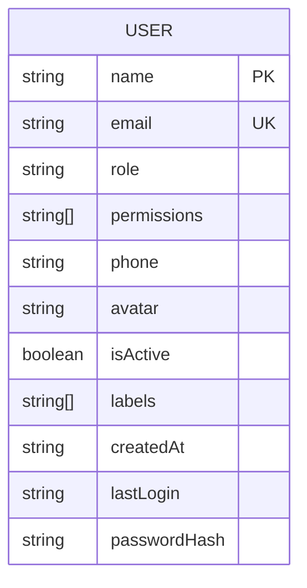
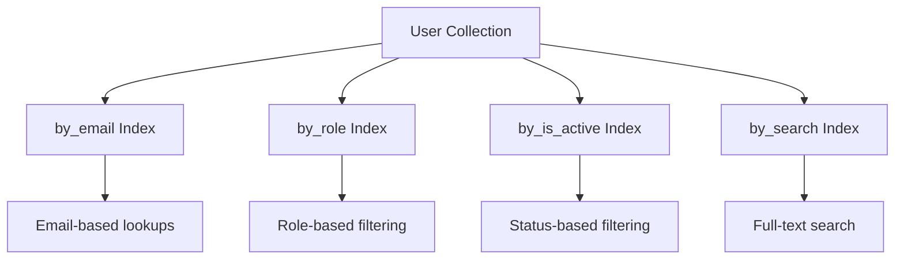
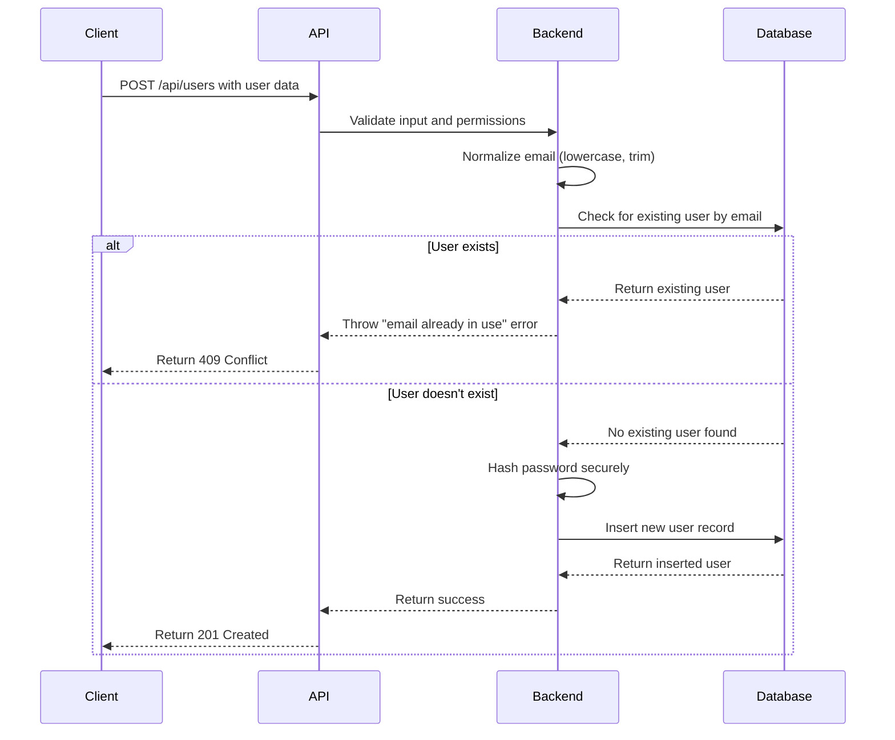
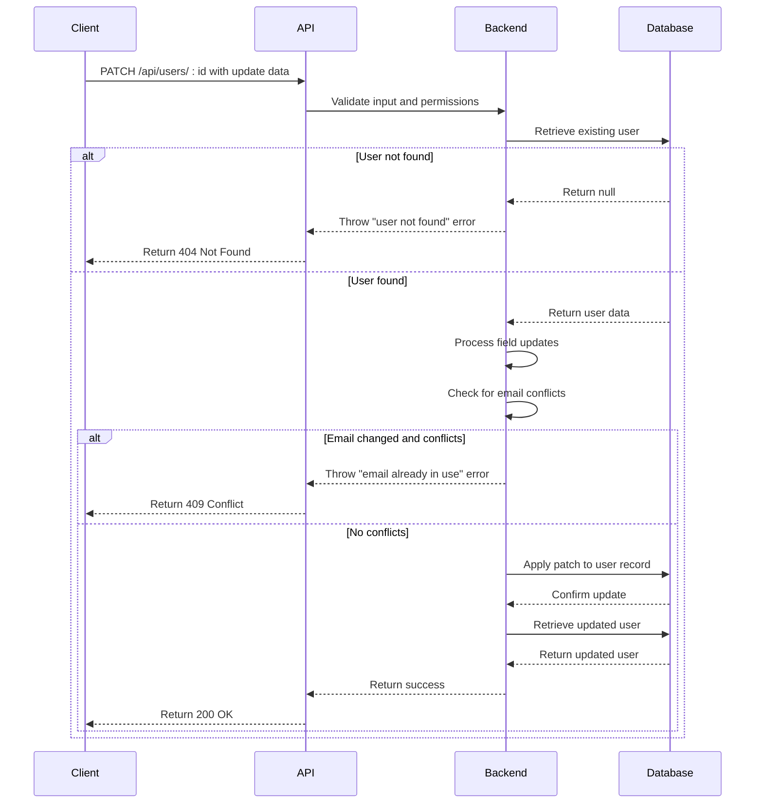
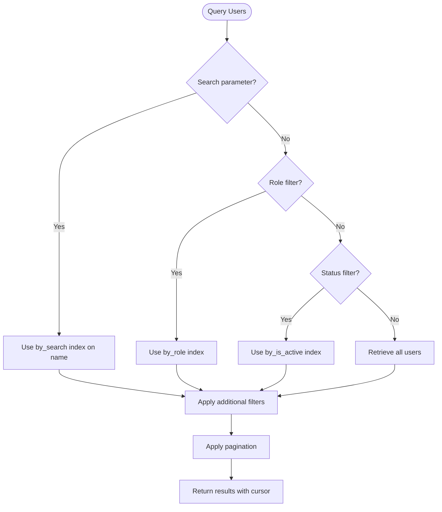
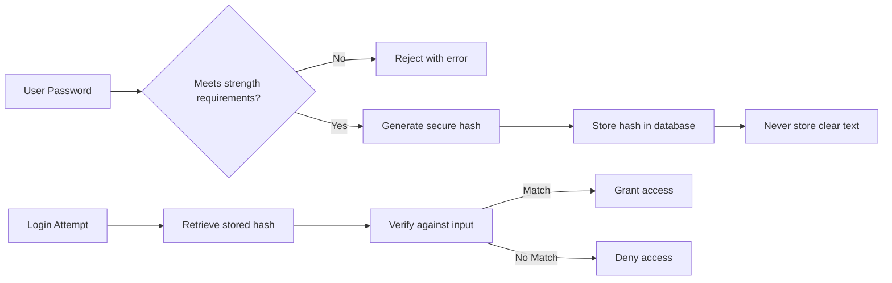
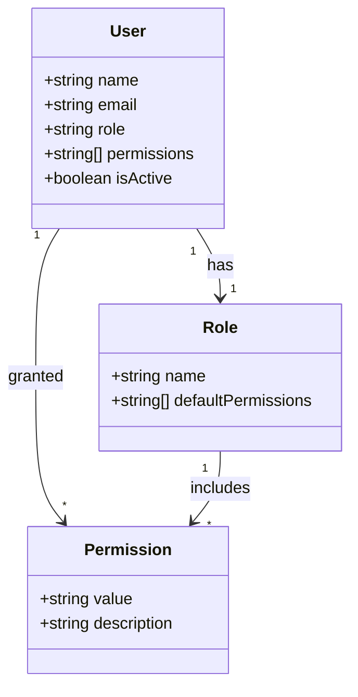
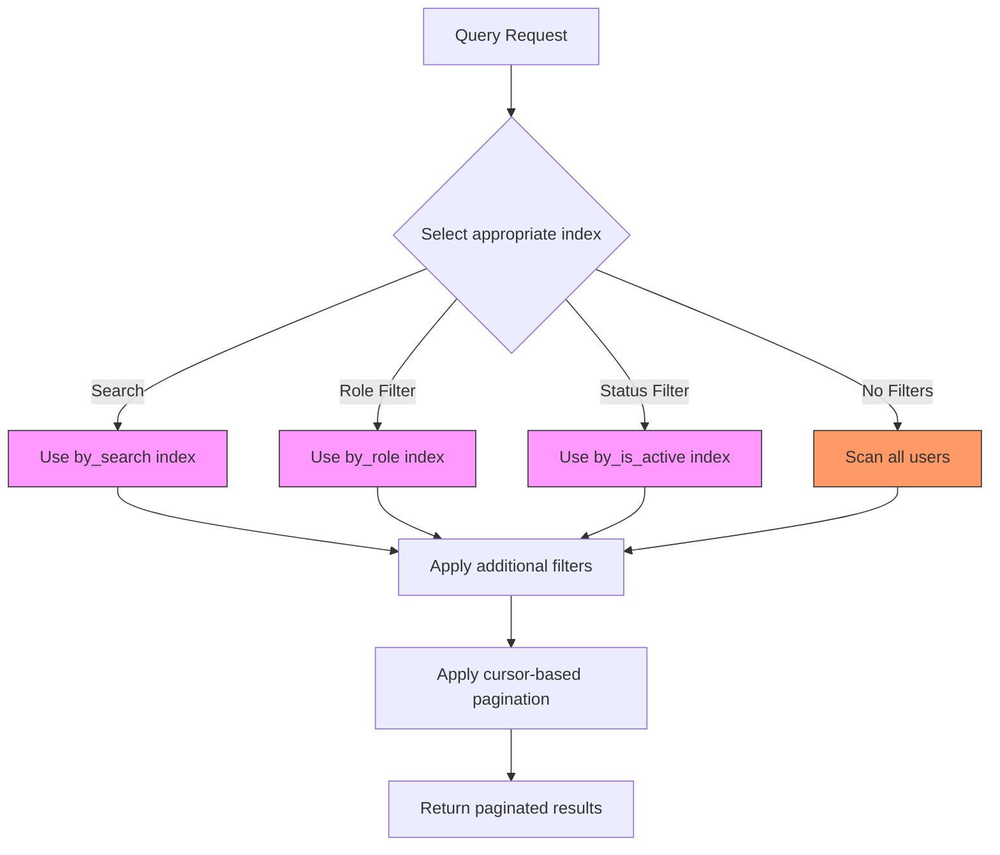
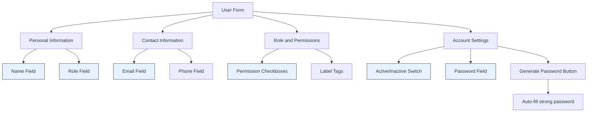
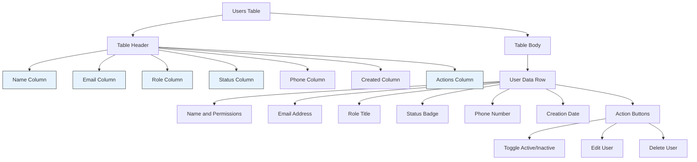

# User Management

<cite>
**Referenced Files in This Document**   
- [schema.ts](file://convex/schema.ts)
- [users.ts](file://convex/users.ts)
- [user-form.tsx](file://src/components/forms/user-form.tsx)
- [users-table.tsx](file://src/components/tables/users-table.tsx)
- [route.ts](file://src/app/api/users/route.ts)
- [audit_logs.ts](file://convex/audit_logs.ts)
- [tasks.ts](file://convex/tasks.ts)
- [meetings.ts](file://convex/meetings.ts)
- [messages.ts](file://convex/messages.ts)
</cite>

## Table of Contents

1. [Introduction](#introduction)
2. [User Entity Schema](#user-entity-schema)
3. [Indexing Strategy](#indexing-strategy)
4. [User Management Operations](#user-management-operations)
5. [Security Implementation](#security-implementation)
6. [Integration with Other Entities](#integration-with-other-entities)
7. [Performance Optimization](#performance-optimization)
8. [User Interface Components](#user-interface-components)
9. [Conclusion](#conclusion)

## Introduction

The User entity serves as the foundation for authentication, authorization, and user management within the Convex backend system. This documentation provides a comprehensive overview of the user data model, business logic, security considerations, and integration points with other system components. The User entity enables role-based access control, secure authentication, and comprehensive audit capabilities across the application.

**Section sources**

- [schema.ts](file://convex/schema.ts#L9-L39)

## User Entity Schema

The User entity schema defines the structure and validation rules for user records in the system. Each user record contains essential information for identification, authentication, and authorization purposes.

### Field Definitions

The User entity includes the following fields with their respective data types and validation rules:



**Diagram sources**

- [schema.ts](file://convex/schema.ts#L9-L32)

#### Core Fields

- **name**: String field representing the user's full name (required)
- **email**: String field storing the user's unique email address used for login and communication (required, unique)
- **role**: String field indicating the user's role within the system (e.g., 'admin', 'staff', 'volunteer') (required)
- **permissions**: Optional array of strings representing specific permissions granted to the user
- **phone**: Optional string field for the user's phone number
- **avatar**: Optional string field containing the URL of the user's avatar image
- **isActive**: Boolean flag indicating whether the user account is active or disabled
- **labels**: Optional array of strings used for categorizing or tagging users
- **createdAt**: Optional ISO 8601 timestamp indicating when the user account was created
- **lastLogin**: Optional ISO 8601 timestamp recording the user's last login time
- **passwordHash**: Optional string field storing the hashed password for the user account

**Section sources**

- [schema.ts](file://convex/schema.ts#L10-L31)

## Indexing Strategy

The User entity employs a comprehensive indexing strategy to optimize query performance for common access patterns and enable efficient user discovery.

### Database Indexes

The following indexes are defined on the User collection to support efficient querying:



**Diagram sources**

- [schema.ts](file://convex/schema.ts#L33-L39)

#### Index Purposes

- **by_email**: Enables efficient lookups by email address, critical for authentication and user retrieval operations
- **by_role**: Facilitates filtering users by their assigned role, supporting role-based access control and reporting
- **by_is_active**: Allows quick filtering of active versus inactive users, essential for access control and user management
- **by_search**: Implements a search index that enables full-text search on the user's name field, with filtering capabilities on email and phone fields for enhanced user discovery

**Section sources**

- [schema.ts](file://convex/schema.ts#L33-L39)

## User Management Operations

The system provides comprehensive CRUD operations for user management through well-defined mutation and query functions in the backend.

### User Creation Process

The user creation process involves validation, email normalization, duplicate checking, and secure password storage:



**Diagram sources**

- [users.ts](file://convex/users.ts#L84-L121)
- [route.ts](file://src/app/api/users/route.ts#L154-L225)

### User Update Process

The user update process includes validation, email conflict detection, and partial updates while preserving existing data:



**Diagram sources**

- [users.ts](file://convex/users.ts#L124-L206)
- [route.ts](file://src/app/api/users/route.ts#L154-L225)

### User Query Operations

The system supports flexible querying of user records with multiple filtering options:



**Diagram sources**

- [users.ts](file://convex/users.ts#L6-L63)

**Section sources**

- [users.ts](file://convex/users.ts#L6-L63)
- [route.ts](file://src/app/api/users/route.ts#L106-L151)

## Security Implementation

The system implements robust security measures for user authentication, password management, and access control.

### Password Security

The password management system follows industry best practices for secure password storage:



**Diagram sources**

- [users.ts](file://convex/users.ts#L84-L121)
- [route.ts](file://src/app/api/users/route.ts#L175-L183)

The password security implementation includes:

- Password strength validation requiring minimum length and complexity
- Secure password hashing using industry-standard algorithms
- Protection against email enumeration attacks
- Account status validation during login
- Comprehensive error logging for security monitoring

**Section sources**

- [users.ts](file://convex/users.ts#L84-L121)
- [route.ts](file://src/app/api/users/route.ts#L175-L183)

### Access Control

The system implements role-based access control with granular permissions:



**Diagram sources**

- [users.ts](file://convex/users.ts#L84-L121)
- [user-form.tsx](file://src/components/forms/user-form.tsx#L18-L19)

Access control is enforced through:

- Role-based permissions with predefined role templates
- Granular module-level access control
- Active/inactive status enforcement
- CSRF protection for all mutating operations
- Authentication requirement for all user management operations

**Section sources**

- [users.ts](file://convex/users.ts#L84-L121)
- [route.ts](file://src/app/api/users/route.ts#L108-L113)

## Integration with Other Entities

The User entity serves as a central hub that integrates with various other system components through references and audit trails.

### Relationship with Other Entities

The User entity maintains relationships with multiple system components:

```mermaid
erDiagram
USER ||--o{ TASK : "assigned_to/created_by"
USER ||--o{ MEETING : "organizer/participants"
USER ||--o{ MESSAGE : "sender/recipients"
USER ||--o{ AUDIT_LOG : "userId"
USER ||--o{ WORKFLOW_NOTIFICATION : "recipient/triggered_by"
USER ||--o{ FINANCE_RECORD : "created_by/approved_by"
USER ||--o{ AID_APPLICATION : "processed_by/approved_by"
USER {
string _id PK
string name
string email
string role
string[] permissions
boolean isActive
}
TASK {
string _id PK
string title
Id<'users'> assigned_to FK
Id<'users'> created_by FK
}
MEETING {
string _id PK
string title
Id<'users'> organizer FK
Id<'users'>[] participants FK
}
MESSAGE {
string _id PK
string content
Id<'users'> sender FK
Id<'users'>[] recipients FK
}
AUDIT_LOG {
string _id PK
Id<'users'> userId FK
string action
string resource
string resourceId
}
WORKFLOW_NOTIFICATION {
string _id PK
Id<'users'> recipient FK
Id<'users'> triggered_by FK
}
FINANCE_RECORD {
string _id PK
Id<'users'> created_by FK
Id<'users'> approved_by FK
}
AID_APPLICATION {
string _id PK
Id<'users'> processed_by FK
Id<'users'> approved_by FK
}
```

**Diagram sources**

- [schema.ts](file://convex/schema.ts#L9-L39)
- [tasks.ts](file://convex/tasks.ts#L226-L228)
- [meetings.ts](file://convex/meetings.ts#L272-L274)
- [messages.ts](file://convex/messages.ts#L435-L437)
- [audit_logs.ts](file://convex/audit_logs.ts#L4-L5)
- [workflow_notifications.ts](file://convex/workflow_notifications.ts#L387-L389)
- [finance_records.ts](file://convex/finance_records.ts#L567-L569)
- [aid_applications.ts](file://convex/aid_applications.ts#L527-L531)

The User entity is referenced by:

- Tasks: Users can be assigned to tasks or create tasks
- Meetings: Users can organize meetings or participate in them
- Messages: Users can send messages to other users
- Audit Logs: User actions are tracked for compliance
- Workflow Notifications: Users receive system notifications
- Financial Records: Users create or approve financial transactions
- Aid Applications: Users process or approve aid applications

**Section sources**

- [schema.ts](file://convex/schema.ts#L9-L39)
- [tasks.ts](file://convex/tasks.ts#L226-L228)
- [meetings.ts](file://convex/meetings.ts#L272-L274)
- [messages.ts](file://convex/messages.ts#L435-L437)
- [audit_logs.ts](file://convex/audit_logs.ts#L4-L5)
- [workflow_notifications.ts](file://convex/workflow_notifications.ts#L387-L389)
- [finance_records.ts](file://convex/finance_records.ts#L567-L569)
- [aid_applications.ts](file://convex/aid_applications.ts#L527-L531)

## Performance Optimization

The system implements several performance optimizations for efficient user management operations.

### Query Optimization

The user query system employs multiple optimization techniques:



**Diagram sources**

- [users.ts](file://convex/users.ts#L14-L55)

Key performance optimizations include:

- Index-based filtering to minimize database scans
- Cursor-based pagination to support efficient large dataset handling
- Client-side filtering for combined search and filter operations
- Caching of frequently accessed user data
- Batch operations for improved throughput

**Section sources**

- [users.ts](file://convex/users.ts#L14-L55)

## User Interface Components

The system provides user-friendly interface components for managing user records.

### User Form Component

The user form component provides a comprehensive interface for creating and editing user records:



**Diagram sources**

- [user-form.tsx](file://src/components/forms/user-form.tsx#L63-L255)

### Users Table Component

The users table component displays user records in a tabular format with filtering and action capabilities:



**Diagram sources**

- [users-table.tsx](file://src/components/tables/users-table.tsx#L47-L151)

**Section sources**

- [user-form.tsx](file://src/components/forms/user-form.tsx#L63-L255)
- [users-table.tsx](file://src/components/tables/users-table.tsx#L47-L151)

## Conclusion

The User entity in the Convex backend provides a robust foundation for user management, authentication, and authorization. The comprehensive schema design, efficient indexing strategy, and secure implementation ensure reliable and performant user operations. The integration with audit logs and other system components enables comprehensive tracking and access control. The user interface components provide an intuitive experience for managing user records, while the backend operations ensure data integrity and security. This implementation supports the organization's needs for secure, scalable, and auditable user management.
