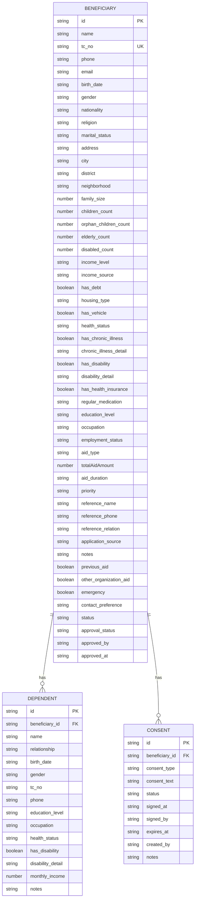
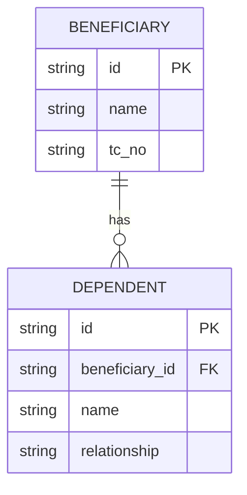
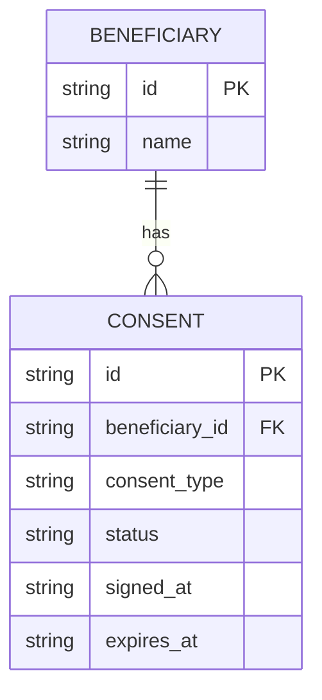
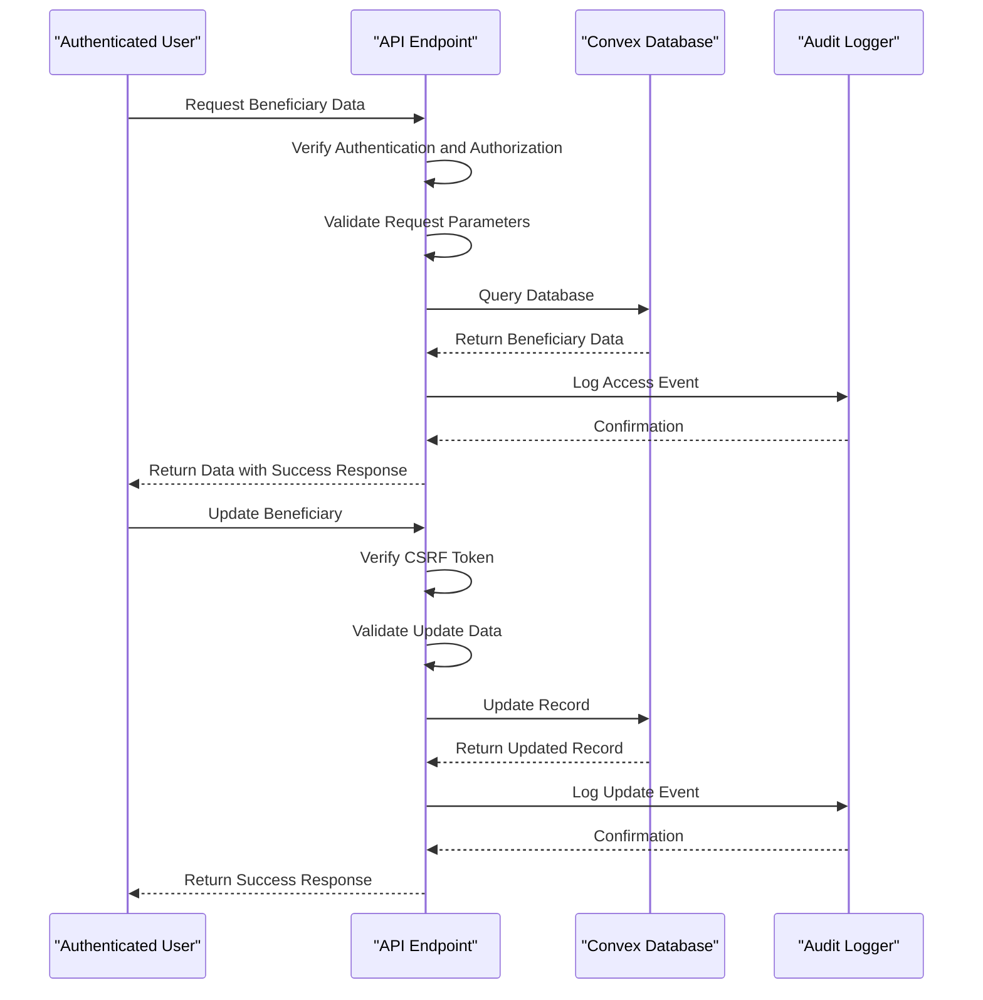

# Beneficiary Model

<cite>
**Referenced Files in This Document**   
- [beneficiaries.ts](file://convex/beneficiaries.ts)
- [dependents.ts](file://convex/dependents.ts)
- [consents.ts](file://convex/consents.ts)
- [route.ts](file://src/app/api/beneficiaries/route.ts)
- [route.ts](file://src/app/api/beneficiaries/[id]/route.ts)
</cite>

## Table of Contents

1. [Introduction](#introduction)
2. [Core Data Model](#core-data-model)
3. [Field Definitions](#field-definitions)
4. [Relationships](#relationships)
5. [Schema Normalization and Indexing](#schema-normalization-and-indexing)
6. [Data Validation Rules](#data-validation-rules)
7. [Data Access Patterns](#data-access-patterns)
8. [Sample Records](#sample-records)
9. [Data Lifecycle](#data-lifecycle)
10. [Conclusion](#conclusion)

## Introduction

The Beneficiary model in the PORTAL application serves as the central entity for managing individuals and families receiving assistance. This comprehensive data model captures personal information, family composition, socioeconomic status, vulnerability indicators, and consent records. The model is designed to support efficient data retrieval, maintain data integrity, and ensure compliance with privacy regulations through robust validation and access controls.

**Section sources**

- [beneficiaries.ts](file://convex/beneficiaries.ts#L1-L229)

## Core Data Model

The Beneficiary model is implemented as a Convex document with a comprehensive schema that includes personal details, family information, socioeconomic data, and vulnerability indicators. The model is designed with extensibility in mind, allowing for the addition of new fields as program requirements evolve.



**Diagram sources**

- [beneficiaries.ts](file://convex/beneficiaries.ts#L89-L149)
- [dependents.ts](file://convex/dependents.ts#L22-L38)
- [consents.ts](file://convex/consents.ts#L20-L31)

**Section sources**

- [beneficiaries.ts](file://convex/beneficiaries.ts#L89-L149)
- [dependents.ts](file://convex/dependents.ts#L22-L38)
- [consents.ts](file://convex/consents.ts#L20-L31)

## Field Definitions

The Beneficiary model contains comprehensive fields organized into logical categories:

### Personal Information

- **name**: Full name of the beneficiary (string, required)
- **tc_no**: Turkish Identification Number (string, required, unique)
- **phone**: Contact phone number (string, required)
- **email**: Email address (string, optional)
- **birth_date**: Date of birth (string, optional)
- **gender**: Gender identifier (string, optional)
- **nationality**: Nationality (string, optional)
- **religion**: Religious affiliation (string, optional)
- **marital_status**: Marital status (string, optional)

### Address Information

- **address**: Full address (string, required, min 10 characters)
- **city**: City of residence (string, required)
- **district**: District within city (string, required)
- **neighborhood**: Neighborhood (string, required)

### Family Status

- **family_size**: Total number of family members (number, required)
- **children_count**: Number of children in household (number, optional)
- **orphan_children_count**: Number of orphaned children (number, optional)
- **elderly_count**: Number of elderly members (65+) (number, optional)
- **disabled_count**: Number of disabled members (number, optional)

### Socioeconomic Data

- **income_level**: Income bracket (string, optional)
- **income_source**: Primary source of income (string, optional)
- **has_debt**: Indicates if family has outstanding debts (boolean, optional)
- **housing_type**: Type of housing (string, optional)
- **has_vehicle**: Indicates if family owns a vehicle (boolean, optional)
- **education_level**: Highest education level (string, optional)
- **occupation**: Occupation (string, optional)
- **employment_status**: Employment status (string, optional)

### Vulnerability Indicators

- **health_status**: General health status (string, optional)
- **has_chronic_illness**: Indicates chronic illness (boolean, optional)
- **chronic_illness_detail**: Details of chronic illness (string, optional)
- **has_disability**: Indicates disability (boolean, optional)
- **disability_detail**: Details of disability (string, optional)
- **has_health_insurance**: Indicates health insurance coverage (boolean, optional)
- **regular_medication**: Medication requirements (string, optional)

### Assistance Information

- **aid_type**: Type of assistance received (string, optional)
- **totalAidAmount**: Total aid amount received (number, optional)
- **aid_duration**: Duration of aid (string, optional)
- **priority**: Priority level (string, optional)
- **reference_name**: Reference person name (string, optional)
- **reference_phone**: Reference person phone (string, optional)
- **reference_relation**: Relationship to reference (string, optional)
- **application_source**: How application was submitted (string, optional)
- **notes**: Additional notes (string, optional)
- **previous_aid**: Indicates previous aid received (boolean, optional)
- **other_organization_aid**: Indicates aid from other organizations (boolean, optional)
- **emergency**: Emergency status (boolean, optional)
- **contact_preference**: Preferred contact method (string, optional)

### System Fields

- **status**: Record status (TASLAK, AKTIF, PASIF, SILINDI) (string, required)
- **approval_status**: Approval status (pending, approved, rejected) (string, optional)
- **approved_by**: User who approved (string, optional)
- **approved_at**: Timestamp of approval (string, optional)

**Section sources**

- [beneficiaries.ts](file://convex/beneficiaries.ts#L89-L149)

## Relationships

The Beneficiary model establishes relationships with dependent models to capture family composition and consent records.

### One-to-Many Relationship with Dependent Model

Each beneficiary can have multiple dependents, representing family members or individuals under their care. This relationship is implemented through a foreign key reference from the Dependent model to the Beneficiary model.



**Diagram sources**

- [beneficiaries.ts](file://convex/beneficiaries.ts#L89-L149)
- [dependents.ts](file://convex/dependents.ts#L22-L38)

### Consent Tracking through Consents Model

The Beneficiary model maintains consent records through a one-to-many relationship with the Consents model. This allows tracking of various consent types, their status, and expiration dates.



**Diagram sources**

- [beneficiaries.ts](file://convex/beneficiaries.ts#L89-L149)
- [consents.ts](file://convex/consents.ts#L20-L31)

**Section sources**

- [dependents.ts](file://convex/dependents.ts#L22-L38)
- [consents.ts](file://convex/consents.ts#L20-L31)

## Schema Normalization and Indexing

The Beneficiary model employs a normalized schema design with strategic indexing to optimize query performance.

### Schema Normalization Approach

The data model follows third normal form principles by:

- Eliminating repeating groups through the Dependent and Consents child models
- Ensuring atomic values in each field
- Minimizing data redundancy through proper relationship design
- Using foreign keys to maintain referential integrity

### Indexing Strategy

The model implements several indexes on key search fields to ensure efficient data retrieval:

- **by_tc_no**: Unique index on tc_no field for fast identification number lookups
- **by_status**: Index on status field for filtering active, draft, or inactive records
- **by_city**: Index on city field for geographic-based queries
- **by_beneficiary**: Index on beneficiary_id in Dependent and Consent models for relationship queries
- **by_search**: Full-text search index on name field for flexible searching

These indexes support the primary data access patterns while maintaining write performance.

**Section sources**

- [beneficiaries.ts](file://convex/beneficiaries.ts#L7-L60)
- [dependents.ts](file://convex/dependents.ts#L6-L18)
- [consents.ts](file://convex/consents.ts#L4-L16)

## Data Validation Rules

The Beneficiary model implements comprehensive validation rules to ensure data quality and integrity, particularly for sensitive information.

### Personal Information Validation

- **TC Number**: Must be exactly 11 digits (regex: ^\d{11}$)
- **Name**: Minimum 2 characters
- **Phone**: 10-15 digits with optional formatting characters
- **Email**: Valid email format if provided (regex: ^[^\s@]+@[^\s@]+\.[^\s@]+$)
- **Address**: Minimum 10 characters

### Status Validation

- **status**: Must be one of: TASLAK, AKTIF, PASIF, SILINDI
- **approval_status**: Must be one of: pending, approved, rejected

### Data Integrity Rules

- **Unique TC Number**: Prevents duplicate beneficiaries with the same identification number
- **Required Fields**: Ensures essential information is provided during creation
- **Type Safety**: Enforces proper data types for all fields
- **Range Validation**: Numeric fields must be valid numbers

These validation rules are enforced at both the API and database levels to ensure data consistency.

**Section sources**

- [beneficiaries.ts](file://convex/beneficiaries.ts#L153-L164)
- [route.ts](file://src/app/api/beneficiaries/route.ts#L46-L79)
- [route.ts](file://src/app/api/beneficiaries/[id]/route.ts#L12-L68)

## Data Access Patterns

The Beneficiary model supports various data access patterns with appropriate privacy controls and audit logging.

### Query Patterns

- **List with Pagination**: Retrieve beneficiaries with filtering by status, city, and search terms
- **Get by ID**: Retrieve a specific beneficiary by document ID
- **Get by TC Number**: Retrieve beneficiary by Turkish Identification Number
- **Filter by Status**: Retrieve beneficiaries by their current status
- **Search by Name**: Full-text search on beneficiary names

### Privacy Controls

- **Authentication**: All access requires authenticated user
- **Authorization**: Module-level access control based on user role
- **CSRF Protection**: State-changing operations require CSRF tokens
- **Data Masking**: Sensitive information like TC numbers are masked in logs
- **Role-Based Access**: Different access levels for viewing, editing, and deleting records

### Audit Logging

All operations on beneficiary records are logged with:

- **User Identification**: Who performed the action
- **Timestamp**: When the action occurred
- **Operation Type**: Create, read, update, or delete
- **Beneficiary ID**: Which record was affected
- **Error Details**: Comprehensive error logging with context



**Diagram sources**

- [beneficiaries.ts](file://convex/beneficiaries.ts#L7-L60)
- [route.ts](file://src/app/api/beneficiaries/route.ts#L86-L123)
- [route.ts](file://src/app/api/beneficiaries/[id]/route.ts#L75-L111)

**Section sources**

- [beneficiaries.ts](file://convex/beneficiaries.ts#L7-L60)
- [route.ts](file://src/app/api/beneficiaries/route.ts#L86-L123)
- [route.ts](file://src/app/api/beneficiaries/[id]/route.ts#L75-L111)

## Sample Records

The following sample records illustrate different family structures and assistance needs:

### Single Individual with Chronic Illness

```json
{
  "name": "Ayşe Yılmaz",
  "tc_no": "12345678901",
  "phone": "5551234567",
  "address": "Atatürk Mahallesi, Cumhuriyet Caddesi No:45",
  "city": "İstanbul",
  "district": "Kadıköy",
  "neighborhood": "Caferağa",
  "family_size": 1,
  "income_level": "düşük",
  "has_chronic_illness": true,
  "chronic_illness_detail": "Diyabet",
  "has_health_insurance": true,
  "regular_medication": "Insulin",
  "status": "AKTIF",
  "aid_type": "nakdi",
  "priority": "yüksek"
}
```

### Family with Orphaned Children

```json
{
  "name": "Mehmet Kaya",
  "tc_no": "23456789012",
  "phone": "5559876543",
  "address": "Cumhuriyet Mahallesi, Barış Caddesi No:12",
  "city": "Ankara",
  "district": "Çankaya",
  "neighborhood": "Kavaklıdere",
  "family_size": 5,
  "children_count": 4,
  "orphan_children_count": 3,
  "elderly_count": 1,
  "income_source": "emeklilik",
  "housing_type": "kira",
  "has_debt": true,
  "status": "AKTIF",
  "aid_type": "nakdi,kumbara",
  "priority": "çok yüksek"
}
```

### Elderly Couple

```json
{
  "name": "Ali ve Fatma Demir",
  "tc_no": "34567890123",
  "phone": "5554567890",
  "address": "Gazi Mustafa Kemal Mahallesi, Barış Caddesi No:78",
  "city": "İzmir",
  "district": "Karşıyaka",
  "neighborhood": "Alsancak",
  "family_size": 2,
  "elderly_count": 2,
  "health_status": "orta",
  "has_chronic_illness": true,
  "chronic_illness_detail": "Hipertansiyon, Romatizma",
  "has_health_insurance": true,
  "status": "AKTIF",
  "aid_type": "nakdi,sağlık",
  "priority": "yüksek"
}
```

**Section sources**

- [beneficiaries.ts](file://convex/beneficiaries.ts#L89-L149)

## Data Lifecycle

The Beneficiary model supports a comprehensive data lifecycle from intake to closure.

### Intake Process

1. **Data Collection**: Gather beneficiary information through intake forms
2. **Validation**: Validate all required fields and data formats
3. **Duplicate Check**: Verify TC number uniqueness
4. **Creation**: Create record with initial status "TASLAK" (Draft)
5. **Review**: Assign for review by appropriate personnel

### Active Management

- **Status Updates**: Transition from "TASLAK" to "AKTIF" upon approval
- **Regular Updates**: Periodic reassessment of beneficiary circumstances
- **Assistance Tracking**: Record aid types, amounts, and duration
- **Consent Management**: Track consent records for various services

### Closure Process

- **Status Change**: Update status to "PASIF" (Inactive) when assistance ends
- **Archival**: Set status to "SILINDI" (Deleted) for permanent removal
- **Audit Trail**: Maintain complete history of all changes
- **Data Retention**: Follow organizational policies for data retention

The lifecycle is managed through status transitions and comprehensive audit logging, ensuring accountability and compliance with data protection regulations.

**Section sources**

- [beneficiaries.ts](file://convex/beneficiaries.ts#L153-L228)
- [route.ts](file://src/app/api/beneficiaries/route.ts#L205-L247)
- [route.ts](file://src/app/api/beneficiaries/[id]/route.ts#L187-L220)

## Conclusion

The Beneficiary model in the PORTAL application provides a comprehensive and robust foundation for managing assistance programs. With its detailed data structure, strong validation rules, and well-defined relationships, the model supports efficient data management while ensuring data quality and privacy compliance. The implementation of proper indexing, access controls, and audit logging enables scalable operations and maintains accountability throughout the beneficiary lifecycle.
