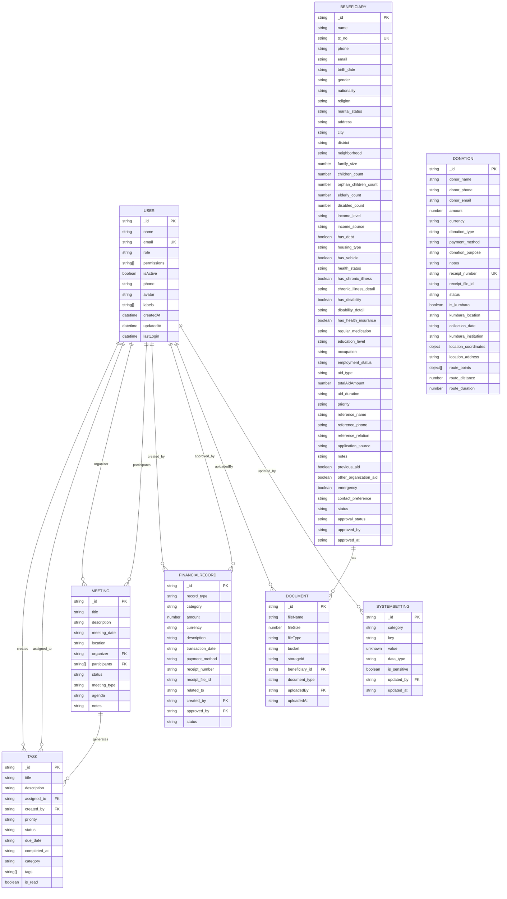

# Data Models

<cite>
**Referenced Files in This Document**   
- [users.ts](file://convex/users.ts)
- [beneficiaries.ts](file://convex/beneficiaries.ts)
- [donations.ts](file://convex/donations.ts)
- [tasks.ts](file://convex/tasks.ts)
- [meetings.ts](file://convex/meetings.ts)
- [finance_records.ts](file://convex/finance_records.ts)
- [documents.ts](file://convex/documents.ts)
- [system_settings.ts](file://convex/system_settings.ts)
- [database.ts](file://src/types/database.ts)
</cite>

## Table of Contents

1. [Introduction](#introduction)
2. [User Model](#user-model)
3. [Beneficiary Model](#beneficiary-model)
4. [Donation Model](#donation-model)
5. [Task Model](#task-model)
6. [Meeting Model](#meeting-model)
7. [FinancialRecord Model](#financialrecord-model)
8. [Document Model](#document-model)
9. [SystemSetting Model](#systemsetting-model)
10. [Database Schema Diagram](#database-schema-diagram)
11. [Data Access Patterns](#data-access-patterns)
12. [Data Validation Rules](#data-validation-rules)
13. [Data Lifecycle Management](#data-lifecycle-management)
14. [Sample Data](#sample-data)

## Introduction

This document provides comprehensive documentation for the data models used in the PORTAL application. The system is built on Convex as the backend platform, utilizing a document-based data model with structured collections for different entity types. The primary data entities include User, Beneficiary, Donation, Task, Meeting, FinancialRecord, Document, and SystemSetting. Each model is designed with specific fields, relationships, constraints, and business logic to support the application's functionality for managing beneficiaries, donations, tasks, meetings, and financial records.

The data model follows a normalized approach where possible while leveraging the flexibility of document databases for complex nested data. All models include standard metadata fields (\_id, \_creationTime, \_updatedAt) provided by Convex. The schema design emphasizes data integrity through validation rules, unique constraints (such as TC number for beneficiaries), and role-based access control.

**Section sources**

- [PROJECT_OVERVIEW.md](file://PROJECT_OVERVIEW.md#L108-L155)

## User Model

The User model represents system users with roles and permissions. It serves as the foundation for authentication and authorization within the application.

### Field Definitions

- **\_id**: Unique identifier (string) - Automatically generated by Convex
- **name**: Full name of the user (string) - Required
- **email**: Email address (string) - Required, normalized to lowercase
- **role**: User role (string) - Required, one of: Admin, Manager, Staff, Volunteer, Donor, Viewer
- **permissions**: Array of permission values (PermissionValue[]) - Required
- **isActive**: Account status (boolean) - Required, defaults to true
- **phone**: Phone number (string) - Optional
- **avatar**: Avatar URL or path (string | null) - Optional
- **labels**: Array of labels for user categorization (string[]) - Optional
- **createdAt**: Creation timestamp (string | Date) - Automatically set
- **updatedAt**: Last update timestamp (string | Date) - Automatically updated
- **lastLogin**: Last login timestamp (Date) - Updated on successful login

### Relationships

- Tasks: User can be assigned to tasks (Task.assigned_to → User.\_id)
- Tasks: User can create tasks (Task.created_by → User.\_id)
- Meetings: User can organize meetings (Meeting.organizer → User.\_id)
- Meetings: User can participate in meetings (Meeting.participants → User.\_id[])
- Financial Records: User can create financial records (FinanceRecord.created_by → User.\_id)
- System Settings: User can update settings (SystemSetting.updated_by → User.\_id)

### Constraints

- Email uniqueness enforced through indexed query
- Email is normalized (trimmed and converted to lowercase) before storage
- Role and permissions are validated during creation and update
- Password is hashed before storage (handled at API layer)

### Business Logic

- Email normalization occurs on create and update operations
- Duplicate email check prevents creation of users with existing emails
- Soft delete pattern implemented through isActive flag rather than physical deletion

**Section sources**

- [users.ts](file://convex/users.ts#L1-L220)
- [database.ts](file://src/types/database.ts#L20-L31)
- [auth.ts](file://src/types/auth.ts#L3-L15)

## Beneficiary Model

The Beneficiary model represents individuals or families receiving assistance through the organization. It contains comprehensive personal, family, economic, health, and education information.

### Field Definitions

- **\_id**: Unique identifier (string) - Automatically generated by Convex
- **name**: Full name (string) - Required
- **tc_no**: Turkish Identification Number (string) - Required, 11 digits
- **phone**: Phone number (string) - Required
- **email**: Email address (string) - Optional
- **birth_date**: Date of birth (string) - Optional, ISO format
- **gender**: Gender (string) - Optional
- **nationality**: Nationality (string) - Optional
- **religion**: Religion (string) - Optional
- **marital_status**: Marital status (string) - Optional
- **address**: Full address (string) - Required
- **city**: City (string) - Required
- **district**: District (string) - Required
- **neighborhood**: Neighborhood (string) - Required
- **family_size**: Total family members (number) - Required
- **children_count**: Number of children (number) - Optional
- **orphan_children_count**: Number of orphan children (number) - Optional
- **elderly_count**: Number of elderly members (number) - Optional
- **disabled_count**: Number of disabled members (number) - Optional
- **income_level**: Income level category (string) - Optional
- **income_source**: Source of income (string) - Optional
- **has_debt**: Indicates if family has debt (boolean) - Optional
- **housing_type**: Type of housing (string) - Optional
- **has_vehicle**: Indicates if family owns a vehicle (boolean) - Optional
- **health_status**: General health status (string) - Optional
- **has_chronic_illness**: Indicates chronic illness (boolean) - Optional
- **chronic_illness_detail**: Details of chronic illness (string) - Optional
- **has_disability**: Indicates disability (boolean) - Optional
- **disability_detail**: Details of disability (string) - Optional
- **has_health_insurance**: Indicates health insurance (boolean) - Optional
- **regular_medication**: Regular medication details (string) - Optional
- **education_level**: Education level (string) - Optional
- **occupation**: Occupation (string) - Optional
- **employment_status**: Employment status (string) - Optional
- **aid_type**: Type of aid received (string) - Optional
- **totalAidAmount**: Total aid amount received (number) - Optional
- **aid_duration**: Duration of aid (string) - Optional
- **priority**: Priority level (string) - Optional
- **reference_name**: Reference person name (string) - Optional
- **reference_phone**: Reference person phone (string) - Optional
- **reference_relation**: Relationship to reference (string) - Optional
- **application_source**: Source of application (string) - Optional
- **notes**: Additional notes (string) - Optional
- **previous_aid**: Indicates previous aid (boolean) - Optional
- **other_organization_aid**: Indicates aid from other organizations (boolean) - Optional
- **emergency**: Emergency case indicator (boolean) - Optional
- **contact_preference**: Preferred contact method (string) - Optional
- **status**: Current status (enum) - Required: TASLAK, AKTIF, PASIF, SILINDI
- **approval_status**: Approval status (enum) - Optional: pending, approved, rejected
- **approved_by**: ID of approver (string) - Optional
- **approved_at**: Approval timestamp (string) - Optional

### Relationships

- Documents: One-to-many relationship (Document.beneficiary_id → Beneficiary.\_id)
- Donations: Can be linked through beneficiary-specific donation tracking
- Tasks: Tasks can be associated with beneficiaries for follow-up

### Constraints

- TC number must be exactly 11 digits and unique across all beneficiaries
- Status field restricted to predefined values
- Validation occurs on both client and server sides
- Duplicate TC number check prevents creation of duplicate beneficiaries

### Business Logic

- TC number validation ensures proper format before creation or update
- Search functionality supports filtering by status, city, and text search
- Comprehensive personal and socioeconomic data collection supports needs assessment
- Status tracking supports workflow from draft to active/pasive cases

**Section sources**

- [beneficiaries.ts](file://convex/beneficiaries.ts#L1-L229)
- [database.ts](file://src/types/database.ts#L75-L146)

## Donation Model

The Donation model tracks all donations received by the organization, including both monetary and kumbara (piggy bank) collections.

### Field Definitions

- **\_id**: Unique identifier (string) - Automatically generated by Convex
- **donor_name**: Donor's full name (string) - Required
- **donor_phone**: Donor's phone number (string) - Required
- **donor_email**: Donor's email address (string) - Optional
- **amount**: Donation amount (number) - Required
- **currency**: Currency code (enum) - Required: TRY, USD, EUR
- **donation_type**: Type of donation (string) - Required
- **payment_method**: Payment method (string) - Required
- **donation_purpose**: Purpose of donation (string) - Required
- **notes**: Additional notes (string) - Optional
- **receipt_number**: Unique receipt number (string) - Required
- **receipt_file_id**: ID of receipt document (string) - Optional
- **status**: Donation status (enum) - Required: pending, completed, cancelled
- **is_kumbara**: Indicates if donation is from kumbara (boolean) - Optional
- **kumbara_location**: Location of kumbara collection (string) - Optional
- **collection_date**: Date of collection (string) - Optional, ISO format
- **kumbara_institution**: Institution where kumbara was collected (string) - Optional
- **location_coordinates**: GPS coordinates of collection (object) - Optional: { lat: number, lng: number }
- **location_address**: Address of collection location (string) - Optional
- **route_points**: Array of GPS points for collection route (object[]) - Optional: { lat: number, lng: number }[]
- **route_distance**: Total distance of collection route (number) - Optional
- **route_duration**: Duration of collection route (number) - Optional

### Relationships

- Users: Donation may be associated with staff who processed it (implied through audit logs)
- Documents: Receipt document linked via receipt_file_id
- Beneficiaries: Donations can be designated for specific beneficiaries (implied through purpose)

### Constraints

- Receipt number must be unique
- Amount must be a positive number
- Currency restricted to supported currencies
- Status field restricted to predefined values
- Kumbara-specific fields only applicable when is_kumbara is true

### Business Logic

- Supports both individual donations and kumbara collection campaigns
- Detailed tracking of kumbara collection routes and logistics
- Receipt management with document storage integration
- Flexible donation purposes to support various fundraising campaigns

**Section sources**

- [donations.ts](file://convex/donations.ts#L1-L149)
- [database.ts](file://src/types/database.ts#L148-L171)

## Task Model

The Task model represents actionable items within the organization, supporting kanban-style workflow management.

### Field Definitions

- **\_id**: Unique identifier (string) - Automatically generated by Convex
- **title**: Task title (string) - Required
- **description**: Detailed description (string) - Optional
- **assigned_to**: ID of user assigned to task (Id<'users'>) - Optional
- **created_by**: ID of user who created task (Id<'users'>) - Required
- **priority**: Task priority (enum) - Required: low, normal, high, urgent
- **status**: Task status (enum) - Required: pending, in_progress, completed, cancelled
- **due_date**: Deadline for task completion (string) - Optional, ISO format
- **completed_at**: Completion timestamp (string) - Automatically set when status changes to completed
- **category**: Task category (string) - Optional
- **tags**: Array of tags for classification (string[]) - Optional
- **is_read**: Read status indicator (boolean) - Required

### Relationships

- Users: Task assigned to user (Task.assigned_to → User.\_id)
- Users: Task created by user (Task.created_by → User.\_id)

### Constraints

- Status field restricted to predefined values
- Priority field restricted to predefined values
- completed_at timestamp automatically set when status changes to completed
- is_read field required for notification tracking

### Business Logic

- Automatic setting of completed_at when task status changes to completed
- Support for task prioritization and categorization
- Kanban board integration through status tracking
- Assignment system for distributing work among team members
- Due date tracking for time-sensitive tasks

**Section sources**

- [tasks.ts](file://convex/tasks.ts#L1-L140)
- [database.ts](file://src/types/database.ts#L232-L244)

## Meeting Model

The Meeting model tracks organizational meetings, including planning, execution, and follow-up actions.

### Field Definitions

- **\_id**: Unique identifier (string) - Automatically generated by Convex
- **title**: Meeting title (string) - Required
- **description**: Meeting description (string) - Optional
- **meeting_date**: Scheduled date and time (string) - Required, ISO format
- **location**: Meeting location (string) - Optional
- **organizer**: ID of meeting organizer (Id<'users'>) - Required
- **participants**: Array of participant IDs (Id<'users'>[]) - Required
- **status**: Meeting status (enum) - Required: scheduled, ongoing, completed, cancelled
- **meeting_type**: Type of meeting (enum) - Required: general, committee, board, other
- **agenda**: Meeting agenda (string) - Optional
- **notes**: Meeting notes (string) - Optional

### Relationships

- Users: Meeting organizer (Meeting.organizer → User.\_id)
- Users: Meeting participants (Meeting.participants → User.\_id[])
- Meeting Decisions: One-to-many relationship (MeetingDecision.meeting_id → Meeting.\_id)
- Meeting Action Items: One-to-many relationship (MeetingActionItem.meeting_id → Meeting.\_id)

### Constraints

- Status field restricted to predefined values
- Meeting type restricted to predefined values
- At least one participant required (including organizer)
- meeting_date must be a valid ISO datetime string

### Business Logic

- Supports different types of organizational meetings
- Participant tracking for attendance and follow-up
- Agenda and notes storage for meeting documentation
- Integration with decision and action item tracking
- Status workflow from scheduled to completed

**Section sources**

- [meetings.ts](file://convex/meetings.ts#L1-L124)
- [database.ts](file://src/types/database.ts#L246-L257)

## FinancialRecord Model

The FinancialRecord model tracks all financial transactions, including both income and expenses.

### Field Definitions

- **\_id**: Unique identifier (string) - Automatically generated by Convex
- **record_type**: Type of financial record (enum) - Required: income, expense
- **category**: Category of transaction (string) - Required
- **amount**: Transaction amount (number) - Required
- **currency**: Currency code (enum) - Required: TRY, USD, EUR
- **description**: Description of transaction (string) - Required
- **transaction_date**: Date of transaction (string) - Required, ISO format
- **payment_method**: Payment method used (string) - Optional
- **receipt_number**: Receipt number (string) - Optional
- **receipt_file_id**: ID of receipt document (string) - Optional
- **related_to**: ID of related entity (string) - Optional
- **created_by**: ID of user who created record (Id<'users'>) - Required
- **approved_by**: ID of user who approved record (Id<'users'>) - Optional
- **status**: Approval status (enum) - Required: pending, approved, rejected

### Relationships

- Users: Record created by user (FinanceRecord.created_by → User.\_id)
- Users: Record approved by user (FinanceRecord.approved_by → User.\_id)
- Documents: Receipt document linked via receipt_file_id

### Constraints

- record_type restricted to income or expense
- status field restricted to predefined values
- Amount must be positive
- Currency restricted to supported currencies
- Required fields enforced on creation

### Business Logic

- Dual status tracking for financial approval workflows
- Support for both income and expense tracking
- Receipt attachment for audit trail
- Flexible categorization system
- Related entity tracking for linking transactions to specific programs or beneficiaries

**Section sources**

- [finance_records.ts](file://convex/finance_records.ts#L1-L132)
- [database.ts](file://src/types/database.ts#L323-L337)

## Document Model

The Document model manages file attachments and documents within the system, with special handling for beneficiary-related documents.

### Field Definitions

- **\_id**: Unique identifier (string) - Automatically generated by Convex
- **fileName**: Original file name (string) - Required
- **fileSize**: Size in bytes (number) - Required
- **fileType**: MIME type (string) - Required
- **bucket**: Storage bucket name (string) - Required
- **storageId**: ID in Convex storage (Id<'\_storage'>) - Required
- **beneficiary_id**: ID of associated beneficiary (Id<'beneficiaries'>) - Required
- **document_type**: Type of document (string) - Optional
- **uploadedBy**: ID of user who uploaded (Id<'users'>) - Optional
- **uploadedAt**: Upload timestamp (string) - Automatically set

### Relationships

- Beneficiaries: Document belongs to beneficiary (Document.beneficiary_id → Beneficiary.\_id)
- Users: Document uploaded by user (Document.uploadedBy → User.\_id)
- Convex Storage: File content stored in Convex storage (Document.storageId → Convex storage ID)

### Constraints

- All fields required except document_type and uploadedBy
- Files are stored in Convex storage with metadata in this collection
- Deletion removes both metadata and file from storage
- Access control enforced through beneficiary permissions

### Business Logic

- Integrated with Convex storage system for file management
- Automatic URL generation for file access
- Complete lifecycle management including upload and deletion
- Specialized queries for retrieving all documents for a beneficiary
- Metadata tracking for audit purposes

**Section sources**

- [documents.ts](file://convex/documents.ts#L1-L109)
- [database.ts](file://src/types/database.ts#L12-L15)

## SystemSetting Model

The SystemSetting model stores configurable application settings organized by category.

### Field Definitions

- **\_id**: Unique identifier (string) - Automatically generated by Convex
- **category**: Settings category (string) - Required
- **key**: Setting key (string) - Required
- **value**: Setting value (unknown) - Required
- **data_type**: Data type of value (enum) - Automatically determined: string, number, boolean, object, array
- **is_sensitive**: Indicates sensitive data (boolean) - Automatically set for passwords/secrets
- **updated_by**: ID of user who last updated (Id<'users'>) - Optional
- **updated_at**: Last update timestamp (string) - Automatically set

### Relationships

- Users: Setting updated by user (SystemSetting.updated_by → User.\_id)

### Constraints

- Unique constraint on category + key combination
- Sensitive flag automatically set for keys containing 'password', 'secret', or 'key'
- Data type automatically inferred from value
- Bulk update operations supported through category-based updates

### Business Logic

- Hierarchical organization by category and key
- Dynamic data typing based on stored values
- Sensitive data identification for security purposes
- Bulk operations for updating all settings in a category
- Reset functionality to restore default settings
- Optimized queries for retrieving settings by category or individual key

**Section sources**

- [system_settings.ts](file://convex/system_settings.ts#L1-L244)
- [database.ts](file://src/types/database.ts#L174-L183)

## Database Schema Diagram



**Diagram sources **

- [users.ts](file://convex/users.ts#L1-L220)
- [beneficiaries.ts](file://convex/beneficiaries.ts#L1-L229)
- [donations.ts](file://convex/donations.ts#L1-L149)
- [tasks.ts](file://convex/tasks.ts#L1-L140)
- [meetings.ts](file://convex/meetings.ts#L1-L124)
- [finance_records.ts](file://convex/finance_records.ts#L1-L132)
- [documents.ts](file://convex/documents.ts#L1-L109)
- [system_settings.ts](file://convex/system_settings.ts#L1-L244)

## Data Access Patterns

The PORTAL application implements optimized data access patterns using Convex queries and indexes to ensure efficient retrieval and manipulation of data.

### Query Patterns

- **List Operations**: All collections support paginated listing with optional filtering. Parameters include limit, skip, and collection-specific filters (e.g., status, category).
- **Search**: Text search implemented using Convex search indexes, primarily on name fields for beneficiaries and users.
- **Filtering**: Indexed queries for common filter criteria such as status, date ranges, and categorical fields.
- **Lookup by Identifier**: Direct retrieval by \_id using Convex's get() method.
- **Unique Field Lookup**: Queries using unique indexes for TC number (beneficiaries) and email (users).

### Indexing Strategy

- **Primary Indexes**: All collections automatically indexed by \_id.
- **Unique Indexes**:
  - Beneficiaries: by_tc_no (tc_no)
  - Donations: by_receipt_number (receipt_number)
  - Users: by_email (email)
- **Filtered Indexes**:
  - Beneficiaries: by_status, by_city, by_search
  - Donations: by_status, by_donor_email, by_is_kumbara
  - Tasks: by_status, by_assigned_to, by_created_by
  - Meetings: by_status, by_organizer, by_meeting_date
  - Financial Records: by_record_type, by_status, by_created_by
  - System Settings: by_category, by_category_key

### Performance Considerations

- **Pagination**: Implemented using skip/limit pattern with cursor-based continuation where appropriate.
- **Batch Operations**: Large updates processed in batches to minimize conflicts (e.g., settings reset).
- **Read Optimization**: Queries designed to minimize read scope by using indexed fields.
- **Write Optimization**: Mutations structured to reduce write conflicts through batch processing.

**Section sources**

- [users.ts](file://convex/users.ts#L6-L63)
- [beneficiaries.ts](file://convex/beneficiaries.ts#L7-L60)
- [donations.ts](file://convex/donations.ts#L5-L52)
- [tasks.ts](file://convex/tasks.ts#L5-L43)
- [meetings.ts](file://convex/meetings.ts#L5-L40)
- [finance_records.ts](file://convex/finance_records.ts#L5-L43)
- [system_settings.ts](file://convex/system_settings.ts#L6-L21)

## Data Validation Rules

The data model implements comprehensive validation rules at both the application and database levels to ensure data integrity.

### Field-Level Validation

- **Required Fields**: All non-optional fields validated for presence.
- **Type Validation**: Data types enforced according to schema definitions.
- **Format Validation**:
  - Email: Valid email format
  - Phone: Turkish phone number format (+90)
  - Date: ISO 8601 format
  - TC Number: Exactly 11 digits
- **Range Validation**:
  - Numeric values: Positive amounts for financial data
  - Enumerated values: Restricted to predefined options

### Business Rule Validation

- **Uniqueness Constraints**:
  - User email uniqueness
  - Beneficiary TC number uniqueness
  - Donation receipt number uniqueness
- **State Transitions**:
  - Task status changes trigger automatic timestamp updates
  - Meeting status follows chronological workflow
- **Referential Integrity**:
  - Foreign key references validated against existing records
  - Cascading operations where appropriate (e.g., document deletion)

### Implementation

Validation is implemented through:

- Convex value types (v.string(), v.number(), etc.)
- Custom validation functions (e.g., isValidTcNumber)
- Zod schemas in client-side validation
- Server-side validation in mutation handlers

**Section sources**

- [beneficiaries.ts](file://convex/beneficiaries.ts#L4-L5)
- [users.ts](file://convex/users.ts#L4-L5)
- [src/lib/validations/](file://src/lib/validations/)

## Data Lifecycle Management

The PORTAL application implements structured data lifecycle management patterns for creation, update, and archival of records.

### Creation Patterns

- **Standard Creation**: All entities follow a consistent creation pattern using Convex mutations.
- **Default Values**: Automatic setting of creation timestamps and default statuses.
- **Data Normalization**: Email addresses normalized to lowercase during user creation.
- **Unique Constraints**: Validation of unique fields (email, TC number, receipt number) before insertion.

### Update Patterns

- **Partial Updates**: Support for updating specific fields without modifying the entire document.
- **Audit Trail**: Tracking of last update timestamp and user for audit purposes.
- **State Management**: Status transitions follow defined workflows with appropriate validations.
- **Conflict Resolution**: Optimistic concurrency control through Convex's document versioning.

### Archival and Deletion Patterns

- **Soft Deletion**: Primary entities use status flags (e.g., isActive) rather than physical deletion.
- **Hard Deletion**: Supported through dedicated remove mutations with proper authorization.
- **Cascade Operations**:
  - Document deletion removes both metadata and file from storage
  - Settings reset processes records in batches to minimize conflicts
- **Data Retention**: Deleted records maintain audit trail information for compliance.

### Special Cases

- **System Settings**: Bulk update and reset operations with batch processing to prevent conflicts.
- **Documents**: Integrated storage management ensuring file cleanup on metadata deletion.
- **Financial Records**: Approval workflows with status transitions and approver tracking.

**Section sources**

- [users.ts](file://convex/users.ts#L124-L219)
- [beneficiaries.ts](file://convex/beneficiaries.ts#L173-L228)
- [documents.ts](file://convex/documents.ts#L81-L97)
- [system_settings.ts](file://convex/system_settings.ts#L180-L244)

## Sample Data

### User Sample

```json
{
  "_id": "user_123",
  "name": "Ahmet Yılmaz",
  "email": "ahmet.yilmaz@organization.org",
  "role": "Manager",
  "permissions": ["beneficiaries:access", "donations:access", "users:manage"],
  "isActive": true,
  "phone": "+90 555 123 45 67",
  "avatar": "https://storage.convex/user_123/avatar.jpg",
  "labels": ["team-leader"],
  "createdAt": "2024-01-15T10:30:00Z",
  "updatedAt": "2024-01-15T10:30:00Z",
  "lastLogin": "2024-01-20T09:15:00Z"
}
```

### Beneficiary Sample

```json
{
  "_id": "beneficiary_456",
  "name": "Fatma Demir",
  "tc_no": "12345678901",
  "phone": "+90 555 987 65 43",
  "email": "fatma.demir@example.com",
  "birth_date": "1985-03-22",
  "gender": "KADIN",
  "nationality": "TC",
  "religion": "MUSLUMAN",
  "marital_status": "EVLİ",
  "address": "Atatürk Caddesi No:12 Daire:3",
  "city": "İSTANBUL",
  "district": "ŞİŞLİ",
  "neighborhood": "Mecidiyeköy",
  "family_size": 4,
  "children_count": 2,
  "orphan_children_count": 0,
  "elderly_count": 1,
  "disabled_count": 0,
  "income_level": "DÜŞÜK",
  "income_source": "EMEKLİLİK",
  "has_debt": true,
  "housing_type": "KİRALIK",
  "has_vehicle": false,
  "health_status": "ORTA",
  "has_chronic_illness": true,
  "chronic_illness_detail": "DİYABET",
  "has_disability": false,
  "disability_detail": "",
  "has_health_insurance": true,
  "regular_medication": "İnsülin",
  "education_level": "LİSE",
  "occupation": "EV HANIMI",
  "employment_status": "ÇALIŞMIYOR",
  "aid_type": "NAKDİ YARDIM",
  "totalAidAmount": 2500,
  "aid_duration": "3 AY",
  "priority": "YÜKSEK",
  "reference_name": "Ali Demir",
  "reference_phone": "+90 555 111 22 33",
  "reference_relation": "EŞ",
  "application_source": "MAHALLE MÜDÜRLÜĞÜ",
  "notes": "İki çocuklu dul anne, diyabet hastası",
  "previous_aid": true,
  "other_organization_aid": false,
  "emergency": false,
  "contact_preference": "TELEFON",
  "status": "AKTIF",
  "approval_status": "approved",
  "approved_by": "user_123",
  "approved_at": "2024-01-10T14:30:00Z"
}
```

### Donation Sample

```json
{
  "_id": "donation_789",
  "donor_name": "Mehmet Kaya",
  "donor_phone": "+90 555 456 78 90",
  "donor_email": "mehmet.kaya@donor.com",
  "amount": 1000,
  "currency": "TRY",
  "donation_type": "Bireysel Bağış",
  "payment_method": "Havale",
  "donation_purpose": "Genel Bağış",
  "notes": "Yılbaşı kampanyası için",
  "receipt_number": "RCP2024001",
  "receipt_file_id": "file_abc",
  "status": "completed",
  "is_kumbara": false,
  "kumbara_location": "",
  "collection_date": "",
  "kumbara_institution": "",
  "location_coordinates": null,
  "location_address": "",
  "route_points": [],
  "route_distance": 0,
  "route_duration": 0
}
```

**Section sources**

- [create-demo-data.ts](file://src/scripts/create-demo-data.ts#L1-L50)
- [PROJECT_OVERVIEW.md](file://PROJECT_OVERVIEW.md#L108-L155)
