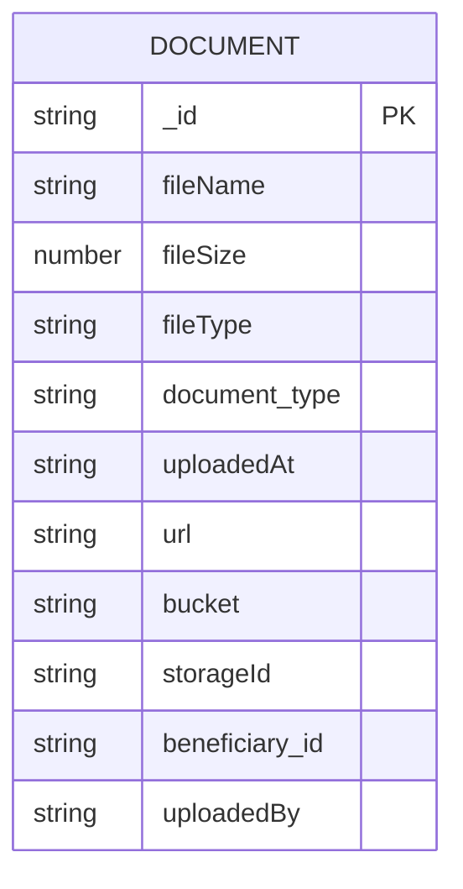
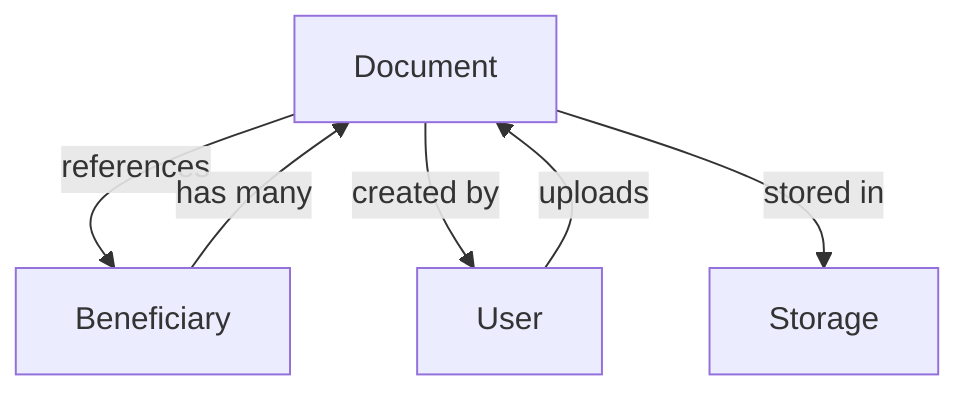
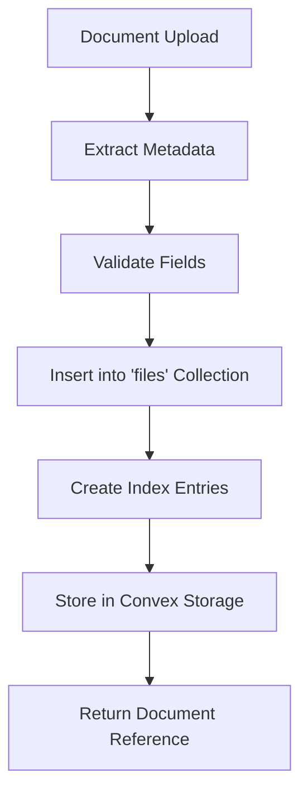
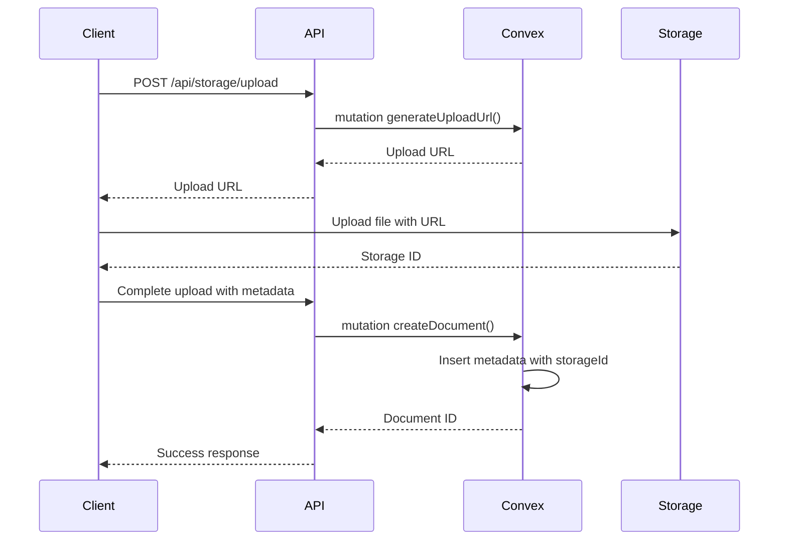
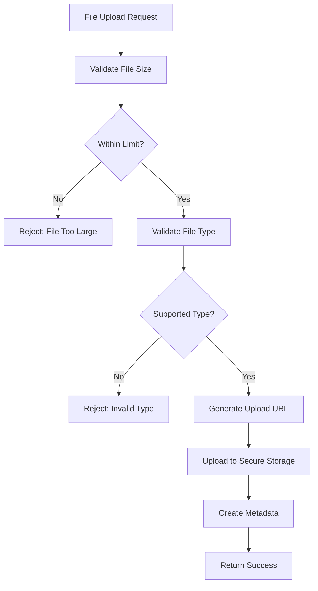
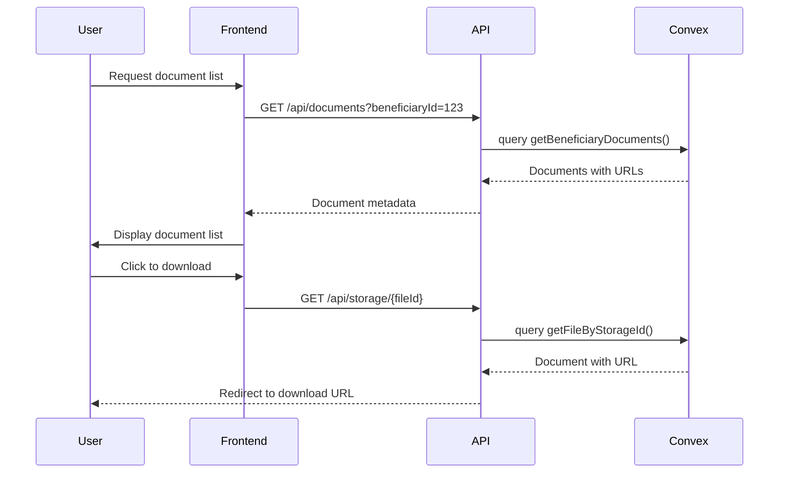
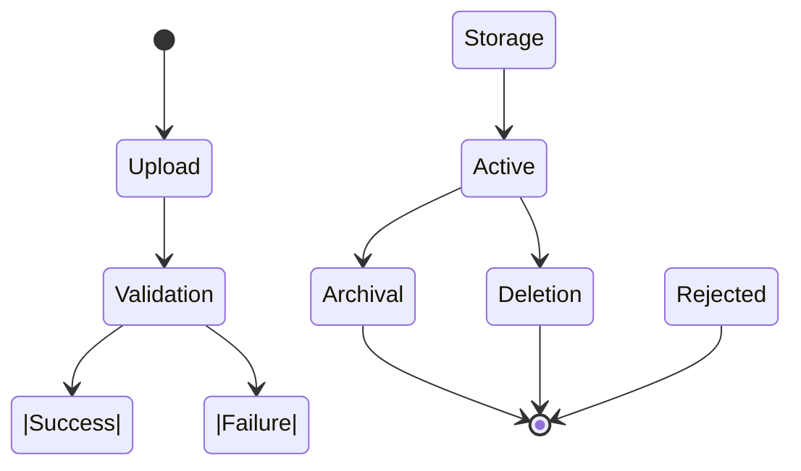

# Document Model

<cite>
**Referenced Files in This Document**   
- [documents.ts](file://convex/documents.ts)
- [DocumentsManager.tsx](file://src/components/documents/DocumentsManager.tsx)
- [storage.ts](file://convex/storage.ts)
- [database.ts](file://src/types/database.ts)
- [upload/route.ts](file://src/app/api/storage/upload/route.ts)
- [storage/[fileId]/route.ts](file://src/app/api/storage/[fileId]/route.ts)
</cite>

## Table of Contents

1. [Introduction](#introduction)
2. [Field Definitions](#field-definitions)
3. [Relationships and References](#relationships-and-references)
4. [Schema Design and Indexing](#schema-design-and-indexing)
5. [File Storage Integration](#file-storage-integration)
6. [Validation and Security](#validation-and-security)
7. [Data Access Patterns](#data-access-patterns)
8. [Sample Document Records](#sample-document-records)
9. [Data Lifecycle](#data-lifecycle)
10. [Conclusion](#conclusion)

## Introduction

The Document model in the PORTAL application serves as the central component for managing file-based records associated with beneficiaries, users, and other entities. This model provides a structured approach to document management, incorporating metadata storage, secure file handling, and comprehensive access controls. The implementation leverages Convex as the backend database and file storage system, ensuring reliable persistence and retrieval of documents across the application.

The Document model is designed to support various document types used throughout the humanitarian aid workflow, from identification documents and medical records to financial statements and educational materials. It enables efficient categorization, retrieval, and management of documents while maintaining data integrity and security.

**Section sources**

- [documents.ts](file://convex/documents.ts#L1-L109)
- [DocumentsManager.tsx](file://src/components/documents/DocumentsManager.tsx#L1-L278)

## Field Definitions

The Document model contains several key fields that capture essential metadata about each document. These fields provide the foundation for document management, search, and categorization within the application.



**Diagram sources**

- [documents.ts](file://convex/documents.ts#L52-L77)
- [database.ts](file://src/types/database.ts#L75-L145)

### Core Metadata Fields

- **fileName**: String field storing the original name of the uploaded file. This field preserves the filename for user reference and display purposes.
- **fileSize**: Numeric field indicating the size of the file in bytes. This enables size-based filtering and validation.
- **fileType**: String field containing the MIME type of the file (e.g., "application/pdf", "image/jpeg"). This information is used for proper rendering and security validation.
- **document_type**: Optional string field for categorizing documents into specific types (e.g., "ID", "medical_report", "financial_statement"). Default value is "other" when not specified.
- **uploadedAt**: String field storing the timestamp of document upload in ISO format. This enables chronological sorting and time-based queries.
- **url**: Optional string field that contains the temporary download URL for the document. This URL is generated on-demand for secure access.
- **metadata**: Object field that can store additional custom metadata specific to the document type or use case.

**Section sources**

- [documents.ts](file://convex/documents.ts#L54-L73)
- [database.ts](file://src/types/database.ts#L186-L215)

## Relationships and References

The Document model establishes relationships with various entities in the system through reference fields, enabling contextual document management and access control.

### Entity Relationships

The model maintains references to key entities in the system:

- **Beneficiaries**: Documents are associated with specific beneficiaries through the `beneficiary_id` field, enabling beneficiary-specific document collections.
- **Users**: The `uploadedBy` field references the user who uploaded the document, supporting audit trails and access control.
- **Donations**: While not directly referenced in the current implementation, documents can be linked to donations through metadata or external references.



**Diagram sources**

- [documents.ts](file://convex/documents.ts#L59-L60)
- [database.ts](file://src/types/database.ts#L75-L145)

These relationships enable the application to:

- Retrieve all documents for a specific beneficiary
- Track document ownership and upload history
- Implement role-based access control based on user permissions
- Generate audit logs for document access and modifications

**Section sources**

- [documents.ts](file://convex/documents.ts#L5-L25)
- [DocumentsManager.tsx](file://src/components/documents/DocumentsManager.tsx#L36-L58)

## Schema Design and Indexing

The Document model schema is designed for efficient querying and data retrieval, with strategic indexing on key fields to optimize performance.

### Collection Structure

The documents are stored in the "files" collection within Convex, with a schema that includes both metadata and system fields. The schema design follows Convex best practices, utilizing proper data types and constraints.

### Indexing Strategy

The model implements indexes on critical fields to enable fast queries:

- **by_beneficiary**: Index on `beneficiary_id` field for efficient retrieval of all documents associated with a specific beneficiary.
- **by_storage_id**: Index on `storageId` field for direct lookup of documents by their storage identifier.
- **by_bucket**: Index on `bucket` field for retrieving documents by their storage category.



**Diagram sources**

- [documents.ts](file://convex/documents.ts#L5-L13)
- [storage.ts](file://convex/storage.ts#L104-L119)

The indexing strategy supports common access patterns such as retrieving all documents for a beneficiary, finding documents by type, and searching within date ranges. This design ensures that document queries remain performant even as the dataset grows.

**Section sources**

- [documents.ts](file://convex/documents.ts#L5-L13)
- [storage.ts](file://convex/storage.ts#L104-L119)

## File Storage Integration

The Document model integrates with Convex's file storage system to securely manage file uploads, storage, and retrieval.

### Storage Architecture

The implementation follows a hybrid approach where:

- File content is stored in Convex's secure file storage system
- Metadata is stored in the "files" database collection
- References between metadata and file content are maintained through the `storageId` field

### Upload Process

The document upload process involves several steps:

1. Client requests an upload URL from the server
2. Client uploads the file directly to Convex storage using the signed URL
3. Server receives the storage ID and creates metadata in the database
4. Metadata record is linked to the stored file via the storage ID



**Diagram sources**

- [upload/route.ts](file://src/app/api/storage/upload/route.ts#L46-L87)
- [documents.ts](file://convex/documents.ts#L101-L107)

This architecture ensures that files are stored securely while allowing efficient metadata queries and access control.

**Section sources**

- [upload/route.ts](file://src/app/api/storage/upload/route.ts#L1-L98)
- [storage.ts](file://convex/storage.ts#L1-L15)

## Validation and Security

The Document model implements comprehensive validation and security measures to protect against malicious uploads and ensure data integrity.

### File Validation

The system enforces strict validation rules on uploaded files:

- **Size Limit**: Maximum file size of 10MB to prevent resource exhaustion
- **Type Restrictions**: Only specific MIME types are allowed, including:
  - Image formats: JPEG, PNG, WebP
  - PDF documents
  - Microsoft Word documents (DOC, DOCX)
- **Content Verification**: File type is validated both by extension and MIME type

### Security Measures

The implementation includes several security features:

- **Signed Upload URLs**: Temporary URLs for uploads that expire after use
- **Access Control**: Document access restricted based on user permissions
- **Input Sanitization**: All metadata fields are validated and sanitized
- **Error Handling**: Comprehensive error handling to prevent information leakage



**Diagram sources**

- [upload/route.ts](file://src/app/api/storage/upload/route.ts#L20-L44)
- [documents.ts](file://convex/documents.ts#L52-L77)

These validation and security measures ensure that only appropriate files are stored in the system while protecting against common attack vectors.

**Section sources**

- [upload/route.ts](file://src/app/api/storage/upload/route.ts#L20-L44)
- [documents.ts](file://convex/documents.ts#L52-L77)

## Data Access Patterns

The Document model supports various data access patterns for retrieving, updating, and managing documents within the application.

### Retrieval Methods

The system provides multiple ways to access documents:

- **By Beneficiary**: Retrieve all documents associated with a specific beneficiary
- **By Storage ID**: Direct lookup of a document using its storage identifier
- **By Type**: Filter documents by their document_type field
- **By Date Range**: Query documents uploaded within specific time periods

### Access Control

Document access follows a permission-based model:

- Users can only access documents they have permission to view
- Access is enforced at both the API and database levels
- Download URLs are temporary and expire after use



**Diagram sources**

- [documents.ts](file://convex/documents.ts#L4-L25)
- [storage/[fileId]/route.ts](file://src/app/api/storage/[fileId]/route.ts#L5-L27)

These access patterns support common use cases such as viewing a beneficiary's document collection, downloading specific files, and managing document lifecycles.

**Section sources**

- [documents.ts](file://convex/documents.ts#L4-L49)
- [storage/[fileId]/route.ts](file://src/app/api/storage/[fileId]/route.ts#L5-L27)

## Sample Document Records

The Document model supports various document types used in the humanitarian aid context. Below are examples of sample document records for different use cases.

### Identification Document

```json
{
  "_id": "doc_123",
  "fileName": "national_id.pdf",
  "fileSize": 1572864,
  "fileType": "application/pdf",
  "document_type": "ID",
  "uploadedAt": "2024-01-15T10:30:00Z",
  "url": "https://storage.convex.dev/abc123",
  "beneficiary_id": "ben_456",
  "uploadedBy": "user_789"
}
```

### Medical Report

```json
{
  "_id": "doc_234",
  "fileName": "medical_report.jpg",
  "fileSize": 2097152,
  "fileType": "image/jpeg",
  "document_type": "medical_report",
  "uploadedAt": "2024-01-16T14:20:00Z",
  "url": "https://storage.convex.dev/def456",
  "beneficiary_id": "ben_456",
  "uploadedBy": "user_789"
}
```

### Financial Statement

```json
{
  "_id": "doc_345",
  "fileName": "bank_statement.pdf",
  "fileSize": 8388608,
  "fileType": "application/pdf",
  "document_type": "financial_statement",
  "uploadedAt": "2024-01-17T09:15:00Z",
  "url": "https://storage.convex.dev/ghi789",
  "beneficiary_id": "ben_456",
  "uploadedBy": "user_789"
}
```

These sample records demonstrate how the Document model can accommodate different document types while maintaining consistent metadata structure.

**Section sources**

- [documents.ts](file://convex/documents.ts#L52-L77)
- [database.ts](file://src/types/database.ts#L186-L215)

## Data Lifecycle

The Document model manages the complete lifecycle of documents from upload to archival or deletion.

### Lifecycle Stages

1. **Upload**: Document is uploaded through the API, with validation and storage
2. **Active**: Document is available for access and use in the application
3. **Archival**: Documents may be moved to long-term storage based on retention policies
4. **Deletion**: Documents are securely deleted when no longer needed

### Versioning Strategy

The current implementation does not support document versioning, treating each upload as a separate document. This approach simplifies the model while allowing for historical tracking through multiple document records.

### Deletion Process

When a document is deleted:

1. The metadata record is retrieved from the database
2. The file is deleted from Convex storage
3. The metadata record is removed from the database
4. Audit logs are updated to record the deletion



**Diagram sources**

- [documents.ts](file://convex/documents.ts#L80-L98)
- [storage/[fileId]/route.ts](file://src/app/api/storage/[fileId]/route.ts#L33-L47)

This lifecycle management ensures that documents are properly handled throughout their existence in the system, with appropriate security and compliance measures.

**Section sources**

- [documents.ts](file://convex/documents.ts#L80-L98)
- [storage/[fileId]/route.ts](file://src/app/api/storage/[fileId]/route.ts#L33-L47)

## Conclusion

The Document model in the PORTAL application provides a robust foundation for managing file-based records in a humanitarian aid context. By combining structured metadata storage with secure file handling, the model enables efficient document management across various use cases.

Key strengths of the implementation include:

- Clear separation between file content and metadata
- Comprehensive validation and security measures
- Efficient indexing for common access patterns
- Integration with Convex's reliable storage system
- Support for multiple document types and use cases

The model effectively supports the application's requirements for document management while maintaining data integrity, security, and performance. Future enhancements could include versioning support, enhanced metadata extraction, and improved search capabilities.

**Section sources**

- [documents.ts](file://convex/documents.ts#L1-L109)
- [DocumentsManager.tsx](file://src/components/documents/DocumentsManager.tsx#L1-L278)
