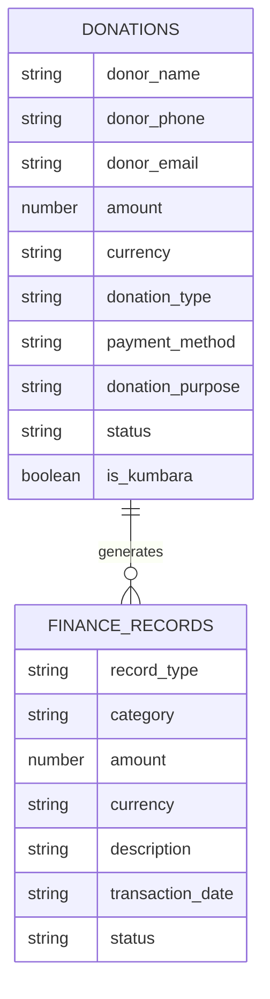
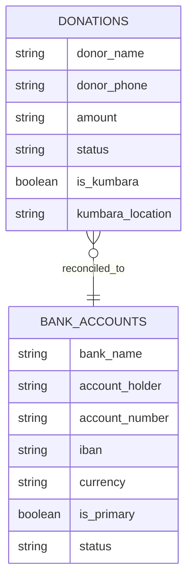
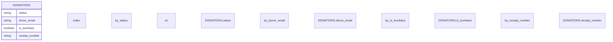
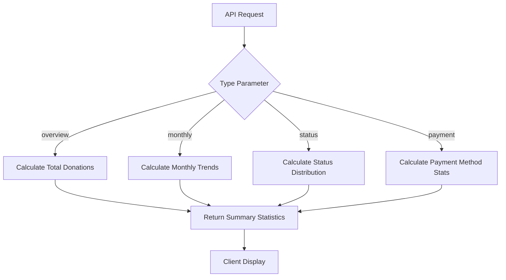
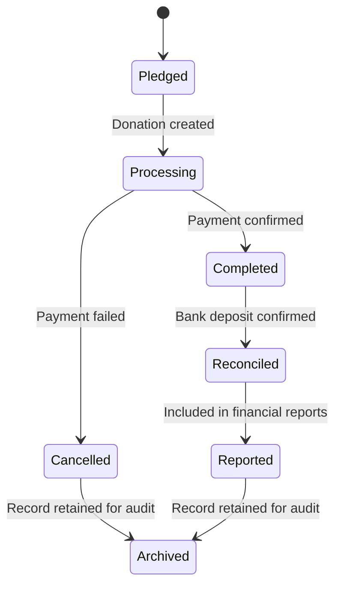
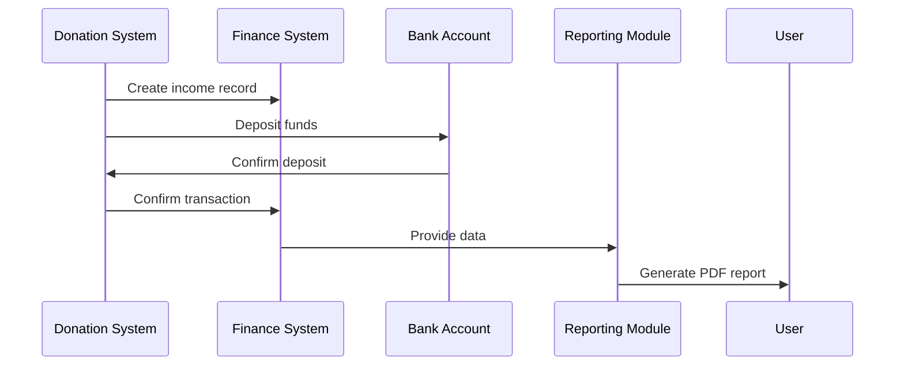

# Donation Model

<cite>
**Referenced Files in This Document**   
- [donations.ts](file://convex/donations.ts)
- [finance_records.ts](file://convex/finance_records.ts)
- [bank_accounts.ts](file://convex/bank_accounts.ts)
- [kumbara.ts](file://src/lib/validations/kumbara.ts)
- [route.ts](file://src/app/api/donations/route.ts)
- [pdf-export.ts](file://src/lib/utils/pdf-export.ts)
</cite>

## Table of Contents

1. [Introduction](#introduction)
2. [Field Definitions](#field-definitions)
3. [Donation Types](#donation-types)
4. [Relationships with Other Models](#relationships-with-other-models)
5. [Schema Design for One-Time and Recurring Donations](#schema-design-for-one-time-and-recurring-donations)
6. [Indexing Strategy](#indexing-strategy)
7. [Validation Rules](#validation-rules)
8. [Data Access Patterns](#data-access-patterns)
9. [Sample Donation Records](#sample-donation-records)
10. [Data Lifecycle](#data-lifecycle)
11. [Reporting and Reconciliation](#reporting-and-reconciliation)

## Introduction

The Donation model in the PORTAL application serves as the central data structure for managing all donation-related information. It captures financial contributions from donors, including both standard donations and Kumbara (piggy bank) collections. The model is designed to support comprehensive tracking of donation details, donor information, transaction status, and accounting integration. This documentation provides a detailed overview of the model's structure, relationships, validation rules, and operational workflows.

**Section sources**

- [donations.ts](file://convex/donations.ts#L1-L149)

## Field Definitions

The Donation model contains the following fields with their respective data types, constraints, and descriptions:

| Field Name           | Data Type | Constraints                                                                 | Description                                             |
| -------------------- | --------- | --------------------------------------------------------------------------- | ------------------------------------------------------- |
| donor_name           | string    | Required, min 2 characters, max 100 characters                              | Full name of the donor                                  |
| donor_phone          | string    | Required, min 10 characters, max 20 characters, Turkish phone number format | Contact phone number of the donor                       |
| donor_email          | string    | Optional, valid email format                                                | Email address of the donor                              |
| amount               | number    | Required, positive value, minimum 0.01, maximum 10,000,000                  | Monetary amount of the donation                         |
| currency             | string    | Required, one of: "TRY", "USD", "EUR"                                       | Currency of the donation                                |
| donation_type        | string    | Required, min 2 characters, max 50 characters                               | Type/category of donation                               |
| payment_method       | string    | Required, min 2 characters, max 50 characters                               | Method used for payment                                 |
| donation_purpose     | string    | Required, min 2 characters, max 100 characters                              | Purpose or reason for the donation                      |
| notes                | string    | Optional, max 500 characters                                                | Additional notes or comments                            |
| receipt_number       | string    | Required, min 3 characters, max 50 characters                               | Unique receipt identifier                               |
| receipt_file_id      | string    | Optional                                                                    | ID reference to uploaded receipt document               |
| status               | string    | Required, one of: "pending", "completed", "cancelled"                       | Current status of the donation transaction              |
| is_kumbara           | boolean   | Optional, default: false                                                    | Flag indicating if donation is from Kumbara collection  |
| kumbara_location     | string    | Optional, min 2 characters, max 100 characters                              | Location where Kumbara donation was collected           |
| collection_date      | string    | Optional, valid date format                                                 | Date when Kumbara collection occurred                   |
| kumbara_institution  | string    | Optional, min 2 characters, max 200 characters                              | Institution or address associated with Kumbara          |
| location_coordinates | object    | Optional, contains lat (number), lng (number)                               | Geographic coordinates of collection location           |
| location_address     | string    | Optional                                                                    | Text address of collection location                     |
| route_points         | array     | Optional, array of objects with lat, lng, and optional address              | GPS points along collection route                       |
| route_distance       | number    | Optional                                                                    | Total distance of collection route in unspecified units |
| route_duration       | number    | Optional                                                                    | Duration of collection route in unspecified units       |

**Section sources**

- [donations.ts](file://convex/donations.ts#L76-L109)
- [kumbara.ts](file://src/lib/validations/kumbara.ts#L5-L92)

## Donation Types

The Donation model supports two primary types of donations:

### Standard Donation

A standard donation represents a direct contribution from a donor through various payment methods. These donations are typically processed immediately and are used for general funding purposes.

### Kumbara Donation

Kumbara donations represent contributions collected from physical piggy banks placed at various locations. These donations have additional metadata specific to their collection process:

- **Collection Logistics**: Track the route taken by collection teams with GPS coordinates, distance, and duration
- **Location Details**: Capture specific information about the collection point including institution name and address
- **Special Processing**: Follow a distinct workflow from collection to bank deposit

The `is_kumbara` field serves as a discriminator between these two types, with additional Kumbara-specific fields populated when this flag is set to true.

**Section sources**

- [donations.ts](file://convex/donations.ts#L96-L104)
- [kumbara.ts](file://src/lib/validations/kumbara.ts#L57-L92)

## Relationships with Other Models

The Donation model maintains critical relationships with other financial models in the system for accounting and reconciliation purposes.

### Relationship with FinanceRecord

Each donation creates a corresponding income record in the FinanceRecord model for accounting purposes:



**Diagram sources**

- [donations.ts](file://convex/donations.ts#L76-L109)
- [finance_records.ts](file://convex/finance_records.ts#L55-L76)

### Relationship with BankAccount

For Kumbara donations, the system tracks reconciliation with specific bank accounts where funds are deposited:



**Diagram sources**

- [donations.ts](file://convex/donations.ts#L96-L104)
- [bank_accounts.ts](file://convex/bank_accounts.ts#L20-L36)

## Schema Design for One-Time and Recurring Donations

The Donation model schema is designed to accommodate both one-time and recurring donation patterns through a flexible structure:

### One-Time Donations

One-time donations are represented as single records in the donations collection. The model captures all necessary information for immediate processing and accounting.

### Recurring Donations

While the current schema does not explicitly include recurring donation fields, the design supports recurring patterns through:

- **Donation Type Field**: Can be used to categorize recurring donations
- **External Scheduling**: Integration with external systems to create individual donation records according to a schedule
- **Consistent Identification**: Use of donor information and donation purpose to identify recurring patterns

The model's design allows for future extension to include native recurring donation support by adding fields such as recurrence pattern, next occurrence date, and total occurrences.

**Section sources**

- [donations.ts](file://convex/donations.ts#L76-L109)

## Indexing Strategy

The Donation model employs a strategic indexing approach to optimize query performance for common access patterns:



The following indexes are implemented:

- **by_status**: Optimizes queries filtering donations by their current status (pending, completed, cancelled)
- **by_donor_email**: Enables efficient lookup of all donations by a specific donor email
- **by_is_kumbara**: Facilitates filtering between standard and Kumbara donations
- **by_receipt_number**: Provides fast lookup by unique receipt identifier

These indexes support the primary data access patterns including donation status monitoring, donor history retrieval, and financial reconciliation.

**Diagram sources**

- [donations.ts](file://convex/donations.ts#L16-L42)

## Validation Rules

The Donation model implements comprehensive validation rules to ensure financial data integrity:

### Field-Level Validation

- **Amount**: Must be a positive number greater than zero
- **Currency**: Restricted to TRY, USD, or EUR
- **Donor Information**: Name must be at least 2 characters; phone must match Turkish format (5XXXXXXXXX)
- **Email**: Must be a valid email format if provided
- **Status**: Limited to pending, completed, or cancelled states
- **Receipt Number**: Required and must be unique

### Business Logic Validation

- **Kumbara-Specific**: When is_kumbara is true, kumbara_location and collection_date are required
- **Data Consistency**: Currency in donation must match currency in corresponding finance record
- **State Transitions**: Status can only progress from pending to completed or cancelled

These validation rules are enforced at both the API layer and the database mutation level to prevent invalid data entry.

**Section sources**

- [donations.ts](file://convex/donations.ts#L76-L109)
- [route.ts](file://src/app/api/donations/route.ts#L19-L35)
- [kumbara.ts](file://src/lib/validations/kumbara.ts#L5-L92)

## Data Access Patterns

The Donation model supports several key data access patterns for different operational needs:

### Donation Reporting

The system provides comprehensive reporting capabilities through the donations/stats endpoint, which calculates various metrics:



**Diagram sources**

- [route.ts](file://src/app/api/donations/stats/route.ts#L22-L74)

### Reconciliation Processes

For financial reconciliation, the system follows a specific access pattern:

1. Retrieve completed donations within a date range
2. Match donations with bank deposit records
3. Verify total amounts and transaction details
4. Update reconciliation status

This process ensures that all donations are properly accounted for in the financial system.

**Section sources**

- [route.ts](file://src/app/api/donations/route.ts#L54-L83)

## Sample Donation Records

The following are examples of donation records for different donation types:

### Standard Donation Record

```json
{
  "donor_name": "Ahmet Yılmaz",
  "donor_phone": "5551234567",
  "donor_email": "ahmet.yilmaz@email.com",
  "amount": 500.0,
  "currency": "TRY",
  "donation_type": "General Support",
  "payment_method": "Credit Card",
  "donation_purpose": "Education Program",
  "receipt_number": "REC2024001",
  "status": "completed",
  "is_kumbara": false
}
```

### Kumbara Donation Record

```json
{
  "donor_name": "Kumbara Collection",
  "donor_phone": "5550000000",
  "amount": 2500.0,
  "currency": "TRY",
  "donation_type": "Kumbara",
  "payment_method": "Cash",
  "donation_purpose": "Kumbara Bağışı",
  "receipt_number": "KUM2024001",
  "status": "completed",
  "is_kumbara": true,
  "kumbara_location": "Beşiktaş Şubesi",
  "collection_date": "2024-01-15",
  "kumbara_institution": "Beşiktaş İlçe Milli Eğitim Müdürlüğü",
  "location_coordinates": {
    "lat": 41.047,
    "lng": 29.007
  },
  "route_points": [
    { "lat": 41.047, "lng": 29.007, "address": "Beşiktaş İlçe Milli Eğitim Müdürlüğü" },
    { "lat": 41.05, "lng": 29.01, "address": "Beşiktaş Belediyesi" }
  ],
  "route_distance": 3.5,
  "route_duration": 45
}
```

**Section sources**

- [donations.ts](file://convex/donations.ts#L76-L109)
- [kumbara.ts](file://src/lib/validations/kumbara.ts#L5-L92)

## Data Lifecycle

The donation data follows a defined lifecycle from pledge to settlement:



### Key Lifecycle Stages

1. **Pledged**: Donation information is entered into the system with status "pending"
2. **Processing**: Payment processing is initiated
3. **Completed**: Payment is successfully received and confirmed
4. **Cancelled**: Payment failed or was intentionally cancelled
5. **Reconciled**: Funds are verified in the bank account
6. **Reported**: Donation is included in financial reports
7. **Archived**: Donation record is retained for audit and historical purposes

The system maintains all records indefinitely for audit and compliance purposes, with appropriate access controls based on user permissions.

**Diagram sources**

- [donations.ts](file://convex/donations.ts#L90-L94)
- [route.ts](file://src/app/api/donations/[id]/route.ts#L104-L107)

## Reporting and Reconciliation

The Donation model supports comprehensive reporting and reconciliation processes:

### Donation Reporting

The system generates various reports including:

- Total donation summaries by period
- Donor contribution histories
- Payment method distributions
- Status-based analytics

These reports are accessible through the API and can be exported to PDF format using the generateDonationPDF function.

### Reconciliation Process

The reconciliation workflow ensures financial accuracy:

1. Daily reconciliation of completed donations with bank statements
2. Verification of donation amounts and receipt numbers
3. Identification of discrepancies for investigation
4. Update of reconciliation status in the system

The integration with the FinanceRecord model ensures that all donations are properly accounted for in the organization's financial records.



**Diagram sources**

- [donations.ts](file://convex/donations.ts#L76-L109)
- [finance_records.ts](file://convex/finance_records.ts#L55-L76)
- [pdf-export.ts](file://src/lib/utils/pdf-export.ts#L184-L212)
