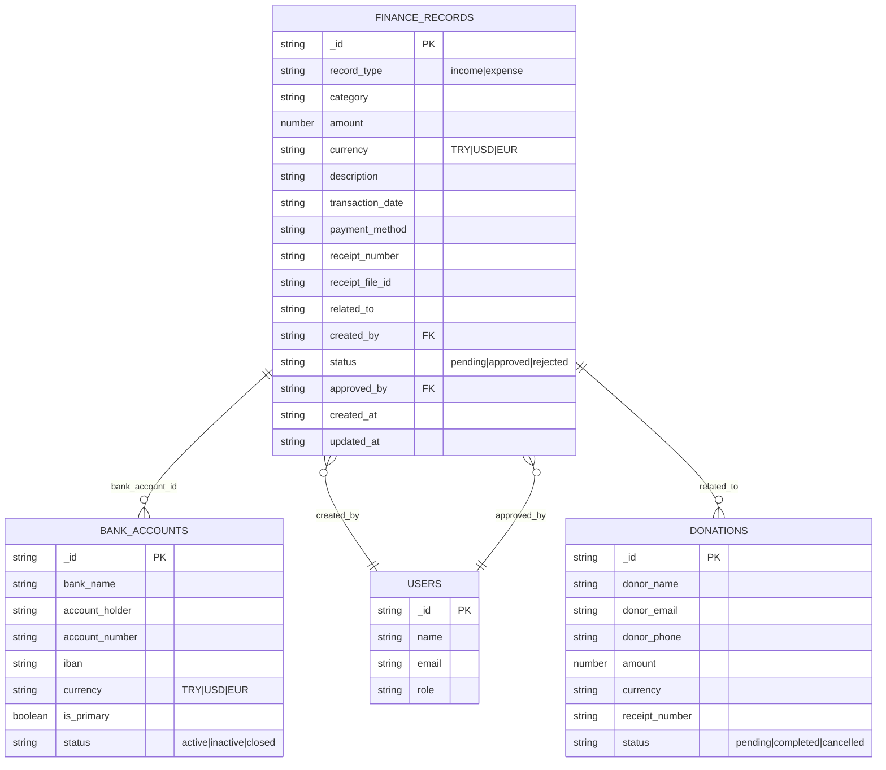
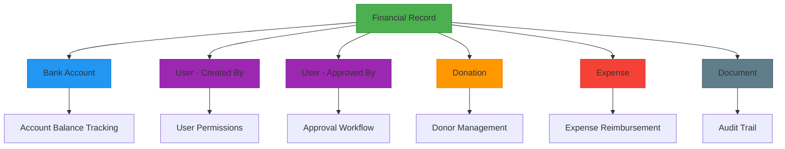
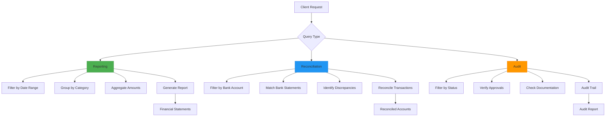
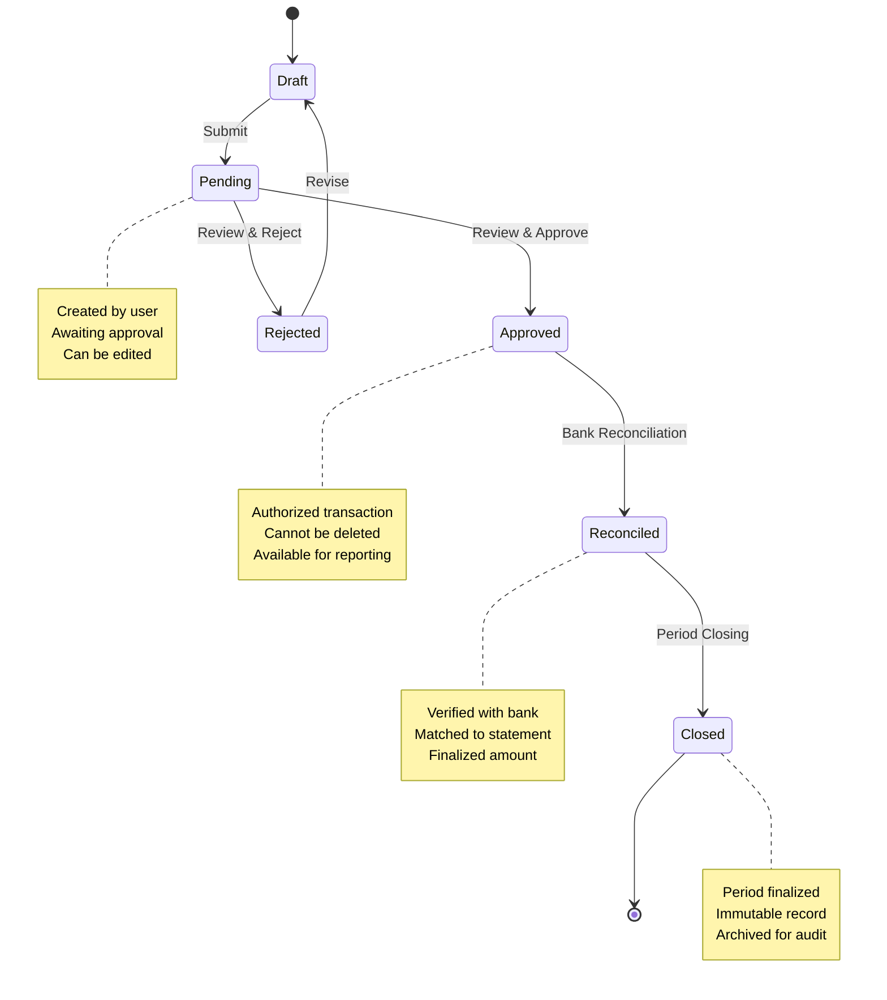

# Financial Record Model

<cite>
**Referenced Files in This Document**   
- [finance_records.ts](file://convex/finance_records.ts)
- [bank_accounts.ts](file://convex/bank_accounts.ts)
- [donations.ts](file://convex/donations.ts)
- [financial.ts](file://src/types/financial.ts)
- [MODULES_BREAKDOWN.md](file://MODULES_BREAKDOWN.md)
</cite>

## Table of Contents

1. [Introduction](#introduction)
2. [Core Data Model](#core-data-model)
3. [Field Definitions](#field-definitions)
4. [Relationships](#relationships)
5. [Schema Design and Validation](#schema-design-and-validation)
6. [Data Access Patterns](#data-access-patterns)
7. [Sample Records](#sample-records)
8. [Data Lifecycle](#data-lifecycle)
9. [Indexing Strategy](#indexing-strategy)

## Introduction

The FinancialRecord model in the PORTAL application serves as the central component for tracking all financial transactions within the system. It supports comprehensive income and expense tracking with robust validation, audit capabilities, and integration with other financial modules. The model is designed to support double-entry accounting principles, ensure financial compliance, and enable detailed reporting for reconciliation and audit purposes.

**Section sources**

- [MODULES_BREAKDOWN.md](file://MODULES_BREAKDOWN.md#L301-L339)

## Core Data Model

The FinancialRecord model represents individual financial transactions with comprehensive metadata for tracking, reporting, and compliance. Each record captures essential financial data including transaction type, amount, category, date, description, and associated documents.



**Diagram sources**

- [finance_records.ts](file://convex/finance_records.ts#L55-L130)
- [bank_accounts.ts](file://convex/bank_accounts.ts#L20-L130)
- [donations.ts](file://convex/donations.ts#L77-L149)

## Field Definitions

The FinancialRecord model contains comprehensive fields to capture all necessary financial transaction details with appropriate data types and constraints.

### Transaction Type

Defines whether the record represents income or expense.

- **Field**: `record_type`
- **Data Type**: String
- **Constraints**: Required, must be either "income" or "expense"
- **Validation**: Enforced through union literal in schema
- **Purpose**: Fundamental classification for all financial transactions

### Amount

Represents the monetary value of the transaction.

- **Field**: `amount`
- **Data Type**: Number
- **Constraints**: Required, positive number
- **Validation**: Numeric validation with positive value check
- **Purpose**: Quantitative value of the financial transaction

### Currency

Specifies the currency denomination of the transaction.

- **Field**: `currency`
- **Data Type**: String
- **Constraints**: Required, must be "TRY", "USD", or "EUR"
- **Validation**: Union literal validation
- **Purpose**: Multi-currency support for international transactions

### Category

Classifies the transaction into specific financial categories.

- **Field**: `category`
- **Data Type**: String
- **Constraints**: Required
- **Income Categories**: donation, membership_fee, sponsorship, event_revenue, grant, other_income
- **Expense Categories**: administrative, program_expenses, scholarship, assistance, marketing, office_supplies, utilities, transportation, other_expense
- **Purpose**: Detailed classification for reporting and analysis

### Date

Records the transaction date.

- **Field**: `transaction_date`
- **Data Type**: String (ISO date format)
- **Constraints**: Required
- **Validation**: Date format validation
- **Purpose**: Temporal tracking for financial periods and reporting

### Description

Provides detailed information about the transaction.

- **Field**: `description`
- **Data Type**: String
- **Constraints**: Required
- **Purpose**: Contextual information for audit and reconciliation

### Associated Documents

Links to supporting documentation for the transaction.

- **Field**: `receipt_file_id`
- **Data Type**: String (optional)
- **Constraints**: Optional
- **Related Field**: `receipt_number`
- **Purpose**: Document management and audit trail

**Section sources**

- [finance_records.ts](file://convex/finance_records.ts#L55-L130)
- [financial.ts](file://src/types/financial.ts#L5-L29)

## Relationships

The FinancialRecord model establishes critical relationships with other entities in the system to provide comprehensive financial tracking and reporting capabilities.

### Bank Account Relationship

The FinancialRecord model integrates with the BankAccount entity to enable account-level financial tracking.

- **Relationship**: One-to-Many (BankAccount to FinanceRecord)
- **Foreign Key**: Implicit through transaction context
- **Integration**: Enables tracking of transactions by specific bank accounts
- **Purpose**: Account-level reconciliation and balance tracking
- **Access Pattern**: Filter financial records by associated bank account

### Donation Workflow Integration

Financial records are closely integrated with the donation management workflow.

- **Relationship**: One-to-One or One-to-Many
- **Field**: `related_to` (references donation records)
- **Integration**: Links financial records to specific donation transactions
- **Purpose**: End-to-end tracking of donations from receipt to accounting
- **Workflow**: Donation creation automatically generates corresponding financial records

### Expense Workflow Integration

The model supports integration with expense management workflows.

- **Relationship**: One-to-One or One-to-Many
- **Field**: `related_to` (references expense records)
- **Integration**: Connects financial records to specific expense approvals
- **Purpose**: Expense tracking and reimbursement processing
- **Workflow**: Expense approval triggers financial record creation



**Diagram sources**

- [finance_records.ts](file://convex/finance_records.ts#L55-L130)
- [bank_accounts.ts](file://convex/bank_accounts.ts#L5-L130)
- [donations.ts](file://convex/donations.ts#L77-L149)

## Schema Design and Validation

The FinancialRecord schema is designed with financial compliance and data integrity as primary considerations, implementing double-entry accounting principles and comprehensive validation rules.

### Double-Entry Accounting Design

The schema supports fundamental accounting principles through its structure.

- **Transaction Type**: Clear income/expense classification
- **Status Workflow**: pending → approved/rejected lifecycle
- **Audit Fields**: created_by, approved_by for accountability
- **Immutable Records**: Update operations maintain history
- **Balanced Transactions**: Income and expense categories ensure balanced books

### Validation Rules

Comprehensive validation ensures financial data integrity and compliance.

- **Required Fields**: record_type, category, amount, currency, description, transaction_date, created_by, status
- **Type Validation**: Strict type checking for all fields
- **Value Constraints**:
  - Amount must be positive
  - Currency limited to TRY, USD, EUR
  - Status limited to pending, approved, rejected
- **Reference Validation**: created_by must reference valid user
- **Temporal Validation**: transaction_date must be valid ISO date

### Data Integrity Constraints

The model enforces data quality through multiple mechanisms.

- **Unique Constraints**: None at record level (allows multiple similar transactions)
- **Foreign Key Constraints**: Implicit through application logic
- **Null Constraints**: Critical fields are required
- **Format Constraints**: Standardized formats for currency and dates
- **Business Rule Constraints**: Category-specific validation rules

**Section sources**

- [finance_records.ts](file://convex/finance_records.ts#L55-L130)
- [financial.ts](file://src/types/financial.ts#L253-L263)

## Data Access Patterns

The FinancialRecord model supports multiple access patterns optimized for financial reporting, reconciliation, and audit purposes.

### Financial Reporting

Optimized for generating comprehensive financial reports.

- **Query Pattern**: Filter by date range and category
- **Index Usage**: by_record_type and by_status indexes
- **Aggregation**: Sum amounts by category and period
- **Performance**: Paginated results with limit/skip parameters
- **Use Case**: Monthly financial statements, budget vs actual reports

### Reconciliation

Designed to support account reconciliation processes.

- **Query Pattern**: Filter by bank account and date range
- **Index Usage**: by_created_by and by_status indexes
- **Data Retrieval**: Complete transaction details with documents
- **Performance**: Efficient filtering by transaction_date
- **Use Case**: Bank statement reconciliation, account balancing

### Audit Purposes

Supports comprehensive audit requirements.

- **Query Pattern**: Filter by status and created_by
- **Index Usage**: by_status index for pending transactions
- **Data Retrieval**: Full transaction history with approval tracking
- **Performance**: Fast lookup by record ID
- **Use Case**: Financial audits, compliance reviews, donor reporting



**Diagram sources**

- [finance_records.ts](file://convex/finance_records.ts#L5-L44)
- [financial.ts](file://src/types/financial.ts#L80-L140)

## Sample Records

Example financial records demonstrating typical income and expense transactions.

### Income Transaction Sample

```json
{
  "record_type": "income",
  "category": "donation",
  "amount": 5000,
  "currency": "TRY",
  "description": "Monthly donation from corporate sponsor",
  "transaction_date": "2024-01-15",
  "payment_method": "bank_transfer",
  "receipt_number": "RCPT-2024-001",
  "receipt_file_id": "file_abc123",
  "related_to": "donation_xyz789",
  "created_by": "user_123",
  "status": "approved",
  "approved_by": "user_456"
}
```

### Expense Transaction Sample

```json
{
  "record_type": "expense",
  "category": "administrative",
  "amount": 2500,
  "currency": "TRY",
  "description": "Office rent payment for January",
  "transaction_date": "2024-01-05",
  "payment_method": "check",
  "receipt_number": "CHK-2024-001",
  "receipt_file_id": "file_def456",
  "related_to": "expense_ghi012",
  "created_by": "user_123",
  "status": "approved",
  "approved_by": "user_456"
}
```

**Section sources**

- [finance_records.ts](file://convex/finance_records.ts#L55-L130)

## Data Lifecycle

The FinancialRecord follows a comprehensive lifecycle from creation to closure, ensuring proper financial controls and auditability.

### Entry Phase

Initial creation of financial records.

- **Creation**: Records created through create mutation
- **Default Status**: "pending" awaiting approval
- **Required Fields**: All mandatory fields must be provided
- **Validation**: Immediate validation upon entry
- **Audit Trail**: created_by timestamp recorded

### Approval Process

Formal review and authorization of transactions.

- **Status Transition**: pending → approved/rejected
- **Approval Tracking**: approved_by field populated
- **Business Rules**: Auto-set approved_by when status changes to approved
- **Error Handling**: Validation prevents invalid state transitions
- **Concurrency**: OCC (Optimistic Concurrency Control) prevents conflicts

### Reconciliation

Periodic matching with external financial data.

- **Frequency**: Monthly or as needed
- **Process**: Match records with bank statements
- **Tools**: Filter by date range and bank account
- **Outcome**: Verified or adjusted records
- **Documentation**: Reconciliation notes attached

### Closing

Finalization of financial periods.

- **Period End**: All transactions for period must be recorded
- **Status Check**: Ensure all records are approved
- **Reporting**: Generate final financial statements
- **Archiving**: Prepare records for long-term storage
- **Audit Preparation**: Ensure complete documentation



**Diagram sources**

- [finance_records.ts](file://convex/finance_records.ts#L55-L130)

## Indexing Strategy

The FinancialRecord model employs a strategic indexing approach to optimize query performance for common financial operations.

### Primary Indexes

Core indexes supporting the most frequent query patterns.

- **by_record_type**: Optimized for filtering income vs expense transactions
  - Usage: Financial reporting, category analysis
  - Performance: Fast filtering by transaction type
- **by_status**: Optimized for workflow management
  - Usage: Pending approvals, rejected transactions
  - Performance: Efficient status-based filtering
- **by_created_by**: Optimized for user-specific queries
  - Usage: User activity tracking, permission-based access
  - Performance: Fast user-based filtering

### Query Optimization

Indexes are designed to support efficient data retrieval.

- **Filter Operations**: Indexes support EQ (equals) operations
- **Composite Queries**: Multiple filters can be combined
- **Pagination**: Skip and limit parameters for large result sets
- **Performance Monitoring**: Query execution times tracked

### Maintenance Considerations

Index management for optimal performance.

- **Update Overhead**: Indexes updated on insert, update, delete
- **Storage Impact**: Additional storage for index data
- **Query Planning**: System automatically selects optimal index
- **Monitoring**: Index usage and performance metrics available

**Section sources**

- [finance_records.ts](file://convex/finance_records.ts#L16-L32)
