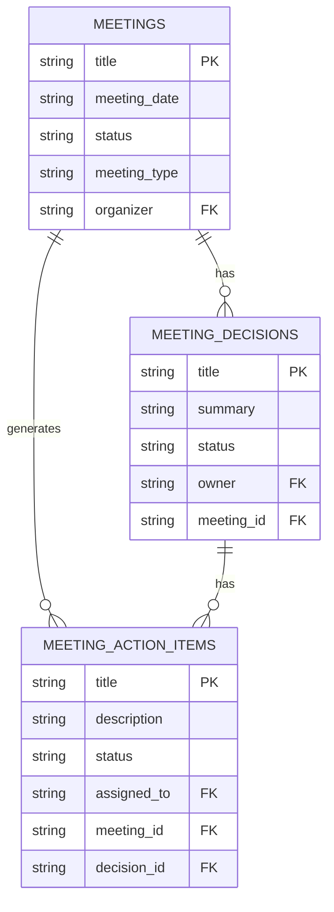

# Meeting Model

<cite>
**Referenced Files in This Document**   
- [meetings.ts](file://convex/meetings.ts)
- [meeting_decisions.ts](file://convex/meeting_decisions.ts)
- [meeting_action_items.ts](file://convex/meeting_action_items.ts)
- [meeting.ts](file://src/lib/validations/meeting.ts)
- [meetingActionItem.ts](file://src/lib/validations/meetingActionItem.ts)
- [database.ts](file://src/types/database.ts)
- [page.tsx](file://src/app/(dashboard)/is/toplantilar/page.tsx)
- [CalendarView.tsx](file://src/components/meetings/CalendarView.tsx)
</cite>

## Table of Contents

1. [Introduction](#introduction)
2. [Core Field Definitions](#core-field-definitions)
3. [Relationships with MeetingDecision and MeetingActionItem](#relationships-with-meetingdecision-and-meetingactionitem)
4. [Schema Design for Meeting Lifecycle Management](#schema-design-for-meeting-lifecycle-management)
5. [Indexing Strategy](#indexing-strategy)
6. [Validation Rules for Meeting Integrity](#validation-rules-for-meeting-integrity)
7. [Data Access Patterns](#data-access-patterns)
8. [Sample Meeting Records](#sample-meeting-records)
9. [Data Lifecycle from Planning to Follow-up](#data-lifecycle-from-planning-to-follow-up)
10. [Conclusion](#conclusion)

## Introduction

The Meeting model in the PORTAL application serves as the central entity for managing organizational meetings, including scheduling, tracking, and post-meeting follow-up. It supports various meeting types such as general, committee, board, and other categories. The model is designed to maintain data integrity through comprehensive validation rules and supports efficient querying via strategic indexing on key fields like date and organizer. This documentation provides a detailed overview of the model's structure, relationships, access patterns, and lifecycle management.

**Section sources**

- [meetings.ts](file://convex/meetings.ts#L1-L124)
- [meeting.ts](file://src/lib/validations/meeting.ts#L1-L171)

## Core Field Definitions

The Meeting model includes the following core fields with their respective data types and constraints:

| Field        | Data Type                   | Constraints                                                             | Description                                   |
| ------------ | --------------------------- | ----------------------------------------------------------------------- | --------------------------------------------- |
| title        | string                      | Min 3, Max 200 characters                                               | Title of the meeting                          |
| description  | string (optional)           | Max 2000 characters                                                     | Detailed description of the meeting           |
| meeting_date | string                      | ISO date format, must be at least 1 hour in the future for new meetings | Scheduled date and time of the meeting        |
| location     | string (optional)           | Max 200 characters                                                      | Physical or virtual location of the meeting   |
| organizer    | string (user ID)            | Required                                                                | ID of the user organizing the meeting         |
| participants | array of strings (user IDs) | Min 1, Max 50, no duplicates, must include organizer                    | List of user IDs participating in the meeting |
| status       | enum                        | One of: scheduled, ongoing, completed, cancelled                        | Current status of the meeting                 |
| meeting_type | enum                        | One of: general, committee, board, other                                | Type/category of the meeting                  |
| agenda       | string (optional)           | Max 2000 characters                                                     | Agenda items for the meeting                  |
| notes        | string (optional)           | Max 2000 characters                                                     | Minutes or notes from the meeting             |

**Section sources**

- [meetings.ts](file://convex/meetings.ts#L54-L74)
- [meeting.ts](file://src/lib/validations/meeting.ts#L60-L83)

## Relationships with MeetingDecision and MeetingActionItem

The Meeting model establishes one-to-many relationships with both MeetingDecision and MeetingActionItem models to capture outcomes and track follow-up items:

- **Meeting → MeetingDecision**: One meeting can have multiple decisions recorded
- **Meeting → MeetingActionItem**: One meeting can generate multiple action items for follow-up

These relationships are implemented through foreign key references:

- MeetingDecision contains a `meeting_id` field that references the parent Meeting
- MeetingActionItem contains a `meeting_id` field that references the parent Meeting
- Both child models can be queried efficiently using indexes on their respective `meeting_id` fields

This design enables comprehensive tracking of meeting outcomes, with decisions representing key resolutions and action items representing specific tasks assigned to individuals with deadlines.



**Diagram sources**

- [meetings.ts](file://convex/meetings.ts#L52-L77)
- [meeting_decisions.ts](file://convex/meeting_decisions.ts#L51-L76)
- [meeting_action_items.ts](file://convex/meeting_action_items.ts#L53-L92)

**Section sources**

- [meetings.ts](file://convex/meetings.ts#L52-L77)
- [meeting_decisions.ts](file://convex/meeting_decisions.ts#L51-L76)
- [meeting_action_items.ts](file://convex/meeting_action_items.ts#L53-L92)

## Schema Design for Meeting Lifecycle Management

The Meeting model is designed to support the complete lifecycle of a meeting from planning through completion and follow-up. The status field drives the workflow with four distinct states:

1. **Scheduled**: Meeting has been planned but not yet started
2. **Ongoing**: Meeting is currently in progress
3. **Completed**: Meeting has concluded
4. **Cancelled**: Meeting was cancelled

The schema includes timestamps and audit fields automatically managed by the Convex database system (\_creationTime, \_updatedAt). The model also supports rich content through the agenda and notes fields, allowing users to document discussion points and minutes. The participants array ensures proper tracking of attendees, with validation requiring the organizer to be included in the participant list.

**Section sources**

- [meetings.ts](file://convex/meetings.ts#L60-L65)
- [meeting.ts](file://src/lib/validations/meeting.ts#L75-L76)

## Indexing Strategy

The Meeting model employs a strategic indexing approach to optimize query performance for common access patterns:

- **by_meeting_date**: Index on meeting_date field for chronological sorting and date-range queries
- **by_status**: Index on status field for filtering meetings by their current state
- **by_organizer**: Index on organizer field for retrieving meetings organized by a specific user

These indexes enable efficient implementation of key features:

- Calendar view displaying meetings by date
- Dashboard filters for different meeting statuses
- Personal meeting lists filtered by organizer
- Performance-optimized pagination for large result sets

The indexing strategy ensures responsive user experiences even as the number of meetings grows over time.

**Section sources**

- [meetings.ts](file://convex/meetings.ts#L18-L29)

## Validation Rules for Meeting Integrity

The Meeting model enforces data integrity through comprehensive validation rules implemented at both the API and application levels:

**Temporal Constraints:**

- New meetings must be scheduled at least 1 hour in the future
- Meeting dates must not be in the past
- Date format must conform to ISO 8601 standard

**Content Constraints:**

- Title must be 3-200 characters
- Description, agenda, and notes limited to 2000 characters
- Location limited to 200 characters

**Participant Constraints:**

- At least one participant required
- Maximum of 50 participants
- No duplicate participant IDs
- Organizer must be included in participants list

**Business Logic Constraints:**

- Meeting type must be one of the predefined values
- Status must be one of the valid states
- Participants and organizer must be valid user IDs

These validation rules are implemented in the Zod schema within the meeting validation file and enforced by the Convex mutation functions.

**Section sources**

- [meeting.ts](file://src/lib/validations/meeting.ts#L11-L135)
- [meetings.ts](file://convex/meetings.ts#L54-L74)

## Data Access Patterns

The Meeting model supports several key data access patterns through its API endpoints:

**Meeting Scheduling:**

- `create` mutation for new meetings with validation
- `list` query with date-based filtering for calendar views
- Conflict detection through date validation

**Decision Tracking:**

- Retrieval of all decisions for a specific meeting via `meeting_id` filter
- Filtering decisions by owner, status, or meeting
- Efficient lookup of decisions associated with completed meetings

**Action Item Follow-up:**

- Tracking action items by assignment (`assigned_to`)
- Monitoring status changes with history tracking
- Deadline-based filtering for overdue items
- Integration with notification system for status updates

**User-Centric Views:**

- Meetings organized by a specific user
- Meetings where a user is a participant
- Filtered views by status (scheduled, ongoing, completed)
- Search functionality by title and description

These access patterns are optimized through appropriate indexing and are exposed through the application's UI components like the CalendarView and meeting list tabs.

**Section sources**

- [meetings.ts](file://convex/meetings.ts#L5-L41)
- [meeting_decisions.ts](file://convex/meeting_decisions.ts#L10-L41)
- [meeting_action_items.ts](file://convex/meeting_action_items.ts#L12-L43)
- [page.tsx](<file://src/app/(dashboard)/is/toplantilar/page.tsx#L82-L157>)

## Sample Meeting Records

The following examples illustrate different meeting types in the system:

**General Meeting:**

```json
{
  "title": "Weekly Team Sync",
  "meeting_date": "2024-01-15T09:00:00Z",
  "location": "Conference Room A",
  "organizer": "user_123",
  "participants": ["user_123", "user_456", "user_789"],
  "status": "scheduled",
  "meeting_type": "general",
  "agenda": "Project updates, blockers, priorities"
}
```

**Committee Meeting:**

```json
{
  "title": "Finance Committee Review",
  "meeting_date": "2024-01-20T14:00:00Z",
  "location": "Board Room",
  "organizer": "user_200",
  "participants": ["user_200", "user_201", "user_202"],
  "status": "completed",
  "meeting_type": "committee",
  "agenda": "Budget approval, expense review",
  "notes": "Q1 budget approved with minor adjustments"
}
```

**Board Meeting:**

```json
{
  "title": "Board of Directors Quarterly Meeting",
  "meeting_date": "2024-01-25T10:00:00Z",
  "location": "Virtual (Zoom)",
  "organizer": "user_300",
  "participants": ["user_300", "user_301", "user_302", "user_303"],
  "status": "ongoing",
  "meeting_type": "board",
  "agenda": "Strategic planning, financial performance"
}
```

These samples demonstrate the flexibility of the model to accommodate different meeting types while maintaining consistent data structure.

**Section sources**

- [meetings.ts](file://convex/meetings.ts#L52-L77)
- [page.tsx](<file://src/app/(dashboard)/is/toplantilar/page.tsx#L706-L716>)

## Data Lifecycle from Planning to Follow-up

The Meeting model supports a comprehensive lifecycle from initial planning through post-meeting follow-up:

1. **Planning Phase:**
   - Meeting creation with title, date, participants, and agenda
   - Validation ensures proper scheduling and participant inclusion
   - Status set to "scheduled" by default

2. **Pre-Meeting Phase:**
   - Participants receive notifications and calendar invites
   - Agenda can be updated before the meeting
   - Status remains "scheduled"

3. **Execution Phase:**
   - Status updated to "ongoing" when meeting starts
   - Real-time note-taking and decision recording
   - Action items created during or immediately after the meeting

4. **Post-Meeting Phase:**
   - Status updated to "completed" after conclusion
   - Final notes and minutes documented
   - Decisions formally recorded in MeetingDecision model
   - Action items assigned with deadlines in MeetingActionItem model

5. **Follow-up Phase:**
   - Action items tracked to completion with status updates
   - Notifications sent when action items are completed
   - Historical data preserved for reference and auditing

This lifecycle is supported by the integrated models and validation rules, ensuring a seamless experience from meeting creation to outcome tracking.

**Section sources**

- [meetings.ts](file://convex/meetings.ts#L76-L108)
- [meeting_action_items.ts](file://convex/meeting_action_items.ts#L66-L92)
- [meeting_decisions.ts](file://convex/meeting_decisions.ts#L63-L76)

## Conclusion

The Meeting model in the PORTAL application provides a robust foundation for managing organizational meetings with comprehensive support for scheduling, execution, and follow-up. Its well-designed schema, strategic indexing, and thorough validation rules ensure data integrity and optimal performance. The integration with MeetingDecision and MeetingActionItem models enables effective tracking of meeting outcomes and accountability for follow-up tasks. This comprehensive approach supports efficient meeting management across various organizational contexts and meeting types.
