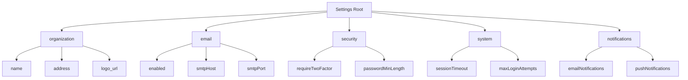
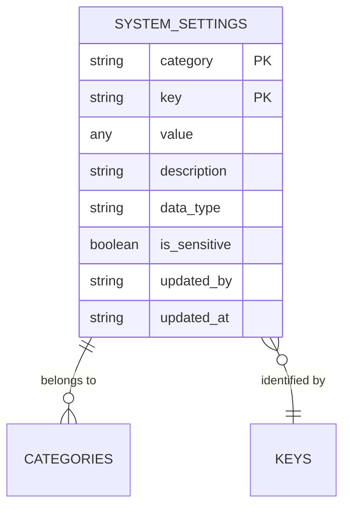
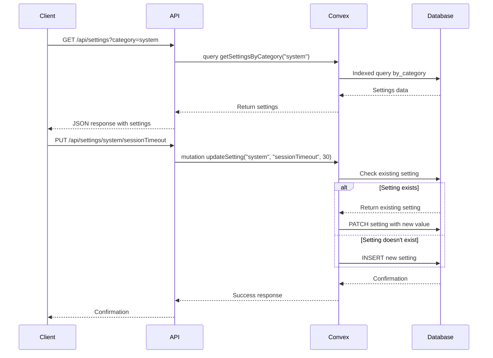

# System Settings Model

<cite>
**Referenced Files in This Document**   
- [system_settings.ts](file://convex/system_settings.ts)
- [settings.ts](file://src/lib/api/settings.ts)
- [schema.ts](file://convex/schema.ts)
- [route.ts](file://src/app/api/settings/route.ts)
- [route.ts](file://src/app/api/settings/[category]/route.ts)
- [route.ts](file://src/app/api/settings/[category]/[key]/route.ts)
</cite>

## Table of Contents

1. [Introduction](#introduction)
2. [Field Definitions](#field-definitions)
3. [Hierarchical Structure](#hierarchical-structure)
4. [Schema Design](#schema-design)
5. [Indexing Strategy](#indexing-strategy)
6. [Validation Rules](#validation-rules)
7. [Data Access Patterns](#data-access-patterns)
8. [Integration with Settings API](#integration-with-settings-api)
9. [Sample Settings Records](#sample-settings-records)
10. [Data Lifecycle](#data-lifecycle)

## Introduction

The SystemSettings model in the PORTAL application provides a flexible configuration management system that allows administrators to store and manage application-wide settings. The model supports various data types and organizes settings hierarchically by category and key, enabling efficient retrieval and updates. This documentation details the model's structure, implementation, and usage patterns.

**Section sources**

- [system_settings.ts](file://convex/system_settings.ts#L756-L786)
- [settings.ts](file://src/lib/api/settings.ts#L1-L71)

## Field Definitions

The SystemSettings model contains the following fields with their respective data types and constraints:

- **category**: string - The category of the setting (e.g., 'organization', 'security', 'notifications'). This field organizes settings into logical groups.
- **key**: string - The unique identifier for the setting within its category (e.g., 'org_name', 'smtp_host', 'session_timeout').
- **value**: any - The actual value of the setting, which can be of any type (string, number, boolean, object, or array).
- **description**: string (optional) - A human-readable description explaining the purpose of the setting.
- **data_type**: enum ('string'|'number'|'boolean'|'object'|'array') - Automatically determined type of the value field, used for validation and type safety.
- **is_sensitive**: boolean (optional) - Flag indicating if the setting contains sensitive data (automatically set if key contains 'password', 'secret', or 'key').
- **updated_by**: reference to users collection (optional) - The ID of the user who last modified the setting.
- **updated_at**: string (ISO 8601 timestamp) - The timestamp when the setting was last updated.

**Section sources**

- [schema.ts](file://convex/schema.ts#L760-L782)
- [system_settings.ts](file://convex/system_settings.ts#L87-L93)

## Hierarchical Structure

The SystemSettings model implements a two-level hierarchical organization using category and key fields. This structure enables logical grouping of related settings while maintaining flexibility for new configurations.

The hierarchy follows this pattern:

- **Category Level**: Broad functional areas such as 'organization', 'email', 'security', 'system', 'appearance', and 'integrations'.
- **Key Level**: Specific configuration parameters within each category, such as 'sessionTimeout' under 'system' or 'smtpHost' under 'email'.

Settings are retrieved and grouped by category, creating a nested object structure where the first level represents categories and the second level contains key-value pairs of settings. This hierarchical approach simplifies client-side consumption and organization of configuration data.



**Diagram sources**

- [system_settings.ts](file://convex/system_settings.ts#L11-L18)
- [settings.ts](file://src/lib/api/settings.ts#L6-L14)

## Schema Design

The SystemSettings schema is designed for flexible configuration management with support for various data types and dynamic settings. The schema uses Convex's type system to ensure data integrity while maintaining flexibility.

Key design aspects include:

- **Flexible Value Storage**: The value field accepts any data type through v.any(), allowing settings to store strings, numbers, booleans, objects, or arrays as needed.
- **Automatic Type Detection**: When settings are updated, the system automatically detects and stores the data type in the data_type field for validation and type safety.
- **Sensitive Data Flagging**: The is_sensitive field is automatically set based on the setting key, identifying potentially sensitive information like passwords or API keys.
- **Audit Trail**: Each setting tracks who made the last update (updated_by) and when it was updated (updated_at) for accountability and debugging.

The schema supports dynamic configuration without requiring database migrations when new settings are added, as new category-key combinations can be created on demand.

**Section sources**

- [schema.ts](file://convex/schema.ts#L756-L786)
- [system_settings.ts](file://convex/system_settings.ts#L87-L93)

## Indexing Strategy

The SystemSettings model implements a comprehensive indexing strategy to optimize query performance for various access patterns:

- **by_category**: Index on the category field alone, enabling efficient retrieval of all settings within a specific category.
- **by_key**: Index on the key field alone, allowing fast lookups of settings with specific keys across all categories.
- **by_category_key**: Composite index on both category and key fields, providing optimal performance for retrieving individual settings by their category and key combination.

These indexes support the primary data access patterns:

- Retrieving all settings for a specific category
- Getting a single setting by category and key
- Bulk operations on settings within a category
- Efficient updates and upserts of individual settings

The indexing strategy ensures that queries remain performant even as the number of settings grows, with O(log n) lookup times for indexed fields.



**Diagram sources**

- [schema.ts](file://convex/schema.ts#L784-L786)
- [system_settings.ts](file://convex/system_settings.ts#L31-L32)

## Validation Rules

The SystemSettings model implements several validation rules to ensure setting integrity and consistency:

- **Required Fields**: Category and key fields are required and must be non-empty strings.
- **Data Type Consistency**: When updating settings, the system automatically detects and records the data type, preventing type mismatches.
- **Sensitive Data Detection**: Keys containing 'password', 'secret', or 'key' (case-insensitive) automatically trigger the is_sensitive flag.
- **Timestamp Validation**: The updated_at field must contain a valid ISO 8601 timestamp.
- **User Reference Validation**: The updated_by field must reference a valid user ID when present.

The model also enforces business rules through its mutation functions:

- Prevents creation of settings without required category and key values
- Validates input parameters before processing updates
- Ensures atomic operations for individual setting updates to prevent race conditions
- Implements batch processing for bulk operations to minimize conflicts

**Section sources**

- [system_settings.ts](file://convex/system_settings.ts#L75-L77)
- [system_settings.ts](file://convex/system_settings.ts#L130-L133)

## Data Access Patterns

The SystemSettings model supports multiple data access patterns for settings retrieval, update, and caching:

### Retrieval Patterns

- **Get All Settings**: Retrieves all settings grouped by category through the getSettings query.
- **Get by Category**: Retrieves all settings for a specific category using the getSettingsByCategory query with indexed lookup.
- **Get Single Setting**: Retrieves an individual setting by category and key using the getSetting query with composite index.

### Update Patterns

- **Bulk Update by Category**: Updates multiple settings within a category simultaneously with the updateSettings mutation.
- **Single Setting Update**: Updates an individual setting with the updateSetting mutation, which performs an upsert operation.
- **All Settings Update**: Updates settings across multiple categories through sequential category updates.

### Caching Strategy

The application implements a multi-layer caching strategy:

- **Client-Side Caching**: The SettingsApi client maintains a local cache of settings with TTL-based invalidation.
- **HTTP Caching**: API responses include appropriate cache headers for browser and intermediary caching.
- **Server-Side Caching**: Frequently accessed settings may be cached in memory to reduce database queries.



**Diagram sources**

- [system_settings.ts](file://convex/system_settings.ts#L5-L68)
- [route.ts](file://src/app/api/settings/[category]/[key]/route.ts#L5-L68)

## Integration with Settings API

The SystemSettings model is integrated with a comprehensive API that exposes CRUD operations through RESTful endpoints:

### API Endpoints

- **GET /api/settings**: Retrieves all settings or settings for a specific category (via category query parameter).
- **GET /api/settings/[category]**: Retrieves all settings for a specific category.
- **GET /api/settings/[category]/[key]**: Retrieves a single setting by category and key.
- **POST /api/settings/[category]**: Creates or updates multiple settings within a category.
- **PUT /api/settings/[category]/[key]**: Updates a single setting.
- **PUT /api/settings**: Updates all settings across categories.
- **DELETE /api/settings**: Resets settings, with optional category parameter to reset only a specific category.

### API Client

The SettingsApi class provides a type-safe client for interacting with the settings API, offering methods that correspond to the backend mutations and queries. The client handles authentication, error handling, and response parsing, providing a clean interface for frontend components.

The integration follows a layered architecture where API routes call Convex queries and mutations, which in turn interact with the SystemSettings model, ensuring separation of concerns and maintainability.

**Section sources**

- [route.ts](file://src/app/api/settings/route.ts#L5-L126)
- [route.ts](file://src/app/api/settings/[category]/route.ts#L5-L67)
- [route.ts](file://src/app/api/settings/[category]/[key]/route.ts#L5-L69)

## Sample Settings Records

The following are example settings records for different categories:

### Organization Settings

```json
{
  "category": "organization",
  "key": "name",
  "value": "Humanitarian Aid Organization",
  "data_type": "string",
  "updated_at": "2024-01-15T10:30:00Z"
}
```

```json
{
  "category": "organization",
  "key": "logo_url",
  "value": "https://example.com/logo.png",
  "data_type": "string",
  "updated_at": "2024-01-15T10:30:00Z"
}
```

### Security Settings

```json
{
  "category": "security",
  "key": "maxLoginAttempts",
  "value": 5,
  "data_type": "number",
  "updated_at": "2024-01-15T10:30:00Z"
}
```

```json
{
  "category": "security",
  "key": "passwordMinLength",
  "value": 8,
  "data_type": "number",
  "updated_at": "2024-01-15T10:30:00Z"
}
```

### Notification Settings

```json
{
  "category": "notifications",
  "key": "emailNotifications",
  "value": true,
  "data_type": "boolean",
  "updated_at": "2024-01-15T10:30:00Z"
}
```

```json
{
  "category": "notifications",
  "key": "notificationTypes",
  "value": ["donation", "task", "meeting"],
  "data_type": "array",
  "updated_at": "2024-01-15T10:30:00Z"
}
```

**Section sources**

- [settings.ts](file://src/lib/api/settings.ts#L23-L90)
- [system_settings.ts](file://convex/system_settings.ts#L50-L64)

## Data Lifecycle

The SystemSettings model follows a comprehensive data lifecycle from initialization to runtime modification:

### Initialization

Settings are initialized either through seed data during application setup or created on-demand when first accessed. The model does not require predefined schema for new settings, allowing dynamic configuration.

### Runtime Modification

Settings can be modified through various operations:

- **Individual Updates**: Single settings are updated via the updateSetting mutation, which performs an upsert operation.
- **Bulk Updates**: Multiple settings within a category are updated via the updateSettings mutation, which processes each setting individually.
- **Complete Updates**: All settings are updated via sequential category updates.

### Reset Operations

The resetSettings mutation allows administrators to reset settings to defaults:

- **Category-Level Reset**: Removes all settings within a specific category.
- **Global Reset**: Removes all settings from the system.
- **Batched Deletion**: Settings are deleted in batches of 50 to prevent conflicts and ensure reliability.

### Audit and Tracking

The model maintains a complete audit trail:

- Each setting tracks the last update timestamp (updated_at).
- The user who made the last modification is recorded (updated_by).
- The system automatically detects and flags sensitive settings.

The lifecycle ensures data integrity while providing flexibility for dynamic configuration management throughout the application's operation.

**Section sources**

- [system_settings.ts](file://convex/system_settings.ts#L177-L241)
- [route.ts](file://src/app/api/settings/route.ts#L104-L126)
