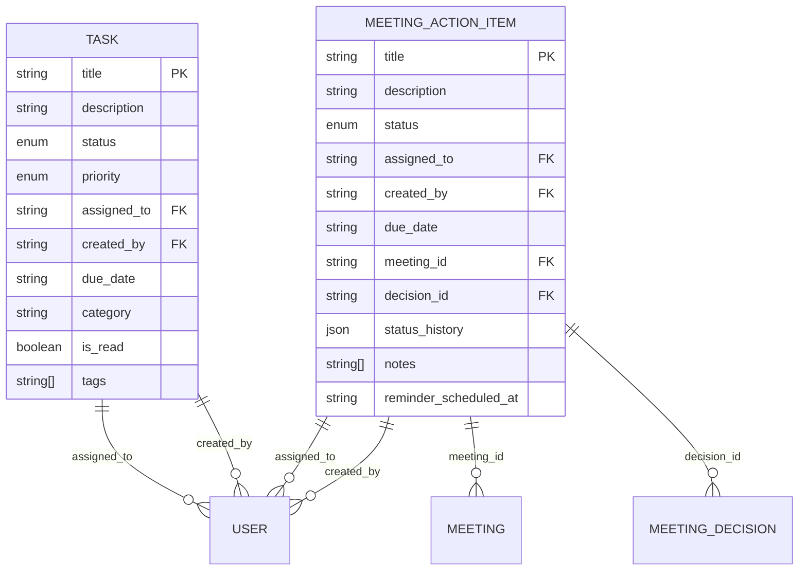
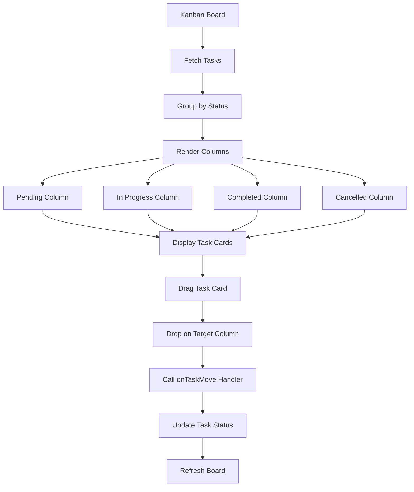

# Task Model

<cite>
**Referenced Files in This Document**   
- [tasks.ts](file://convex/tasks.ts)
- [task.ts](file://src/lib/validations/task.ts)
- [database.ts](file://src/types/database.ts)
- [KanbanBoard.tsx](file://src/components/tasks/KanbanBoard.tsx)
- [meeting_action_items.ts](file://convex/meeting_action_items.ts)
</cite>

## Table of Contents

1. [Introduction](#introduction)
2. [Field Definitions](#field-definitions)
3. [Relationship with MeetingActionItem](#relationship-with-meetingactionitem)
4. [Kanban Board Integration](#kanban-board-integration)
5. [Schema Design and Indexing Strategy](#schema-design-and-indexing-strategy)
6. [Validation Rules](#validation-rules)
7. [Data Access Patterns](#data-access-patterns)
8. [Sample Task Records](#sample-task-records)
9. [Data Lifecycle](#data-lifecycle)
10. [Conclusion](#conclusion)

## Introduction

The Task model in the PORTAL application serves as a central component for managing workflow items, tracking progress, and ensuring accountability across various operational domains. This document provides comprehensive documentation of the Task model, detailing its structure, relationships, validation rules, and integration points. The model supports both standalone tasks and those derived from meeting action items, enabling seamless coordination between strategic planning and execution. The integration with the Kanban board interface provides a visual representation of task status and facilitates intuitive workflow management.

**Section sources**

- [tasks.ts](file://convex/tasks.ts#L1-L140)
- [database.ts](file://src/types/database.ts#L231-L243)

## Field Definitions

The Task model contains several key fields that define its behavior and metadata. Each field has specific data types, constraints, and business rules that ensure data integrity and support workflow requirements.

- **title**: String field with a minimum length of 3 characters and maximum of 100 characters. This required field contains the primary identifier for the task.
- **description**: Optional string field with a maximum length of 1000 characters, providing additional context and details about the task requirements.
- **status**: Enum field with four possible values: "pending", "in_progress", "completed", or "cancelled". This field tracks the current state of the task in its lifecycle.
- **priority**: Enum field with four levels: "low", "normal", "high", or "urgent". This helps in prioritizing tasks based on their importance and urgency.
- **assignee**: Reference field (string ID) that identifies the user responsible for completing the task. This field supports task delegation and accountability.
- **due_date**: Optional string field (ISO date format) that specifies the deadline for task completion. Valid dates must be today or in the future.
- **category**: Optional string field with a maximum length of 50 characters, allowing tasks to be grouped by functional area or project.
- **created_by**: Required string field that records the ID of the user who created the task, ensuring auditability.
- **is_read**: Boolean flag that tracks whether the task has been viewed by the assigned user.
- **tags**: Array of strings (maximum 10 tags) used for additional classification and filtering. Tags must be unique and follow specific formatting rules.

**Section sources**

- [database.ts](file://src/types/database.ts#L231-L243)
- [task.ts](file://src/lib/validations/task.ts#L40-L124)

## Relationship with MeetingActionItem

The Task model maintains a distinct but related structure to the MeetingActionItem model, which handles action items generated from meetings. While both models share similar workflow concepts, they serve different purposes within the application. MeetingActionItems are specifically tied to meeting contexts, with references to meeting_id and decision_id, and use Turkish status values ("beklemede", "devam", "hazir", "iptal") compared to the English status values used in the Task model.

MeetingActionItems include additional fields such as status_history, which maintains an audit trail of status changes with timestamps and responsible users, and reminder_scheduled_at, which supports automated notifications. When a meeting action item is completed (status "hazir"), the system automatically triggers notifications to administrators through the workflow notification system. Although these models are separate, they share similar UI components and validation logic, particularly in the frontend where utility functions for determining task urgency and overdue status are reused across both types.



**Diagram sources**

- [tasks.ts](file://convex/tasks.ts#L54-L80)
- [meeting_action_items.ts](file://convex/meeting_action_items.ts#L52-L92)
- [database.ts](file://src/types/database.ts#L231-L243)

**Section sources**

- [meeting_action_items.ts](file://convex/meeting_action_items.ts#L1-L267)
- [tasks.ts](file://convex/tasks.ts#L1-L140)

## Kanban Board Integration

The Task model integrates with the Kanban board interface through the KanbanBoard component, which provides a visual representation of tasks organized by status. The board displays four columns corresponding to the task status values: "pending", "in_progress", "completed", and "cancelled". Each task is rendered as a draggable card that can be moved between columns to update its status through drag-and-drop interaction.

The Kanban board enhances task visibility by displaying key information including title, description, assignee, priority (with color-coded badges), due date, and tags. Tasks with due dates within 24 hours are highlighted with a clock icon, while overdue tasks display an alert icon and are styled in red. The component uses utility functions from the validation module to determine task urgency and overdue status, applying appropriate visual indicators. The board supports real-time updates through the onTaskMove callback, which triggers backend updates when tasks are repositioned.



**Diagram sources**

- [KanbanBoard.tsx](file://src/components/tasks/KanbanBoard.tsx#L1-L238)
- [tasks.ts](file://convex/tasks.ts#L83-L124)

**Section sources**

- [KanbanBoard.tsx](file://src/components/tasks/KanbanBoard.tsx#L1-L238)

## Schema Design and Indexing Strategy

The Task model employs a denormalized schema design optimized for read performance and common query patterns. The schema includes dedicated indexes to support efficient filtering by key attributes. Three primary indexes are implemented: "by_status" for filtering tasks by their current status, "by_assigned_to" for retrieving tasks assigned to specific users, and "by_created_by" for filtering tasks by creator.

These indexes enable efficient data retrieval for common use cases such as displaying all pending tasks, viewing tasks assigned to a particular team member, or reviewing tasks created by a specific user. The list query implementation in the backend automatically selects the appropriate index based on the provided filter parameters, falling back to a full collection scan when no filters are applied. The indexing strategy supports pagination with skip and limit parameters, allowing for efficient retrieval of large datasets in manageable chunks.

The schema also includes standard Convex document fields (\_id, \_creationTime, \_updatedAt) that provide built-in audit capabilities and support for real-time updates. The is_read field enables notification management by tracking user engagement with assigned tasks, while the tags array supports flexible categorization without requiring additional database joins.

**Section sources**

- [tasks.ts](file://convex/tasks.ts#L4-L43)
- [database.ts](file://src/types/database.ts#L231-L243)

## Validation Rules

The Task model enforces data integrity through comprehensive validation rules implemented in both the frontend and backend. The frontend validation schema, built with Zod, defines type safety and business rules for form inputs. Key validation rules include:

- Title must be 3-100 characters long
- Description limited to 1000 characters
- Category limited to 50 characters
- Due dates must be today or in the future
- Tags must be alphanumeric with hyphens/underscores, max 30 characters each
- Maximum of 10 unique tags per task (no duplicates)
- Priority and status fields restricted to predefined enum values

The validation system includes refinement rules that enforce business logic. When a task status is set to "completed", the system automatically sets the completed_at timestamp to the current time. A refinement rule warns users when a pending task has a due date within 24 hours but does not have "urgent" priority, encouraging appropriate prioritization. The backend enforces these rules through Convex value validation, ensuring data integrity even when bypassing the frontend interface.

**Section sources**

- [task.ts](file://src/lib/validations/task.ts#L40-L124)
- [tasks.ts](file://convex/tasks.ts#L54-L80)

## Data Access Patterns

The Task model supports several key data access patterns that align with common workflow management scenarios. The primary access pattern is filtered listing, which allows retrieval of tasks based on status, assignee, or creator. This pattern supports dashboard views, personal task lists, and team workload monitoring.

Task creation follows a straightforward pattern where all required fields are validated before insertion into the database. The creation process includes automatic timestamp generation and default value assignment. Task updates support partial modifications, allowing users to change specific fields without affecting others. The update handler includes special logic for status changes, automatically setting the completed_at timestamp when a task transitions to "completed" status.

The data access layer also supports pagination for efficient retrieval of large result sets, with default limits to prevent performance issues. The API endpoints for task operations are exposed through the application routes, enabling both UI-based and programmatic access. The integration with the Kanban board creates an additional access pattern focused on visual workflow management and drag-and-drop status updates.

**Section sources**

- [tasks.ts](file://convex/tasks.ts#L4-L138)
- [KanbanBoard.tsx](file://src/components/tasks/KanbanBoard.tsx#L220-L237)

## Sample Task Records

The following examples illustrate different workflow states for the Task model:

**Pending Task:**

```json
{
  "title": "Review quarterly financial report",
  "description": "Analyze Q3 financial performance and prepare summary for leadership meeting",
  "status": "pending",
  "priority": "high",
  "assigned_to": "user_123",
  "created_by": "user_456",
  "due_date": "2024-09-15T00:00:00.000Z",
  "category": "finance",
  "tags": ["report", "analysis"],
  "is_read": false
}
```

**In Progress Task:**

```json
{
  "title": "Implement user authentication improvements",
  "description": "Update login flow with multi-factor authentication options",
  "status": "in_progress",
  "priority": "urgent",
  "assigned_to": "user_789",
  "created_by": "user_456",
  "due_date": "2024-09-10T00:00:00.000Z",
  "completed_at": null,
  "category": "development",
  "tags": ["security", "auth", "MFA"],
  "is_read": true
}
```

**Completed Task:**

```json
{
  "title": "Conduct team performance reviews",
  "description": "Complete annual performance evaluations for engineering team",
  "status": "completed",
  "priority": "normal",
  "assigned_to": "user_456",
  "created_by": "user_456",
  "due_date": "2024-08-30T00:00:00.000Z",
  "completed_at": "2024-08-29T14:30:00.000Z",
  "category": "HR",
  "tags": ["performance", "review"],
  "is_read": true
}
```

**Section sources**

- [database.ts](file://src/types/database.ts#L231-L243)

## Data Lifecycle

The Task model follows a defined lifecycle from creation to completion or cancellation. When a task is created, it must include a title, creator ID, priority, and initial status, with "pending" being the default state. The system automatically assigns a unique ID and creation timestamp. Upon creation, the task appears in the assignee's task list, with the is_read flag initially set to false.

As the task progresses, users can update its status, priority, due date, and other attributes. When a task is moved to "in_progress" status, it transitions from planning to active execution. The most significant lifecycle event occurs when a task reaches "completed" status, triggering the automatic setting of the completed_at timestamp to the current time. This ensures accurate tracking of completion times without requiring manual entry.

Tasks can also be cancelled when they are no longer relevant, preserving the record while indicating it will not be completed. The system maintains all task records indefinitely, supporting audit requirements and historical analysis. The combination of status tracking, timestamps, and user references creates a comprehensive audit trail that documents the entire lifecycle of each task.

**Section sources**

- [tasks.ts](file://convex/tasks.ts#L83-L124)
- [task.ts](file://src/lib/validations/task.ts#L79-L89)

## Conclusion

The Task model in the PORTAL application provides a robust foundation for workflow management and task tracking. Its well-defined schema, comprehensive validation rules, and strategic indexing support efficient data management and retrieval. The integration with the Kanban board interface offers an intuitive visual workflow that enhances user productivity and collaboration. The clear separation between standalone tasks and meeting-derived action items allows for specialized handling of different workflow types while maintaining consistency in core functionality. The model's lifecycle management, including automatic timestamp updates and status tracking, ensures data integrity and provides valuable insights into workflow efficiency. This comprehensive design enables the PORTAL application to effectively support complex organizational workflows and accountability requirements.
