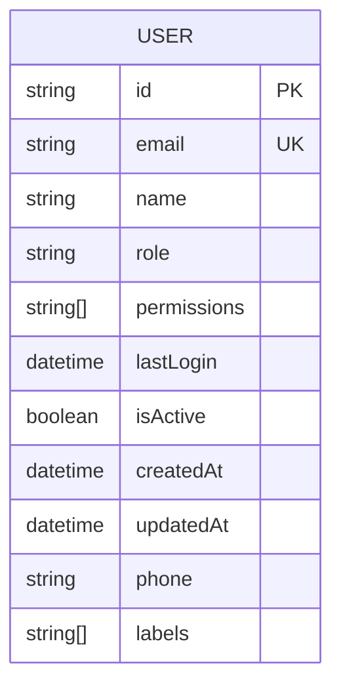
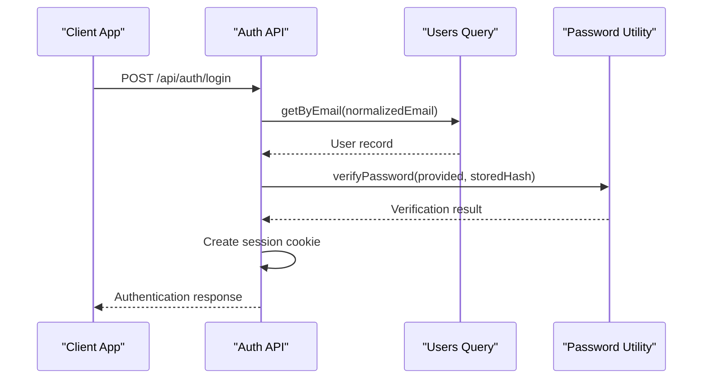
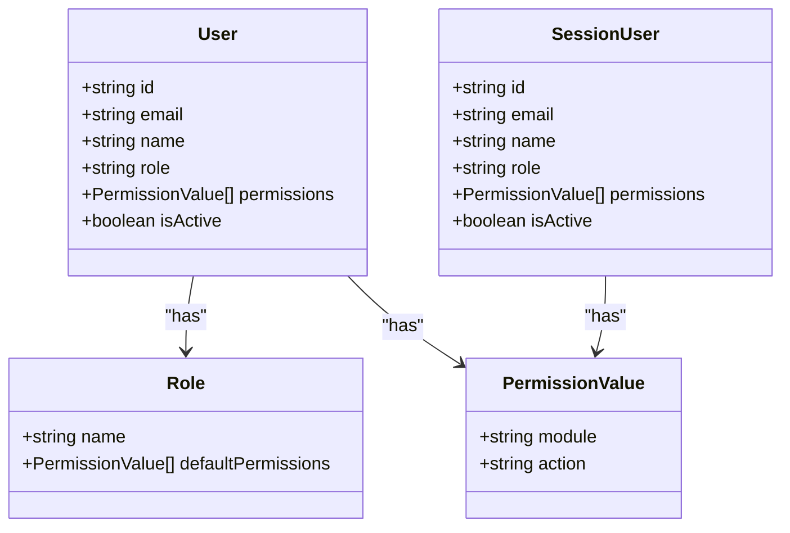
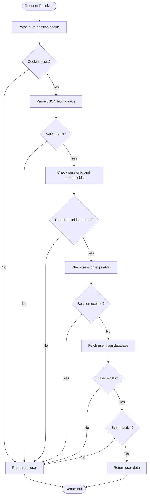
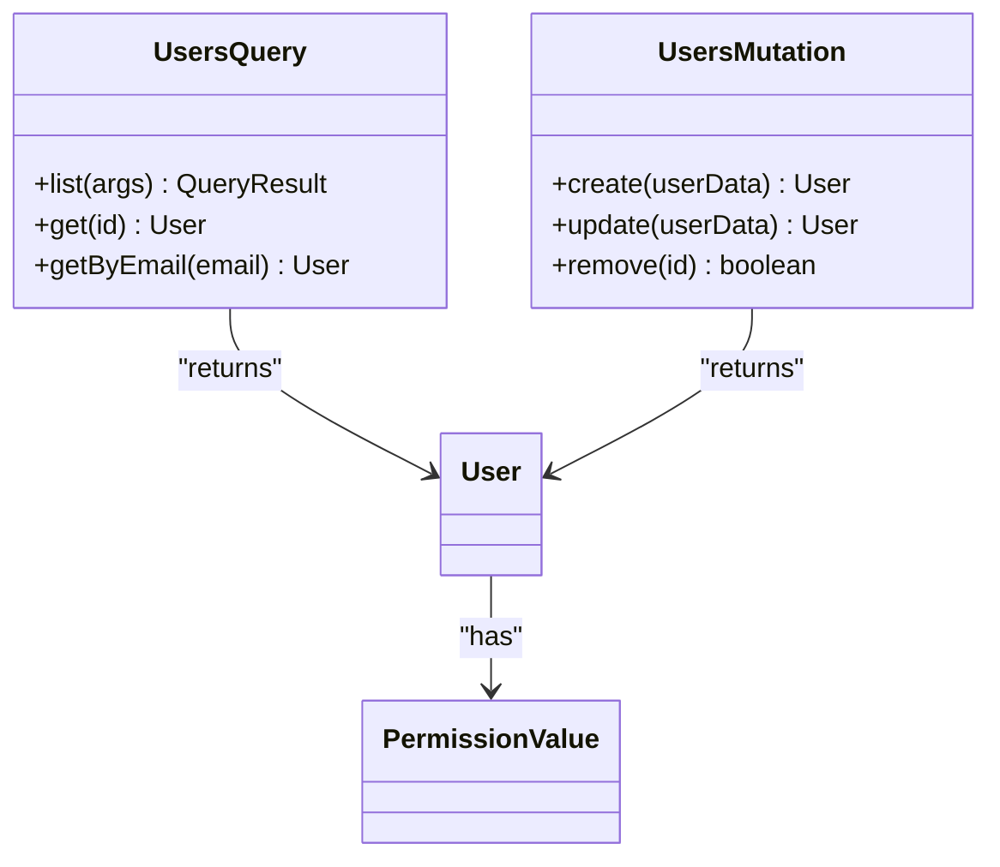
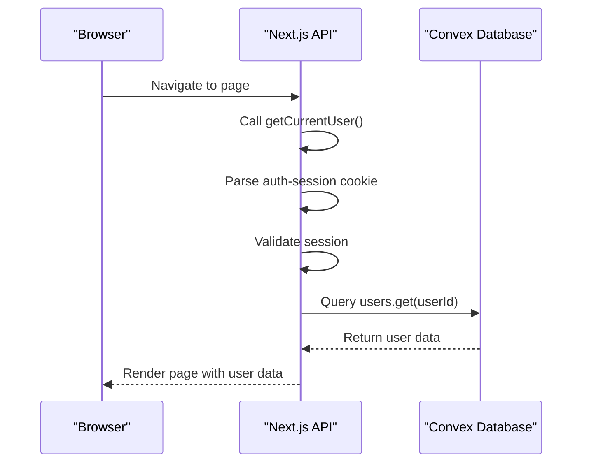

# User Model

<cite>
**Referenced Files in This Document**   
- [users.ts](file://convex/users.ts)
- [auth.ts](file://convex/auth.ts)
- [get-user.ts](file://src/lib/auth/get-user.ts)
- [session.ts](file://src/lib/auth/session.ts)
- [password.ts](file://src/lib/auth/password.ts)
- [auth.ts](file://src/types/auth.ts)
- [user-form.tsx](file://src/components/forms/user-form.tsx)
- [users-table.tsx](file://src/components/tables/users-table.tsx)
</cite>

## Table of Contents

1. [Introduction](#introduction)
2. [Field Definitions](#field-definitions)
3. [Schema Design and Indexing Strategy](#schema-design-and-indexing-strategy)
4. [Authentication System Integration](#authentication-system-integration)
5. [Role-Based Access Control (RBAC) Implementation](#role-based-access-control-rbac-implementation)
6. [Session Management](#session-management)
7. [Data Validation Rules](#data-validation-rules)
8. [Convex Queries and Mutations](#convex-queries-and-mutations)
9. [Frontend Authentication Flow Integration](#frontend-authentication-flow-integration)
10. [Sample User Records](#sample-user-records)
11. [Data Lifecycle](#data-lifecycle)
12. [Conclusion](#conclusion)

## Introduction

The User model in the PORTAL application serves as the central entity for managing user accounts, authentication, authorization, and session state. It is implemented using Convex as the backend database and integrates with a comprehensive authentication system that includes password hashing, role-based access control (RBAC), and secure session management. This document provides a detailed analysis of the User model's structure, relationships, and operational characteristics, focusing on its role in the overall security and access control architecture of the application.

**Section sources**

- [users.ts](file://convex/users.ts#L1-L220)
- [auth.ts](file://src/types/auth.ts#L2-L15)

## Field Definitions

The User model contains the following fields with their respective data types and constraints:

| Field       | Type              | Constraints               | Description                                                              |
| ----------- | ----------------- | ------------------------- | ------------------------------------------------------------------------ |
| id          | string            | Required, Unique          | Unique identifier for the user (Convex document ID)                      |
| email       | string            | Required, Unique, Indexed | User's email address, normalized to lowercase and trimmed                |
| name        | string            | Required                  | Full name of the user                                                    |
| role        | string            | Optional                  | User's role within the organization (e.g., "Dernek Başkanı", "Yönetici") |
| permissions | PermissionValue[] | Required                  | Array of permission values that define the user's access rights          |
| lastLogin   | Date              | Optional                  | Timestamp of the user's last successful login                            |
| isActive    | boolean           | Required                  | Flag indicating whether the user account is active                       |
| createdAt   | string \| Date    | Required                  | Timestamp when the user account was created                              |
| updatedAt   | string \| Date    | Required                  | Timestamp of the last update to the user record                          |
| phone       | string            | Optional                  | User's phone number                                                      |
| labels      | string[]          | Optional                  | Array of string labels for user categorization or filtering              |

**Section sources**

- [auth.ts](file://src/types/auth.ts#L2-L15)
- [users.ts](file://convex/users.ts#L84-L94)

## Schema Design and Indexing Strategy

The User model schema is designed with performance and query efficiency in mind. The database schema includes several indexes to optimize common query patterns:

- **by_email**: Secondary index on the email field to enable fast lookups during authentication
- **by_role**: Secondary index on the role field to facilitate role-based user filtering
- **by_is_active**: Secondary index on the isActive field to efficiently retrieve active or inactive users
- **by_search**: Search index on the name field to support fuzzy name searches with pagination

The schema design follows Convex's document-based model, where each user is stored as a document in the "users" table. The indexing strategy prioritizes the most common access patterns: user authentication (by email), user management (by role), and user status filtering (by isActive). The search index on the name field enables efficient implementation of the user search functionality in the admin dashboard.



**Diagram sources**

- [users.ts](file://convex/users.ts#L5-L63)
- [users.ts](file://convex/users.ts#L73-L81)

## Authentication System Integration

The User model is tightly integrated with the application's authentication system, which handles user login, password verification, and session creation. When a user attempts to log in, the system first normalizes the provided email address (converting to lowercase and trimming whitespace) before querying the database. The getByEmail query uses the by_email index to efficiently locate the user record.

Password management is handled through bcrypt hashing with 12 salt rounds for enhanced security. The password.ts utility provides functions for hashing passwords during user creation and verifying passwords during authentication. The system enforces password strength requirements, including a minimum length of 8 characters, maximum length of 128 characters, and the presence of at least one letter and one number.



**Diagram sources**

- [users.ts](file://convex/users.ts#L73-L81)
- [password.ts](file://src/lib/auth/password.ts#L8-L20)
- [auth.ts](file://convex/auth.ts#L33-L48)

## Role-Based Access Control (RBAC) Implementation

The RBAC system is implemented through the permissions field in the User model, which contains an array of PermissionValue objects. Each user's role determines their initial set of permissions, but individual permissions can be customized on a per-user basis. The system defines module-level permissions (MODULE_PERMISSIONS) and special administrative permissions (SPECIAL_PERMISSIONS) that can be assigned to users.

During authentication, the session system constructs a SessionUser object that includes the user's permissions, which are then used throughout the application to control access to features and data. The permissions system supports both coarse-grained role-based access and fine-grained permission-based access, allowing for flexible security policies.



**Diagram sources**

- [session.ts](file://src/lib/auth/session.ts#L14-L22)
- [auth.ts](file://src/types/auth.ts#L7-L9)
- [users.ts](file://convex/users.ts#L88-L90)

## Session Management

The session management system uses HTTP-only cookies to store session information securely. The session cookie contains a JSON object with the sessionId, userId, and optional expiration timestamp. The system validates sessions by parsing the cookie, checking for expiration, and verifying the user's existence and active status in the database.

The session.ts utility provides comprehensive functions for session handling, including parsing session cookies, checking expiration, and retrieving user data from the session. For development environments, the system supports mock sessions with predefined user roles and permissions, allowing for rapid testing without requiring actual authentication.



**Diagram sources**

- [session.ts](file://src/lib/auth/session.ts#L27-L40)
- [session.ts](file://src/lib/auth/session.ts#L76-L167)

## Data Validation Rules

The User model enforces several data validation rules to ensure data integrity and security:

- **Email validation**: Emails are normalized (lowercase, trimmed) and checked for uniqueness before user creation or email updates
- **Password validation**: Passwords must be at least 8 characters long, contain at least one letter and one number, and are hashed using bcrypt before storage
- **Field trimming**: Name, role, and phone fields are trimmed of whitespace before storage
- **Role validation**: Role values are validated and trimmed before storage
- **Status validation**: The isActive field is required and must be a boolean value

These validation rules are enforced at multiple levels: in the Convex mutation functions, in the password utility, and in the frontend form validation. This multi-layered approach ensures data consistency and security throughout the application.

**Section sources**

- [users.ts](file://convex/users.ts#L97-L105)
- [password.ts](file://src/lib/auth/password.ts#L28-L51)
- [user-form.tsx](file://src/components/forms/user-form.tsx)

## Convex Queries and Mutations

The User model exposes several Convex queries and mutations for data access and manipulation:

- **list**: Retrieves a paginated list of users with optional filtering by search term, role, or active status
- **get**: Retrieves a specific user by ID
- **getByEmail**: Retrieves a user by email address (used for authentication)
- **create**: Creates a new user with hashed password and normalized email
- **update**: Updates user information with email uniqueness validation
- **remove**: Deletes a user account

These functions are implemented as Convex queries and mutations, providing a secure and type-safe API for user management. The list function supports pagination with cursor-based navigation, while the create and update functions include comprehensive validation to prevent data integrity issues.



**Diagram sources**

- [users.ts](file://convex/users.ts#L6-L63)
- [users.ts](file://convex/users.ts#L66-L71)
- [users.ts](file://convex/users.ts#L73-L81)
- [users.ts](file://convex/users.ts#L84-L121)
- [users.ts](file://convex/users.ts#L123-L206)

## Frontend Authentication Flow Integration

The frontend authentication flow integrates with the User model through API routes and React hooks. The login process begins with a POST request to /api/auth/login, which validates credentials and creates a session cookie. The getCurrentUser function in get-user.ts provides a convenient way to access the authenticated user's data in API routes and server components.

In the React frontend, the authentication state is managed through context and hooks, with user data retrieved from the session and Convex database. The system supports both server-side and client-side user retrieval, ensuring consistent access to user information across different parts of the application.



**Diagram sources**

- [get-user.ts](file://src/lib/auth/get-user.ts#L13-L70)
- [session.ts](file://src/lib/auth/session.ts#L173-L180)
- [route.ts](file://src/app/api/auth/login/route.ts)

## Sample User Records

The following are sample user records for different roles in the system:

**Admin User**

```json
{
  "id": "doc_123",
  "email": "admin@portal.com",
  "name": "Dernek Başkanı",
  "role": "Dernek Başkanı",
  "permissions": ["BENEFICIARIES", "AID_APPLICATIONS", "DONATIONS", "USERS_MANAGE"],
  "isActive": true,
  "createdAt": "2023-01-01T00:00:00Z",
  "updatedAt": "2023-01-01T00:00:00Z",
  "phone": "+905551234567",
  "labels": ["admin", "management"]
}
```

**Staff User**

```json
{
  "id": "doc_456",
  "email": "staff@portal.com",
  "name": "Personel Kullanıcı",
  "role": "Personel",
  "permissions": ["BENEFICIARIES", "AID_APPLICATIONS", "MESSAGES"],
  "isActive": true,
  "createdAt": "2023-01-02T00:00:00Z",
  "updatedAt": "2023-01-02T00:00:00Z",
  "phone": "+905559876543",
  "labels": ["staff", "operations"]
}
```

**Volunteer User**

```json
{
  "id": "doc_789",
  "email": "volunteer@portal.com",
  "name": "Gönüllü Kullanıcı",
  "role": "Gönüllü",
  "permissions": ["BENEFICIARIES", "MESSAGES"],
  "isActive": true,
  "createdAt": "2023-01-03T00:00:00Z",
  "updatedAt": "2023-01-03T00:00:00Z",
  "phone": "+905551112233",
  "labels": ["volunteer", "community"]
}
```

**Section sources**

- [session.ts](file://src/lib/auth/session.ts#L89-L126)

## Data Lifecycle

The user data lifecycle spans from creation to deactivation:

1. **Creation**: A new user is created through the create mutation, which hashes the password, normalizes the email, and sets initial timestamps
2. **Authentication**: Users authenticate by providing email and password, which are validated against the stored data
3. **Active Usage**: The user interacts with the system, with their permissions determining access to features
4. **Updates**: User information can be updated through the update mutation, with appropriate validation
5. **Deactivation**: Users can be deactivated by setting isActive to false, preserving their data while preventing login
6. **Removal**: User accounts can be permanently deleted through the remove mutation

The system maintains data integrity throughout the lifecycle by enforcing validation rules, preserving audit trails, and managing relationships with other entities in the system.

**Section sources**

- [users.ts](file://convex/users.ts#L84-L121)
- [users.ts](file://convex/users.ts#L123-L206)
- [users.ts](file://convex/users.ts#L209-L218)

## Conclusion

The User model in the PORTAL application provides a robust foundation for user management, authentication, and authorization. Its design emphasizes security, performance, and flexibility, with features like bcrypt password hashing, role-based access control, and efficient indexing. The integration with Convex provides a type-safe, real-time data access layer, while the session management system ensures secure authentication across the application. The model supports the full user lifecycle from creation to deactivation, with comprehensive validation and error handling to maintain data integrity.
