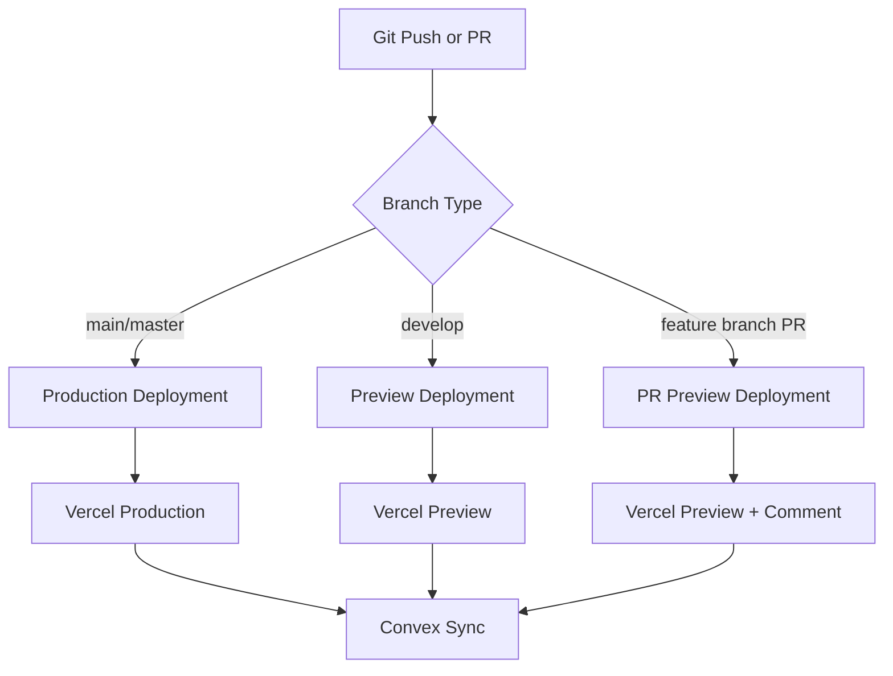
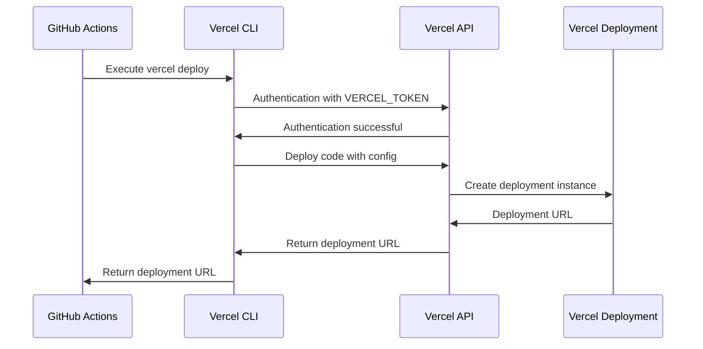

# CI/CD Pipeline

<cite>
**Referenced Files in This Document**   
- [vercel-production.yml](file://.github/workflows/vercel-production.yml)
- [vercel-preview.yml](file://.github/workflows/vercel-preview.yml)
- [vercel.json](file://vercel.json)
- [deploy-vercel.sh](file://scripts/deploy-vercel.sh)
- [add-github-secrets.sh](file://scripts/add-github-secrets.sh)
- [DEPLOYMENT_QUICKSTART.md](file://DEPLOYMENT_QUICKSTART.md)
- [GITHUB_SECRETS_SETUP.md](file://GITHUB_SECRETS_SETUP.md)
</cite>

## Table of Contents

1. [Introduction](#introduction)
2. [CI/CD Workflow Configuration](#cicd-workflow-configuration)
3. [Deployment Triggers and Conditions](#deployment-triggers-and-conditions)
4. [Vercel Integration](#vercel-integration)
5. [Convex Backend Synchronization](#convex-backend-synchronization)
6. [Pull Request Preview Comments](#pull-request-preview-comments)
7. [Pipeline Failure Handling](#pipeline-failure-handling)
8. [Security Implications](#security-implications)

## Introduction

The CI/CD pipeline for PORTAL is designed to automate deployments based on Git operations, ensuring rapid and reliable delivery of application changes. The system leverages GitHub Actions to trigger deployments to different environments based on branch names and pull request events. This document details the workflow configurations, deployment triggers, integration with Vercel's deployment system, and synchronization with the Convex backend.

**Section sources**

- [DEPLOYMENT_QUICKSTART.md](file://DEPLOYMENT_QUICKSTART.md#L147-L154)
- [GITHUB_SECRETS_SETUP.md](file://GITHUB_SECRETS_SETUP.md#L1-L136)

## CI/CD Workflow Configuration

The CI/CD pipeline consists of two primary GitHub Actions workflows located in the `.github/workflows/` directory. The `vercel-production.yml` workflow handles production deployments, while `vercel-preview.yml` manages preview deployments for development and pull request environments. These workflows are configured to execute based on specific Git events and conditions, ensuring appropriate deployment targets based on the code's maturity level.

**Diagram sources**

- [vercel-production.yml](file://.github/workflows/vercel-production.yml)
- [vercel-preview.yml](file://.github/workflows/vercel-preview.yml)

**Section sources**

- [DEPLOYMENT_QUICKSTART.md](file://DEPLOYMENT_QUICKSTART.md#L147-L154)
- [DEPLOYMENT_SUMMARY.md](file://DEPLOYMENT_SUMMARY.md#L25-L27)

## Deployment Triggers and Conditions

The CI/CD pipeline employs specific triggers and conditions to determine the appropriate deployment environment. Pushes to the main or master branches automatically trigger production deployments through the `vercel-production.yml` workflow. Pushes to the develop branch initiate preview deployments via the `vercel-preview.yml` workflow. Additionally, when a pull request is created from any feature branch, the preview workflow executes, creating a temporary deployment for review. These conditions ensure that code changes progress through appropriate environments before reaching production.

**Section sources**

- [DEPLOYMENT_QUICKSTART.md](file://DEPLOYMENT_QUICKSTART.md#L147-L154)
- [GITHUB_SECRETS_SETUP.md](file://GITHUB_SECRETS_SETUP.md#L57-L74)

## Vercel Integration

The pipeline integrates with Vercel's deployment system through the Vercel CLI and API, using GitHub Secrets to securely store deployment credentials. The `vercel.json` configuration file defines build commands, environment variables, and deployment regions. When a workflow executes, it uses the Vercel CLI to deploy the application, with environment variables injected from GitHub Secrets. The integration supports both production and preview deployments, with preview URLs automatically generated for review purposes.

**Diagram sources**

- [vercel.json](file://vercel.json)
- [deploy-vercel.sh](file://scripts/deploy-vercel.sh)

**Section sources**

- [vercel.json](file://vercel.json)
- [DEPLOYMENT_QUICKSTART.md](file://DEPLOYMENT_QUICKSTART.md#L19-L39)

## Convex Backend Synchronization

The CI/CD pipeline synchronizes with the Convex backend during the deployment process. When a production deployment is triggered, the workflow first ensures the Convex backend is deployed and synchronized with the latest schema and functions. This synchronization is critical for maintaining consistency between the frontend application and backend services. The pipeline uses the Convex CLI to deploy the backend, ensuring that API endpoints and data models are up-to-date before the frontend deployment proceeds.

**Section sources**

- [deploy-vercel.sh](file://scripts/deploy-vercel.sh#L1-L47)
- [DEPLOYMENT_QUICKSTART.md](file://DEPLOYMENT_QUICKSTART.md#L45-L56)

## Pull Request Preview Comments

When a pull request is created, the CI/CD pipeline automatically generates a preview deployment and posts a comment on the PR with the preview URL. This functionality is implemented in the `vercel-preview.yml` workflow, which uses GitHub Actions to create a comment containing the deployment URL. The comment enables reviewers to access the deployed preview environment directly from the PR interface, facilitating efficient code review and testing. This automation streamlines the development workflow by providing immediate feedback on changes.

**Section sources**

- [vercel-preview.yml](file://.github/workflows/vercel-preview.yml)
- [GITHUB_SECRETS_SETUP.md](file://GITHUB_SECRETS_SETUP.md#L68-L74)

## Pipeline Failure Handling

The CI/CD pipeline includes comprehensive failure handling mechanisms to ensure reliability and provide clear debugging information. When a deployment fails, the workflow captures and displays error logs, helping developers identify the root cause. The `validate-deploy.sh` script performs pre-deployment validation, checking for common issues such as TypeScript errors, linting problems, and security vulnerabilities. Additionally, the `rollback-vercel.sh` script provides a mechanism to revert to a previous deployment in case of critical issues, minimizing downtime and impact on users.

**Section sources**

- [validate-deploy.sh](file://scripts/validate-deploy.sh)
- [rollback-vercel.sh](file://scripts/rollback-vercel.sh)
- [DEPLOYMENT_QUICKSTART.md](file://DEPLOYMENT_QUICKSTART.md#L174-L200)

## Security Implications

Storing deployment tokens in GitHub Secrets provides a secure method for managing sensitive credentials. GitHub Secrets are encrypted at rest and only exposed during workflow execution, reducing the risk of unauthorized access. The pipeline uses three critical secrets: `VERCEL_TOKEN`, `VERCEL_PROJECT_ID`, and `VERCEL_ORG_ID`, which are required for Vercel deployment. These secrets are never exposed in logs or code, ensuring that deployment credentials remain protected. However, it is essential to restrict access to GitHub repository settings and monitor for unauthorized changes to secrets.

**Section sources**

- [add-github-secrets.sh](file://scripts/add-github-secrets.sh)
- [GITHUB_SECRETS_SETUP.md](file://GITHUB_SECRETS_SETUP.md#L84-L100)
- [DEPLOYMENT_QUICKSTART.md](file://DEPLOYMENT_QUICKSTART.md#L157-L171)
