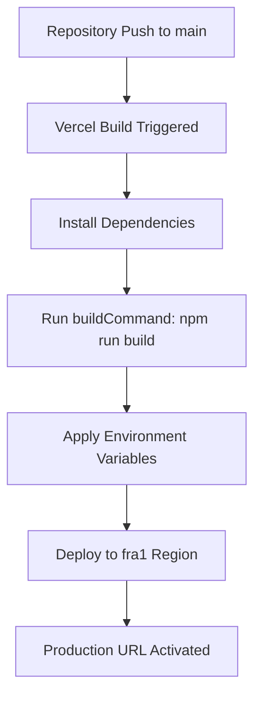
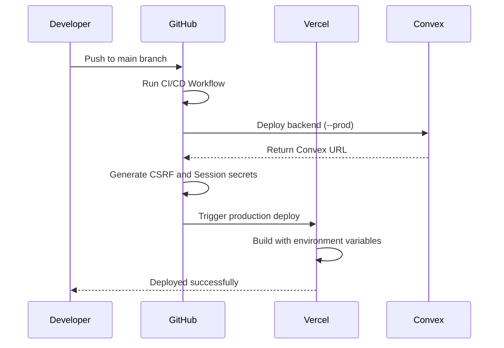
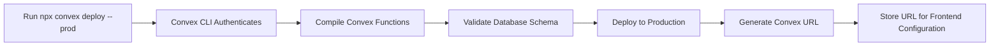
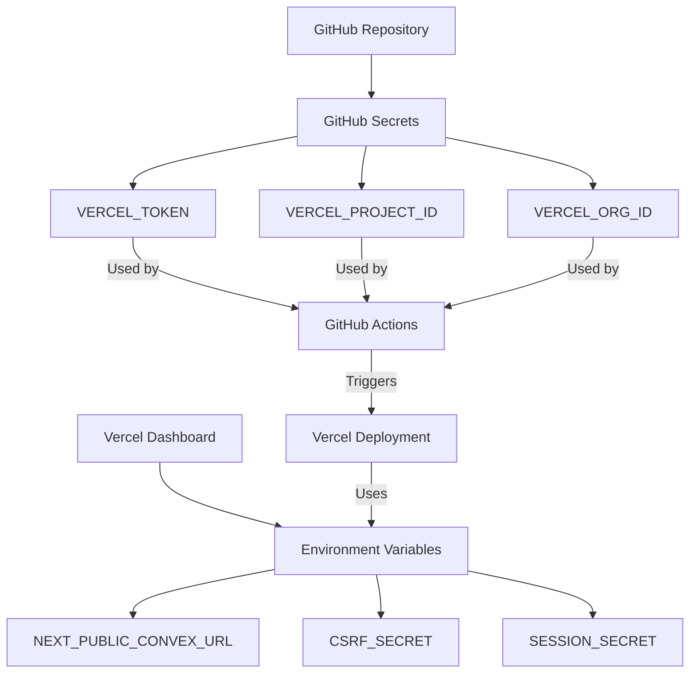
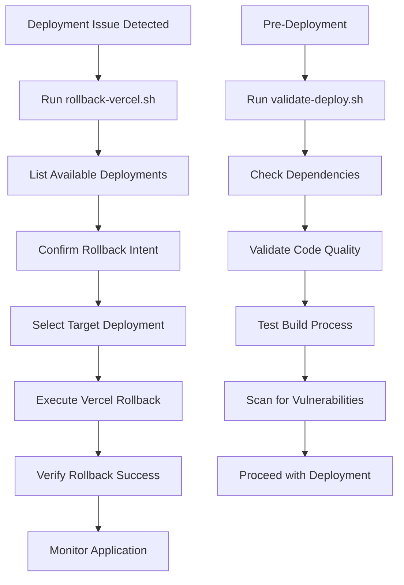

# Deployment and DevOps

<cite>
**Referenced Files in This Document**   
- [vercel.json](file://vercel.json)
- [scripts/deploy-vercel.sh](file://scripts/deploy-vercel.sh)
- [scripts/rollback-vercel.sh](file://scripts/rollback-vercel.sh)
- [scripts/setup-vercel-secrets.sh](file://scripts/setup-vercel-secrets.sh)
- [scripts/add-github-secrets.sh](file://scripts/add-github-secrets.sh)
- [scripts/validate-deploy.sh](file://scripts/validate-deploy.sh)
- [package.json](file://package.json)
- [GITHUB_SECRETS_SETUP.md](file://GITHUB_SECRETS_SETUP.md)
- [DEPLOYMENT_QUICKSTART.md](file://DEPLOYMENT_QUICKSTART.md)
- [DEPLOYMENT_SUMMARY.md](file://DEPLOYMENT_SUMMARY.md)
- [convex/seed.ts](file://convex/seed.ts)
- [src/lib/convex/client.ts](file://src/lib/convex/client.ts)
- [src/lib/convex/server.ts](file://src/lib/convex/server.ts)
</cite>

## Table of Contents

1. [Vercel Deployment Configuration](#vercel-deployment-configuration)
2. [CI/CD Pipeline and Deployment Scripts](#cicd-pipeline-and-deployment-scripts)
3. [Convex Deployment Workflow](#convex-deployment-workflow)
4. [Environment Configuration and Secret Management](#environment-configuration-and-secret-management)
5. [Rollback Procedures and Deployment Verification](#rollback-procedures-and-deployment-verification)
6. [Practical Deployment Examples](#practical-deployment-examples)
7. [Monitoring and Logging in Production](#monitoring-and-logging-in-production)

## Vercel Deployment Configuration

The Vercel deployment process for PORTAL is configured through the `vercel.json` file, which defines the build settings, environment variables, and deployment regions. The configuration specifies Next.js as the framework with a designated build command and development command. The application is deployed in the `fra1` (Frankfurt) region for optimal performance in European markets.

The `vercel.json` configuration includes both runtime and build-time environment variables. Critical environment variables such as `NEXT_PUBLIC_CONVEX_URL`, `CSRF_SECRET`, and `SESSION_SECRET` are referenced as Vercel project variables (prefixed with `@`). This approach ensures that sensitive values are securely stored in the Vercel dashboard rather than in version control.

**Diagram sources**

- [vercel.json](file://vercel.json#L1-L22)

**Section sources**

- [vercel.json](file://vercel.json#L1-L22)
- [package.json](file://package.json#L10-L39)

## CI/CD Pipeline and Deployment Scripts

The CI/CD pipeline for PORTAL is automated through GitHub Actions and a suite of deployment scripts located in the `scripts/` directory. The pipeline supports both production and staging deployments with different triggers: pushes to the `main` branch trigger production deployments, while pull requests generate preview deployments.

The deployment process is orchestrated by several bash scripts that handle different aspects of the deployment workflow. The `deploy-vercel.sh` script automates the entire deployment sequence, including Convex backend deployment, secret generation, and Vercel frontend deployment. This script first ensures the Convex CLI is installed, logs into the Convex account, deploys the Convex backend to production, generates cryptographic secrets for CSRF and session protection, and then guides the user through the Vercel deployment process.

**Diagram sources**

- [scripts/deploy-vercel.sh](file://scripts/deploy-vercel.sh#L1-L133)
- [package.json](file://package.json#L29-L33)

**Section sources**

- [scripts/deploy-vercel.sh](file://scripts/deploy-vercel.sh#L1-L133)
- [scripts/validate-deploy.sh](file://scripts/validate-deploy.sh#L1-L155)
- [package.json](file://package.json#L29-L33)

## Convex Deployment Workflow

The Convex deployment workflow is tightly integrated with the Vercel deployment process. Convex serves as the backend-as-a-service platform for PORTAL, providing a serverless database and function execution environment. The deployment workflow begins with the `npx convex deploy --prod` command, which deploys the Convex functions and database schema to the production environment.

The deployment script captures the generated Convex URL, which is then used to configure the frontend application. This URL is a critical environment variable (`NEXT_PUBLIC_CONVEX_URL`) that enables the Next.js frontend to communicate with the Convex backend. The Convex deployment process includes schema validation and function compilation, ensuring that the backend is consistent and functional before the frontend deployment proceeds.

The `convex/seed.ts` file contains initialization logic for the database, including a mutation to create the first admin user if one doesn't already exist. This seed function uses environment variables for the admin credentials, allowing for secure configuration during deployment.

**Diagram sources**

- [scripts/deploy-vercel.sh](file://scripts/deploy-vercel.sh#L35-L47)
- [convex/seed.ts](file://convex/seed.ts#L18-L58)

**Section sources**

- [scripts/deploy-vercel.sh](file://scripts/deploy-vercel.sh#L35-L47)
- [convex/seed.ts](file://convex/seed.ts#L1-L87)
- [src/lib/convex/client.ts](file://src/lib/convex/client.ts#L1-L108)

## Environment Configuration and Secret Management

Environment configuration and secret management in PORTAL follows security best practices, leveraging both Vercel and GitHub Secrets to protect sensitive information. The system uses a multi-layered approach to environment management, with different configurations for development, staging, and production environments.

Secrets are managed through Vercel's environment variable system and GitHub Actions secrets. The three critical GitHub secrets required for CI/CD automation are `VERCEL_TOKEN`, `VERCEL_PROJECT_ID`, and `VERCEL_ORG_ID`. These secrets enable GitHub Actions to programmatically trigger deployments to Vercel without exposing credentials in the codebase.

The `setup-vercel-secrets.sh` script guides developers through the process of configuring these secrets, while the `add-github-secrets.sh` script provides an automated way to add them using the GitHub CLI. This dual approach accommodates both manual and automated setup scenarios.

Vercel environment variables are categorized into build-time and runtime variables. Build-time variables are available during the build process, while runtime variables are injected into the running application. The configuration distinguishes between public variables (prefixed with `NEXT_PUBLIC_`) that are exposed to the client-side code and private variables that remain server-side only.

**Diagram sources**

- [scripts/setup-vercel-secrets.sh](file://scripts/setup-vercel-secrets.sh#L1-L87)
- [scripts/add-github-secrets.sh](file://scripts/add-github-secrets.sh#L1-L107)
- [GITHUB_SECRETS_SETUP.md](file://GITHUB_SECRETS_SETUP.md#L1-L136)

**Section sources**

- [scripts/setup-vercel-secrets.sh](file://scripts/setup-vercel-secrets.sh#L1-L87)
- [scripts/add-github-secrets.sh](file://scripts/add-github-secrets.sh#L1-L107)
- [GITHUB_SECRETS_SETUP.md](file://GITHUB_SECRETS_SETUP.md#L1-L136)
- [vercel.json](file://vercel.json#L7-L19)

## Rollback Procedures and Deployment Verification

The rollback procedures for PORTAL are designed to quickly restore service in case of deployment issues. The `rollback-vercel.sh` script provides a straightforward mechanism to revert to a previous deployment version. This script first lists all available deployments, prompts for confirmation to prevent accidental rollbacks, and then executes the rollback using the Vercel CLI.

The deployment verification process is comprehensive, ensuring that both the frontend and backend are functioning correctly after deployment. The `validate-deploy.sh` script performs pre-deployment validation, checking Node.js version compatibility, dependency installation, TypeScript type correctness, ESLint compliance, test suite results, environment variable configuration, production build success, and security vulnerabilities.

Post-deployment verification includes health checks via the `/api/health` endpoint, which returns a JSON response indicating the application's status. Additional verification steps include testing the login functionality and confirming the Convex backend connection through its ping endpoint.

**Diagram sources**

- [scripts/rollback-vercel.sh](file://scripts/rollback-vercel.sh#L1-L75)
- [scripts/validate-deploy.sh](file://scripts/validate-deploy.sh#L1-L155)

**Section sources**

- [scripts/rollback-vercel.sh](file://scripts/rollback-vercel.sh#L1-L75)
- [scripts/validate-deploy.sh](file://scripts/validate-deploy.sh#L1-L155)
- [DEPLOYMENT_QUICKSTART.md](file://DEPLOYMENT_QUICKSTART.md#L118-L147)

## Practical Deployment Examples

Practical deployment scenarios for PORTAL demonstrate the workflow for deploying new features and managing environment differences. For a new feature deployment, developers create a feature branch, implement the changes, and push to GitHub. This triggers a preview deployment, allowing stakeholders to review the changes before merging to main.

When deploying to production, the process begins with pre-deployment validation using `npm run validate:deploy`, which runs the comprehensive check suite. Once validation passes, the deployment is initiated with `npm run deploy:vercel`, which executes the automated deployment script.

Environment differences are managed through environment-specific configuration. The system uses different Convex URLs for development, staging, and production environments, with the appropriate URL injected based on the deployment target. Feature flags can be controlled through environment variables, allowing gradual rollout of new functionality.

For emergency fixes, the team can use hotfix branches that bypass the normal review process but still go through automated testing and validation. The rollback capability ensures that if a hotfix introduces new issues, the system can quickly revert to the previous stable state.

**Section sources**

- [DEPLOYMENT_QUICKSTART.md](file://DEPLOYMENT_QUICKSTART.md#L1-L221)
- [DEPLOYMENT_SUMMARY.md](file://DEPLOYMENT_SUMMARY.md#L1-L170)
- [package.json](file://package.json#L29-L33)

## Monitoring and Logging in Production

Monitoring and logging in production are critical components of PORTAL's DevOps practices. The system incorporates multiple monitoring layers to ensure reliability and performance. Vercel Analytics and Speed Insights are integrated into the application to track user behavior and performance metrics, providing insights into page load times, user interactions, and potential bottlenecks.

Error tracking is implemented using Sentry, which captures and reports exceptions in both the frontend and backend. The configuration includes Sentry for Next.js, ensuring that server-side and client-side errors are properly reported with context and stack traces.

Application logging is handled through a custom logger that respects the environment context, suppressing verbose output during build time while providing detailed information in development and production. The health check endpoint (`/api/health`) provides a comprehensive status report, including system health, timestamp, and version information.

The monitoring strategy includes proactive alerts for critical issues, regular performance reviews based on analytics data, and post-mortem analysis of incidents to prevent recurrence. This comprehensive approach ensures that the application remains stable and performant in production.

**Section sources**

- [package.json](file://package.json#L70-L71)
- [sentry.client.config.ts](file://sentry.client.config.ts)
- [sentry.server.config.ts](file://sentry.server.config.ts)
- [src/lib/logger.ts](file://src/lib/logger.ts)
- [DEPLOYMENT_SUMMARY.md](file://DEPLOYMENT_SUMMARY.md#L118-L123)
