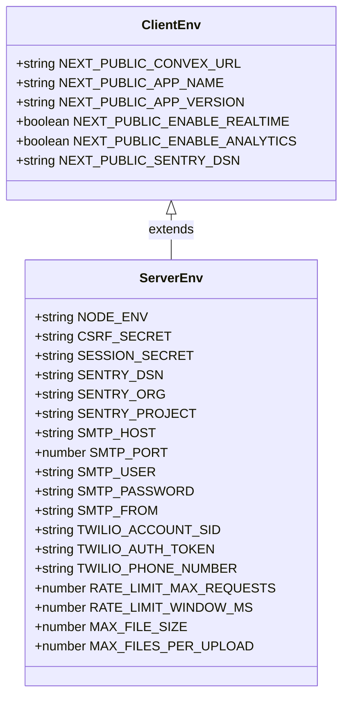
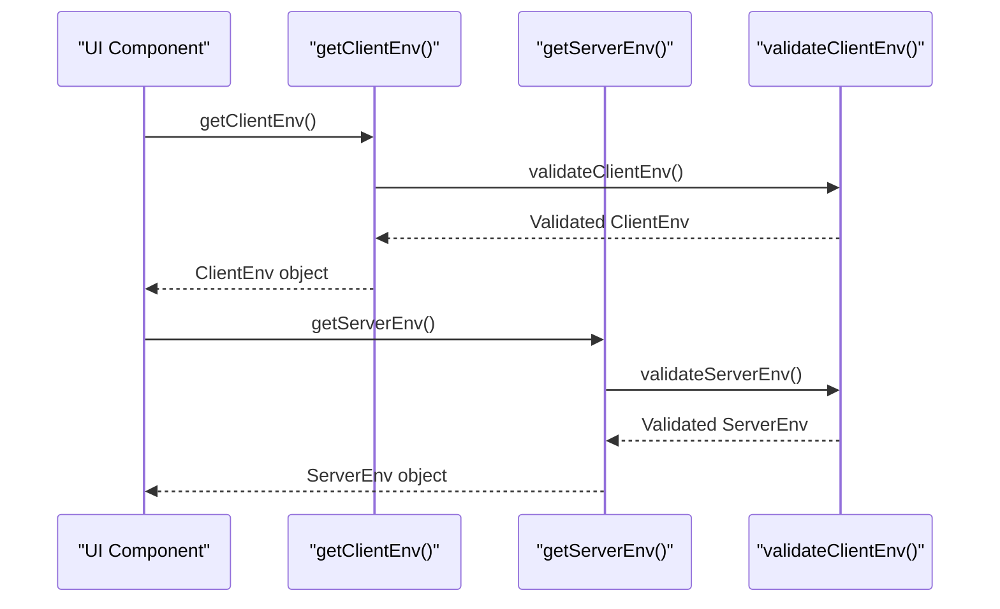

# Environment Configuration

<cite>
**Referenced Files in This Document**  
- [vercel.json](file://vercel.json)
- [src/lib/env-validation.ts](file://src/lib/env-validation.ts)
- [DEPLOYMENT_QUICKSTART.md](file://DEPLOYMENT_QUICKSTART.md)
- [scripts/deploy-vercel.sh](file://scripts/deploy-vercel.sh)
- [src/components/analytics/GoogleAnalytics.tsx](file://src/components/analytics/GoogleAnalytics.tsx)
- [src/lib/services/email.ts](file://src/lib/services/email.ts)
- [src/lib/services/sms.ts](file://src/lib/services/sms.ts)
</cite>

## Table of Contents

1. [vercel.json Configuration](#verceljson-configuration)
2. [Required Environment Variables](#required-environment-variables)
3. [Environment Variable Management](#environment-variable-management)
4. [Optional Configuration Variables](#optional-configuration-variables)
5. [Environment Variable Consumption](#environment-variable-consumption)
6. [Development, Staging, and Production Best Practices](#development-staging-and-production-best-practices)

## vercel.json Configuration

The `vercel.json` file serves as the primary configuration for Vercel deployment, defining build commands, regions, and environment variable mappings. This configuration ensures consistent deployment behavior across different environments.

```mermaid
json
{
"buildCommand": "npm run build",
"devCommand": "npm run dev",
"installCommand": "npm install",
"framework": "nextjs",
"regions": ["fra1"],
"env": {
"NEXT_PUBLIC_CONVEX_URL": "@convex_url",
"BACKEND_PROVIDER": "convex",
"NEXT_PUBLIC_BACKEND_PROVIDER": "convex",
"CSRF_SECRET": "@csrf_secret",
"SESSION_SECRET": "@session_secret"
},
"build": {
"env": {
"NEXT_PUBLIC_CONVEX_URL": "@convex_url",
"BACKEND_PROVIDER": "convex",
"NEXT_PUBLIC_BACKEND_PROVIDER": "convex"
}
}
}
```

**Diagram sources**

- [vercel.json](file://vercel.json#L1-L22)

**Section sources**

- [vercel.json](file://vercel.json#L1-L22)

The configuration includes several key elements:

- **Build Commands**: Specifies `npm run build` as the build command, `npm run dev` for development, and `npm install` for dependency installation
- **Framework Detection**: Explicitly sets the framework to "nextjs" for proper Next.js application handling
- **Region Deployment**: Restricts deployment to the Frankfurt (fra1) region for compliance and performance requirements
- **Environment Variables**: Maps environment variables using @-prefixed references for secure secret management
- **Build Environment**: Defines environment variables specifically for the build phase, excluding sensitive secrets

The @-prefixed variable references (e.g., `@convex_url`, `@csrf_secret`) are Vercel's secret management system, allowing secure storage of sensitive values that are injected during deployment without being exposed in the repository.

## Required Environment Variables

The application requires several critical environment variables for proper operation, with specific security requirements for production environments.

### Core Required Variables

| Variable                     | Purpose                                               | Security Requirements                     |
| ---------------------------- | ----------------------------------------------------- | ----------------------------------------- |
| NEXT_PUBLIC_CONVEX_URL       | Backend API endpoint for Convex database              | Must be a valid HTTPS URL                 |
| CSRF_SECRET                  | Protection against Cross-Site Request Forgery attacks | Minimum 32 characters, randomly generated |
| SESSION_SECRET               | Encryption key for session management                 | Minimum 32 characters, randomly generated |
| BACKEND_PROVIDER             | Specifies the backend service provider                | Fixed value: "convex"                     |
| NEXT_PUBLIC_BACKEND_PROVIDER | Public-facing backend identifier                      | Fixed value: "convex"                     |

**Section sources**

- [vercel.json](file://vercel.json#L8-L12)
- [src/lib/env-validation.ts](file://src/lib/env-validation.ts#L32-L33)
- [DEPLOYMENT_QUICKSTART.md](file://DEPLOYMENT_QUICKSTART.md#L88-L92)

The `CSRF_SECRET` and `SESSION_SECRET` variables have strict security requirements:

- Both must be at least 32 characters long
- Should be cryptographically random values generated using secure methods
- Must be unique and never exposed in client-side code
- In production, these values are required and cannot use development defaults

The validation schema in `env-validation.ts` enforces these requirements, throwing descriptive errors if validation fails during application startup.

## Environment Variable Management

Proper environment variable management is critical for secure and reliable deployments. The system provides multiple methods for setting up environment variables in the Vercel Dashboard.

### Setting Up Environment Variables in Vercel Dashboard

To configure environment variables in Vercel:

1. Navigate to your project in the Vercel Dashboard
2. Go to Settings → Environment Variables
3. Add each required variable with its corresponding value
4. Set the appropriate variable scope (Production, Preview, Development)
5. Save the configuration

The @-prefixed references in `vercel.json` correspond to Vercel secrets that must be created in the dashboard. These secrets are securely stored and injected into the application environment during deployment.

### Automated Setup Process

The repository includes scripts to automate the environment setup process:

```bash
# Run the deployment script
npm run deploy:vercel

# The script will output required environment variables
NEXT_PUBLIC_CONVEX_URL=https://your-project.convex.cloud
BACKEND_PROVIDER=convex
NEXT_PUBLIC_BACKEND_PROVIDER=convex
CSRF_SECRET=generated-32-character-secret
SESSION_SECRET=generated-32-character-secret
```

The `deploy-vercel.sh` script automates the entire deployment process, including:

- Deploying the Convex backend and retrieving the production URL
- Generating cryptographically secure random secrets for CSRF and session protection
- Displaying all required environment variables for manual configuration
- Creating a `.env.vercel` file with the complete configuration

This automation ensures consistent and secure environment setup across deployments.

**Section sources**

- [scripts/deploy-vercel.sh](file://scripts/deploy-vercel.sh#L60-L61)
- [vercel.json](file://vercel.json#L8-L12)
- [DEPLOYMENT_QUICKSTART.md](file://DEPLOYMENT_QUICKSTART.md#L71-L75)

## Optional Configuration Variables

In addition to required variables, the application supports several optional configuration variables for enhanced functionality.

### Email Integration

Email functionality can be enabled by configuring SMTP settings:

```env
# Email (SMTP)
SMTP_HOST=smtp.gmail.com
SMTP_PORT=587
SMTP_USER=your-email@gmail.com
SMTP_PASSWORD=your-app-password
SMTP_FROM=noreply@yoursite.com
```

These variables enable the application to send transactional emails through any SMTP provider. The `hasEmailConfig` function in `env-validation.ts` checks for the presence of these variables and enables email functionality when properly configured.

### SMS Integration

SMS capabilities are provided through Twilio integration:

```env
# SMS (Twilio)
TWILIO_ACCOUNT_SID=ACxxxxx
TWILIO_AUTH_TOKEN=your-token
TWILIO_PHONE_NUMBER=+905xxxxxxxxx
```

The application uses these credentials to send SMS messages for notifications, alerts, and verification codes. The `hasSmsConfig` function validates the presence of these variables before enabling SMS functionality.

### Google Maps Integration

Geolocation features are supported through Google Maps API:

```env
# Google Maps
NEXT_PUBLIC_GOOGLE_MAPS_API_KEY=AIzaSyXXXXXXXXX
```

This public API key enables map rendering, geocoding, and location-based services within the application.

### Application Configuration

Additional application-level settings:

```env
# Uygulama
NEXT_PUBLIC_APP_NAME=Dernek Yönetim Sistemi
NEXT_PUBLIC_APP_VERSION=1.0.0
NEXT_PUBLIC_ENABLE_REALTIME=true
NEXT_PUBLIC_ENABLE_ANALYTICS=false
```

These variables control application behavior, branding, and feature flags.

**Section sources**

- [DEPLOYMENT_QUICKSTART.md](file://DEPLOYMENT_QUICKSTART.md#L103-L115)
- [src/lib/env-validation.ts](file://src/lib/env-validation.ts#L40-L52)
- [src/lib/services/email.ts](file://src/lib/services/email.ts)
- [src/lib/services/sms.ts](file://src/lib/services/sms.ts)

## Environment Variable Consumption

Environment variables are consumed throughout the application using a validated, type-safe approach that ensures reliability and security.

### Validation and Type Safety

The application uses Zod for comprehensive environment variable validation:



**Diagram sources**

- [src/lib/env-validation.ts](file://src/lib/env-validation.ts#L8-L77)

The validation system provides:

- Type safety through TypeScript interfaces
- Runtime validation with descriptive error messages
- Default values for optional variables
- Automatic type coercion (e.g., string to number)
- Development defaults for non-production environments

### Consumption Patterns

Environment variables are accessed through dedicated getter functions:



**Diagram sources**

- [src/lib/env-validation.ts](file://src/lib/env-validation.ts#L176-L197)

Client-side components use `getClientEnv()` to access public variables, while server-side code (API routes, middleware, server components) uses `getServerEnv()` for access to both public and private variables. Both functions include caching for performance optimization.

The consumption pattern ensures:

- Environment variables are validated before use
- Sensitive variables are never exposed to client-side code
- Consistent access patterns throughout the codebase
- Proper error handling for missing or invalid variables

**Section sources**

- [src/lib/env-validation.ts](file://src/lib/env-validation.ts#L176-L197)
- [src/components/analytics/GoogleAnalytics.tsx](file://src/components/analytics/GoogleAnalytics.tsx#L7-L10)

## Development, Staging, and Production Best Practices

Effective environment management requires different strategies for development, staging, and production environments.

### Development Environment

In development, the application provides sensible defaults to simplify setup:

- Missing `CSRF_SECRET` and `SESSION_SECRET` use development defaults (with warning)
- Optional services (email, SMS) are disabled by default
- Analytics and monitoring are configured for verbose logging
- Real-time features are enabled by default

Developers can override defaults by creating a `.env.local` file in the project root.

### Staging Environment

Staging environments should mirror production as closely as possible:

- Use production-like secrets (different from production values)
- Enable all services with test credentials
- Configure analytics with staging identifiers
- Use a separate Convex deployment for staging
- Enable comprehensive logging and monitoring

### Production Environment

Production deployments require strict security and reliability measures:

- All required secrets must be explicitly configured (no defaults)
- Use strong, randomly generated secrets for CSRF and session protection
- Enable error monitoring and performance tracking
- Configure proper logging levels (avoid verbose logging)
- Use production Convex deployment
- Implement proper backup and recovery procedures

The validation system enforces production requirements by making critical secrets mandatory and providing clear error messages for configuration issues.

**Section sources**

- [src/lib/env-validation.ts](file://src/lib/env-validation.ts#L134-L139)
- [DEPLOYMENT_QUICKSTART.md](file://DEPLOYMENT_QUICKSTART.md)
- [scripts/deploy-vercel.sh](file://scripts/deploy-vercel.sh)
