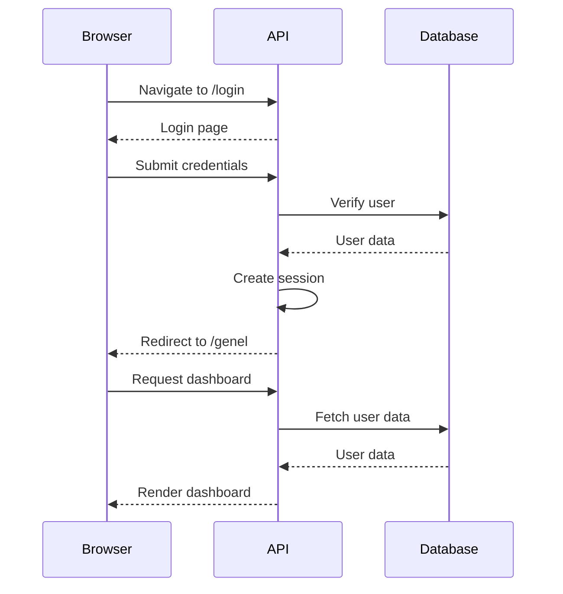
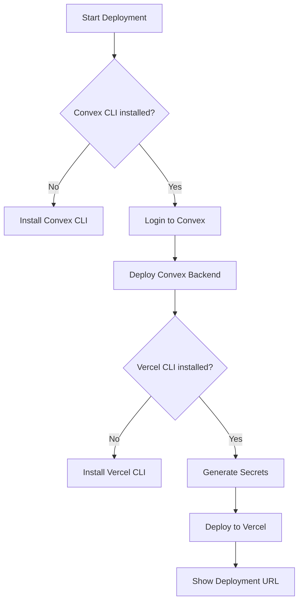

# Directory Structure

<cite>
**Referenced Files in This Document**   
- [sg.ts](file://cli/sg.ts)
- [aid_applications.ts](file://convex/aid_applications.ts)
- [analytics.ts](file://convex/analytics.ts)
- [audit_logs.ts](file://convex/audit_logs.ts)
- [auth.ts](file://convex/auth.ts)
- [bank_accounts.ts](file://convex/bank_accounts.ts)
- [beneficiaries.ts](file://convex/beneficiaries.ts)
- [communication_logs.ts](file://convex/communication_logs.ts)
- [consents.ts](file://convex/consents.ts)
- [dependents.ts](file://convex/dependents.ts)
- [documents.ts](file://convex/documents.ts)
- [donations.ts](file://convex/donations.ts)
- [finance_records.ts](file://convex/finance_records.ts)
- [meeting_action_items.ts](file://convex/meeting_action_items.ts)
- [meeting_decisions.ts](file://convex/meeting_decisions.ts)
- [meetings.ts](file://convex/meetings.ts)
- [messages.ts](file://convex/messages.ts)
- [partners.ts](file://convex/partners.ts)
- [seed.ts](file://convex/seed.ts)
- [storage.ts](file://convex/storage.ts)
- [system_settings.ts](file://convex/system_settings.ts)
- [tasks.ts](file://convex/tasks.ts)
- [users.ts](file://convex/users.ts)
- [workflow_notifications.ts](file://convex/workflow_notifications.ts)
- [schema.ts](file://convex/schema.ts)
- [auth.spec.ts](file://e2e/auth.spec.ts)
- [donations.spec.ts](file://e2e/donations.spec.ts)
- [mcptest_ff1962ad-f02f-46ee-8ce2-f9cc73c09b6a.spec.ts](file://e2e/mcptest_ff1962ad-f02f-46ee-8ce2-f9cc73c09b6a.spec.ts)
- [notifications.spec.ts](file://e2e/notifications.spec.ts)
- [settings.spec.ts](file://e2e/settings.spec.ts)
- [add-github-secrets.sh](file://scripts/add-github-secrets.sh)
- [deploy-vercel.sh](file://scripts/deploy-vercel.sh)
- [rollback-vercel.sh](file://scripts/rollback-vercel.sh)
- [setup-vercel-secrets.sh](file://scripts/setup-vercel-secrets.sh)
- [validate-deploy.sh](file://scripts/validate-deploy.sh)
- [layout.tsx](file://src/app/layout.tsx)
- [page.tsx](file://src/app/page.tsx)
- [user-form.tsx](file://src/components/forms/user-form.tsx)
- [button.tsx](file://src/components/ui/button.tsx)
- [useInfiniteScroll.ts](file://src/hooks/useInfiniteScroll.ts)
- [utils.ts](file://src/lib/utils.ts)
- [auth.ts](file://src/types/auth.ts)
</cite>

## Table of Contents

1. [Top-Level Directory Overview](#top-level-directory-overview)
2. [Source Code Directory (src/)](#source-code-directory-src)
3. [Convex Backend Functions (convex/)](#convex-backend-functions-convex)
4. [End-to-End Tests (e2e/)](#end-to-end-tests-e2e)
5. [Deployment Scripts (scripts/)](#deployment-scripts-scripts)
6. [Command-Line Tools (cli/)](#command-line-tools-cli)
7. [Code Organization Guidelines](#code-organization-guidelines)

## Top-Level Directory Overview

The PORTAL project follows a well-structured directory organization that separates concerns between frontend, backend, testing, deployment, and tooling. The top-level directories serve distinct purposes:

- **src/**: Contains all frontend application code including pages, components, utilities, and types
- **convex/**: Houses backend functions and data models for the Convex serverless platform
- **e2e/**: Contains end-to-end tests that validate complete user workflows
- **scripts/**: Includes deployment and operational scripts for CI/CD processes
- **cli/**: Contains command-line interface tools for project maintenance

This separation enables clear boundaries between different aspects of the application, making it easier to maintain and extend.

## Source Code Directory (src/)

The `src/` directory contains the complete frontend application codebase, organized into feature-based subdirectories that follow React and Next.js conventions.

### Application Pages and Routes (app/)

The `app/` directory implements the Next.js App Router, containing all pages and API routes. It follows a nested routing structure where each subdirectory represents a route segment.

```mermaid
graph TD
A[app/] --> B[(dashboard)/]
A --> C[login/]
A --> D[api/]
A --> E[layout.tsx]
A --> F[page.tsx]
A --> G[providers.tsx]
B --> H[bagis/]
B --> I[financial-dashboard/]
B --> J[kullanici/]
B --> K[yardim/]
H --> L[kumbara/]
H --> M[liste/]
J --> N[[id]/duzenle/]
J --> O[yeni/]
D --> P[aid-applications/]
D --> Q[analytics/]
D --> R[auth/]
D --> S[beneficiaries/]
D --> T[donations/]
D --> U[users/]
```

**Diagram sources**

- [layout.tsx](file://src/app/layout.tsx#L1-L84)
- [page.tsx](file://src/app/page.tsx#L1-L30)

**Section sources**

- [layout.tsx](file://src/app/layout.tsx#L1-L84)
- [page.tsx](file://src/app/page.tsx#L1-L30)

The `(dashboard)` directory uses Next.js route groups to organize dashboard-related pages without affecting the URL structure. This allows logical grouping of related pages while maintaining clean URLs.

### UI Components (components/)

The `components/` directory contains reusable UI components organized by feature area:

- **components/analytics/**: Analytics integration components
- **components/bank-accounts/**: Bank account management UI
- **components/beneficiary-analytics/**: Aid history visualization
- **components/documents/**: Document management interface
- **components/forms/**: Form components including user-form.tsx
- **components/kumbara/**: Money box (Kumbara) related UI
- **components/layouts/**: Layout components like PageLayout.tsx
- **components/meetings/**: Calendar and meeting views
- **components/scholarships/**: Scholarship application UI
- **components/tables/**: Data table components
- **components/tasks/**: Task management UI
- **components/ui/**: Base UI components from shadcn/ui
- **components/users/**: User-specific components

The components follow a modular design, with atomic components in `ui/` that are composed into higher-level feature components.

### Utilities and Libraries (lib/)

The `lib/` directory contains utility functions and shared logic:

- **lib/api/**: API client utilities and route helpers
- **lib/auth/**: Authentication utilities including session management
- **lib/convex/**: Convex client and server configuration
- **lib/export/**: Data export functionality
- **lib/performance/**: Web vitals and performance monitoring
- **lib/services/**: External service integrations (email, SMS)
- **lib/utils/**: General utility functions and formatting
- **lib/validations/**: Form validation schemas
- **lib/rate-limit/**: Rate limiting configuration and monitoring

These utilities provide shared functionality across the application while maintaining separation of concerns.

### Custom Hooks (hooks/)

The `hooks/` directory contains custom React hooks that encapsulate reusable logic:

- **useApiCache.ts**: Manages API response caching
- **useFormMutation.ts**: Handles form submission with mutation state
- **useInfiniteScroll.ts**: Implements infinite scrolling for large datasets

```mermaid
classDiagram
class useInfiniteScroll {
+limit : number
+queryKey : string[]
+queryFn : Function
+initialPageParam : number
+data : any[]
+total : number
+hasMore : boolean
+isLoading : boolean
+isFetchingNextPage : boolean
+ref : RefObject
+fetchNextPage() : void
}
useInfiniteScroll --> "1" "1" useInfiniteQuery : uses
useInfiniteQuery --> "1" "1" IntersectionObserver : observes
```

**Diagram sources**

- [useInfiniteScroll.ts](file://src/hooks/useInfiniteScroll.ts#L1-L124)

**Section sources**

- [useInfiniteScroll.ts](file://src/hooks/useInfiniteScroll.ts#L1-L124)

### Type Definitions (types/)

The `types/` directory contains TypeScript interfaces and type definitions:

- **types/auth.ts**: Authentication-related types including User and AuthState
- **types/financial.ts**: Financial data types
- **types/permissions.ts**: User permission types
- **types/scholarship.ts**: Scholarship-related types

These type definitions ensure type safety across the application and provide clear contracts for data structures.

## Convex Backend Functions (convex/)

The `convex/` directory contains all backend functions that run on the Convex serverless platform. Each TypeScript file corresponds to a specific domain entity and exposes query and mutation functions.

### Function Organization

The Convex functions are organized by domain entities, with each file following a consistent pattern:

```mermaid
graph TD
A[Convex Functions] --> B[aid_applications.ts]
A --> C[analytics.ts]
A --> D[audit_logs.ts]
A --> E[auth.ts]
A --> F[bank_accounts.ts]
A --> G[beneficiaries.ts]
A --> H[communication_logs.ts]
A --> I[consents.ts]
A --> J[dependents.ts]
A --> K[documents.ts]
A --> L[donations.ts]
A --> M[finance_records.ts]
A --> N[meeting_action_items.ts]
A --> O[meeting_decisions.ts]
A --> P[meetings.ts]
A --> Q[messages.ts]
A --> R[partners.ts]
A --> S[system_settings.ts]
A --> T[tasks.ts]
A --> U[users.ts]
A --> V[workflow_notifications.ts]
```



**Diagram sources**

- [users.ts](file://convex/users.ts#L1-L220)
- [schema.ts](file://convex/schema.ts#L1-L800)

**Section sources**

- [users.ts](file://convex/users.ts#L1-L220)
- [schema.ts](file://convex/schema.ts#L1-L800)

### Data Model Mapping

The Convex functions directly map to the data model defined in `schema.ts`. Each collection in the schema corresponds to a function file that provides CRUD operations:

```mermaid
classDiagram
class users {
+list() Query
+get() Query
+getByEmail() Query
+create() Mutation
+update() Mutation
+remove() Mutation
}
class beneficiaries {
+list() Query
+get() Query
+create() Mutation
+update() Mutation
+remove() Mutation
}
class donations {
+list() Query
+get() Query
+create() Mutation
+update() Mutation
}
users --> "1" "0..*" beneficiaries : manages
users --> "1" "0..*" donations : processes
beneficiaries --> "0..*" "1" donations : receives
```

**Diagram sources**

- [users.ts](file://convex/users.ts#L1-L220)
- [schema.ts](file://convex/schema.ts#L1-L800)

The functions use Convex's type-safe API with `query` and `mutation` wrappers that automatically generate TypeScript types. The `_generated/` directory contains the generated API types that are used by the frontend.

## End-to-End Tests (e2e/)

The `e2e/` directory contains Playwright-based end-to-end tests that validate complete user workflows across the application.

### Test Organization

The end-to-end tests are organized by feature area:

- **auth.spec.ts**: Authentication flows including login and logout
- **donations.spec.ts**: Donation processing workflows
- **mcptest\_\*.spec.ts**: Monte Carlo performance and stress tests
- **notifications.spec.ts**: Notification system testing
- **settings.spec.ts**: System settings and configuration testing



**Diagram sources**

- [auth.spec.ts](file://e2e/auth.spec.ts#L1-L307)

**Section sources**

- [auth.spec.ts](file://e2e/auth.spec.ts#L1-L307)

The tests use a comprehensive testing strategy that includes:

- Authentication flow validation
- Protected route access control
- API endpoint security (CSRF protection)
- Navigation between application modules
- Sidebar collapse/expand functionality

## Deployment Scripts (scripts/)

The `scripts/` directory contains shell scripts for deployment and operational tasks:

- **add-github-secrets.sh**: Configures GitHub repository secrets
- **deploy-vercel.sh**: Deploys the application to Vercel
- **rollback-vercel.sh**: Rolls back to a previous Vercel deployment
- **setup-vercel-secrets.sh**: Configures Vercel environment variables
- **start-dev.mjs**: Starts the development server
- **validate-deploy.sh**: Validates deployment configuration

The `deploy-vercel.sh` script is particularly comprehensive, handling the entire deployment workflow:



**Diagram sources**

- [deploy-vercel.sh](file://scripts/deploy-vercel.sh#L1-L133)

**Section sources**

- [deploy-vercel.sh](file://scripts/deploy-vercel.sh#L1-L133)

## Command-Line Tools (cli/)

The `cli/` directory contains command-line tools built with Yargs for project maintenance and documentation generation.

### SG Tool (sg.ts)

The `sg.ts` file implements a CLI tool for generating project documentation:

```mermaid
classDiagram
class SGTool {
+target : string
+type : 'docs'|'api'|'structure'|'readme'
+format : 'md'|'json'|'yaml'
+generateStructureMarkdown(dir : string) : string
}
SGTool --> "1" "1" yargs : uses
SGTool --> "1" "1" fs : uses
SGTool --> "1" "1" path : uses
```

**Diagram sources**

- [sg.ts](file://cli/sg.ts#L1-L76)

**Section sources**

- [sg.ts](file://cli/sg.ts#L1-L76)

The tool supports generating different types of documentation:

- **structure**: Generates a markdown representation of the project directory structure
- **docs**: Placeholder for comprehensive documentation
- **api**: Placeholder for API documentation
- **readme**: Placeholder for README generation

## Code Organization Guidelines

When extending the PORTAL application, follow these guidelines for placing new code:

### Frontend Code Placement

- **New pages**: Add to `src/app/` following the route structure
- **New components**: Place in `src/components/` under the appropriate feature directory
- **New utilities**: Add to `src/lib/` under the relevant subdirectory
- **New hooks**: Place in `src/hooks/`
- **New types**: Add to `src/types/`

### Backend Function Placement

- **New domain entities**: Create a new `.ts` file in `convex/` following the naming convention
- **New queries/mutations**: Add to the appropriate existing file based on domain
- **New data models**: Update `schema.ts` and regenerate types

### Testing Code Placement

- **New end-to-end tests**: Add to `e2e/` with descriptive naming
- **New unit tests**: Place in `src/__tests__/` following the source file structure

### Script Placement

- **New deployment scripts**: Add to `scripts/` with clear naming
- **New CLI tools**: Place in `cli/`

This organization ensures consistency across the codebase and makes it easier for developers to locate and understand the code.
