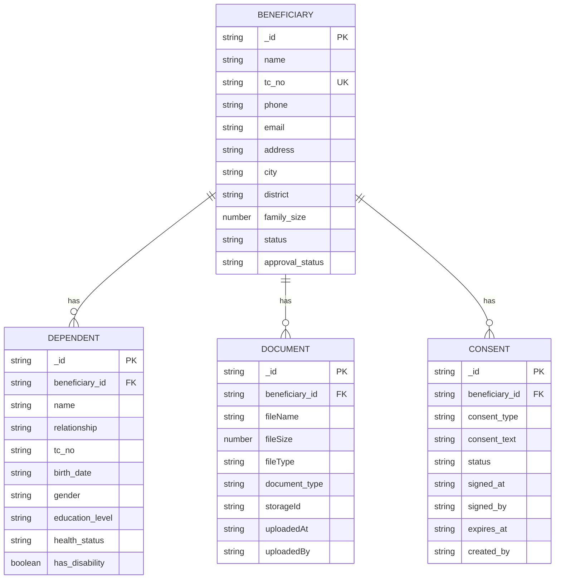
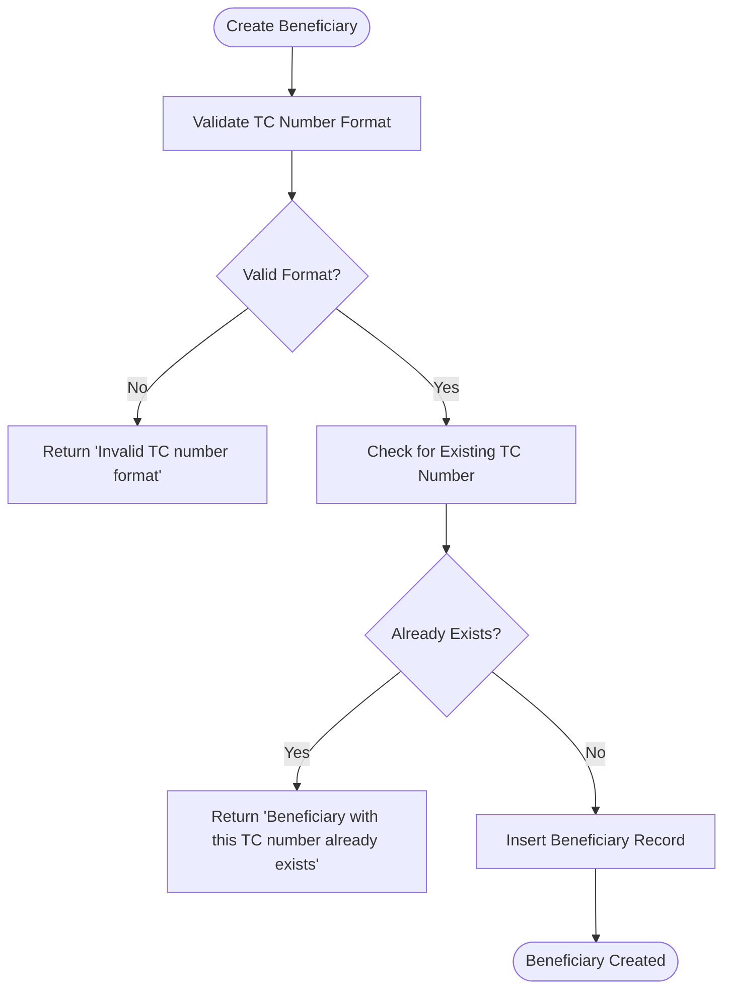
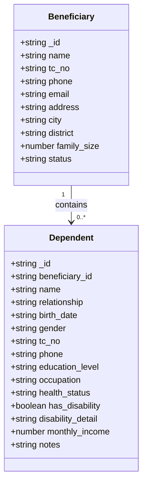
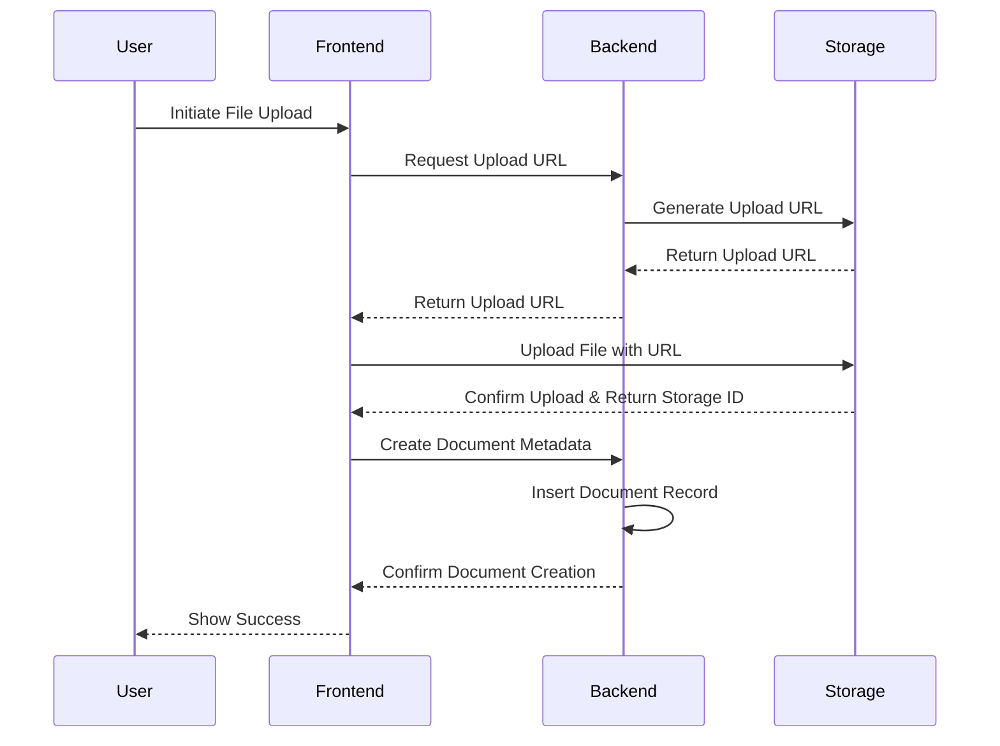
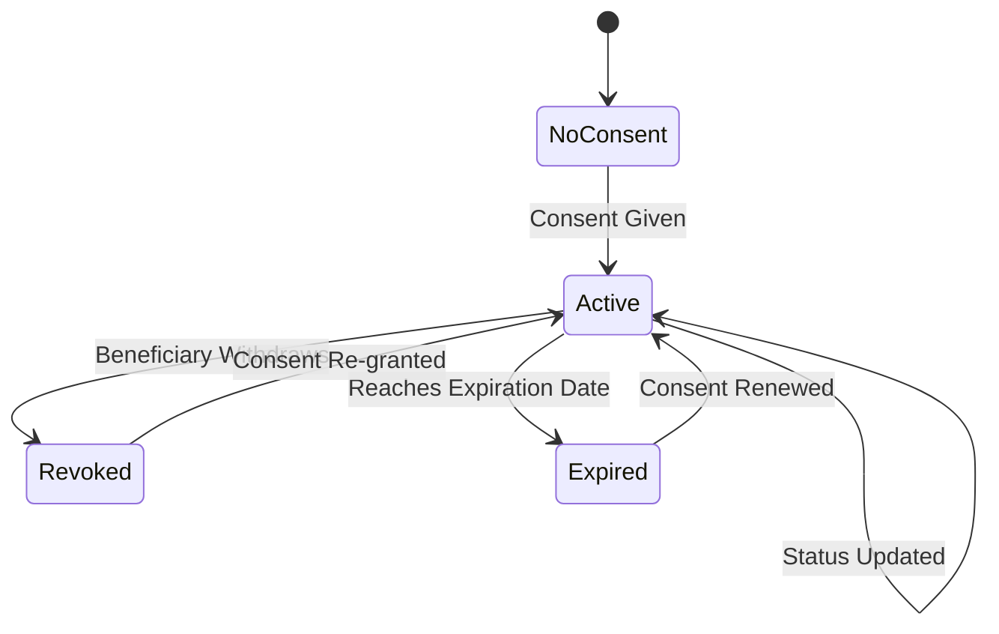
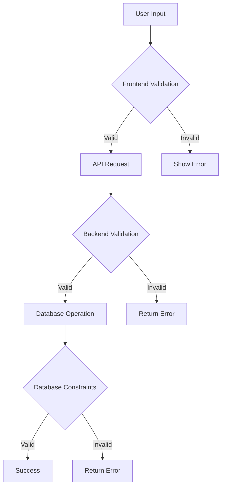
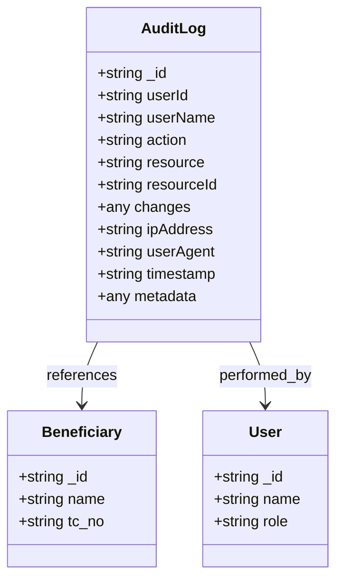
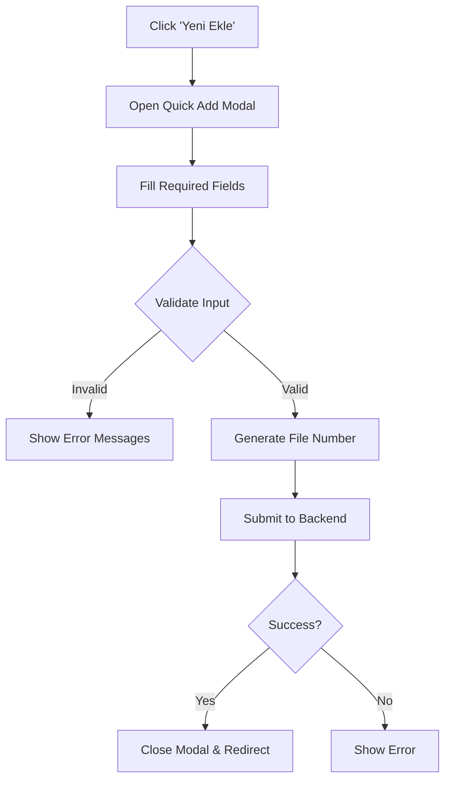
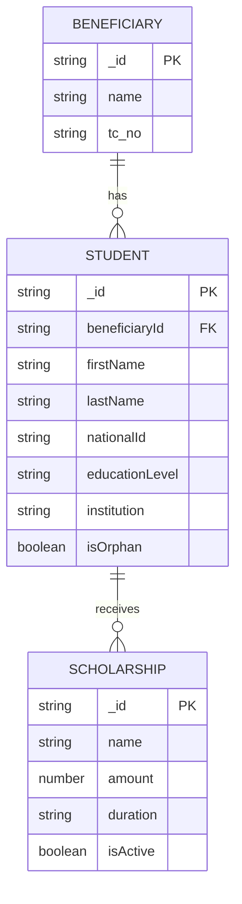

# Beneficiary Management

<cite>
**Referenced Files in This Document**   
- [beneficiaries.ts](file://convex/beneficiaries.ts)
- [dependents.ts](file://convex/dependents.ts)
- [documents.ts](file://convex/documents.ts)
- [consents.ts](file://convex/consents.ts)
- [page.tsx](file://src/app/(dashboard)/yardim/ihtiyac-sahipleri/page.tsx)
- [BeneficiaryQuickAddModal.tsx](file://src/components/forms/BeneficiaryQuickAddModal.tsx)
- [audit_logs.ts](file://convex/audit_logs.ts)
- [storage/upload/route.ts](file://src/app/api/storage/upload/route.ts)
- [documentsManager.tsx](file://src/components/documents/DocumentsManager.tsx)
- [scholarship.ts](file://src/types/scholarship.ts)
</cite>

## Table of Contents

1. [Introduction](#introduction)
2. [Core Data Model](#core-data-model)
3. [Personal Information Management](#personal-information-management)
4. [Family and Dependent Tracking](#family-and-dependent-tracking)
5. [Document Management System](#document-management-system)
6. [Consent Tracking](#consent-tracking)
7. [Data Validation Rules](#data-validation-rules)
8. [Audit Trails and Change Tracking](#audit-trails-and-change-tracking)
9. [User Interface and Workflow](#user-interface-and-workflow)
10. [Integration with Donation and Scholarship Systems](#integration-with-donation-and-scholarship-systems)
11. [Security and Compliance](#security-and-compliance)
12. [Troubleshooting Guide](#troubleshooting-guide)

## Introduction

The Beneficiary Management module serves as the central system for managing individuals and families receiving assistance through the organization. This comprehensive system handles personal information, family relationships, document storage, consent tracking, and integration with donation and scholarship programs. The module is designed to ensure data integrity, compliance with privacy regulations (KVKK/GDPR), and efficient workflow for case managers.

The system is built on a Convex backend with a Next.js frontend, providing real-time data synchronization and a responsive user interface. The architecture follows a modular approach with separate but interconnected components for beneficiaries, dependents, documents, and consents.

**Section sources**

- [beneficiaries.ts](file://convex/beneficiaries.ts#L1-L229)
- [page.tsx](<file://src/app/(dashboard)/yardim/ihtiyac-sahipleri/page.tsx#L1-L240>)

## Core Data Model

The Beneficiary Management system is built around four primary entities that work together to create a comprehensive profile of each beneficiary:

**Diagram sources**

- [beneficiaries.ts](file://convex/beneficiaries.ts#L89-L169)
- [dependents.ts](file://convex/dependents.ts#L22-L63)
- [documents.ts](file://convex/documents.ts#L52-L77)
- [consents.ts](file://convex/consents.ts#L20-L46)

## Personal Information Management

The beneficiary record serves as the primary entity in the system, containing comprehensive personal information. The `beneficiaries.ts` file defines the core operations for managing beneficiary records including creation, retrieval, updating, and deletion.

Key personal information fields include:

- **Identification**: Name, TC identification number (11-digit Turkish identity number)
- **Contact Information**: Phone, email, full address (city, district, neighborhood)
- **Demographics**: Birth date, gender, nationality, religion, marital status
- **Household Information**: Family size, children count, elderly count, disabled count
- **Socioeconomic Status**: Income level, income source, employment status, housing type
- **Health Information**: Health status, chronic illness details, disability status, health insurance
- **Education and Occupation**: Education level, occupation, employment status

The system enforces strict validation rules for the TC number format (11 digits) and prevents duplicate entries by checking existing records before creation.

**Diagram sources**

- [beneficiaries.ts](file://convex/beneficiaries.ts#L153-L169)

**Section sources**

- [beneficiaries.ts](file://convex/beneficiaries.ts#L89-L169)
- [page.tsx](<file://src/app/(dashboard)/yardim/ihtiyac-sahipleri/page.tsx#L119-L185>)

## Family and Dependent Tracking

The dependent management system allows for tracking family members and other individuals connected to a beneficiary. This is crucial for understanding household composition and assessing needs.

The `dependents.ts` file provides a complete CRUD interface for managing dependents with the following key features:

- **Relationship Tracking**: Each dependent is linked to a beneficiary through the `beneficiary_id` field
- **Comprehensive Profile**: Name, relationship type, birth date, gender, TC number, phone, education level, occupation, health status, disability status, monthly income, and notes
- **Flexible Relationship Types**: The system supports various relationship types including spouse, children, parents, and other family members

Key operations include:

- `getBeneficiaryDependents()`: Retrieve all dependents for a specific beneficiary
- `createDependent()`: Add a new dependent with validation of TC number format
- `updateDependent()`: Modify existing dependent information
- `deleteDependent()`: Remove a dependent from the system

The system maintains referential integrity by ensuring all dependents are associated with a valid beneficiary record.

**Diagram sources**

- [dependents.ts](file://convex/dependents.ts#L6-L139)

**Section sources**

- [dependents.ts](file://convex/dependents.ts#L6-L139)

## Document Management System

The document management system provides secure storage and retrieval of files associated with beneficiaries. The implementation leverages Convex's storage capabilities with metadata tracking in the database.

The `documents.ts` file defines the following key operations:

- `getBeneficiaryDocuments()`: Retrieve all documents for a beneficiary with their URLs
- `getFileByStorageId()`: Get a specific file by its storage ID
- `createDocument()`: Create metadata for an uploaded document
- `deleteDocument()`: Remove a document and its associated file
- `generateUploadUrl()`: Generate a secure URL for uploading files

The system follows a two-step process for document management:

1. Upload the file to Convex storage using a generated upload URL
2. Create metadata in the database linking the storage ID to the beneficiary

Document metadata includes:

- File name, size, and type
- Storage ID (reference to the actual file)
- Beneficiary ID (link to the beneficiary record)
- Document type (categorization)
- Upload timestamp and user who uploaded

**Diagram sources**

- [documents.ts](file://convex/documents.ts#L4-L108)
- [storage/upload/route.ts](file://src/app/api/storage/upload/route.ts#L1-L96)
- [DocumentsManager.tsx](file://src/components/documents/DocumentsManager.tsx#L1-L107)

**Section sources**

- [documents.ts](file://convex/documents.ts#L4-L108)
- [storage/upload/route.ts](file://src/app/api/storage/upload/route.ts#L1-L96)
- [DocumentsManager.tsx](file://src/components/documents/DocumentsManager.tsx#L1-L107)

## Consent Tracking

The consent management system ensures compliance with data protection regulations (KVKK/GDPR) by tracking all consents provided by beneficiaries. This is critical for legal and ethical handling of personal data.

The `consents.ts` file provides the following functionality:

- `getBeneficiaryConsents()`: Retrieve all consents for a beneficiary
- `createConsent()`: Record a new consent with detailed information
- `updateConsent()`: Modify consent status (active, revoked, expired)
- `deleteConsent()`: Remove a consent record

Each consent record contains:

- **Consent Type**: Purpose of the consent (e.g., data processing, communication, photo usage)
- **Consent Text**: Full text of what the beneficiary agreed to
- **Status**: Current status (active, revoked, expired)
- **Signed At**: Timestamp when consent was given
- **Signed By**: Name of the person who provided consent
- **Expires At**: Optional expiration date
- **Created By**: System user who recorded the consent
- **Notes**: Additional relevant information

The system maintains a complete history of consent changes, allowing for audit and compliance verification.

**Diagram sources**

- [consents.ts](file://convex/consents.ts#L4-L74)

**Section sources**

- [consents.ts](file://convex/consents.ts#L4-L74)

## Data Validation Rules

The system implements comprehensive validation rules to ensure data quality and integrity across all beneficiary-related operations.

### TC Number Validation

- Must be exactly 11 digits
- Must contain only numeric characters
- Must be unique across all beneficiaries and dependents
- Implemented in both frontend and backend for comprehensive protection

### Field-Level Validation

- **Name**: Minimum 2 characters
- **Phone**: 10-15 digits with optional formatting characters
- **Email**: Valid email format (if provided)
- **Address**: Minimum 10 characters
- **Status**: Must be one of: TASLAK, AKTIF, PASIF, SILINDI

### Backend Validation Implementation

The validation is implemented in multiple layers:

1. **Convex Function Level**: Validation in `beneficiaries.ts`, `dependents.ts`, etc.
2. **API Route Level**: Additional validation in API endpoints
3. **Database Level**: Unique constraints and data type enforcement

**Section sources**

- [beneficiaries.ts](file://convex/beneficiaries.ts#L153-L164)
- [dependents.ts](file://convex/dependents.ts#L40-L42)
- [api/beneficiaries/route.ts](file://src/app/api/beneficiaries/route.ts#L58-L99)
- [api/beneficiaries/[id]/route.ts](file://src/app/api/beneficiaries/[id]/route.ts#L1-L39)

## Audit Trails and Change Tracking

The system maintains comprehensive audit trails for all critical operations through the `audit_logs.ts` file. This ensures accountability, supports compliance, and enables troubleshooting.

Key audit log features:

- **Action Types**: CREATE, UPDATE, DELETE, VIEW
- **Resource Tracking**: Type and ID of the affected resource
- **User Information**: ID and name of the user performing the action
- **Timestamp**: Precise time of the action
- **IP Address and User Agent**: Security and forensic information
- **Change Details**: For UPDATE operations, records of what changed

The audit system is automatically triggered by critical operations and provides:

- Complete history of all changes to beneficiary records
- Ability to investigate data consistency issues
- Compliance with regulatory requirements
- Security monitoring for unauthorized access

**Diagram sources**

- [audit_logs.ts](file://convex/audit_logs.ts#L12-L35)

**Section sources**

- [audit_logs.ts](file://convex/audit_logs.ts#L12-L35)

## User Interface and Workflow

The beneficiary management interface is accessible through the ihtiyac-sahipleri page, providing a comprehensive dashboard for managing beneficiary records.

Key UI components and workflows:

### Beneficiary List View

- Virtualized data table for efficient rendering of large datasets
- Search functionality across multiple fields (name, TC number, phone)
- Export capability for data analysis
- Quick add modal for rapid beneficiary creation

### Quick Add Workflow

The `BeneficiaryQuickAddModal.tsx` component provides a streamlined process for creating new beneficiaries:

The quick add form captures essential information including:

- Category (family type)
- Personal details (name, nationality, birth date)
- Identification (TC number)
- Fund region and file connection
- Automatic file number generation

### Document Management Interface

The `DocumentsManager.tsx` component provides a drag-and-drop interface for uploading and managing documents with:

- File upload with drag-and-drop support
- Progress indicators during upload
- List view of existing documents with download options
- Delete functionality with confirmation

**Section sources**

- [page.tsx](<file://src/app/(dashboard)/yardim/ihtiyac-sahipleri/page.tsx#L36-L239>)
- [BeneficiaryQuickAddModal.tsx](file://src/components/forms/BeneficiaryQuickAddModal.tsx#L66-L391)
- [DocumentsManager.tsx](file://src/components/documents/DocumentsManager.tsx#L1-L107)

## Integration with Donation and Scholarship Systems

The beneficiary management system serves as the foundation for both donation and scholarship programs, providing the necessary data context for these operations.

### Donation System Integration

- Beneficiary records are linked to donation records
- Total aid amount is tracked and updated
- Donation history is accessible from the beneficiary profile
- Eligibility for specific donation programs can be determined based on beneficiary characteristics

### Scholarship System Integration

The system integrates with the scholarship module through shared data models and relationships:

Key integration points:

- **Student Records**: The scholarship system can link student records to beneficiary records through the `beneficiaryId` field
- **Orphan Status**: Beneficiary data about orphan children is used to determine eligibility for orphan-specific scholarships
- **Family Income**: Household income information is used for need-based scholarship eligibility
- **Education Level**: Current education level helps determine appropriate scholarship programs

The integration allows for comprehensive support of beneficiaries across multiple assistance programs while maintaining data consistency.

**Section sources**

- [beneficiaries.ts](file://convex/beneficiaries.ts#L125-L128)
- [scholarship.ts](file://src/types/scholarship.ts#L60-L115)

## Security and Compliance

The system implements robust security measures to protect sensitive personal data in compliance with KVKK and GDPR regulations.

### Data Protection Measures

- **TC Number Hashing**: TC identification numbers are hashed before storage to prevent unauthorized access
- **Audit Trails**: All access and modifications are logged for accountability
- **Role-Based Access Control**: Access to beneficiary data is restricted based on user roles and permissions
- **CSRF Protection**: All state-changing operations are protected against cross-site request forgery

### Privacy Compliance

- **Consent Management**: Explicit tracking of all consents with ability to revoke
- **Data Minimization**: Collection of only necessary information
- **Right to Access and Rectification**: Beneficiaries can access and correct their data
- **Right to Erasure**: Mechanisms for data deletion when required

### Security Implementation

- Input validation and sanitization at multiple levels
- Secure file upload with type and size restrictions
- Rate limiting to prevent abuse
- Error handling that doesn't expose sensitive information

The system balances accessibility for authorized users with strong protection of sensitive personal data.

**Section sources**

- [beneficiaries.ts](file://convex/beneficiaries.ts#L153-L164)
- [audit_logs.ts](file://convex/audit_logs.ts#L12-L35)
- [middleware.ts](file://src/middleware.ts#L52-L72)
- [TECHNICAL_DEEP_DIVE.md](file://TECHNICAL_DEEP_DIVE.md#L162-L225)

## Troubleshooting Guide

This section addresses common issues encountered when managing beneficiary records and provides solutions.

### Data Consistency Problems

**Issue**: Duplicate TC number errors during beneficiary creation

- **Cause**: Attempting to create a beneficiary with a TC number that already exists
- **Solution**: Use the search functionality to check if the beneficiary already exists before creation

**Issue**: Missing dependent records

- **Cause**: Dependent created without proper beneficiary association
- **Solution**: Verify that the beneficiaryId is correctly passed when creating dependents

### Document Management Issues

**Issue**: Failed document uploads

- **Cause**: File size exceeds 10MB limit or unsupported file type
- **Solution**: Compress large files or convert to supported formats (PDF, JPEG, PNG, DOC, DOCX)

**Issue**: Missing document URLs

- **Cause**: Storage ID mismatch between file and metadata
- **Solution**: Ensure the storage ID from the upload response is correctly used when creating document metadata

### Validation Errors

**Issue**: "Invalid TC number format" error

- **Cause**: TC number not exactly 11 digits or contains non-numeric characters
- **Solution**: Verify the TC number format and re-enter

**Issue**: "Adres en az 10 karakter olmalıdır" (Address must be at least 10 characters)

- **Cause**: Address field too short
- **Solution**: Provide a more complete address

### Performance Issues

**Issue**: Slow loading of beneficiary lists

- **Cause**: Large dataset without proper pagination
- **Solution**: Use search filters to narrow results or implement lazy loading

**Issue**: Modal freezing during file upload

- **Cause**: Large file upload blocking the UI
- **Solution**: Implement progress indicators and ensure async processing

The audit logs can be used to investigate most data consistency issues by tracking the history of changes to beneficiary records.

**Section sources**

- [beneficiaries.ts](file://convex/beneficiaries.ts#L153-L164)
- [documents.ts](file://convex/documents.ts#L81-L98)
- [storage/upload/route.ts](file://src/app/api/storage/upload/route.ts#L1-L47)
- [audit_logs.ts](file://convex/audit_logs.ts#L40-L92)
